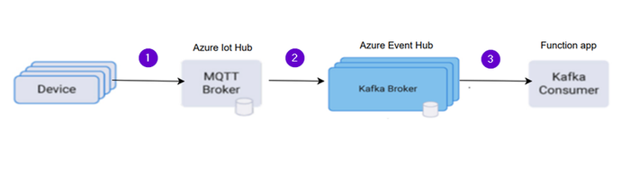
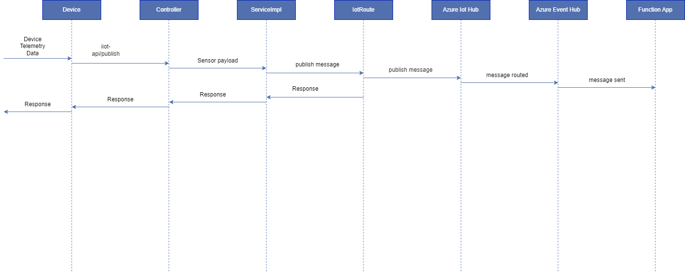
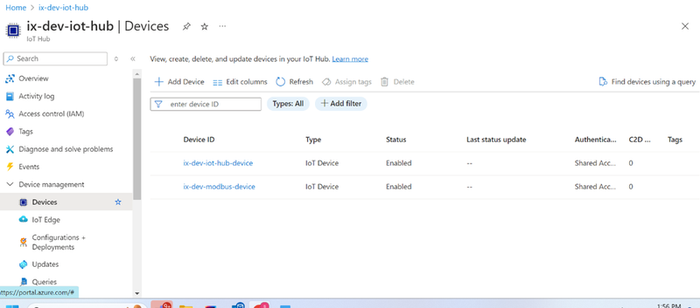
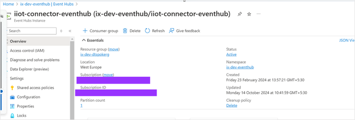
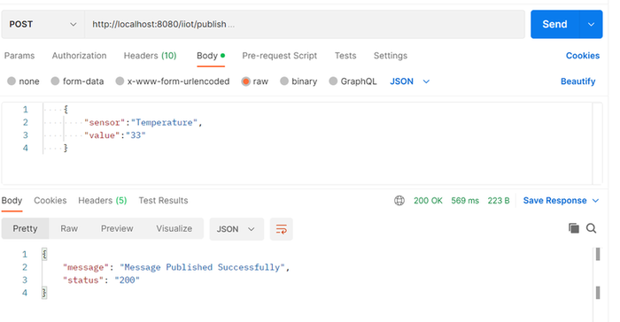
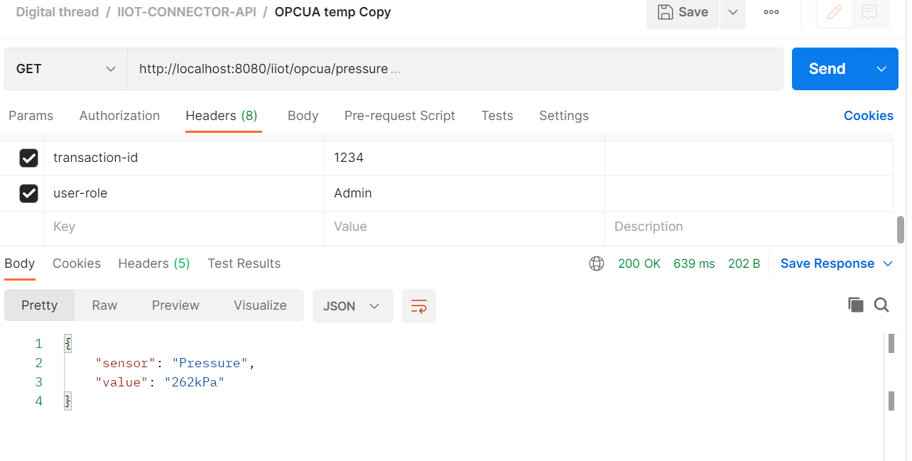

DIGITAL THREAD FOUNDATIONS

IIoT Connector

INTEGRATION GUIDE

Release Version: 1.2

##  \{#section .TOC-Heading\}

## Introduction

A digital thread refers to the continuous and consistent flow of information throughout the entire lifecycle of a product or system -- from design and development to operation and maintenance. It enables the integration of data from different stages and sources, allowing effective traceability, seamless collaboration, and efficient decision-making by unleashing the power of sleeping data. The digital thread is considered a key aspect of Industry 4.0 and the digital transformation of the manufacturing industry. It is the core of what we call the Enterprise Operating System (EOS). Digital Thread is a communication framework that helps integrate various enterprise systems involved in the engineering and manufacturing product life cycle.

The IIoT Connector is a tool created using Digital Thread Foundations SDK. Leveraging the capabilities of the SDK, an Industrial IoT (IIoT) connector is developed as part of the platform to ingest real-time data from sensors and machines. The integration of IIoT connectors is crucial for achieving a seamless flow of data and information across the various stages of engineering and manufacturing processes. Key features: Real-time data ingestion, asset monitoring, integration with cloud storage and analytics, AI.

### 

## Purpose

This document describes the implementation and configuration of the IIoT connector.

### Target Audience

Software architects, developers, and integrators with IT backgrounds.

### 

## Business Contacts

-   [florian.tournier@accenture.com](mailto:florian.tournier@accenture.com)

-   [laura.mosconi@accenture.com](mailto:laura.mosconi@accenture.com)

-   [karthik.ramachandra@accenture.com](mailto:karthik.ramachandra@accenture.com)

### Technical Contacts

-   [laura.mosconi@accenture.com](mailto:laura.mosconi@accenture.com)

-   [stefano.giacco@accenture.com](mailto:stefano.giacco@accenture.com)

- [DevOps Team (for access and deployment tasks)](mailto:IX_DT_DEVOPS_INFRA@accenture.com)

### Related Links

-   [Digital Thread Foundations Connectors](https://industryxdevhub.accenture.com/assetdetails/97)

### 

## Prerequisites

To use the IIoT Connector, the following must be completed:

-   [Request access](mailto:IX_DT_DEVOPS_INFRA@accenture.com) and [download](https://dev.azure.com/IXDigitalThread/IXThreadComponents/_artifacts/feed/IXThreadComponents) the Azure Container Registry

-   IIoT Connector must be deployed on the target environment.

-   A device (sensor/machine) must be created on Azure IoT Hub

-   Active Azure Subscription to access EventHub and Function app

### Glossary

| **Term** | **Definition** |
| --- | --- |
| IIoT | Industrial Internet of Things; a network of industrial devices connected for the exchange of data and control to improve automation and efficiency. |
| MQTT | Message Queuing Telemetry Transport; a lightweight messaging protocol used for efficient communication in IIoT applications. |
| OPC UA | Open Platform Communications Unified Architecture; a platform-independent, secure protocol for industrial automation and real-time data exchange. |
| Azure IoT Hub | A managed Microsoft Azure service that enables secure, bi-directional communication between IoT devices and cloud applications. |
| Eclipse Paho | An open-source client library used for implementing MQTT protocol support in IIoT solutions. |
| Eclipse Milo | An open-source Java stack that provides OPC UA client and server functionality for industrial automation integration. |
| DevOps Team | The group responsible for deployment, access, and operational tasks within the IIoT infrastructure. |
## 

# Key Features

### Multi-Protocol Support

The IIoT connector facilitates seamless communication between various industrial devices and systems. It supports the MQTT and OPC UA protocols.

#### 

### MQTT Protocol Support

The Industrial Internet of Things (IIoT) connector has been developed to facilitate seamless communication between various industrial devices and systems. One of the key features of this connector is its support for the MQTT protocol, a lightweight messaging protocol ideal for IIoT applications due to its efficiency and reliability. The MQTT protocol support in the IIoT connector is implemented using the Eclipse Paho MQTT client library IIoT connector can reliably connect to an MQTT broker such as Azure IOT Hub.

####  OPC-UA Protocol

The Industrial Internet of Things (IIoT) connector has been designed to ensure seamless communication between various industrial devices, machines, and systems. A key feature of this connector is its support for the OPC-UA protocol, a robust and platform-independent protocol ideal for industrial automation applications. OPC-UA provides secure, dependable, and scalable communication, enabling real-time data exchange between sensors, controllers, and enterprise systems. The OPC-UA protocol support in the IIoT connector is implemented using the Eclipse Milo OPC-UA library, allowing the connector to act as a client that can communicate with OPC-UA servers, facilitating real-time data acquisition and control.

### 

## Azure IoT Hub Integration

The IIoT connector integrates with Azure IoT Hub to enable secure and efficient communication between industrial devices and the cloud. Azure IoT Hub is a managed service that provides bi-directional communication between IoT applications and the devices it manages.

## 

# System Architecture Overview

The diagram on the side illustrates the integration of devices with the Azure IoT ecosystem, leveraging MQTT and Kafka protocols for data communication and processing. Each component and the data flow within the system are described in the corresponding table below.

| **Step** | **Data Flow** **Description** |
| --- | --- |
| 1 | Device to Azure IoT Hub Devices generate telemetry data and send it to the Azure IoT Hub using the MQTT protocol. The IoT Hub acts as an MQTT Broker, managing device connections and ensuring secure data transmission. |
| 2 | Azure IoT Hub to Azure EventHub The IoT Hub forwards the received telemetry data to the Azure Event Hub. The Event Hub, configured to use the Kafka protocol, acts as a Kafka Broker to handle high-throughput data streams. |
| 3 | Azure Event Hub to Function App The Function App, configured as a Kafka Consumer, reads the data streams from the Azure Event Hub (Kafka Broker). The Function App processes the incoming data and can perform various actions, such as data transformation, analytics, or triggering other processes based on the business logic. |
## 

# Sequence Diagram

As shown above, the sequence involves the components listed in the table below:

| **Component** | **Description** |
| --- | --- |
| Device/Caller | A device or caller sends sensor data via the iot-api/publish API. |
| IIOT Connector | The controller in the IIOT connector receives the request and forwards it to the service implementation and IoT Route, which directs the messages to Azure IoT Hub and the response is sent back to the caller via serviceImpl, controller. |
| Azure IoT Hub | Azure IoT Hub receives the message and routes it to an Event Hub. |
| Azure Event Hub | The Event Hub processes the message and forwards it to an Azure Function App. |
| Function App | The Function App logs the received sensor payload. |
## 

# Configuration Procedure 

1.  A device is created in Azure IoT Hub by the [Infra Team](mailto:IX_DT_DEVOPS_INFRA@accenture.com). For more information on this step, refer to this [link](https://learn.microsoft.com/en-us/azure/iot-hub/create-connect-device?tabs=portal).

2.  

3.  Select the device and copy the primary connection string displayed. This string is needed to connect the device to the IoT Hub.

4.  Events in Azure event hub namespace are created by the Infra Team. For more information refer to this [link](https://learn.microsoft.com/en-us/azure/event-hubs/event-hubs-create).

5.  

6.  Configure IoT Hub Message Routing. This is done by:

    a.  Setting up message routing to Azure EventHub.

        -   In the left menu of the IoT Hub, select Message Routing.

        -   Click on \'Add\' to create a new route.

    b.  Adding routing endpoint.

        -   Under the Routing endpoints section, click on \'Add\'.

        -   Select EventHub as the endpoint type.

        -   Provide the name and enter the connection string that was previously copied in Step \# 2.

        -   Click \'Create\' to add the endpoint.

    c.  Defining the route.

        -   In the Routes section, enter a name for the route.

        -   Specify the Data Source as \'Device Telemetry Messages\'.

        -   In the Endpoint dropdown menu, select the EventHub endpoint that was created.

        -   Click \'Save\' to create the route.

7.  Create Azure Function App (Function app to be created by Infra Team) to process (log) messages from EventHub.

8.  The Infra team integrates the EventHub and the Function App.

9.  By using the SDK, generate the IIoT Connector application to publish messages to Azure IoT Hub. For more information on the Digital Thread\'s SDK, refer to the [DT SDK Guide](https://industryxdevhub.accenture.com/assetdetails/98). The implementation of the IIoT connector is described in the subsequent section.

## 

# Implementation Overview 

### MQTT Protocol Support

The MQTT protocol support in the IIoT connector is implemented using the Eclipse Paho MQTT client library.

> \\
> \org.apache.camel.springboot\\
> \camel-paho-starter\\
> \4.5.0\\
> \

Below is a detailed explanation of the implementation, including the configuration of the MQTT client and the connection options.

-   The MQTT support is implemented in the \"MqttClientConnUtils\" class within the \"com.digitalthread.iiotlab.util\" package.

-   The following properties are injected from the application\'s configuration file.

> azure.iot.resourceuri=\_\_iotHubHostName\_\_/devices/\_\_iotHubDeviceId\_\_\
> azure.iot.key=\_\_iotHubKeySecretName\_\_\
> camel.component.paho.broker-url=ssl://\_\_iotHubHostName\_\_:\_\_iotHubPortNumber\_\_\
> camel.component.paho.client-id=\_\_iotHubDeviceId\_\_\
> camel.component.paho.user-name=\_\_iotHubHostName\_\_/\_\_iotHubDeviceId\_\_/?api-version=2021-04-12

-   A MemoryPersistence instance is used to manage MQTT client persistence.

-   The MqttClient is created using the server URI, client ID, and memory persistence.

-   The client connects to the MQTT broker using the provided connection options (SAS token).

-   An exception is logged and thrown if the connection fails.

#### 

### POST Publish API

The IIoT connector utilizes the POST Publish API that is described in the following section. This API publishes messages from the device to the Azure IoT hub using the MQTT protocol.

| PROTOCOL | HTTP |
| --- | --- |
| DEV ENDPOINT |  |
| QA ENDPOINT |  |
| METHOD | POST |
| CONTENT TYPE | application / json |
##### Input

| Header | Description |
| --- | --- |
| transaction-id | Any random integer value e.g., 1234. |
| Authorization | Bearer Token |
| Ocp-Apim-Subscription-Key | Subscription-Key |
##### Result

| HTTP Code | Result Description |
| --- | --- |
| 200 | OK |
| 400 | Bad Request |
| 401 | Unauthorized |
| 403 | Forbidden |
| 404 | Not Found |
| 500 | Internal Server Error |
##### Error Management

| HTTP Code | Error Code Error Description |
| --- | --- |
| 500 | 001002 Request body is null |
| 500 | 001002 Sensor is null |
| 500 | 001002 Value is null **Sample JSON Request** &gt; \{ &gt; &gt; \"sensor\":\"Temperature\", &gt; &gt; \"value\":\"33\" &gt; &gt; \} **Sample JSON Response** &gt; \{ &gt; &gt; \"message\":\"Message Published Succesfully\", &gt; &gt; \"status\":\"200\" &gt; &gt; \} 
|  |

### OPC Protocol Support

To implement OPC protocol support in the IIOT connector, you need to have OPC client (iiotconnector) and OPC server.

Detailed explanations and setting up are given below.

**Creating an OPC UA Server**

-   Install Python.

-   Installing OPC UA Library: Open your command line and run pip install opcua. This command uses pip, Python\'s package installer, to download and install the OPC UA library, which is crucial for our server setup.

-   Crafting the OPC UA Server Script.

-   Script Overview: Our script will initialize a server instance, configure its settings, and add simulated data points (variables).

-   The script can be found in ix-opc-server under file opcserver.py.

**Code Walkthrough**:

-   **Server Initialization**: Begin by creating a server object and setting its endpoint URL. This URL is how clients will connect to your server.

-   **Namespace Configuration**: Namespaces in OPC UA are used to create unique identifiers for nodes. We have defined a custom namespace for our variables.

-   **Adding Variables**: Simulated variables like temperature or pressure are added.

-   **Server Start**: Finally, the server is started and enabled to accept connections.

**Executing the Server**

-   **Running the Script**: Navigate to your script\'s directory in the command line and execute it with python \[script_name\].py(e.g. python OPCUASimulation.py). This launches your OPC UA server.

**Creating an OPC UA Client**

-   Ensure Java 11 or higher is installed.

-   Use Maven or Gradle to manage dependencies.

-   Include OPC UA libraries (e.g., Eclipse Milo).

> Below library is added in IiotConnector.
>
> \
>
> \org.eclipse.milo\
>
> \sdk-client\
>
> \0.6.12\
>
> \
>
> **Eclipse Milo Classes**: Used to interact with the OPC UA server.

-   OpcUaClient: Represents the client interface for communicating with the server.

-   Creation of OPC UA client is implemented in the \"OpcUaConfig\" class within the \"com.digitalthread.iiotlab.config\" package.

-   The OpcUaServiceImpl class is a well-structured implementation for reading sensor data from an OPC UA server. It encapsulates the logic for node value retrieval, error handling, and data publishing.

> **APIs using OPC protocol**
>
> The IIoT connector utilizes the GET API, which is described in the following section.

#### 

### GET Read Pressure or Temperature API

This API reads temperature and pressure from the OPC server.

| PROTOCOL | HTTP |
| --- | --- |
| DEV ENDPOINT | [link](https://ix-dev-apimgmt.azure-api.net/iiot-api/opcua/pressure) |
| QA ENDPOINT | [link](https://ix-qa-apimgmt.azure-api.net/iiot-api/opcua/temperature) |
| METHOD | GET |
| CONTENT TYPE | application / json |
  --------------------------------------------------------------------------

| Header | Description |
| --- | --- |
| transaction-id | Any random integer value e.g., 1234. |
| Authorization | Bearer Token |
| Ocp-Apim-Subscription-Key | Subscription key Result |
| HTTP Code | Result Description |
| 200 | OK |
| 400 | Bad Request |
| 401 | Unauthorized |
| 403 | Forbidden |
| 404 | Not Found |
| 500 | Internal Server Error **Sample JSON Response** &gt; \{ &gt; &gt; \"sensor\": \"Pressure\", &gt; &gt; \"value\": \"262kPa\" &gt; &gt; \} 
|  |
