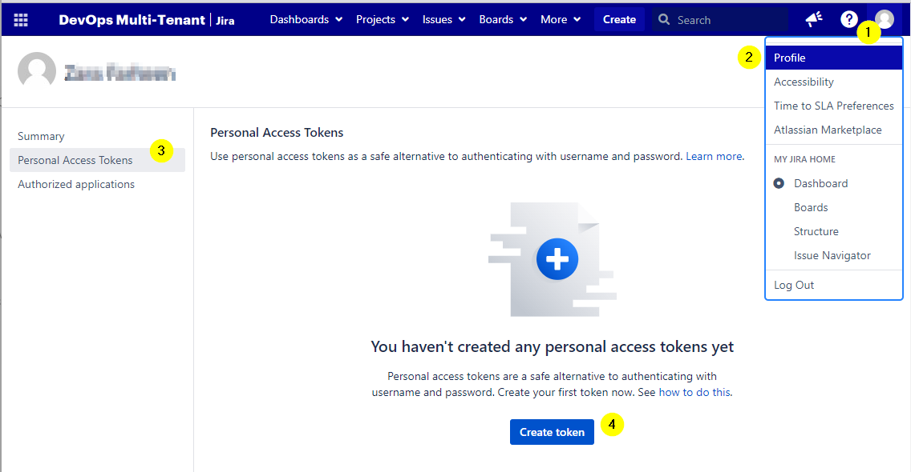
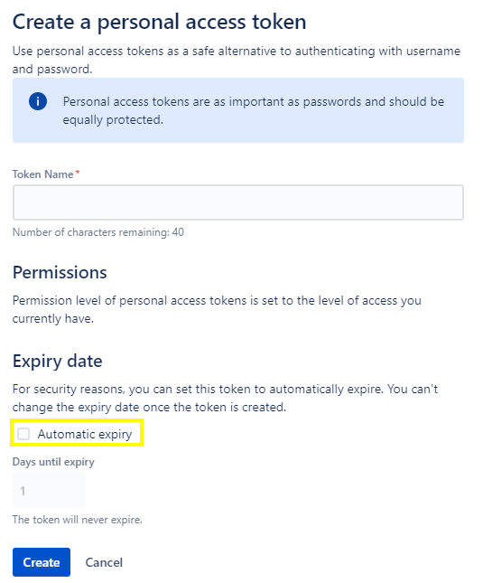

DIGITAL THREAD FOUNDATIONS

Jira Connector

INTEGRATION GUIDE

Release Version: 1.2

## Introduction

A digital thread refers to the continuous and consistent flow of information throughout the entire lifecycle of a product or system -- from design and development to operation and maintenance. It enables the integration of data from different stages and sources, allowing effective traceability, seamless collaboration, and efficient decision-making by unleashing the power of sleeping data. The digital thread is considered a key aspect of Industry 4.0 and the digital transformation of the manufacturing industry. It is the core of what we call the Enterprise Operating System (EOS). Digital Thread is a communication framework that helps integrate various enterprise systems involved in the engineering and manufacturing product life cycle.

The Jira Connector is a tool created using the Digital Thread Foundations SDK, designed specifically to facilitate seamless interaction with Jira. Leveraging the capabilities of the SDK, the connector enables users to effortlessly connect with Jira and execute operations such as fetching, creating, and updating data.

### Purpose

This document describes the Jira Connector integration and API details.

### Target Audience

Software architects, developers, and integrators with IT backgrounds.

### Prerequisites

-   Jira Connector must be deployed on the target environment.

-   Access to Jira instance with proper permissions to access project details.

### Related Links

-   [Digital Thread Foundations Documentation](https://industryxdevhub.accenture.com/asset-home;search_text=IX%20Digital%20Thread)

-   [Personal Access Tokens](https://confluence.atlassian.com/display/BITBUCKETSERVER076/Personal+access+tokens)

-   [API Tokens](https://support.oneio.cloud/hc/en-us/articles/360029762672-How-to-create-an-API-token-for-Atlassian-JIRA-Cloud-authentication)

-   [OAuth](https://developer.atlassian.com/cloud/jira/platform/oauth-2-3lo-apps/)

### Business Contacts

-   [florian.tournier@accenture.com](mailto:florian.tournier@accenture.com)

-   [laura.mosconi@accenture.com](mailto:laura.mosconi@accenture.com)

-   [karthik.ramachandra@accenture.com](mailto:karthik.ramachandra@accenture.com)

### Technical Contacts

-   [laura.mosconi@accenture.com](mailto:laura.mosconi@accenture.com)

-   [stefano.giacco@accenture.com](mailto:stefano.giacco@accenture.com)

## 

# Key Features

### **Bulk Export**

The Bulk Export feature of the Jira Connector allows the efficient export of issue details from a Jira instance in CSV format, based on specific criteria or filters. This functionality serves as a valuable tool for those seeking to streamline their reporting processes, share project data with stakeholders, or migrate information to other systems seamlessly.

Multiple issues may be exported from Jira simultaneously, saving time and effort compared to exporting individual issues one by one. This capability becomes particularly advantageous when dealing with large datasets or when comprehensive project information must be extracted for analysis or archival purposes.

Furthermore, Bulk Export offers flexibility by allowing the definition of criteria to simplify the selection of issues. Filters can be applied based on various parameters such as issue type, status, assignee, priority, creation date, and custom fields. This granular control enables exports to be tailored to specific project requirements or reporting needs, ensuring that only relevant data is included in the exported CSV files.

[]\{#_Toc220307702 .anchor\}**CRU API**

The Create/Read/Update (CRU) API enables interaction with Jira to perform essential operations such as fetching issue details, updating existing issues, and creating new ones. This provides the flexibility needed to manage issues directly from external systems or custom applications, enhancing integration possibilities.

### Bulk Issue Creation

Bulk Issue Creation is a feature offered by the Jira Connector that enables the efficient creation of multiple issues simultaneously within a Jira environment. This functionality is particularly useful when the need exists to import a large number of issues by uploading data from a CSV (Comma-Separated Values) file. The bulk issue creation process is designed to be intuitive and streamlined. Digital Thread users can prepare their data in a CSV file according to a predefined format, specifying details such as issue summary, description, assignee, priority, due date, and other relevant fields.

### Metrics

Metrics generation in Jira is a pivotal feature offered by connectors, enabling users to effortlessly obtain essential metrics such as percent completion and progress tracking. This functionality empowers teams to monitor current sprint progress, individual user contributions.

## 

# Access and Authentication

The Jira connector, as well as other Digital Thread connectors, are distributed as a Container Image. The Container Image can be downloaded from Digital Thread's [Azure Container Registry](https://dev.azure.com/IXDigitalThread/IXThreadComponents/_artifacts/feed/IXThreadComponents). The appropriate access to the container registry is obtained from the [DevOps team](mailto:IX_DT_DEVOPS_INFRA@accenture.com). The various types of supported authentication mechanisms for Jira connectivity are listed in the following table:

-   [Personal Access Tokens](https://confluence.atlassian.com/display/BITBUCKETSERVER076/Personal+access+tokens) are used for integrating with Atlassian Jira Data Center instances.

-   [API Tokens](https://support.oneio.cloud/hc/en-us/articles/360029762672-How-to-create-an-API-token-for-Atlassian-JIRA-Cloud-authentication) are supported by Atlassian Jira Cloud instances.

-   [OAuth](https://developer.atlassian.com/cloud/jira/platform/oauth-2-3lo-apps/) is available for both Data Center and Cloud instances, but it has limitations due to the absence of the implicit grant flow. Manual intervention from the user is required to approve access when using the OAuth authorization code approach.

Note that due to limitations with OAuth, Accenture's IX Digital Thread Jira Connector supports integration using PAT and API token approaches only.

### RBAC Implementation

Role Based Access Control (RBAC) in the Jira connector application is managed through Azure management services, following similar practices as other connector applications. RBAC policies are defined at the product level, dictating the access rights for various methods within the application. The below table shows the permissions granted to each role. The permissions for each role in the Jira connector application are as follows:

-   Admin: Full permissions, including the ability to perform POST, PUT, and GET operations.

-   QE (Quality Engineer): Full permissions for all methods---POST, PUT, and GET.

-   Tester: Limited permissions, restricted to GET operations only.

-   Dev (Developer): Limited permissions, restricted to GET operations only.

-   User: Limited permissions, restricted to GET operations only.

### 

## Integration

Users can seamlessly integrate with Jira using either of the methods described below.

#### Token Generation

The generated Jira server token is securely stored in the Azure Key Vault and fetched from there during integration.

##### Personal Access Token

To generate the required token from Jira settings:

1.  Sign in to Jira.

2.  Go to the profile.

3.  Select Personal Access Tokens

4.  Click on 'Create Token'

5.  On the 'Create a personal access token' page, create your token by naming it and unchecking the 'Automatic Expiry' checkbox to ensure that the token never expires.

##### API Token

To generate the required token from Jira settings:

1.  Sign in to Jira.

2.  Navigate to .

3.  Click Create API token.

4.  From the dialog that appears, enter a memorable and concise Label for your token and click Create. The label works as the name of your API token.

#### Application Properties

Edit the application.properties file to configure the properties according to the method.

##### Personal Access Token

> auth.type=PAT
>
> jira.server.token=\\
> jira.server.base.url=\\
> jira.project.management.type=\ \&gt;

##### API Token

> auth.type=BASIC
>
> jira.cloud.base.url=\
>
> jira.cloud.token=\
>
> jira.cloud.email=\\
> jira.project.management.type=\ \&gt;

Note: Possible values for project management type: Team, Company, Team, and Company

## APIs

The Jira Connector offers a suite of APIs designed to streamline interactions with Jira, enabling a range of operations including retrieval, creation, and updating of data. The primary APIs provided by the connector are listed in the below table.

| **API Name** | **Description** |
| --- | --- |
| GET Board | This API retrieves details about a board using the /board endpoint. |
| GET Sprint | This API retrieves details about the sprints associated with a specific board. |
| GET Project Bulk | This API retrieves information about all projects in a single response, i.e., in bulk. |
| GET Project | This API is used to retrieve details of a specific project identified by its unique ID. |
| GET Issue | The /project/issue/\{issueId\} endpoint is used to retrieve details of a specific issue identified by its unique ID within a project. |
| GET Issue Types | The /project/\{projectId\}/issue/type endpoint retrieves all issue types eg. Bug, User story within a project. |
| CREATE Issue | This API is for creating Jira issues within a project. |
| UPDATE Issue | This API is used to update details of a Jira issue within a project. |
| UPLOAD Attachment | This API is used to upload attachments in a particular issue. |
| GET Status | This API retrieves available status details for a Jira issue in a project. |
| GET Comments | This API retrieves all comments associated with a specific Jira issue. |
| GET Meta | This endpoint retrieves metadata necessary for updating a specific Jira issue. |
| GET Worklog | This API retrieves all work logs associated with a Jira issue in a project. |
| Export Bulk Issue | This API retrieved all issues associated in a project based on filter criteria if provided. |
| Download Bulk Creation Template | This API returns a CSV Bulk issue creation template |
| Bulk Issue Creation | This API is used to create issues in bulk using the data provided in CSV template. |
| Metrics | This API provides metrics for a project based on filter criteria if provided any. Users must obtain appropriate access to generate a JWT token for authentication, a product subscription key from Azure application management for the Jira connector, and a transaction-id. Include all this information in the request headers. Append specific endpoints to the base URL to use the API as needed. |

### Get Board

This API retrieves details about a board using the /board endpoint.

| PROTOCOL | HTTPS |
| --- | --- |
| DEV ENDPOINT |  |
| QA ENDPOINT |  |
| METHOD | GET |
| CONTENT TYPE | application / json |

#### Pagination Parameters

| Parameter | Description |
| --- | --- |
| Offset | Page number of the dataset to retrieve (greater than 0) |
| Limits | Page size, maximum value is 50 (greater than 0) **Sample Response** &gt; \{ &gt; &gt; \"offset\": "", &gt; &gt; \"limits\": "", &gt; &gt; \"total\": "", &gt; &gt; \"values\": \[ &gt; &gt; \{ &gt; &gt; \"id\": "", &gt; &gt; \"self\": \"\", &gt; &gt; \"name\": \"\", &gt; &gt; \"type\": \"\" &gt; &gt; \} &gt; &gt; \] &gt; &gt; \} |

#### Result

| HTTP Code | Result Description |
| --- | --- |
| 200 | Board details fetched successfully as mentu |

#### Error Management

| HTTP Code | Error Code Error Description |
| --- | --- |
| 500 | 500 Project Specific error |
| 404 | 404 Not Found |
| 403 | 403 Forbidden |
| 401 | 401 Invalid Subscription key / Invalid Token |
| 400 | 400 Bad request |

### 

## Get Sprint

This API retrieves details about the sprints associated with a specific board. Sprints are typically time-bound iterations within an Agile project framework.

| PROTOCOL | HTTPS |
| --- | --- |
| DEV ENDPOINT | [link](https://ix-dev-apimgmt.azure-api.net/jira-api/board/\{board_id\}/sprint) |
| QA ENDPOINT | [https://ix-qa-apimgmt.azure-api.net/jira-api/board/\{board_id\}/sprint](https://ix-qa-apimgmt.azure-api.net/jira-api/board/%7bboard_id%7d/sprint) |
| METHOD | GET |
| CONTENT TYPE | application / json |

#### Path Parameters

| Parameter | Description |
| --- | --- |
| boardId | Unique identifier of the board |

#### Pagination Parameters

| Parameter | Description |
| --- | --- |
| offset | Page number of the dataset to retrieve (greater than 0 |
| limits | Page size, the maximum value is 50 (greater than 0). |

#### Sample Response

> \{
>
> \"offset\": ,
>
> \"limits\": ,
>
> \"total\": null,
>
> \"values\": \[\{
>
> \"id\": ,
>
> \"self\": \"\",
>
> \"state\": \"\",
>
> \"name\": \"\",
>
> \"startDate\": \"\",
>
> \"endDate\": \"\",
>
> \"completeDate\": \"\",
>
> \"activatedDate\": \"\",
>
> \"originBoardId\": ,
>
> \"goal\": \"\",
>
> \"synced\": false,
>
> \"autoStartStop\": false
>
> \}\]

\}

#### Result

| HTTP Code | Result Description |
| --- | --- |
| 200 | Sprint details will be fetched successfully as mentioned in the sample response. |

#### Error Management

| HTTP Code | Error Code Error Description |
| --- | --- |
| 500 | 500 Project Specific error |
| 404 | 404 Not Found |
| 403 | 403 Forbidden |
| 401 | 401 Invalid Subscription key / Invalid Token |
| 400 | 400 Bad request |

### 

## Get Project Bulk

This API retrieves information about all projects in a single response, i.e., in bulk.

| PROTOCOL | HTTPS |
| --- | --- |
| DEV ENDPOINT | [link](https://ix-dev-apimgmt.azure-api.net/jira-api/project/bulk) |
| QA ENDPOINT |  |
| METHOD | GET |
| CONTENT TYPE | application / json |

#### Pagination Parameters

| Parameter | Description |
| --- | --- |
| offset | Page number of the dataset to retrieve (greater than 0) |
| limits | Page size, maximum value is 50 (greater than 0) |

#### Sample Response

> \[
>
> \{
>
> \"expand\": \"\",
>
> \"self\": \"\",
>
> \"id\": \"\",
>
> \"key\": \"\",
>
> \"name\": \"\",
>
> \"avatarUrls\": \{
>
> \"48x48\": \"\",
>
> \"24x24\": \"\",
>
> \"16x16\": \"\",
>
> \"32x32\": \"\"
>
> \},
>
> \"projectTypeKey\": \"\",
>
> \"archived\": false/true
>
> \}
>
> \]

#### Result

| HTTP Code | Result Description |
| --- | --- |
| 200 | Success |

#### Error Management

| HTTP Code | HTTP Code Result Description |
| --- | --- |
| 500 | 500 Project Specific error |
| 404 | 404 Not Found |
| 403 | 403 Forbidden |
| 401 | 401 Invalid Subscription key / Invalid Token |
| 400 | 400 Bad request |

### 

## Get Project

This API is used to retrieve details of a specific project identified by its unique ID.

| PROTOCOL | HTTPS |
| --- | --- |
| DEV ENDPOINT | [https://ix-dev-apimgmt.azure-api.net/jira-api/project/\{projectId\}](https://ix-dev-apimgmt.azure-api.net/jira-api/project/%7bprojectId%7d) |
| QA ENDPOINT | [https://ix-qa-apimgmt.azure-api.net/jira-api/project/\{projectId\}](https://ix-qa-apimgmt.azure-api.net/jira-api/project/%7bprojectId%7d) |
| METHOD | GET |
| CONTENT TYPE | application / json |

#### Path Parameters

| Parameter | Description |
| --- | --- |
| projectId | Unique identifier of the project |

#### Pagination Parameters

| Parameter | Description |
| --- | --- |
| offset | Page number of the dataset to retrieve (greater than 0) |
| limits | Page size, maximum value is 50 (greater than 0) |

#### Sample Response: [LINK](https://ts.accenture.com/:t:/r/sites/GlobalDocTemplates/Published%20Documents/IX%20Thread/Linked%20Files/DT_Get_Project_Response.txt)

Projects represent individual units of work or initiatives within the system. The JSON response contains details of the project, including its name, description, creation date, and other relevant information.

#### Result

| HTTP Code | Result Description |
| --- | --- |
| 200 | Success |
| HTTP Code | HTTP Code Result Description |
| 500 | 500 Project Specific error |
| 404 | 404 Not Found |
| 403 | 403 Forbidden |
| 401 | 401 Invalid Subscription key / Invalid Token |
| 400 | 400 Bad Request |

### 

## Get Issue

The /project/issue/\{issueId\} endpoint is used to retrieve details of a specific issue identified by its unique ID within a project. Issues represent tasks, bugs, or other items tracked within the project management system.

| PROTOCOL | HTTPS |
| --- | --- |
| DEV ENDPOINT | [https://ix-dev-apimgmt.azure-api.net/jira-api/project/\{issueId\}](https://ix-dev-apimgmt.azure-api.net/jira-api/project/%7bissueId%7d-) |
| QA ENDPOINT | [https://ix-qa-apimgmt.azure-api.net/jira-api/project/\{issueId\}](https://ix-qa-apimgmt.azure-api.net/jira-api/project/%7bissueId%7d) |
| METHOD | GET |
| CONTENT TYPE | application / json |
| USAGE | [DT_Get_Issue_Response.txt](https://ts.accenture.com/:t:/r/sites/GlobalDocTemplates/Published%20Documents/IX%20Thread/Linked%20Files/DT_Get_Issue_Response.txt) |

#### Path Parameters

| Parameter | Description |
| --- | --- |
| issueId | Unique identifier of the issue |

#### Pagination Parameters

| Parameter | Description |
| --- | --- |
| offset | Page number of the dataset to retrieve (greater than 0) |
| limits | Page size, maximum value is 50 (greater than 0) |

#### Result

| HTTP Code | Result Description |
| --- | --- |
| 200 | Success |

#### Error Managment

| HTTP Code | Error Code Error Description |
| --- | --- |
| 500 | 500 Project Specific error |
| 404 | 404 Not Found |
| 403 | 403 Forbidden |
| 401 | 401 Invalid Subscription key or Invalid Token |
| 400 | 400 Bad Request |

### 

## Get Issue Types

The /project/\{projectId\}/issue/type endpoint retrieves all issue types within a project. Issue types include Bug, User story, etc. This API supports pagination to efficiently handle large datasets. Pagination allows clients to retrieve a subset of issue types at a time.

| PROTOCOL | HTTPS |
| --- | --- |
| DEV ENDPOINT | [https://ix-dev-apimgmt.azure-api.net/jira-api/project/\{projectId\}/issue/type](https://ix-dev-apimgmt.azure-api.net/jira-api/project/%7bprojectId%7d/issue/type) |
| QA ENDPOINT | [https://ix-qa-apimgmt.azure-api.net/jira-api/project/\{projectId\}/issue/type](https://ix-qa-apimgmt.azure-api.net/jira-api/project/%7bprojectId%7d/issue/type) |
| METHOD | GET |
| CONTENT TYPE | application / json |
| USAGE | [DT_Get_Issue_Types_Response.txt](https://ts.accenture.com/:t:/r/sites/GlobalDocTemplates/Published%20Documents/IX%20Thread/Linked%20Files/DT_Get_Issue_Types_Response.txt) |

#### Path Parameters

| Parameter | Description |
| --- | --- |
| projectId | The identifier of the project for which issue types are to be retrieved. |

#### Pagination Parameters

| Parameter | Description |
| --- | --- |
| offset | Page number of the dataset to retrieve (greater than 0. Default is 0. |
| limits | Page size, maximum value is 100 (greater than 0). Default is 100. |

#### Result

| HTTP Code | Result Description |
| --- | --- |
| 200 | Success |

#### Error Management

| HTTP Code | Error Code Error Description |
| --- | --- |
| 500 | 500 Project Specific error |
| 404 | 404 Not Found |
| 403 | 403 Forbidden |
| 401 | 401 Invalid Subscription key or Invalid Token |
| 400 | 400 Bad Request |

### 

## Create Issue

This API is for creating Jira issues within a project. It accepts a JSON representation of a Jira request in the request body and delegates the task to the Jira service for creating issues in the specified project.

| PROTOCOL | HTTPS |
| --- | --- |
| DEV ENDPOINT | [link](https://ix-dev-apimgmt.azure-api.net/jira-api/project/issue) |
| QA ENDPOINT |  |
| METHOD | POST |
| CONTENT TYPE | application / json |

#### Pagination Parameters

| Parameter | Description |
| --- | --- |
| offset | Page number of the dataset to retrieve (greater than 0 |
| limits | Page size, the maximum value is 50 (greater than 0). |

#### Result

| HTTP Code | Result Description |
| --- | --- |
| 200 | Success |

#### Error Management

| HTTP Code | Error Code Error Description |
| --- | --- |
| 500 | 500 Project Specific error |
| 404 | 404 Not Found |
| 403 | 403 Forbidden |
| 401 | 401 Invalid Subscription key\ Invalid Token |
| 400 | 400 Bad Request |

#### Usage

> POST-
>
> [link](https://ix-dev-apimgmt.azure-api.net/jira-api/project/issue)
>
> Request:
>
> \{\"fields\":\{\"project\":\{\"key\":\"Test\"\},\"summary\":\"Test, getting null response\",\"issuetype\":\{\"name\":\"Bug\"\},\"labels\":\[\"test\",\"test\"\],\"description\":\"test description\"\}\}
>
> Response:
>
> \{
>
> \"id\": \"1212\",
>
> \"key\": \"Test-121\",
>
> \"self\": \"https://alm.accenture.com/jira/rest/api/latest/issue/1212\"
>
> \}

### 

## Update Issue

This API is used to update details of a Jira issue within a project. Users can send specific data for updating the issue, such as updateIssue, changeStatus, addWorklog, or updateWorklog, and only those actions will be performed. The JSON representation of the Jira request in the request body contains the updated information for the issue identified by the provided issueId. Upon completion, the user will receive either an error or success message, depending on the outcome of the performed actions.

| PROTOCOL | HTTPS |
| --- | --- |
| DEV ENDPOINT | [https://ix-dev-apimgmt.azure-api.net/jira-api/project/issue/\{issueId\}](https://ix-dev-apimgmt.azure-api.net/jira-api/project/issue/%7bissueId%7d) |
| QA ENDPOINT | [https://ix-qa-apimgmt.azure-api.net/jira-api/project/issue/\{issueId\}](https://ix-qa-apimgmt.azure-api.net/jira-api/project/issue/%7bissueId%7d) |
| METHOD | PUT |
| CONTENT TYPE | application / json |
| REQUEST | [DT_Update_Issue_Request.txt](https://ts.accenture.com/:t:/r/sites/GlobalDocTemplates/Published%20Documents/IX%20Thread/Linked%20Files/DT_Update_Issue_Request.txt?csf=1&amp;web=1&amp;e=DNWHZv) |
| RESPONSE | [DT_Update_Issue_Response.txt](https://ts.accenture.com/:t:/r/sites/GlobalDocTemplates/Published%20Documents/IX%20Thread/Linked%20Files/DT_Update_Issue_Response.txt) |

#### Path Parameter

| Parameter | Description |
| --- | --- |
| issueId | The identifier of the issue for which details have to be updated. |

#### Pagination Parameters

| Parameter | Description |
| --- | --- |
| offset | Page number of the dataset to retrieve (greater than 0 |
| limits | Page size, the maximum value is 50 (greater than 0). |

#### Result

| HTTP Code | Result Description |
| --- | --- |
| 200 | Success |

#### Error Management

| HTTP Code | Error Code Error Description |
| --- | --- |
| 500 | 500 Project Specific error |
| 404 | 404 Not Found |
| 403 | 403 Forbidden |
| 401 | 401 Invalid Subscription key or Invalid Token |
| 400 | 400 Bad Request |

### 

## Upload Attachment

This API is used to upload attachments in a particular issue. Users can upload one attachment at a time.

| PROTOCOL | HTTPS |
| --- | --- |
| DEV ENDPOINT | [https://ix-dev-apimgmt.azure-api.net/jira-api/project/issue/\{issueId\}/attachment](https://ix-dev-apimgmt.azure-api.net/jira-api/project/issue/%7bissueId%7d/attachment) |
| QA ENDPOINT | [https://ix-qa-apimgmt.azure-api.net/jira-api/project/issue/\{issueId\}/attachment](https://ix-qa-apimgmt.azure-api.net/jira-api/project/issue/%7bissueId%7d/attachment) |
| METHOD | POST |
| CONTENT TYPE | multipart/form-data |
| USAGE | [DT_Upload_Attachment_Response.txt](https://ts.accenture.com/:t:/r/sites/GlobalDocTemplates/Published%20Documents/IX%20Thread/Linked%20Files/DT_Upload_Attachment_Response.txt) |

#### Path Parameters

| Parameter | Description |
| --- | --- |
| issueId | The identifier of the issue for which the attachment has to be validated. |

#### Pagination Parameters

| Parameter | Description |
| --- | --- |
| offset | Page number of the dataset to retrieve (greater than 0) |
| limits | Page size, the maximum value is 50 (greater than 0). |

#### Result

| HTTP Code | Result Description |
| --- | --- |
| 200 | Success |

#### Error Management

| HTTP Code | Error Code Error Description |
| --- | --- |
| 500 | 500 Project Specific error |
| 404 | 404 Not Found |
| 403 | 403 Forbidden |
| 401 | 401 Invalid Subscription key\ Invalid Token |
| 400 | 400 Bad Request |

### 

## Get Status

This API retrieves available status details for a Jira issue in a project. It allows users to obtain information about the available status options for a specific Jira issue identified by the provided issueId. The issueId is passed as a path variable in the endpoint.

| PROTOCOL | HTTPS |
| --- | --- |
| DEV ENDPOINT | [https://ix-dev-apimgmt.azure-api.net/jira-api/project/issue/\{issueId\}/status](https://ix-dev-apimgmt.azure-api.net/jira-api/project/issue/%7bissueId%7d/status) |
| QA ENDPOINT | [https://ix-qa-apimgmt.azure-api.net/jira-api/project/issue/\{issueId\}/status](https://ix-qa-apimgmt.azure-api.net/jira-api/project/issue/%7bissueId%7d/status) |
| METHOD | GET |
| CONTENT TYPE | application / json |
| USAGE | [DT_Get_Status_Response.txt](https://ts.accenture.com/:t:/r/sites/GlobalDocTemplates/Published%20Documents/IX%20Thread/Linked%20Files/DT_Get_Status_Response.txt) |

#### Path Paramaters

  -----------------------------------------------------------------------------------------------------------------

| Parameter | Description |
| --- | --- |
| issueId | The unique identifier of the Jira issue for which available status details will be retrieved. |

#### Pagination Paramaters

| Parameter | Description |
| --- | --- |
| offset | Page number of the dataset to retrieve (greater than 0 |
| limits | Page size, the maximum value is 50 (greater than 0). |

#### Result

| HTTP Code | Result Description |
| --- | --- |
| 200 | Success |

#### Error Management

| HTTP Code | Error Code Error Description |
| --- | --- |
| 500 | 500 Project Specific error |
| 404 | 404 Not Found |
| 403 | 403 Forbidden |
| 401 | 401 Invalid Subscription key\ Invalid Token |
| 400 | 400 Bad Request |

### 

## **Get Comments**

This API retrieves all comments associated with a specific Jira issue. Users can obtain information about comments by providing the unique identifier of the issue (issueId) as a path variable in the endpoint. Pagination is supported to manage large sets of comments, allowing users to specify the offset and limit parameters for controlling the number of comments returned in each response.

| PROTOCOL | HTTPS |
| --- | --- |
| DEV ENDPOINT | [https://ix-dev-apimgmt.azure-api.net/jira-api/project/issue/\{issueId\}/comment](https://ix-dev-apimgmt.azure-api.net/jira-api/project/issue/%7bissueId%7d/comment) |
| QA ENDPOINT | [https://ix-qa-apimgmt.azure-api.net/jira-api/project/issue/\{issueId\}/comment](https://ix-qa-apimgmt.azure-api.net/jira-api/project/issue/%7bissueId%7d/comment) |
| METHOD | GET |
| CONTENT TYPE | application / json |
| USAGE | [DT_Get_Comment_Response.txt](https://ts.accenture.com/:t:/r/sites/GlobalDocTemplates/Published%20Documents/IX%20Thread/Linked%20Files/DT_Get_Comment_Response.txt) |

#### Path Parameters

  -------------------------------------------------------------------------------------------------

| Parameter | Description |
| --- | --- |
| issueId | The unique identifier of the Jira issue for which comments will be retrieved. |

#### Pagination Parameters

| Parameter | Description |
| --- | --- |
| offset | Page number of the dataset to retrieve (greater than 0 |
| limits | Page size, the maximum value is 50 (greater than 0). |

#### Result

| HTTP Code | Result Description |
| --- | --- |
| 200 | Success |

#### Error Management

| HTTP Code | Error Code Error Description |
| --- | --- |
| 500 | 500 Project Specific error |
| 404 | 404 Not Found |
| 403 | 403 Forbidden |
| 401 | 401 Invalid Subscription key\ Invalid Token |
| 400 | 400 Bad Request |

### 

## Get Meta

This endpoint retrieves metadata necessary for updating a specific Jira issue. It is designed to provide information required to update various aspects of the issue, such as fields, status, and other relevant data.

| PROTOCOL | HTTPS |
| --- | --- |
| DEV ENDPOINT | [https://ix-dev-apimgmt.azure-api.net/jira-api/project/issue/\{issueId\}/meta](https://ix-dev-apimgmt.azure-api.net/jira-api/project/issue/%7bissueId%7d/meta) |
| QA ENDPOINT | [https://ix-qa-apimgmt.azure-api.net/jira-api/project/issue/\{issueId\}/meta](https://ix-qa-apimgmt.azure-api.net/jira-api/project/issue/%7bissueId%7d/meta) |
| METHOD | GET |
| CONTENT TYPE | application / json |
| USAGE | [DT_Get_Meta_Response.txt](https://ts.accenture.com/:t:/r/sites/GlobalDocTemplates/Published%20Documents/IX%20Thread/Linked%20Files/DT_Get_Meta_Response.txt) |

#### Path Parameters

| Parameter | Description |
| --- | --- |
| issueId | The ID of the Jira issue for which metadata is requested. |

#### Pagination Parameters

| Parameter | Description |
| --- | --- |
| offset | Page number of the dataset to retrieve (greater than 0 |
| limits | Page size, the maximum value is 50 (greater than 0). |

#### Result

| HTTP Code | Result Description |
| --- | --- |
| 200 | Success |

#### Result

| HTTP Code | Error Code Error Description |
| --- | --- |
| 500 | 500 Project Specific error |
| 404 | 404 Not Found |
| 403 | 403 Forbidden |
| 401 | 401 Invalid Subscription key or Invalid Token |
| 400 | 400 Bad Request |

### 

## Get Worklog

This API retrieves all work logs associated with a Jira issue in a project. Users can obtain information about all work logs related to a specific Jira issue identified by the provided issueId. The issueId is passed as a path variable in the endpoint.

| PROTOCOL | HTTPS |
| --- | --- |
| DEV ENDPOINT | [https://ix-dev-apimgmt.azure-api.net/jira-api/project/issue/\{issueId\}/worklog](https://ix-dev-apimgmt.azure-api.net/jira-api/project/issue/%7bissueId%7d/worklog) |
| QA ENDPOINT | [link](https://ix-qa-apimgmt.azure-api.net/jira-api/project/issue/\{issueId\}/worklog) |
| METHOD | GET |
| CONTENT TYPE | application / json |
| USAGE | [DT_Get_Worklog_Response.txt](https://ts.accenture.com/:t:/r/sites/GlobalDocTemplates/Published%20Documents/IX%20Thread/Linked%20Files/DT_Get_Worklog_Response.txt) |

#### Path Parameters

| Parameter | Description |
| --- | --- |
| issueId | The unique identifier of the Jira issue for which all work logs will be retrieved. |

#### Pagination Parameters

| Parameter | Description |
| --- | --- |
| offset | Page number of the dataset to retrieve (greater than 0 |
| limits | Page size, the maximum value is 50 (greater than 0). |

#### Result

| HTTP Code | Result Description |
| --- | --- |
| 200 | Success |

#### Error Management

| HTTP Code | Error Code Error Description |
| --- | --- |
| 500 | 500 Project Specific error |
| 404 | 404 Not Found |
| 403 | 403 Forbidden |
| 401 | 401 Invalid Subscription key or Invalid Token |
| 400 | 400 Bad Request **Export Bulk Issue Details** This API retrieves all issues in a project based on specified parameters. Users can obtain information about issues filtered by criteria such as issue type, status, assignee, reporter, creation date, update date, priority, epic, fixVersion, affectedVersion, sprint, and storyPoints. The endpoint path includes the project ID as a path variable. |
| PROTOCOL | HTTPS |
| DEV ENDPOINT | [https://ix-dev-apimgmt.azure-api.net/jira-api/project/\{projectId\}/issue/bulk](https://ix-dev-apimgmt.azure-api.net/jira-api/project/%7bprojectId%7d/issue/bulk) |
| QA ENDPOINT | [https://ix-qa-apimgmt.azure-api.net/jira-api/project/\{projectId\}/issue/bulk](https://ix-qa-apimgmt.azure-api.net/jira-api/project/%7bprojectId%7d/issue/bulk) |
| METHOD | GET |
| CONTENT TYPE | application / json |
| USAGE | [Jira_Bulk_Issue_Details.csv](https://ts.accenture.com/:x:/r/sites/GlobalDocTemplates/Published%20Documents/IX%20Thread/Linked%20Files/Jira%20Connector/Jira_Bulk_Issue_Details.csv?d=w05401102c5854de59d2f054eb38c907c&amp;csf=1&amp;web=1&amp;e=jgF7SD) |

#### Path Parameters

| Parameter | Description |
| --- | --- |
| projectId | The unique identifier of the Jira project for which all issues will be retrieved. |

#### Pagination Parameters

| Parameter | Description |
| --- | --- |
| offset | Page number of the dataset to retrieve (greater than 0). Default is 1. |
| limits | Page size, the maximum value is 100 (greater than 0). Default is 100. |

#### Query Parameters

| Parameter | Description |
| --- | --- |
| issueType | Filter result set based on the type of issues. |
| status | Filter result set based on the status of issues. |
| assignee | Filter result set based on the assignee of issues. |
| reported | Filter result set based on the reporter of issues. |
| createdDate | Filter result set based on the created date of issues. Format options include \'yyyy-MM-dd\', \'yyyy/MM/dd\', \'yyyy-MM-dd HH:mm\', \'yyyy/MM/dd HH:mm\'. |
| updatedDate | Filter result set based on the updated date of issues. Format options same as createdDate. |
| priority | Filter result set based on the priority of issues. |
| epic | Filter result set based on the epic. |
| fixVersion | Filter result set based on the fixVersion. |
| affectedVersion | Filter result set based on the affectedVersion. |
| sprint | Filter result set based on the sprint. |
| storyPoints | Filter result set based on the storyPoints. |

#### Result

| HTTP Code | Result Description |
| --- | --- |
| 200 | Success |

#### Error Management

| HTTP Code | Error Code Error Description |
| --- | --- |
| 500 | 500 Project Specific error |
| 404 | 404 Not Found |
| 403 | 403 Forbidden |
| 401 | 401 Invalid Subscription key\ Invalid Token |
| 400 | 400 Bad Request |

### Download Bulk Issue Creation Template

This API is used to download the template which can be used for bulk issue creation.

| PROTOCOL | HTTPS |
| --- | --- |
| DEV ENDPOINT | [https://ix-dev-apimgmt.azure-api.net/jira-api/](https://ix-dev-apimgmt.azure-api.net/jira-api/project/%7bprojectId%7d/issue/bulk)[project/issue/bulk/template] |
| QA ENDPOINT | [https://ix-qa-apimgmt.azure-api.net/jira-api/project/issue/bulk./template] |
| METHOD | GET |
| CONTENT TYPE | application / json |
| USAGE | The [bulk_Issue_Creation_Template.csv](https://ts.accenture.com/:x:/r/sites/GlobalDocTemplates/Published%20Documents/IX%20Thread/Linked%20Files/Jira%20Connector/bulk_Issue_Creation_Template.csv?d=w2d157727cbba4cefb50a126240315ed0&amp;csf=1&amp;web=1&amp;e=qRIFSf) template can be used to fill in the details and create issues in bulk. Other details related to the issues can be updated using the Update operation. |

#### Result

| HTTP Code | Result Description |
| --- | --- |
| 200 | Success Error Management |

#### Error Management

| HTTP Code | Error Code Error Description |
| --- | --- |
| 500 | 500 Project Specific error |
| 404 | 404 Not Found |
| 403 | 403 Forbidden |
| 401 | 401 Invalid Subscription key or Invalid Token |
| 400 | 400 Bad Request **Bulk Issue Creation** This API is used to create issues in bulk in Jira using CSV template. |
| PROTOCOL | HTTPS |
| DEV ENDPOINT | [https://ix-dev-apimgmt.azure-api.net/jira-api/](https://ix-dev-apimgmt.azure-api.net/jira-api/project/%7bprojectId%7d/issue/bulk)[project/issue/bulk] |
| QA ENDPOINT | [https://ix-qa-apimgmt.azure-api.net/jira-api/project/issue/bulk] |
| METHOD | POST |
| CONTENT TYPE | application / json |
| USAGE | [bulk_Issue_Creation.csv](https://ts.accenture.com/:x:/r/sites/GlobalDocTemplates/Published%20Documents/IX%20Thread/Linked%20Files/Jira%20Connector/bulk_Issue_Creation.csv?d=w46cc10d739734523a8adaa2f856c443b&amp;csf=1&amp;web=1&amp;e=b9O0mA) |

#### Result

| HTTP Code | Result Description |
| --- | --- |
| 200 | Success |

#### Error Management

| HTTP Code | Error Code Error Description |
| --- | --- |
| 500 | 500 Project Specific error |
| 404 | 404 Not Found |
| 403 | 403 Forbidden |
| 401 | 401 Invalid Subscription key or Invalid Token |
| 400 | 400 Bad Request Note that when project settings are not appropriate, the following error may be encountered. &gt; \"errors\": \{ &gt; &gt; \"Environment\": \"Field environment cannot be set. It is not on the appropriate screen, or unknown.\" &gt; &gt; \}, &gt; &gt; \"failedElementNumber\": 0 To resolve, modify the project settings to ensure that these fields are included on the appropriate screen or component. By adjusting project settings, users can add these fields to the required screen or component, allowing them to be set in the API requests without encountering errors. |

### Metrics

This API retrieves metrics for a specified project on the basis on filter criteria if provided.

| PROTOCOL | HTTPS |
| --- | --- |
| DEV ENDPOINT | [https://ix-dev-apimgmt.azure-api.net/jira-api/project/\{projectId\}/metrics](https://ix-dev-apimgmt.azure-api.net/jira-api/project/%7bprojectId%7d/metrics) |
| QA ENDPOINT | [https://ix-qa-apimgmt.azure-api.net/jira-api/project/\{projectId\}/metrics](https://ix-qa-apimgmt.azure-api.net/jira-api/project/%7bprojectId%7d/metrics) |
| METHOD | GET |
| CONTENT TYPE | application / json |
| USAGE | [jira_metrics.xlsx](https://ts.accenture.com/:x:/r/sites/GlobalDocTemplates/Published%20Documents/IX%20Thread/Linked%20Files/Jira%20Connector/jira_metrics.xlsx?d=wf52a97cf3cb8472bb7df3df4272a1c1d&amp;csf=1&amp;web=1&amp;e=X3v1wm) |

#### Path Parameters

| Parameter | Description |
| --- | --- |
| projectId | The unique identifier of the Jira project for which all issues will be retrieved. |

#### Pagination Parameters

| Parameter | Description |
| --- | --- |
| offset | Page number of the dataset to retrieve (greater than 0). Default is 1. |
| limits | Page size, the maximum value is 100 (greater than 0). Default is 100. |

#### Query Parameters

| Parameter | Description |
| --- | --- |
| priority | Filter result set based on the priority of issues. |
| fixVersion | Filter result set based on the fixVersion. |
| sprint | Filter result set based on the sprint. |
| storyPoints | Filter result set based on the storyPoints. |

#### Result

| HTTP Code | Result Description |
| --- | --- |
| 200 | Success |

#### Error Management

| HTTP Code | Error Code Error Description |
| --- | --- |
| 500 | 500 Project Specific error |
| 404 | 404 Not Found |
| 403 | 403 Forbidden |
| 401 | 401 Invalid Subscription key\ Invalid Token |
| 400 | 400 Bad Request |
