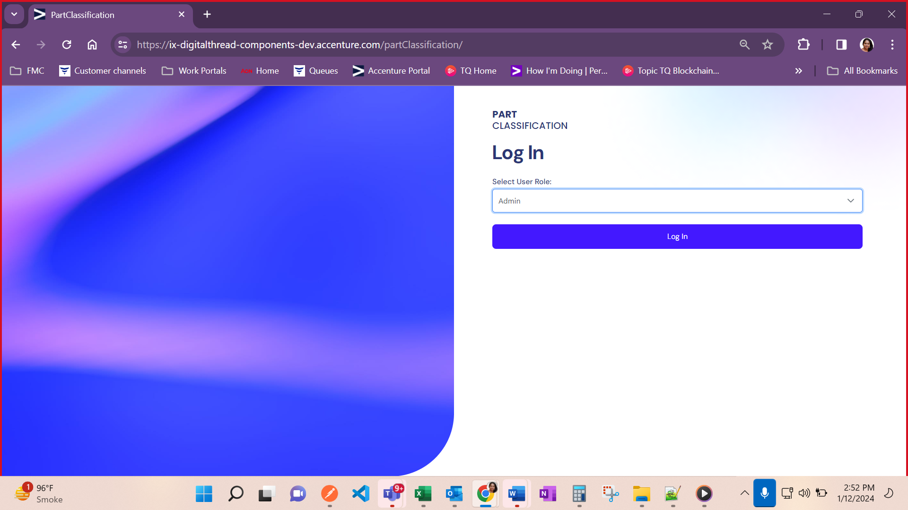
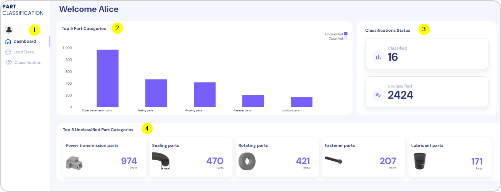
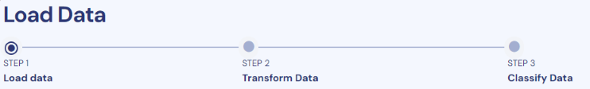
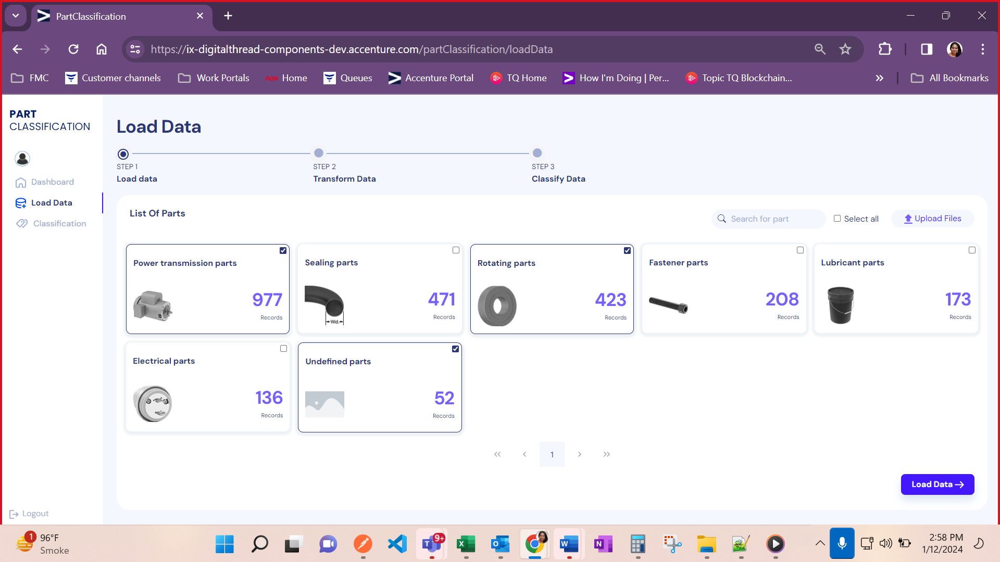
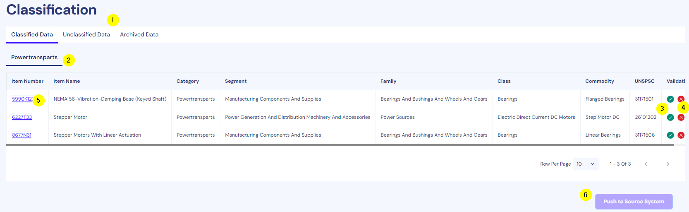
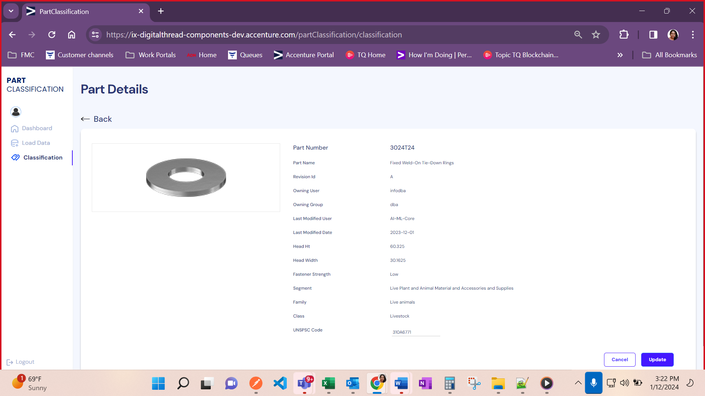
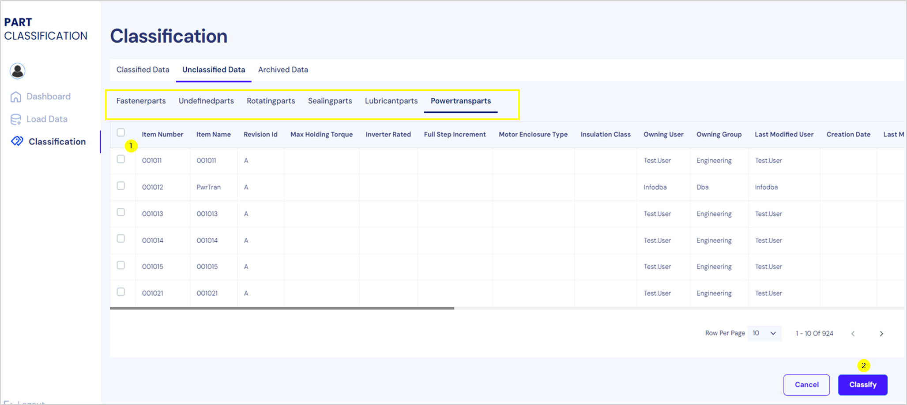
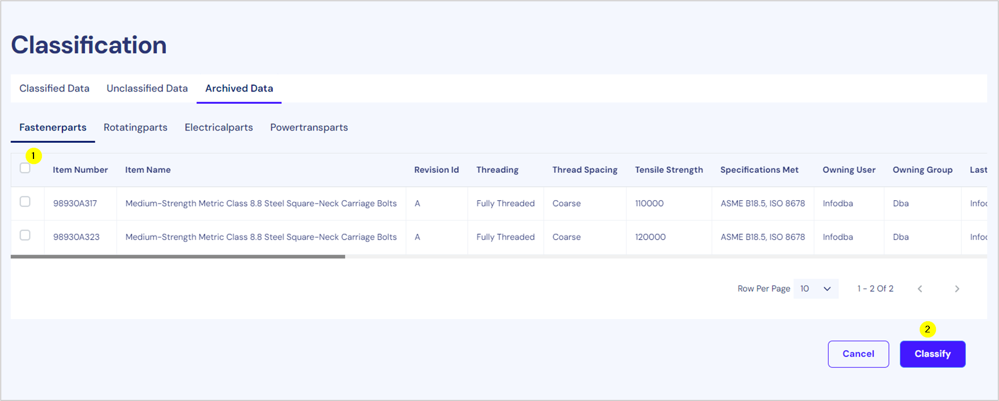

Digital Thread Foundations

Part Classification System

USE CASE OVERVIEW

Release: 1.2

Metadata Table

| **Field** | **Value** |
| --- | --- |
| **Asset / Solution Name** | Digital Thread |
| **Domain / Area** | Engineering |
| **Owner (Team/Person)** | Karthik Ramachandra |
| **Reviewers** | Karthik Ramachandra |
| **Status** | Approved / Complete |
| **Confidentiality** | Internal / Confidential |
| **Source of Truth** | [link](https://dev.azure.com/IXAssets/IXAssetsProject/\_git/ixassets) |
| **Related Assets / Alternatives** | AOT / Engineering Orchestration / Engineering Agents |

## Introduction

A digital thread refers to the continuous and consistent flow of information throughout the entire lifecycle of a product or system - from design and development to operation and maintenance. It enables the integration of data from different stages and sources, allowing effective traceability, seamless collaboration, and efficient decision-making by unleashing the power of sleeping data. The digital thread is considered a key aspect of Industry 4.0 and the digital transformation of the manufacturing industry. It is the core of what we call the Enterprise Operating System (EOS). Digital Thread is a communication framework that helps integrate various enterprise systems involved in the engineering and manufacturing product life cycle.

Digital Thread\'s Part Classification is an optimization engine designed to solve business challenges such as the rising number of components, lack of part management in systems, duplication of parts, and limited reuse. The solution features an intuitive user interface driven by IX Digital Thread on the back end.

### Purpose

This document describes IX Digital Thread\'s Part Classification system and its usage.

### Target Audience

Software architects, developers, and integrators with IT backgrounds.

###  Prerequisites

-   Access to Part Classification System by [sandipkumar.d.parmar@accenture.com](mailto:sandipkumar.d.parmar@accenture.com)

-   Global Protect VPN

-   Part Classification demo URL.

### Related Links

-   [Digital Thread Foundations Documentation](https://industryxdevhub.accenture.com/asset-home;search_text=ix%20digital%20thread)

### Business Contacts

-   [florian.tournier@accenture.com](mailto:florian.tournier@accenture.com)

-   [laura.mosconi@accenture.com](mailto:laura.mosconi@accenture.com)

-   [karthik.ramachandra@accenture.com](mailto:karthik.ramachandra@accenture.com)

### Technical Contacts

-   [laura.mosconi@accenture.com](mailto:laura.mosconi@accenture.com)

-   [janos.puskas@accenture.com](mailto:janos.puskas@accenture.com)

-   [zsolt.tofalvi@accenture.com](mailto:zsolt.tofalvi@accenture.com)

-   [stefano.giacco@accenture.com](mailto:stefano.giacco@accenture.com)

## 

# Background

### Challenges

The following challenges exist today:

-   Rising number of components

-   Lack of part management in systems (source of truth)

-   Duplication of parts and limited reuse

### Impact

The impact of the above challenges includes:

-   Considerable amount of time and effort spent in data management

-   Negative impact on operations and profitability

-   Increased cost of creating and managing parts

-   Inefficient change management

-   Decreased product quality due to limited control

-   Duplication of parts and product data

-   Increased time and effort searching for the right part

###  Solution

Digital Thread\'s Parts Management Optimization Engine solution for parts classification, standardization and rationalization solution will include following key features to optimize parts management:

-   A standardized process to develop organization wide classification, standardization and rationalization framework

-   Accelerated execution of unstructured raw object data to structured/classified data transformation using data analytics and AI/ML techniques

-   Enable robust data enrichment through data identification from unstructured documents and automated plug-in to scan relevant objects

-   Highly flexible and scalable solution to serve variety of industries and data objects with robust connectivity

-   Automated processes for adoption as well definition of precise classification schema for organization within short time

### Value

The solution delivers the following business KPIs:

-   Leaner organization with optimized parts management saving time, effort and cost across life cycle

-   Economies of scale and scope by supplier consolidation- spend Analytics and Savings in Supply chain/material cost

## 

The pages that follow describe the user interface processes for signing in, viewing the dashboard, and loading data, as well as classification of parts, as they would apply to an admin user with full control. Other user roles, as described in the last section of the document, have more limited abilities in the UI.

## Sign In

Ensure that all prerequisites have been met before attempting to sign in.

1.  Connect to the [Global Protect VPN](https://vpn.accenture.com).

2.  Open the Part Classification [URL](https://ix-digitalthread-components-dev.accenture.com/partClassification/).

3.  Enter your email address and password.

4.  Open the Microsoft Authenticator app on your mobile device and scan the QR code.

5.  As shown on the right, use the six-digit Authenticator code to gain access.

6.  As shown below, select a user role from the dropdown menu and click on *Log In*.\
    (1)

\
(3)

\
(5)

\(6\)

## Dashboard

The dashboard is the landing page after login. The dashboard components are called out in the screenshot. The following numbered list corresponds with the callouts in the screenshot.

1.  Side menu with three selectable options:

    -   Dashboard

    -   Load Data

    -   Classification

2.  Top 5 Part Categories of the PLM data source.

3.  Classification Status: Classified vs. Unclassified Parts count is displayed here.

4.  Top 5 Unclassified Part Categories of the PLM data source.

## Load Data

Clicking the Load Data link in the left navigation pane launches the Load Data page, which is comprised of three steps:

-   Load data

-   Transform data

-   Classify data\
    

### Step 1 - Load Data

Checking a checkbox for one or more parts selects it for loading. Clicking on *Load Data* loads the data for the selected parts. Note that the *Upload Files* control is for future use.

## 

## Step 2 -Transform Data

After the data is selected in step one and the *Load Data* option is clicked, the data begins to load. Once the data from the source system has loaded, three tabs are available for interaction.

-   Power Transformation Parts

-   Rotating Parts

-   Undefined Parts

After selecting the data using the checkboxes, the following options are enabled:

-   Skip Transformation

-   Define Transformation Logic

### Step 3 - Classify Data

When the data has been transformed and successfully classified, a success message is displayed along with an option labeled *Go to Classification*. Clicking on the option opens the *Classify Data* page where classified data may be reviewed and updated.

## 

# 

## Classification

This page has the following three tabs:

-   Classified Data

-   Unclassified Data

-   Archived Data

### Classified Data

After the transformation, data is classified into a parts category. The following numbered list corresponds with the callouts in the screenshot.

1.  The top menu is used to switch between tabs for classified, unclassified, and archived data.

2.  The second-level menu is used to switch between types of classifications if multiple types have been identified.

3.  The green verify icon may be used to validate the classification of the data

4.  The red X icon is used to move the data to the Archived tab.

5.  When clicked, the UNSPC code (Item Number) loads the *Part Details* page.

6.  Clicking on *Push to Source System* sends the classified data to the source system.

### Part Details

The *Part Details* page allows the end user to view all details of the part and make changes to the UNSPSC code if required.

### Unclassified Data

The Unclassified Data tab displays data that has undergone transformation but has not been assigned a UNSPSC code. The UNSPSC code is not assigned in scenarios that encounter exceptions such as the model not being trained for the data.

The data is organized in sub-tabs which are the parts categories defined when loading the data. The checkboxes (1) may be used to select the unclassified data. The Classify button is used to then classify the data that was selected.

### Archived Data

Under the Archived Data tab, the admin has the option to select parts (1) and use the Classify option (2) to generate the UNSPSC code. This can be done only for the data items that do not have the UNSPC code.

The Admin user can also use the *Undo Archive* option (not shown) to revert the Archive action (option visible for each item when scrolled completely to the right). If the data has a UNSPC code, then it is moved to the Classified Data tab, otherwise, it is moved to the Unclassified Data tab.

## User Roles

User roles are defined based on different authorization levels to grant people the appropriate access to the Part Classification system.

| User Role | Description |
| --- | --- |
| Admin | The administrator has access to all functionalities and full access |
| Data Engineer | The Data Engineer can perform the data transformation but cannot Classify or Edit the Classified data. |
| PLM Manager | The PLM Manager can manage procurement and inventory of parts, classify the data as the UNSPSC code, and update the data as needed. |
| Standard User | The Standard User has read-only access. |

### Feature Availability by Role 

As each role has a different authorization level, the features of the Part Classification system available to them vary. The following table describes the features available for each user role.

**Dashboard Page**

| Feature | Admin Data Engineer PLM Manager Standard User |
| --- | --- |
| Graph | Y Y Y Y |
| Top 5 Unclassified Part Categories | Y Y Y Y |
| Count of Unclassified/Classified | Y Y Y Y **Load Data Page** |
| Feature | Admin Data Engineer PLM Manager Standard User |
| View list of parts | Y Y Y Y |
| Load Data option for part details | Y Y Y Y |
| Define transformation option (includes Transform option for a standard user) | Y Y N N |
| Classify option | Y N Y N **Classification Page** |
| Feature | Admin Data Engineer PLM Manager Standard User |
| View List of Classification types | Y Y Y Y |
| Push to Source system option | Y N Y N |
| View UNSPSC code | Y Y Y N |
| Update for UNSPSC code (update option) | Y N Y N |
| Archive data from the Classified tab | Y N Y N |
| Archive data from the Unclassified tab | Y N Y N |
| Classify option in the Unclassified tab | Y N Y N |
| Classify option in the Archive tab | Y N Y N Contact [sandipkumar.d.parmar@accenture.com](mailto:sandipkumar.d.parmar@accenture.com) to get access for all roles. |
