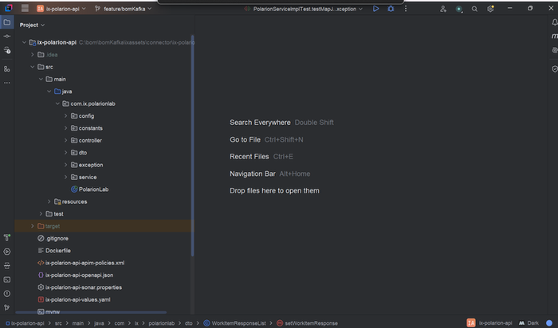

Digital Thread Foundations

Polarion Connector

INTEGRATION GUIDE

Release Version: 1.2

## 
\{#section .TOC-Heading\}

## Introduction

A digital thread refers to the continuous and consistent flow of information throughout the entire lifecycle of a product or system - from design and development to operation and maintenance. It enables the integration of data from different stages and sources, allowing effective traceability, seamless collaboration, and efficient decision-making by unleashing the power of sleeping data. Digital Thread is a communication framework that helps integrate various enterprise systems involved in the engineering and manufacturing product life cycle.

*Siemens Polarion ALM* (Application Lifecycle Management) is a powerful, web-based platform that enables organizations to manage the complete lifecycle of software and system development. It provides end-to-end traceability, collaboration, and process automation - from requirements gathering and design, to development, testing, and release management.

IX Digital Thread Foundations leverages Polarion by utilizing its Polarion Connector. This connector is designed to bridge the gap between disparate systems, providing a robust solution for managing the application\'s lifecycle data across different platforms. The connector enables users to effortlessly connect with Polarion and execute operations such as fetching, creating, updating, and deleting the data.

### Purpose

This document provides information about IX Digital Thread\'s Polarion Connector, including its usage and related APIs.

### Target Audience

Software architects, developers, and integrators with IT backgrounds.

### Business Contacts

-   [florian.tournier@accenture.com](mailto:florian.tournier@accenture.com)

-   [karthik.ramachandra@accenture.com](mailto:karthik.ramachandra@accenture.com)

-   [laura.mosconi@accenture.com](mailto:laura.mosconi@accenture.com)

### Technical Contacts

-   [karthik.ramachandra@accenture.com](mailto:karthik.ramachandra@accenture.com)

-   [phani.kumar.koduri@accenture.com](mailto:phani.kumar.koduri@accenture.com)

-   [g.c.shukla@accenture.com]

-   [rohan.anaparthi@accenture.com]

### Related Links

-   [IX Digital Thread Connectors](https://industryxdevhub.accenture.com/assetdetails/97)

-   [Release Notes](https://industryxdevhub.accenture.com/assetdetails/84)

-   [IX Digital Thread Documentation](https://industryxdevhub.accenture.com/asset-home;search_text=IX%20Digital%20Thread)

### 

## Prerequisites

-   [Download](https://www.java.com/download) and [install](https://ts.accenture.com/sites/GlobalDocTemplates/ixthread/Shared%20Documents/RC1/•%09https:/docs.oracle.com/en/java/javase/16/install/installation-jdk-microsoft-windows-platforms.html) Java (version 17)

-   [Download](https://www.jetbrains.com/idea/download/) and [install](https://www.jetbrains.com/idea/download/) IntelliJ IDEA (version: 2023.1.1)

-   [Download](https://maven.apache.org/download.cgi) and [install](https://maven.apache.org/install.html) Apache Maven (version: 3.9.1)

-   Azure Artifact Repository Access

-   Azure Storage Access.

-   An API testing tool such as [Postman](https://app.getpostman.com/app/download/win64).

## Usage

1.  Visit the Azure repository at .

2.  Use Git to Clone the project into local.

3.  Use this path to access the Teamcenter connector code in IntelliJ IDEA: IXDigitalThread\\TC-Dev\\ix-thread-components\\connector\\ix-polarion-api.

4.  Import the project into IntelliJ from the project directory. After importing, the project structure should resemble the following example.

> 

5.  After importing the project into local, Update the application.properties with server details.

6.  Run the application.

7.  Using Postman, add \"user-role\" in the header to trigger the APIs.

## APIs

The Polarion Connector offers a suite of CRUD APIs designed to streamline interactions with Polarion, enabling a range of operations including creating, updating, reading, and deleting data.

| Name | Description |
| --- | --- |
| GET Document Details | This API retrieves Document details from Polarion. |
| POST Create Work Item | This API creates a work item depending on the request body create a work item in a Polarion |
| PATCH Update Work Item | This API updates the work item attribute of work item in Polarion on the provided request body. |
| DELETE Work Item | This API is used to delete a work item from the document in Polarion. |
| POST Link Work Item Details | This API will link the work Item to a document based on the request body |
| POST Polarion - Teamcenter Sync | This API fetch document work item details from Polarion and create those work items in Teamcenter These CRUD APIs enable seamless interaction with Siemens Polarion to perform essential operations such as fetching Documents and their associated Work Items, updating existing documents and work items, or creating new work items. This API provides the flexibility required to manage work items and link them to documents from external systems or custom applications, thereby enhancing integration capabilities and automation within the Polarion ecosystem. Capabilities include: |
| 1. | Logging |
| 2. | Secure Secrets Management |
| 3. | Error management |
| 4. | Role-based Access Control The capabilities listed above are described in the subsequent sections. |
#### 

## Logging

Polarion connector is built to log with logback and slf4j. The required format for the application logging is as follows:

\\|\\|\\|\\|\\|\\|\\|\

Refer logback-spring.xml under the directory \"src/main/resources\"

> \
>
> \
>
> \
>
> \
>
> \
>
> %d\{yyyy-MM-dd\'T\'HH:mm:ss.SSS\'Z\'\}\|%level\|%thread\|%X\{APPLICATION-LABEL\}\|%X\{TRANSACTION-ID\}\|%X\{PLATFORM-TRANSACTION-ID\}\|%logger\|%method\|%msg%n
>
> \
>
> \
>
> \
>
> \
>
> \
>
> \
>
> \
>
> \
>
> \
>
> \

#### Transaction ID Parameters

Logging requires the use of transaction ID parameters, which are unique identifiers generated for each transaction. These parameters are displayed in the output header. The table below describes these parameters.

| Parameter | Description M/O\* |
| --- | --- |
| cpaas-transaction-id | The transaction ID from the input M |
| cpaas-platform-transaction-id | The transaction ID that is automatically set through the API Manager. NA indicates that the parameter is empty. O *\*Mandatory/Optional* |
### 

## **Secure Secrets Management**

Secret management lets developers securely store sensitive data like passwords, keys, and tokens with strict access controls. Azure Key Vault provides centralized, protected storage for credentials using advanced security measures. In Teamcenter, users can keep access information in key vaults, which APIs can retrieve securely to perform actions based on credential permissions.

#### Azure Key Vault Dependency

> \
>
> \com.azure.spring\
>
> \spring-cloud-azure-starter-[keyvault]-secrets\
>
> \
>
> \
>
> \
>
> \
>
> \com.azure.spring\
>
> \spring-cloud-azure-dependencies\
>
> \5.3.0\
>
> \[pom]\
>
> \import\
>
> \
>
> \
>
> \

#### Key Vault Configuration

In springboot application.properties:

spring.cloud.azure.keyvault.secret.property-source-enabled=true

spring.cloud.azure.keyvault.secret.property-sources\[0\].credential.client-secret=\

spring.cloud.azure.keyvault.secret.property-sources\[0\].credential.client-id=\

spring.cloud.azure.keyvault.secret.property-sources\[0\].profile.tenant-id=\

spring.cloud.azure.keyvault.secret.property-sources\[0\].endpoint=\

### Error Management

Whenever a certain operation encounters an error, the same structure should be returned by all the DigitalThread components in the body of the output.

| ***Parameter*** | ***Description*** ***Mand/Opt*** ***Type*** |
| --- | --- |
| errorManagement | *Object identifying the error* O\* Object |
| errorCode | *Code that identifies the error occurred* O\* String |
| errorDescription | *Error description* O\* String **Example Error Response** &gt; \{ &gt; &gt; \"errorManagement\": \{ &gt; &gt; \"errorCode\": \"CMPNT_02.100004\", &gt; &gt; \"errorDescription\": \"db connection error\" &gt; &gt; \} &gt; &gt; \} |
#### 

## Role-based Access Control

Role-based Access Control (RBAC) is a mechanism that restricts system access. Also known as role-based security, it involves setting permissions and privileges to enable access to authorized users. Users can consume the API exposed, based on the RBAC system. Users may have different access to the external system. Role Based Access Control (RBAC) in the Polarion connector application is managed through Azure management services. Policies are defined at the product level, dictating the access rights for various methods within the application. The below table shows the permissions granted to each role.

The permissions granted to each role in the Polarion connector application are as follows:

-   Admin: Has full permissions, including POST, PUT, and GET operations.

-   QE (Quality Engineer): Has full permissions, including POST, PUT, and GET operations.

-   Tester: Has limited permissions and can only perform GET operations.

-   Dev (Developer): Has limited permissions and can only perform GET operations.

-   User: Has limited permissions and can only perform GET operations.

### 

### Post Create WorkItem

This API endpoint allows clients to create a new Work Item in Siemens within a specified project. It accepts the project identifier, an access token for authentication, and the request body containing the Work Item details such as title, type, description, and any additional fields required by Polarion.

| PROTOCOL | HTTPS |
| --- | --- |
| DEV ENDPOINT |  |
| QA ENDPOINT |  |
| METHOD | POST |
| CONTENT TYPE | application / json |
| SAMPLE REQUEST | [Link](https://ts.accenture.com/:t:/r/sites/GlobalDocTemplates/Published%20Documents/IX%20Thread/Linked%20Files/Polarion%20Connector/POST_Create_Work_Item_Sample_Request.txt) |
| SAMPLE RESPONSE | [Link](https://ts.accenture.com/:t:/r/sites/GlobalDocTemplates/Published%20Documents/IX%20Thread/Linked%20Files/Polarion%20Connector/POST_Create_Work_Item_Sample_Response.txt) |
##### Input Header

| Header | Description |
| --- | --- |
| accessToken | The authentication token generated by Polarion UI used to authorize the request against the Polarion API. |
##### Input Path

| Parameter | Description |
| --- | --- |
| projectId | The unique identifier of the Polarion project that contains the Work Item to be updated. |
##### Result

| HTTP Code | Result Description |
| --- | --- |
| 200 | WorkItems Created Successful |
##### Error Management

| HTTP Code | Error Code Error Description |
| --- | --- |
| 500 | 500 Project Specific error |
| 404 | 404 Not Found |
| 403 | 403 Forbidden |
| 401 | 401 Invalid Subscription key / Invalid Token |
| 400 | 400 Bad request |
#### 

### Patch Update WorkItem

This API endpoint allows clients to create a new Work Item in Siemens within a specified project. It accepts the project identifier, an access token for authentication, and the request body containing the Work Item details such as title, type, description, and any additional fields required by Polarion.

| PROTOCOL | HTTPS |
| --- | --- |
| DEV ENDPOINT |  |
| QA ENDPOINT |  |
| METHOD | Patch |
| CONTENT TYPE | application/json |
| SAMPLE REQUEST | [Link](https://ts.accenture.com/:t:/r/sites/GlobalDocTemplates/Published%20Documents/IX%20Thread/Linked%20Files/Polarion%20Connector/POST_Create_Work_Item_Sample_Request.txt) |
##### Input Path

| Parameter | Description |
| --- | --- |
| projectId | The unique identifier of the Polarion project that contains the Work Item to be updated. |
| workItemId | The unique identifier of the Work Item to be modified. |
##### Input Header

| Header | Description |
| --- | --- |
| accessToken | The authentication token generated by Polarion UI used to authorize the request against the Polarion API. |
##### Result

| HTTP Code | Result Description |
| --- | --- |
| 200 | WorkItems Updated Successful |
##### Error Management

| HTTP Code | Error Code Error Description |
| --- | --- |
| 500 | 500 Project Specific error |
| 404 | 404 Not Found |
| 403 | 403 Forbidden |
| 401 | 401 Invalid Subscription key / Invalid Token |
| 400 | 400 Bad request |
#### 

### Delete WorkItem

This API endpoint allows clients to delete an existing Work Item from Siemens Polarion within a specified project. It requires a project identifier, a valid access token for authentication, and a request body containing the details of the Work Item to be deleted.

| PROTOCOL | HTTPS |
| --- | --- |
| DEV ENDPOINT |  |
| QA ENDPOINT |  |
| METHOD | Delete |
| CONTENT TYPE | application/json |
| SAMPLE REQUEST | \{\"data\":\[\{\"type\":\"workitems\",\"id\":\"E_Bike/EB-33\"\},\{\"type\":\"workitems\",\"id\":\"E_Bike/EB-35\"\}\]\} |
##### Input Header

| **Header** | **Description** |
| --- | --- |
| accessToken | The authentication token generated by Polarion UI used to authorize the request against the Polarion API. |
##### Input Path

| **Parameter** | **Description** |
| --- | --- |
| projectId | The unique identifier of the Polarion project that contains the Work Item to be deleted. |
##### Result

| HTTP Code | Result Description |
| --- | --- |
| 200 | WorkItems Deleted Successful |
##### Error Management

| HTTP Code | Error Code Error Description |
| --- | --- |
| 500 | 500 Project Specific error |
| 404 | 404 Not Found |
| 403 | 403 Forbidden |
| 401 | 401 Invalid Subscription key / Invalid Token |
| 400 | 400 Bad request |
#### 

### Get Document

This API endpoint allows clients to retrieve a specific Document from Siemens Polarion within a given project and space. It requires the project identifier, the space ID where the document resides, the document name, and a valid access token for authentication. The response contains detailed information about the document and its associated Work Items.

| PROTOCOL | HTTPS |
| --- | --- |
| DEV ENDPOINT |  |
| QA ENDPOINT |  |
| METHOD | GET |
| CONTENT TYPE | application/json |
| SAMPLE RESPONSE | [Link](https://ts.accenture.com/:t:/r/sites/GlobalDocTemplates/Published%20Documents/IX%20Thread/Linked%20Files/Polarion%20Connector/GET_Document_Sample_Response.txt) |
##### Input Header

| **Header** | **Description** |
| --- | --- |
| accessToken | The authentication token generated by Polarion UI used to authorize the request against the Polarion API. |
##### Input Path

| **Parameter** | **Description** |
| --- | --- |
| projectId | The unique identifier of the Polarion project that contains the Work Item to be deleted. |
| spaceId | The identifier of the space or folder within the project where the document is stored. |
| documentName | The name of the document to be retrieved. |
##### Result

| HTTP Code | Result Description |
| --- | --- |
| 200 | Document is retrieved successfully |
##### Error Management

| HTTP Code | Error Code Error Description |
| --- | --- |
| 500 | 500 Project Specific error |
| 404 | 404 Not Found |
| 403 | 403 Forbidden |
| 401 | 401 Invalid Subscription key / Invalid Token |
| 400 | 400 Bad request |
#### 

### Link WorkItem to Document

This API endpoint allows clients to link an existing Work Item to a Document within Siemens Polarion. It requires the project identifier, the unique Work Item ID, a valid access token for authentication, and a request body containing the document details or link configuration. By establishing this association, teams can maintain traceability between requirements, tasks, and documentation.

| PROTOCOL | HTTPS |
| --- | --- |
| DEV ENDPOINT |  |
| QA ENDPOINT |  |
| METHOD | POST |
| CONTENT TYPE | application/json |
| SAMPLE REQUEST | \{ \"targetDocument\": \"IXDT/Development/Demo Doc\"*,* \"previousPart\": \"IXDT/Development/Demo Doc/workitem_IXDT-616\"*,* \"nextPart\": \"IXDT/Development/Demo Doc/workitem_IXDT-623\" *\}* |
##### Input Path

| Parameter | Description |
| --- | --- |
| projectId | The unique identifier of the Polarion project that contains the Work Item to be deleted. |
| spaceId | The identifier of the space or folder within the project where the document is stored. |
##### Input Header

| Header | Description |
| --- | --- |
| accessToken | The authentication token generated by Polarion UI used to authorize the request against the Polarion API. |
##### Result

| HTTP Code | Result Description |
| --- | --- |
| 200 | workItem link Successfull |
##### Error Management

| HTTP Code | Error Code Error Description |
| --- | --- |
| 500 | 500 Project Specific error |
| 404 | 404 Not Found |
| 403 | 403 Forbidden |
| 401 | 401 Invalid Subscription key / Invalid Token |
| 400 | 400 Bad request |
#### 

### Sync Work Items

This API endpoint enables clients to synchronize Work Items from Siemens Polarion to Teamcenter. It facilitates data transfer between the two systems, ensuring that Work Items in Polarion are accurately reflected in Teamcenter for seamless traceability and collaboration. The synchronization process requires project and document identifiers to locate the source Work Items, a mapping file to define field correspondences between Polarion and Teamcenter, and valid authentication headers for secure data exchange.

| PROTOCOL | HTTPS |
| --- | --- |
| DEV ENDPOINT |  |
| QA ENDPOINT |  |
| METHOD | POST |
| CONTENT TYPE | application/json |
| SAMPLE REQUEST | \{ |
| (mapping file) | \"ObjectMapping\": \{ \"type\": \"workitems\", \"tctype\": \"Requirement\", \"AttributeMappings\": \[ \{ \"name\": \"id\", \"tcattr\": \"id\" \}, \{ \"name\": \"title\", \"tcattr\": \"object_name\" \}, \{ \"name\": \"description\", \"tcattr\": \"object_desc\" \}, \{ \"name\": \"links::portal\", \"tcattr\": \"portalUrl\" \} \] \} \} |
##### Input Headers

| Header | Description |
| --- | --- |
| accessToken | The authentication token generated by Polarion UI used to authorize the request against the Polarion API. |
| Transaction-Id | A unique transaction identifier used for tracking and auditing the synchronization process. |
| Authorization | The authorization token for authenticating requests to the Teamcenter system. |
##### Input Path

  -------------------------------------------------------------------------------------------------------------------------------------------------------------

| Parameter | Description |
| --- | --- |
| projectId | The unique identifier of the Polarion project that contains the Work Item to be deleted. |
| spaceId | The identifier of the space or folder within the project where the document is stored. |
| documentName | The name of the document whose associated Work Items are to be synchronized. |
| mappingFile (multipart/form-data, *required*) | A file of type MultipartFile that defines the mapping configuration between Polarion and Teamcenter fields. |
##### Result

| HTTP Code | Result Description |
| --- | --- |
| 200 | workItem details sent to teamcenter successful |
##### Error Management

| HTTP Code | Error Code Error Description |
| --- | --- |
| 500 | 500 Project Specific error |
| 404 | 404 Not Found |
| 403 | 403 Forbidden |
| 401 | 401 Invalid Subscription key / Invalid Token |
| 400 | 400 Bad request |