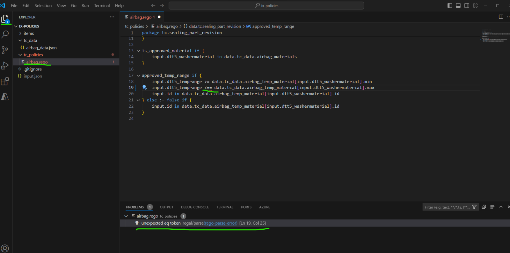
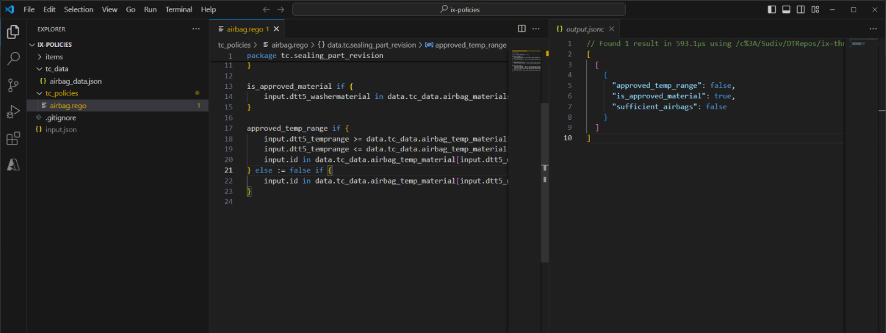
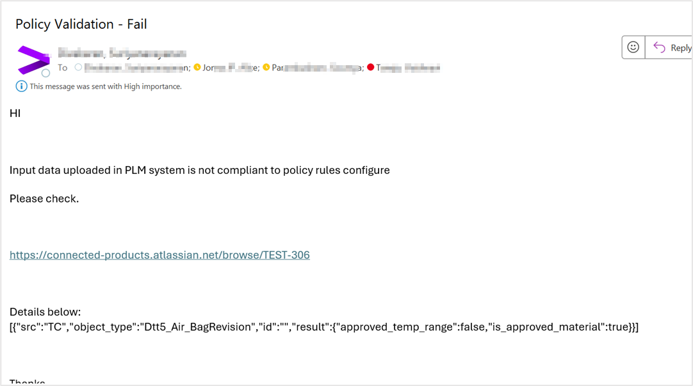

Digital Thread Foundations

Policy Engine

USE CASE OVERVIEW

Release: 1.2

Metadata Table

| **Field** | **Value** |
| --- | --- |
| **Asset / Solution Name** | Digital Thread |
| **Domain / Area** | Engineering |
| **Owner (Team/Person)** | Karthik Ramachandra |
| **Reviewers** | Karthik Ramachandra |
| **Status** | Approved / Complete |
| **Confidentiality** | Internal / Confidential |
| **Source of Truth** | [link](https://dev.azure.com/IXAssets/IXAssetsProject/\_git/ixassets) |
| **Related Assets / Alternatives** | AOT / Engineering Orchestration / Engineering Agents |
| # | \{#section .TOC-Heading\} |
| # | \{#section-1 .TOC-Heading\} |

## Introduction

A digital thread refers to the continuous and consistent flow of information throughout the entire lifecycle of a product or system - from design and development to operation and maintenance. It enables the integration of data from different stages and sources, allowing effective traceability, seamless collaboration, and efficient decision-making by unleashing the power of sleeping data. The digital thread is considered a key aspect of Industry 4.0 and the digital transformation of the manufacturing industry. It is the core of the Enterprise Operating System (EOS). Digital Thread is a communication framework that helps integrate various enterprise systems involved in the engineering and manufacturing product life cycle.

In Digital Thread Foundations, Policy Engine implementation is a way of governing the thread\'s components and driving the business compliance and risk management for business policies for an organization across the thread\'s framework.

### Purpose

This document describes Policy Engine implementation and usage to assist the target audience in understanding and authoring business policies for IXDT.

### 

## Target Audience

-   Software developers

-   Quality control engineers

-   Legal team

### Related Links

-   [OPA Rego](https://www.openpolicyagent.org/docs/latest/policy-language/)

-   [Release Notes](https://industryxdevhub.accenture.com/assetdetails/84)

-   [Architecture](https://industryxdevhub.accenture.com/assetdetails/85)

-   [Functional Overview](https://industryxdevhub.accenture.com/assetdetails/86)

### 

## Business Contacts

-   [florian.tournier@accenture.com](mailto:florian.tournier@accenture.com)

-   [laura.mosconi@accenture.com](mailto:laura.mosconi@accenture.com)

-   [karthik.ramachandra@accenture.com](mailto:karthik.ramachandra@accenture.com)

### Technical Contacts

-   [laura.mosconi@accenture.com](mailto:laura.mosconi@accenture.com)

-   [stefano.giacco@accenture.com](mailto:stefano.giacco@accenture.com)

### Prerequisites

-   Global Protect VPN

-   Access to IX Digital Thread

-   Familiarity with REGO (Policy Language)

-   Access to upload/integrate with CAD tools like NX/connector-enabled upload functionality for a model to Teamcenter

## Background

The policy management of IXDT is explained via its challenges, its impact, the solution developed, and the value it brings to Thread.

### Challenges

Policy management in IXDT faces the following challenges:

-   Policy management was not centralized

-   Policy enforcement was not dynamic

-   Weak policies audit trail

### Impact

The aforementioned challenges caused the following impact.

-   Product Lifecycle Management often involves sensitive data and processes that must comply with regulatory requirements, which are clearly defined due to policy management challenges.

-   A lack of centralized policy enforcement results in security vulnerabilities.

-   Failure to enforce compliance policies may lead to legal consequences, fines, or reputational damage.

-   Policy management inefficiencies cause operational since more time is spent in resolving policy conflicts and inconsistencies**.**

-   There is ambiguity regarding who is responsible for enforcing and adhering to policies, which can lead to gaps in governance and oversight.

### Solution

Digital Thread\'s use case with Policy Engine provides the necessary framework to manage and protect data throughout a product\'s lifecycle, thereby supporting the integrity and reliability of the digital thread ecosystem.

-   Accelerated execution of unstructured raw object data to structured/classified data transformation using data analytics and AI/ML techniques.

-   Enable robust data enrichment through data identification from unstructured documents and automated plug-ins to scan relevant objects.

-   Highly flexible and scalable solution to serve a variety of industries and data objects with robust connectivity.

-   Automated processes for adoption as well as the definition of precise classification schema for organization within a short time.

### 

## Value

The solution delivers the following values.

-   **Consistency and Standardization**: A policy engine ensures that consistent policies are applied across the entire digital ecosystem of the company. This includes manufacturing processes, data handling procedures, access controls, and compliance measures. Standardization helps reduce errors, improves operational efficiency, and enhances overall quality management.

-   **Enhanced Security**: By centrally managing access controls, encryption standards, and data protection policies, a policy engine strengthens security measures within the company. It ensures that sensitive information, such as design specifications, manufacturing plans, and customer data, is accessed only by authorized personnel and protected against cyber threats and data breaches.

-   **Compliance Assurance**: Product manufacturing companies are subject to strict regulatory requirements and industry standards (e.g., ISO standards, and automotive safety regulations). A policy engine facilitates compliance by enforcing relevant policies and procedures. It ensures that the company adheres to data privacy laws (e.g., GDPR), safety regulations, and other legal requirements, thereby mitigating the risk of non-compliance penalties and reputational damage.

-   **Operational Efficiency**: Automating policy enforcement through a policy engine reduces the manual effort required to manage and monitor policies. This frees up resources and allows employees to focus on core manufacturing activities and innovation rather than administrative tasks. Streamlined processes lead to improved efficiency and faster decision-making.

-   **Risk Management**: Effective policy management helps mitigate risks associated with data breaches, unauthorized access, and operational disruptions. The policy engine can proactively identify and address potential security vulnerabilities or policy violations, reducing the likelihood of incidents that could impact production schedules or customer trust.

-   **Flexibility and Scalability**: A policy engine provides flexibility to adapt policies as business needs evolve or regulatory requirements change. It supports scalability by easily integrating with new technologies, systems, and processes implemented as the company grows. This agility allows the company to innovate and respond quickly to market demands without compromising security or compliance.

-   **Auditing and Accountability**: The policy engine maintains audit logs and provides visibility into policy enforcement and access control decisions. This transparency enhances accountability by enabling the company to track who accessed specific data or systems and when supporting internal audits and regulatory compliance reviews.

## 

# Authoring Policies

To author a policy, VS code is used. Policies are authored, generally by developers, according to the regulatory and business needs defined by stakeholders such as Legal teams and Regulatory teams. To understand the authoring of policies, consider the example depicted in the image below.

1.  The item that requires a business/legal/compliance policy to be defined, is identified in the Data Catalog.

2.  The sample policy considered as an example here is an airbag (item) with part ID 000123 for a car manufacturer, where there is a compliance requirement for the market region EU to have the number of airbags for the specific model (part marked critical) as Redundancy- Min=2, Max=6.

3.  Use VS code to author policy:

    a.  Once the first two steps are complete, create a new Rego and the input data file to test the setup.

    b.  Open the folder with the policies and other files (data.json and input.json) in the VS Code (File \&gt; Open Folder)

    c.  On the file navigator on the left, double-click on any file with the .rego extension to open the policy file.

## Use Case - Car Manufacturing Instance

### Upload Design Data

Parts for production are handled in a PLM system. Product Lifecycle Management (PLM) encompasses the entire lifecycle of a product, from its initial conception through design, manufacturing, distribution, and eventually disposal or recycling. For the car, a designer uploads the Airbag part design to ID 000123 in Teamcenter.

In the context of the example being discussed, the car manufacturer decides and defines policies for the parts. An airbag is considered a critical part and thus has compliance requirements. The compliance requirement set for the car is as per its market region (EU), where the airbag must fulfill the following: Redundancy- Min=2, Max=6, a temperature range of Min=30 Max=100, and Material = TPU.

-   The input file is uploaded by the designer.

-   Details for the attributes of the part are updated along with the file uploaded for the part. E.g. temperature range, and redundancy for the Airbag.

#### Methods

1.  Load file via NX

> NX is a CAD tool that can be used to create a CAD file. It can be directly integrated with Teamcenter, thus enabling modifications made in NX to reflect in Teamcenter.

2.  Load file via Direct upload

> Directly upload to the part ID 000123 in Teamcenter.

3.  Upload the file via the Teamcenter connector

> Use a connector via POSTMAN service for an item ID 000123 to which the CAD needs to be uploaded.

### Policy Trigger

Open Policy Agent is the Policy Engine used for policy management. A notifier is run in Teamcenter to detect when files are modified in Teamcenter. When it detects modifications, it publishes notifications (as .json files), which are sent as input to OPA and then the policy engine is triggered.

A subscriber service within the OPA receives this trigger (the input .json files) and based on details of the item and policies that are attached to it, it evaluates the item.

### 

## Policy Evaluation 

OPA is configured with policies that define the acceptable attribute range for the item, and in this case, Airbag A. The attribute range is (min=2 and max=6), and the acceptable temperature range and acceptable material are shown in the example below.

The OPA evaluates the uploaded attributes against these defined policies.

### Compliance Check

After OPA evaluates the item against the defined policies, the status is sent as follows:

-   Compliant: If attributes (e.g., temperature range) meet policy criteria, OPA sends a compliant status.

-   Non-compliant: If attributes do not meet policy criteria, OPA sends a non-compliant status.

#### 

### Workflow Automation Using Azure Logic App

Based on OPA\'s compliance status (compliant or non-compliant), the Azure Logic App is triggered as follows.

-   Compliant: The relevant stakeholders are notified of the complaint status via email.

-   Non-compliant: The relevant stakeholders are notified of the non-compliant status via email. Additionally, a workflow is initiated to address the non-compliance (for example, a JIRA ticket is raised to correct the design).

A sample email sent for non-compliance is shown below.

