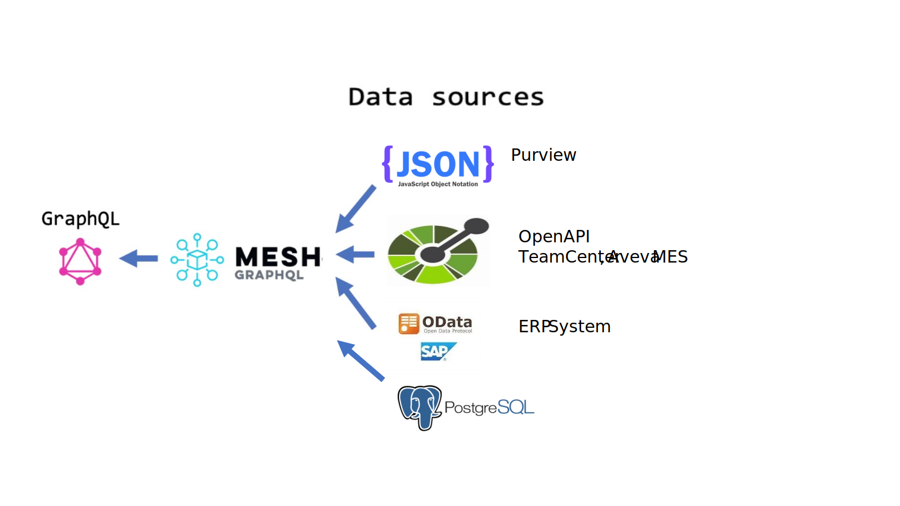

Digital Thread Foundations

Query Engine

API REFERENCE

Release Version: 1.2

Metadata Table

| **Field** | **Value** |
| --- | --- |
| **Asset / Solution Name** | Digital Thread |
| **Domain / Area** | Engineering |
| **Owner (Team/Person)** | Karthik Ramachandra |
| **Reviewers** | Karthik Ramachandra |
| **Status** | Approved / Complete |
| **Confidentiality** | Internal / Confidential |
| **Source of Truth** | [link](https://dev.azure.com/IXAssets/IXAssetsProject/\_git/ixassets) |
| **Related Assets / Alternatives** | AOT / Engineering Orchestration / Engineering Agents |

### Purpose

This document serves as an API reference for IX Digital Thread\'s Query Engine application.

### Target Audience

Developers, Business Analysts, and Accenture teams deploying IX Digital Thread\'s applications.

### Prerequisites

Access to Azure DevOps, Purview, and Query Engine APIs provided by [IX_DT_DEVOPS_INFRA@accenture.com](mailto:IX_DT_DEVOPS_INFRA@accenture.com).

### Contacts

-   [karthik.ramachandra@accenture.com](mailto:karthik.ramachandra@accenture.com)

-   [d.choukse@accenture.com](mailto:d.choukse@accenture.com)

### Related Links

-   [Release Notes](https://industryxdevhub.accenture.com/assetdetails/84)

-   [Documentation](https://industryxdevhub.accenture.com/asset-home;search_text=ix%20digital%20thread)

## 

# Background

GraphQL Mesh is a tool that allows users to access any data source (REST APIs, gRPC, databases, Odata, SOAP, etc.) with GraphQL. It provides a way to unify these different types of data sources into a single GraphQL schema. Query Engine uses GraphQL Mesh internally. It leverages GraphQL\'s capabilities to interact with various external source systems such as connectors, ERP, Aveva MES, Purview, and RDBMS. GraphQL Mesh allows the Query Engine to integrate with different data sources such as OData, Open API, JSON Schema, and Postgres.

The Query Engine uses GraphQL Mesh as follows:

1.  Schema Stitching and Transformation:

-   GraphQL Mesh automatically generates a GraphQL schema by introspecting the source systems.

-   It can stitch together multiple schemas from different sources into a single, unified schema.

2.  Query Translation and Execution:

-   When a user submits a query, the Query Engine uses GraphQL Mesh to translate the GraphQL query into the respective format required by each data source (e.g., SQL for databases, HTTP requests for REST APIs).

-   GraphQL Mesh handles the execution of these translated queries against the respective data sources.

3.  Data Integration:

-   The results from various data sources are integrated and transformed into the shape defined by the GraphQL schema.

-   This allows for seamless integration of data from disparate sources into a single response.

### 

## Data Sources

> 

## API Usage

### Endpoint URL

| **Environment** | **API Endpoint URL** |
| --- | --- |
| DEV | [link](https://ix-dev-apimgmt.azure-api.net/query-engine-api) |
| QA | [link](https://ix-qa-apimgmt.azure-api.net/query-engine-api) |

### Example API Request

curl \--location \--request POST \'https://ix-dev-apimgmt.azure-api.net/test-query-engine-api\' \\

\--header \'Ocp-Apim-Subscription-Key: 2547a337c5c048afa719197ba4ac4ffe \'\\

\--header \'Authorization: Bearer \\' \\

\--header \'Content-Type: application/json\' \\

\--data-raw \'\{\"query\":\"query materialTracking \{\\r\\n materialTrackingSet \{\\r\\n trackingNumber\\r\\n material\\r\\n qualityControl\\r\\n inventory\\r\\n quantity\\r\\n transactionType\\r\\n tracsactionDate\\r\\n sourceLocation\\r\\n destination\\r\\n transactionStatus\\r\\n createdOn\\r\\n createdAt\\r\\n \}\\r\\n\}\",\"variables\":\{\}\}\'

### Authentication and Authorization

The Query Engine API requires authorization using a Bearer Token (JWT) to secure access to its resources.

#### Obtaining a Bearer Token (JWT)

-   Users or applications authenticate and obtain a JWT token from the authentication server.

-   Kindly send an email to Infra Team [IX_DT_DEVOPS_INFRA@accenture.com](mailto:IX_DT_DEVOPS_INFRA@accenture.com) to provide B2C token access for Query Engine API to generate JWT token.

#### Including the Bearer Token in API Requests

-   To access protected endpoints of the Query Engine API, include the JWT token in the Authorization header of your HTTP requests.

-   Format the header as follows:

> Authorization: Bearer \
>
> Replace \ with the actual JWT token obtained from the authentication server.

#### Handling Authorization Errors

If an invalid or expired JWT token is provided, the Query Engine API will respond with an HTTP 401 Unauthorized error.

### 

## Subscription Key

When accessing APIs managed by API Management (APIM), it is mandatory to include the Ocp-Apim-Subscription-Key header in your HTTP requests.

#### Including the Subscription Key in API Requests

To authenticate and authorize your requests, include the Ocp-Apim-Subscription-Key header in the HTTP request.

Format the header as follows:

> Ocp-Apim-Subscription-Key: \

Replace \ with the actual subscription key associated with your API access which is given in below tableb2.

#### Handling errors

If the Ocp-Apim-Subscription-Key is omitted or incorrect, then APIM will respond with an HTTP 401, Access Denied Error Access denied due to invalid subscription key. Make sure to provide a valid key for an active subscription.

| **Source system** | **DEV Subscription key** **UAT Subscription key** |
| --- | --- |
| Query Engine | 2547a337c5c048afa719197ba4ac4ffe f52bc8ee32cd438f8f7de86201311832 |
| Team center | 969ffc37d81444809de91a0af5d5756e 94ea8e19a94a4b8d8cfea5816a44d2f6 |
| Aveva MES | e2b971909d634b1495a2a86bab87d518 ff506fa4134f4054aa56a8c0b2765231 |

## 

# External Systems Queries

The API can fetch from the systems described on the following pages.

### ERP (SAP OData)

Use the queries below to fetch the data. The headers are the same for all of the ERP queries.

[Headers]

> \{
>
> \"Authorization\": \"Bearer \\",
>
> \"Ocp-Apim-Subscription-Key\": \"\\"
>
> \}

[Example Request]

> curl \--location \--request POST \'\' \\
>
> \--header \'Ocp-Apim-Subscription-Key: 2547a337c5c048afa719197ba4ac4ffe\' \\
>
> \--header \'Authorization: Bearer \\' \\
>
> \--header \'Content-Type: application/json\' \\
>
> \--data-raw \'\{\"query\":\"query sourceListSet \{\\r\\n sourceListSet(queryOptions: \{skip: 2, top: 2\}) \{\\r\\n vendorNumber\\r\\n vendorLocation\\r\\n vendorApprovalStatus\\r\\n vendorPurchaseDetail\\r\\n sourceListNumber\\r\\n productNumber\\r\\n plant\\r\\n material\\r\\n lastQueryRun\\r\\n createdOn\\r\\n createdAt\\r\\n\}\\r\\n\}\",\"variables\":\{\}\}\'

The queries can be found in the sections that follow.

#### Queries

##### 

#### Source List

query sourceListSet \{

sourceListSet\{

vendorNumber

vendorLocation

vendorApprovalStatus

vendorPurchaseDetail

sourceListNumber

productNumber

plant

material

lastQueryRun

createdOn

createdAt

\}

\}

##### Inventory Management Data

query sapInventory\{

inventorySet \{

material

storageLocation

currentStockLevel

minReorderPoint

leadTime

batchNumber

supplierNumber

safetyStockLevel

createdOn

createdAt

lastQueryRun

\}

\}

##### 

#### Purchasing Order

query purchasingHeader \{

quality

\{

createdAt

contactPic

createdOn

currency

deliveryDate

documentNumber

documentStatus

dueDate

paymentTerms

planId

productNumber

shippingAddress

supplierNumber

taxAmount

totalAmount

lastQueryRun

\}

\}

##### Material Tracking

query materialTracking \{

materialTrackingSet \{

trackingNumber

material

qualityControl

inventory

quantity

transactionType

tracsactionDate

sourceLocation

destination

transactionStatus

createdOn

createdAt

lastQueryRun

\}

\}

##### 

#### Vendor Master

query venderMaster\{

vendorMasterSet \{

vendorNumber

vendorName

vendorContract

materialNumber

vendorStatus

vendorLocation

createdAt

createdOn

lastQueryRun

\}

##### Ingredient

query Ingredient \{

ingredientSet \{

ingredientNumber

productionRecipe

material

ingredientName

ingredientDescription

ingredientQuantity

ingredientUnit

lastQueryRun

\}

\}

##### 

#### Production Recipe

query productionReceipe\{

masterRecipeSet(queryOptions: \{skip: 0, top: 5\}) \{

recipeKey

recipeName

version

ingredient

processNumber

createdOn

createdAt

lastQueryRun

\}

\}

##### 

#### Bill Of Materials

query billOfMaterial \{

bomHeaderSet \{

billOfMaterial

material

alternateBom

effectiveDate

expiryDate

createdOn

createdAt

createdBy

changedOn

changedAt

changedBy

lastQueryRun

bom_to_comps \{

componentQuantity

componentUnit

component

componentScrap

\}

\}

\}

##### Supplier Purchase Order

query supplierPo \{

supplierPoSet \{

documentNumber

supplierNumber

inventory

material

expectedDeliveryDate

totalAmount

poStatus

paymentTerms

shippingAddress

billingAddress

createdOn

createdAt

lastQueryRun

\}

\}

##### Quality

query quality\{

qualitySet \{

inspectionLotNumber

testingBatch

processId

inspectionType

testingDateTime

operatorId

testingParams

testStatus

NotesComments

manufacturingMaterial

createdOn

createdAt

lastQueryRun

\}

\}

### 

## PLM (Teamcenter Connector)

#### CAD

query item(\$Ocp_Apim_Subscription_Key: String!, \$transaction_id: String!, \$id: String, \$Authorization: String, \$offset: Int, \$limits : Int)\{

fetchItems(

id: \$id,

offset : \$offset,

limits : \$limits,

transaction_id: \$transaction_id,

Ocp_Apim_Subscription_Key: \$Ocp_Apim_Subscription_Key,

Authorization: \$Authorization

)\{

\... on TCResponseBody \{

dataInstances \{

entityType

instances \{

properties

workflows

secondaryDatasets\{

secondaryTypeName

secondaryDataInstances

\}

\}

\}

\}

\}

\}

[Variables]

\{

\"offset\":1,

\"limits\":5,

\"id\": \"004771\",

\"transaction_id\": \"123456\",

\"Ocp_Apim_Subscription_Key\": \"\\",

\"Authorization\": \"Bearer \ \"

\}

[Headers]

\"Authorization\": \"Bearer \\",

\"Ocp-Apim-Subscription-Key\": \"\\"

#### 

### Bill of Material (BOM)

##### query 

tcDataRefreshness(

\$Ocp_Apim_Subscription_Key: String!,

\$transaction_id: String!,\$modifiedAfter: String!,\$maxResults: String!) \{

get_bom_details(

Ocp_Apim_Subscription_Key: \$Ocp_Apim_Subscription_Key,

transaction_id: \$transaction_id, modifiedAfter: \$modifiedAfter,

maxResults:\$maxResults) \{

\... on BOMResponseBody \{

availableChildren

itemId

itemRevisionId

parentBOMLineProperties \{

dtt5_bl_material_comp

dtt5_bl_material_type

dtt5_bl_material_prop

bl_formatted_parent_name

awb0RevisionLastModifiedDate

bl_affecting_ice_types

bl_all_notes

bl_appearance

bl_bomview

bl_child_lines

bl_bomview_rev

bl_bg_colour_int_as_str

bl_compare_change

bl_config_string

bl_fg_colour_int_as_str

bl_formatted_title

bl_has_children

bl_has_date_effectivity

bl_has_global_alternates

bl_has_module

bl_has_substitutes

bl_indented_title

bl_is_all_history_line

bl_is_classified

bl_is_occ_configured

bl_is_orphan

bl_is_packed

bl_is_pending_cut

bl_is_precise

bl_is_variant

bl_is_vi

bl_item

bl_item_has_variant_module

bl_item_object_desc

bl_item_object_type

bl_item_owning_site

bl_item_uom_tag

bl_level_starting_0

bl_line_name

bl_line_object

bl_load_state

bl_occ_type

bl_pack_master

bl_occurrence

bl_parent

bl_quantity

bl_quantity_change

bl_rev_is_vi

bl_rev_has_variants

bl_rev_checked_out_user

bl_rev_checked_out

bl_rev_object_type

bl_rev_release_status_list

bl_revision

bl_revision_change

bl_sequence_no

\}

childBOMLineProperties \{

AvailableChildren

childProperties \{

AvailableChildren

itemId

properties \{

bl_affecting_ice_types

dtt5_bl_material_comp

dtt5_bl_material_type

dtt5_bl_material_prop

bl_formatted_parent_name

awb0RevisionLastModifiedDate

\}

\}

itemId

itemRevisionId

properties \{

dtt5_bl_material_comp

dtt5_bl_material_type

dtt5_bl_material_prop

bl_formatted_parent_name

awb0RevisionLastModifiedDate

bl_affecting_ice_types

bl_all_notes

bl_appearance

bl_bg_colour_int_as_str

\}

\}

\}

\}

\}

##### Variables

\{

\"itemId\" : \"003827\",

\"revId\": \"A\",

\"transaction_id\": \"123456\",

\"Ocp_Apim_Subscription_Key\": \"\\",

\"Authorization\": \"Bearer \\"

\}

##### Headers

\"Authorization\": \"Bearer \\",

\"Ocp-Apim-Subscription-Key\": \"\\"

### 

## MES Connector

#### Query

query mesdata (\$Ocp_Apim_Subscription_Key: String!,

\$transaction_Id: String!, \$modified_after: String!, \$source: String!,

\$offset: Int!, \$limit: Int!) \{

get_product_data(

Ocp_Apim_Subscription_Key: \$Ocp_Apim_Subscription_Key

transaction_Id: \$transaction_Id

modified_after: \$modified_after

source: \$source

offset:\$offset

limits:\$limit

) \{

\... on aveva_MesCommonResponse \{

dataInstances\{

attributes

\}

\}

\}

\}

#### Variables 

\{

\"offset\": 1,

\"limit\": 10,

\"modified_after\": \"2023-02-03 15:45:03.000\",

\"source\": \"production_performance\",

\"transaction_Id\": \"1234\",

\"Ocp_Apim_Subscription_Key\": \"\\"

\}

The following source values must be provided into variables for each data products.

-   manufacturing_batch

-   production_schedule

-   production_performance

-   manufacturing_performance_metrics

-   manufacturing_scrap_wastage

-   production_downtime

-   production_shift

-   production_resource

-   resource

-   electronic_batch_record

-   Maintenance

#### Headers

\"Authorization\": \"Bearer \\",

\"Ocp-Apim-Subscription-Key\": \"\\"

## 

# Postgres (ADF) Queries

The authorization headers are the same for all Postgres queries:

\"Authorization\": \"Bearer \\",

\"Ocp-Apim-Subscription-Key\": \"\\"

The queries are shown on the pages that follow.

### LIMS

#### 

### Lab Test

query labtests \{

allLabtestsList \{

testid

batchid

testname

testdate

testparameters

testequipment

testtechnician

createdby

createdtimestamp

modifiedby

modifiedtimestamp

lastQueryRun

\}

\}

#### Lab Samples

query labsamples \{

allLabsamplesList \{

sampleid

batchid

sampletype

samplequantity

samplelocation

samplingdate

createdtimestamp

createdby

modifiedtimestamp

modifiedby

lastQueryRun

\}

\}

#### 

### Lab Test Results

query labtestresults \{

allLabtestresultsList \{

testid

resultid

resultvalue

sampleid

resultflag

analysisdate

analysistechnician

createdby

createdtimestamp

modifiedby

modifiedtimestamp

lastQueryRun

\}

\}

####  Lab Test Analysis

query labtestanalyses \{

allLabtestanalysesList \{

analysisid

analysisname

analysisparameters

analysiscost

analysismethod

analysisequipment

createdby

createdtimestamp

modifiedby

modifiedtimestamp

lastQueryRun

\}

\}

### 

## ERP (SAP)

#### 

### Source List

query sourceList \{

allSourcelistsList \{

sourcelistnumber

vendornumber

material

productnumber

vendorapprovalstatus

vendorlocation

vendorpurchasedetail

createdon

createdat

\}

\}

####  Inventory

query Inventories \{

allInventoriesList\{

suppliernumber

storagelocation

safetystocklevel

plant

minreorderpoint

material

leadtime

lastQueryRun

createdon

createdat

currentstocklevel

batchnumber

\}

\}

#### 

### 

#### Purchasing Order

query allPurchasingheadersList \{

allPurchasingheadersList \{

billingaddress

contactpic

createdat

createdon

currency

deliverydate

documentnumber

documentstatus

duedate

lastQueryRun

paymentterms

planid

productnumber

shippingaddress

suppliernumber

taxamount

totalamount

\}

\}\

**Material Tracking**

query materialtracking \{

allMaterialtrackingsList \{

trackingnumber

tracsactiondate

transactionstatus

transactiontype

sourcelocation

quantity

qualitycontrol

material

inventory

createdat

createdon

destination

lastQueryRun

\}

\}

#### 

### Vendor Master

query allVendormastersList \{

allVendormastersList \{

vendornumber

vendorname

vendorcontract

materialnumber

vendorstatus

vendorlocation

createdat

createdon

lastQueryRun

\}

\}

#### Ingredients

query Ingredients \{

allMasterrecipeIngredientsList\{

ingredientnumber

productionrecipe

material

ingredientname

ingredientdescription

ingredientquantity

ingredientunit

\}

\}

#### 

### 

#### Production Recipe

query allMasterrecipesList \{

allMasterrecipesList\{

recipekey

recipename

version

ingredient

processnumber

createdon

createdat

lastQueryRun

\}

\}

####  Bill Of Material

query billOfMaterial \{

allBomheadersList \{

billofmaterial

material

alternatebom

bomComponent \{

componentquantity

componentunit

component

componentscrap

\}

effectivedate

expirydate

createdon

createdat

createdby

changedon

changedat

changedby

lastQueryRun

\}

#### Supplier Purchase Order

query allSupplierposList \{

allSupplierposList\{

suppliernumber

inventory

material

expecteddeliverydate

totalamount

postatus

paymentterms

shippingaddress

billingaddress

createdon

createdat

lastQueryRun

\}

\}

#### Quality

query allQualitiesList \{

allQualitiesList \{

manufacturingmaterial

testingbatch

processid

inspectiontype

testingdatetime

operatorid

testingparams

teststatus

notescomments

createdon

createdat

lastQueryRun

\}

\}

### 

## MES

#### 

### Manufacturing Batch

query ManufacturingBatch \{

allManufacturingBatchesList \{

batchId

productTypeId

productionLineId

productType

productionRecipeId

resourceId

workorderId

batchStartTime

batchEndTime

currentBatchStatus

estimatedQuantity

batchSize

lastEditTime

\}

\}

#### Production Schedule

query ProductionSchedule \{

allProductionSchedulesList \{

productionOrderId

batchId

productId

plannerResource

startTime

endTime

status

workOrderId

productionLineId

priority

lastEditTime

\}

\}

#### 

### Production Performance

query ProductionPerformance \{

allProductionPerformancesList \{

productionPerformanceId

batchId

productId

productionScheduleId

productionYield

scrapId

batchDownTime

cycleTime

productionEfficency

qualityMetricsId

quliatyMetrics

productionOperator

productionShift

lastEditTime

\}

\}

####  Mfg. Performance Metrics

query ManufacturingPerformanceMetrics \{

allManufacturingPerformanceMetricsList \{

productionMetricsId

productionMetricsType

productMetricsName

productionMetricsDescription

lastEditTime

\}

\}

#### Manufacturing Scrap/Wastage

query ManufacturingScrapWastages \{

allManufacturingScrapWastagesList \{

manufacturingScrapId

batchId

inventoryId

resourceId

scrapReason

scrapQuantity

scrapUnit

scrapLocation

lastEditTime

\}

\}

#### 

### Production Downtime

query ProductionDowntimes \{

allProductionDowntimesList \{

downtimeId

machineId

downtimeStartime

downtimeRoutingId

downttimeEndtime

downtimeDuration

downtimeRootcause

downtimeCategory

operatorId

shiftInformaiton

lastEditTime

\}

\}

####  Production Shift

query ProductionShifts \{

allProductionShiftsList \{

shiftId

shiftName

productionPerformanceId

productionRoutingId

productionScheduleId

downtimeId

shiftStartTime

shiftEndTime

shiftDuration

shiftDescription

shiftOperatorId

shiftScheduleWeekly

shiftRotation

lastEditTime

\}

\}

#### 

### 

#### Production Resource

query ProductionResources \{

allProductionResourcesList \{

resourceAllocationId

workorderId

productionPerformanceId

shiftId

productionProcessId

resourceType

deallocationTimeDate

resourceAllocationQuantity

status

allocationPriority

lastEditTime

\}

\}

#### Resource

query resources \{

allResourcesList \{

resourceTypeId

resourceName

resourceType

resourceEquipmentId

resourceDescription

availabilitySchedule

resourceLocation

resourceStatus

resourceOwner

lastEditTime

\}

\}

#### 

### 

#### Maintenance

query MesMaintenance \{

allMesMaintenancesList \{

maintananceId

maintananceType

maintenanceScheduleType

maintananceStartEndDates

maintenanceDetails

technicianResourceId

downDuration

partsDetails

maintananceCost

lastEditTime

\}

\}

####  Electronic Batch Records

query ElectronicBatchRecord \{

allElectronicBatchRecordsList \{

ebrId

batchId

rawMaterialData

manufacturingDate

operatorId

entId

processParameters

lastEditTime

\}

\}

### PLM (Team center)

#### 

### Material Properties

query MaterialProperties\{

allTcBomcomponentsList\{

dtt5BlMaterialComp

dtt5BlMaterialProp

dtt5BlMaterialType

\}

\}

####  Bill of Material

query tcBillOfMaterial \{

allTcBomcomponentsList \{

itemid

revisionid

blQuantity

blHasDateEffectivity

updatedat

lastQueryRun

\}

\}

### 

## 

### Siemens Simcenter Battery Design Studio

#### Simulation Data

query simulationdata \{

allSimulationdataList \{

voltageV

capacityFadePercent

thermalBehaviour

materialInteractions

createdby

createdtimestamp

modifiedby

modifiedtimestamp

lastQueryRun

\}

\}

### BMS / Battery Data

#### Field Data

query fieldData \{

allFielddataList

\{

rtVoltageV

rtTemperatureC

rtCurrentA

stateOfHealth

rtRemainingCapacityMahSoc

createdby

createdtimestamp

modifiedby

modifiedtimestamp

lastQueryRun

\}

\}

### SCM Platform

#### Logistics Data

query logisticdata \{

allLogisticdataList

\{

vendorName

routeOfTransportation

modeOfTransportation

shippingSchedule

costUsd

createdby

createdtimestamp

modifiedby

modifiedtimestamp

lastQueryRun

\}

\}

### External Market Data

#### Price Data

query priceData \{

allPricedataList

\{

materialName

currentMarketPriceUsd

predictedPriceMonthly

predictedPriceQuarterly

priceMovement

createdby

createdtimestamp

modifiedby

modifiedtimestamp

lastQueryRun

\}

\}

### 

## Compliance Management

#### Regulatory

query regulatorydata \{

allRegulatorydataList

\{

environmentalRegulations

safetyStandards

conflictMinerals

createdby

createdtimestamp

modifiedby

modifiedtimestamp

lastQueryRun

\}

\}

### Purview

#### purviewGlossaryTerm

##### Query

query GlossaryTerm(\$guid:String!, \$termHierarchy:Boolean!) \{

purviewGlossaryTerm(guid: \$guid, termHierarchy: \$termHierarchy) \{

additionalAttributes

anchor

assignedEntities

createTime

createdBy

glossaryTermHeader

hierarchyInfo

guid

lastModifiedTS

longDescription

name

nickName

qualifiedName

resources

seeAlso

status

synonyms

updateTime

updatedBy

\}

\}

##### Variable

\{

\"guid\": \"f7e67f83-5a82-4918-a5cf-27c86c5aa019\",

\"termHierarchy\": true

\}

#### purviewLineage

##### Query

query MyQuery(\$guid:String!, \$direction:String!, \$forceNewApi:Boolean!, \$getDerivedLineage:Boolean!, \$includeParent:Boolean!) \{

purviewLineage(

direction: \$direction

forceNewApi: \$forceNewApi

getDerivedLineage: \$getDerivedLineage

guid: \$guid

includeParent: \$includeParent

) \{

baseEntityGuid

guidEntityMap

childrenCount

includeParent

lineageDepth

lineageDirection

lineageWidth

parentRelations

relations \{

fromEntityId

relationshipId

toEntityId

\}

widthCounts \{

INPUT

OUTPUT

\}

\}

##### Variables:

\{

\"direction\":\"BOTH\",

\"guid\":\"07a837a2-3baf-440d-9b94-0cd30a233298\",

\"includeParent\":true,

\"getDerivedLineage\":true,

\"forceNewApi\": true

\}

#### 

### purviewAssetSuggestion

##### Query

query MyQuery(\$version : String!, \$payload : queryInput_purviewAssetSuggestion_input_Input) \{

purviewAssetSuggestion (input: \$payload, version: \$version) \{

value \{

\_AT_search_score

\_AT_search_text

assetType

createBy

createTime

displayText

entityFullTypeName

entityType

id

isIndexed

name

objectType

qualifiedName

updateBy

updateTime

\}

\}

\}

##### Variables

\{

\"version\":\"2023-02-01-preview\",

\"payload\": \{\"keywords\":\"data\"\}

\}

#### 

### purviewClassification

##### Query

query \{

purviewClassification \{

classificationDefs \{

attributeDefs

category

createdBy

createTime

description

entityTypes

guid

name

options \{

displayName

\}

searchable

superTypes

typeVersion

updatedBy

updateTime

version

\}

\}

\}

#### purviewCollections

##### 

#### Query

query(\$version: String!) \{

purviewCollections(version: \$version) \{

count

value \{

collectionProvisioningState

description

friendlyName

name

parentCollection \{

referenceName

type

\}

systemData \{

createdAt

createdBy

createdByType

lastModifiedAt

lastModifiedBy

lastModifiedByType

\}

\}

\}

\}

#####  Variables

\{

\"version\": \"2019-11-01-preview\"

\}

#### 

### 

#### purviewBrowse

##### Query

query MyQuery(\$version : String!, \$payload : queryInput_purviewBrowse_input_Input)\{

purviewBrowse(input: \$payload, version: \$version) \{

\_AT_search_count

value

\}

\}

##### Variables

\{

\"version\":\"2021-05-01-preview\",

\"payload\":\{\"limit\": 100, \"path\": \"/mssql_instance#tc-training13%2FMSSQLSERVER/mssql_db#tc/mssql_schema#dbo\"\}

\}

#### purviewAssetRelationship

##### Query

query purviewRelationship(\$guid: String!) \{

purviewAssetRelationship(guid: \$guid) \{

relationship

\}

\}

##### Variables

\{

\"guid\" :\"cdb61ad3-cb1a-4679-93b2-75f7ae191ef3\"

\}

#### 

### purviewAutoComplete

##### Query

query(\$version: String!, \$payload: queryInput_purviewAutoComplete_input_Input) \{

purviewAutoComplete(input:\$payload, version: \$version) \{

value \{

queryPlusText

text

\}

\}

\}

##### Variables

\{

\"version\":\"2023-02-01-preview\",

\"payload\": \{\"keywords\":\"data\"\}

\}

#### purviewMetadata

##### Query

query purviewMetadata(\$api_version: String , \$servicetype: String , \$type: String ) \{

purviewMetadata(api_version: \$api_version, servicetype: \$servicetype, type: \$type) \{

category

guid

name

serviceType

\}

\}

##### Variables

\{

\"api_version \": \"2023-09-01\",

\"servicetype \": \"Purview Business \",

\"type \": \" ENTITY \"

\}

#### 

### purviewBulkEntities

##### Query

query purviewBulkEntities(\$guid : String!)\{

purviewBulkEntities(guid:\$guid)\{

entity

referredEntities

\}

\}

##### Variables

\{

\"guid\": \"7b582cb0-6111-40ed-9c2d-8eac9559d7aa \"

\}

#### purviewEntityDef

##### 

#### Query

query purview(\$name: String!) \{

purviewEntityDef(name: \$name) \{

entityDefs

\}

\}

##### Variables

\{

\"name\": \"CTC1_Dtt5_FastenerPrtRevision\"

\}

#### 

### 

#### purviewDashboard

##### Query

query purviewDashboard (\$version : String!, \$payload : queryInput_purviewDashboard_input_Input)\{

purviewDashboard(input: \$payload, version: \$version) \{

\_AT_search_count

\_AT_search_count_approximate

\_AT_search_facets

continuationToken

value

\}

\}

##### Variables

\{

\"version\":\"2022-08-01-preview\",

\"payload\": \{\"keywords\":null,\"limit\":1,\"filter\":\{\"and\":\[\{\"not\":\{\"classification\":\"MICROSOFT.SYSTEM.TEMP_FILE\"\}\},\{\"not\":\{\"or\":\[\{\"entityType\":\"AtlasGlossary\"\}\]\}\},\{\"not\":\{\"or\":\[\{\"attributeName\":\"size\",\"operator\":\"eq\",\"attributeValue\":0\},\{\"attributeName\":\"fileSize\",\"operator\":\"eq\",\"attributeValue\":0\}\]\}\}\]\},\"facets\":\[\{\"facet\":\"collectionId\",\"count\":200\}\]\}

\}
