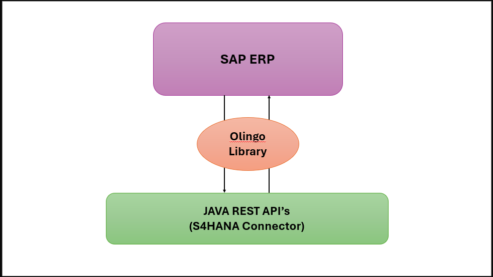
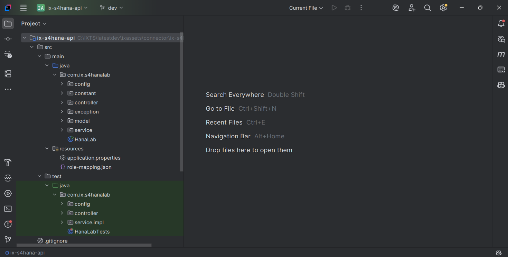
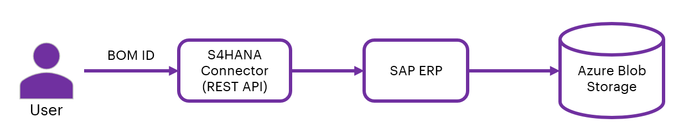

DIGITAL THREAD FOUNDATIONS

S4HANA Connector

INTEGRATION GUIDE

Release Version: 1.2

## 

# Introduction

A digital thread refers to the continuous and consistent flow of information throughout the entire lifecycle of a product or system - from design and development to operation and maintenance. It enables the integration of data from different stages and sources, allowing effective traceability, seamless collaboration, and efficient decision-making by unleashing the power of sleeping data. The digital thread is considered a key aspect of Industry 4.0 and the digital transformation of the manufacturing industry. It is the core of what we call the Enterprise Operating System (EOS). Digital Thread is a communication framework that helps integrate various enterprise systems involved in the engineering and manufacturing product life cycle.

The S4HANA Connector, leveraging the Olingo library, serves as middleware, bridging S4HANA systems and external applications through JAVA REST APIs. This REST API can perform Create, Read, Update and Delete (CRUD) operations using HTTP gateway. Acting as a Java-based intermediary, it streamlines connectivity and data exchange. With Maven integration, developers can seamlessly access SAP resources. This document explores how this middleware simplifies S4HANA integration, empowering businesses to enhance connectivity and efficiency effortlessly.

### Target Audience

Software architects, developers, and integrators with IT backgrounds.

### Purpose

This document describes the S4HANA Connector integration and API details.

### Prerequisites

-   [Download](https://www.java.com/download) and [install](https://ts.accenture.com/sites/GlobalDocTemplates/ixthread/Shared%20Documents/RC1/•%09https:/docs.oracle.com/en/java/javase/16/install/installation-jdk-microsoft-windows-platforms.html) Java (version 17)

-   [Download](https://www.jetbrains.com/idea/download/) and [install](https://www.jetbrains.com/idea/download/) IntelliJ IDEA (version: 2023.1.1)

-   [Download](https://maven.apache.org/download.cgi) and [install](https://maven.apache.org/install.html) Apache Maven (version: 3.9.1)

-   An API testing tool such as [Postman](https://app.getpostman.com/app/download/win64).

-   Access to Azure repository. Request access from [DevOps team](mailto:IX_DT_DEVOPS_INFRA@accenture.com).

### Business Contacts

-   [florian.tournier@accenture.com](mailto:florian.tournier@accenture.com)

-   [laura.mosconi@accenture.com](mailto:laura.mosconi@accenture.com)

-   [karthik.ramachandra@accenture.com](mailto:karthik.ramachandra@accenture.com)

-   [stefano.giacco@accenture.com](mailto:stefano.giacco@accenture.com)

-   [phani.kumar.koduri@accenture.com](mailto:phani.kumar.koduri@accenture.com)

### Related Links

-   [Azure Repository](https://dev.azure.com/IXAssets/IXAssetsProject/_git/ixassets)

-   [Digital Thread documentation](https://industryxdevhub.accenture.com/asset-home;search_text=digital%20thread%20foundations)

## 

# CRUD API

The Create/Read/Update/Delete (CRUD) API enables interaction with S4HANA to perform essential operations such as fetching issue details, updating existing issues, and creating new ones. This provides the flexibility needed to manage issues directly from external systems or custom applications, enhancing integration possibilities.

## RBAC Implementation

Role Based Access Control (RBAC) in the S4HANA connector application is managed through Azure management services, following similar practices as other connector applications. RBAC policies are defined at the product level, dictating the access rights for various methods within the application. The table below shows the permissions granted to each role. The permissions granted to each role within the S4HANA connector application are as follows:

-   Admin: Has full permissions, including the ability to perform POST, PUT, and GET operations.

-   QE (Quality Engineer): Has full permissions, allowing POST, PUT, and GET operations.

-   Tester: Granted full permissions, which include POST, PUT, and GET operations.

-   Dev (Developer): Receives full permissions for POST, PUT, and GET operations.

-   User: Has limited permissions and can perform only GET operations.

## S4HANA Connector Blueprint

The following diagram provides a high-level design flow for S4HANA Connector

> 
## 

# SAP Olingo Library Details

The SAP Olingo library is used as a dependency in the S4HANA connector to provide the functionality of CRED operations and access information present in SAP ERP.

The dependency is defined in pom.xml file as shown on the side:

Ensure you replace the placeholder text in the code with the actual version of the Apache Olingo library you downloaded

## Capabilities

The following capabilities are discussed in this section:

1.  Logging

2.  Secure Secrets Management

3.  Error management

### Logging

The S4HANA connector is built to log with logback and slf4j. The required format for the application logging is as follows:

\\|\\|\\|\\|\\|\\|\\|\

Refer logback-spring.xml Under directory \"src/main/resources\"

> \
>
> \
>
> \
>
> \
>
> \
>
> %d\{yyyy-MM-dd\'T\'HH:mm:ss.SSS\'Z\'\}\|%level\|%thread\|%X\{APPLICATION-LABEL\}\|%X\{TRANSACTION-ID\}\|%X\{PLATFORM-TRANSACTION-ID\}\|%logger\|%method\|%msg%n
>
> \
>
> \
>
> \
>
> \
>
> \
>
> \
>
> \
>
> \
>
> \
>
> \

### 

## **Secure Secrets Management**

Secret management is a practice that allows developers to store sensitive data such as passwords, keys, and tokens, in a secure environment with strict access controls. Azure Key Vault enables users to securely store and manage sensitive data like keys, passwords, certificates, and other sensitive information. These are kept in centralized storage that is protected by industry-standard algorithms and hardware security modules.

Using this feature on S4HANA Connector, the user will be able to store various access information in the key vaults. This information will be picked up by the various APIs securely and based on the access level provided on the credential, the actions are performed.

#### Azure Key Vault Dependency

> \
>
> \com.azure.spring\
>
> \spring-cloud-azure-starter-[keyvault]-secrets\
>
> \
>
> \
>
> \
>
> \
>
> \com.azure.spring\
>
> \spring-cloud-azure-dependencies\
>
> \5.3.0\
>
> \[pom]\
>
> \import\
>
> \
>
> \
>
> \

#### Key Vault Configuration 

In springboot application.properties:

spring.cloud.azure.keyvault.secret.property-source-enabled=true

spring.cloud.azure.keyvault.secret.property-sources\[0\].credential.client-secret=\

spring.cloud.azure.keyvault.secret.property-sources\[0\].credential.client-id=\

spring.cloud.azure.keyvault.secret.property-sources\[0\].profile.tenant-id=\

spring.cloud.azure.keyvault.secret.property-sources\[0\].endpoint=\

### 

## Error Management

When a certain operation encounters an error, the same structure should be returned by all the Digital Thread components.

#### Output Body

| **Parameter** | **Description** **M / O** **Type** |
| --- | --- |
| errorManagement | Object identifying the error O\* Object |
| errorCode | Code that identifies the error occurred O\* String |
| errorDescription | Error description O\* String Example: error response message: &gt; \{ &gt; &gt; \"errorManagement\": \{ &gt; &gt; \"errorCode\": \"CMPNT_02.100004\", &gt; &gt; \"errorDescription\": \"db connection error\" &gt; &gt; \} &gt; &gt; \} |
## 

# Connector Usage 

Follow the steps mentioned below to access S4HANA Connector code:

1.  Navigate to the [Azure repository](https://dev.azure.com/IXAssets/IXAssetsProject/_git/ixassets). To request access, contact the [DevOps team](mailto:IX_DT_DEVOPS_INFRA@accenture.com),

2.  Clone the project with the help of Git into local.

3.  Use the path to access S4HANA connector code in IntelliJ IDEA.

> IXAssets/IXAssetsProject/Repos/Files/dev/connector/ix-s4hana-api

4.  Import the project into IntelliJ from the project directory. After importing, the project structure should resemble the following example.

5.  After importing the project into local, update the application.properties with server details.

6.  Run the application.

7.  Navigate to Postman, add \"user-role\" in header Trigger the APIs. Information about the APIs is provided in the subsequent sections.

## 

# APIs

The S4HANA Connector offers a suite of APIs designed to streamline interactions with SAP, enabling a range of operations including create, update, read and delete of data. The primary APIs provided by the connector are listed in the table below.

| Name | Description |
| --- | --- |
| GET Data | This endpoint fetches the data present in SAP. Data fetched can also be filtered if specified in request. |
| CREATE Data | This API is for creating data. |
| UPDATE Data | This API is used to update details. |
| DELETE Data | This endpoint deletes the data. |
| BOM Fetch | This API is used to fetch BOM data from SAP ERP system. |
### API Prerequisites

According to the environment, users will have to acquire proper access to generate a JWT token to be used for authentication. Additionally, users will require a product subscription key of the product created in Azure application management services for the SAP connector application and will have to pass a transaction-id. All this information needs to be passed on the request headers for authentication. The user can append specific endpoints after the base URL and utilize the API accordingly.

### 

## Get Data

This API is used for fetching the data present in SAP and can also filter the response as per user request for attributes, material, pagination using S4HANA Connector.

| PROTOCOL | HTTPS |
| --- | --- |
| DEV ENDPOINT | [https://ixts-dev-apim.azure-api.net/s4hana-api/v1/feed] |
| QA ENDPOINT |  |
| METHOD | GET |
| CONTENT TYPE | application / json |
#### Path Parameters

| Parameter | Description |
| --- | --- |
| type | Unique identifier and specifies the type of data to retrieve |
| entitySetName | Specifies the name of the entity set to query |
#### Pagination Parameters

| Parameter | Description |
| --- | --- |
| offset | Page number of the dataset to retrieve (greater than 0). |
| limits | Page size, the maximum value is 50 (greater than 0). |
| filter | Is used to fetch materials based on given criteria or conditions |
| attributes | Is used to fetch particular attributes in the response |
#### Result

| HTTP Code | Result Description |
| --- | --- |
| 200 | Data details fetched successfully |
#### Error Management

| HTTP Code | Error Code Error Description |
| --- | --- |
| 500 | 500 Project Specific error |
| 404 | 404 Not Found |
| 403 | 403 Forbidden |
| 401 | 401 Invalid Subscription key / Invalid Token |
| 400 | 400 Bad request |
#### Sample Response

> \{
>
> \"dataInstances\": \[\{
>
> \"instances\": \[\{
>
> \"properties\": \[\{
>
> \"product\": \"0XX0\",
>
> \"plant\": \"\",
>
> \"description\": \"0XX0-test matnr range\",
>
> \"type\": \"FERT\",
>
> \"status\": \"Active\"
>
> \}\],
>
> \"workflows\": null,
>
> \"secondaryDatasets\": \[\],
>
> \"changeHistory\": null
>
> \}\]
>
> \}\],
>
> \"offset\": 0,
>
> \"limits\": 0,
>
> \"totalRecords\": null
>
> \}

### Create Data

This API retrieves details about the sprints associated with a specific board. Sprints are typically time-bound iterations within an Agile project framework.

| PROTOCOL | HTTPS |
| --- | --- |
| DEV ENDPOINT | [https://ixts-dev-apim.azure-api.net/s4hana-api/v1/create] |
| QA ENDPOINT | [https://ixts-qa-apim.azure-api.net/s4hana-api/v1/create] |
| METHOD | POST |
| CONTENT TYPE | application / json |
#### Path Parameters

| Parameter | Description |
| --- | --- |
| type | Unique identifier and specifies the type of data to retrieve |
| entitySetName | Specifies the name of the entity set to query |
#### Result

| HTTP Code | Result Description |
| --- | --- |
| 200 | Data details fetched successfully |
#### Error Management

| HTTP Code | Error Code Error Description |
| --- | --- |
| 500 | 500 Project Specific error |
| 404 | 404 Not Found |
| 403 | 403 Forbidden |
| 401 | 401 Invalid Subscription key / Invalid Token |
| 400 | 400 Bad request |
#### Request and Response

[LINK](https://ts.accenture.com/:t:/r/sites/GlobalDocTemplates/Published%20Documents/IX%20Thread/Linked%20Files/DT_Create_Data_Request_Response.txt)

### 

## Update Data

This API retrieves details about a board using the /board endpoint.

| PROTOCOL | HTTPS |
| --- | --- |
| DEV ENDPOINT | [https://ixts-dev-apim.azure-api.net/s4hana-api/v1/update] |
| QA ENDPOINT |  |
| METHOD | PUT |
| CONTENT TYPE | application / json |
#### Pagination Parameters

| Parameter | Description |
| --- | --- |
| type | Unique identifier and specifies the type of data to retrieve |
| entitySetName | Specifies the name of the entity set to query |
#### Result

| HTTP Code | Result Description |
| --- | --- |
| 200 | Data details fetched successfully |
#### Error Management

| HTTP Code | Error Code Error Description |
| --- | --- |
| 500 | 500 Project Specific error |
| 404 | 404 Not Found |
| 403 | 403 Forbidden |
| 401 | 401 Invalid Subscription key / Invalid Token |
| 400 | 400 Bad request |
#### 

### Sample Request Body

\{

\"material_list\": \[

\{

\"product\": \"0XYZ7\",

\"description\": \"0XYZ8-test matnr range\",

\"header_data\": \{

\"basic_view\": \"X\",

\"mrp_view\": \"X\"

\},

\"client_data\": \{

\"ind_sector\": \"Mechanical engineering\",

\"matl_group\": \"01\",

\"matl_type\": \"Finished Product\",

\"base_uom\": \"EA\",

\"base_uom_iso\": \"EA\",

\"item_cat\": \"Make-to-order\"

\},

\"plant_data\": \{

\"sm_key\": \"001\",

\"fixed_lot\": \"26\",

\"mrp_ctrler\": \"001\",

\"plant\": \"0001\",

\"mrp_type\": \"X0\",

\"proc_type\": \"In-house production\",

\"lotsizekey\": \"FX\"

\}

\}

\]

\}

####  Sample Response

\"entityTypes\": \[\{

\"name\": \"Customer\",

\"properties\": \[\{

\"name\": \"Kunnr\",

\"type\": \"String\",

\"annotationAttributes\": \{

\"filterable\": \"false\",

\"unicode\": \"false\",

\"updatable\": \"false\",

\"label\": \"Customer\",

\"creatable\": \"false\",

\"sortable\": \"false\"

\}

\}

### 

## Delete Data

This API is used to indicate deletion of data. There is no hard-delete option in SAP server, thus data can only be soft-deleted. Hence, when the API runs, the data is only marked as deleted in the ERP system.

| PROTOCOL | HTTPS |
| --- | --- |
| DEV ENDPOINT | [link](https://ix-dev-apimgmt.azure-api.net/sap-api/feed) |
| QA ENDPOINT |  |
| METHOD | GET |
| CONTENT TYPE | application / json |
#### Path Parameters

| Parameter | Description |
| --- | --- |
| type | Unique identifier and specifies the type of data to retrieve |
| entitySetName | Specifies the name of the entity set to query |
| Material Id | Specifies the material Unique Identification |
#### Result

| HTTP Code | Result Description |
| --- | --- |
| 200 | Data details fetched successfully |
#### Error Management

| HTTP Code | Error Code Error Description |
| --- | --- |
| 500 | 500 Project Specific error |
| 404 | 404 Not Found |
| 403 | 403 Forbidden |
| 401 | 401 Invalid Subscription key / Invalid Token |
| 400 | 400 Bad request |
#### Sample Response

\{

\"statusCode\": \"204\",

\"statusMessage\": \"Entry deleted successfully.\"

\}

### 

## BOM Fetch

This API is used to fetch BOM data from the SAP ERP system. The user provides a BOM ID as the input parameter to the API. The API communicates with the SAP ERP system and fetches all data related to the BOM ID. The data is stored within the internal storage of the SAP system as an Excel file. A scheduler script, developed by the SAP SME, is used to export the stored Excel file to Blob storage, ensuring secure and scalable access to the BOM data.

| PROTOCOL | HTTPS |
| --- | --- |
| DEV ENDPOINT |  |
| QA ENDPOINT |  |
| METHOD | GET |
| CONTENT TYPE | application / json |
#### Path Parameters

| Parameter | Description |
| --- | --- |
| type | Unique identifier and specifies the type of data to retrieve |
| entitySetName | Specifies the name of the entity set to query |
#### Pagination Parameters

| Parameter | Description |
| --- | --- |
| filter | Is used to fetch materials based on given criteria or conditions |
#### Result

| HTTP Code | Result Description |
| --- | --- |
| 200 | Data details fetched successfully |
#### Error Managment

| HTTP Code | Error Code Error Description |
| --- | --- |
| 500 | 500 Project Specific error |
| 404 | 404 Not Found |
| 403 | 403 Forbidden |
| 401 | 401 Invalid Subscription key / Invalid Token |
| 400 | 400 Bad request |
#### Sample Response

200 Ok Success Response
