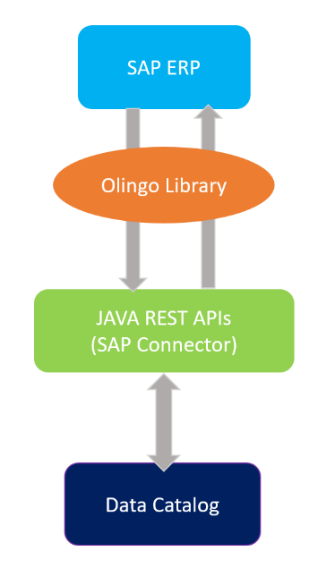
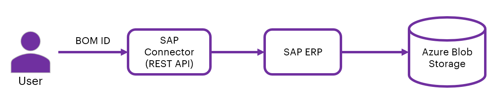
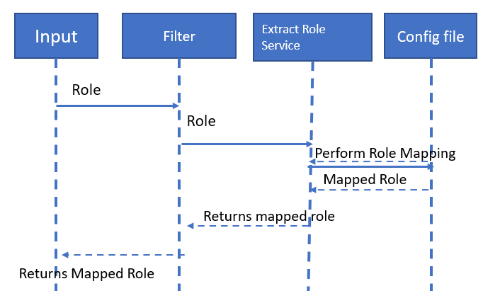
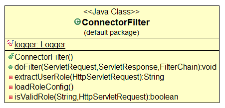
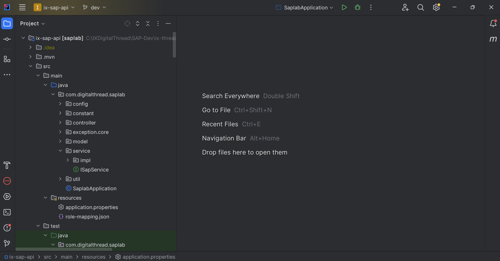

Digital Thread Foundations

SAP Connector

INTEGRATION GUIDE

Release Version: 1.2

## Introduction

A digital thread refers to the continuous and consistent flow of information throughout the entire lifecycle of a product or system -- from design and development to operation and maintenance. It enables the integration of data from different stages and sources, allowing effective traceability, seamless collaboration, and efficient decision-making by unleashing the power of sleeping data. The digital thread is considered a key aspect of Industry 4.0 and the digital transformation of the manufacturing industry. It is the core of the Enterprise Operating System (EOS). Digital Thread is a communication framework that helps integrate various enterprise systems involved in the engineering and manufacturing product life cycle.

Digital Thread Foundations has implemented dedicated connectors to connect to various source systems. The SAP Connector is one such connection implemented. It leverages the Olingo library and serves as middleware, bridging SAP systems and external applications through JAVA REST APIs. This REST API can perform Create, Read, Update, and Delete (CRUD) operations using the HTTP gateway. Acting as a Java-based intermediary, it streamlines connectivity and data exchange. With Maven integration, developers can seamlessly access SAP resources. This document explores how this middleware simplifies SAP integration, empowering businesses to enhance connectivity and efficiency effortlessly.

### Purpose

This document describes the SAP Connector integration and API details.

### Target Audience

Software architects, developers, and integrators with IT backgrounds.

### Prerequisites

-   [Download](https://www.java.com/download) and [install](https://ts.accenture.com/sites/GlobalDocTemplates/ixthread/Shared%20Documents/RC1/•%09https:/docs.oracle.com/en/java/javase/16/install/installation-jdk-microsoft-windows-platforms.html) Java (version 17)

-   [Download](https://www.jetbrains.com/idea/download/) and [install](https://www.jetbrains.com/idea/download/) IntelliJ IDEA (version: 2023.1.1)

-   [Download](https://maven.apache.org/download.cgi) and [install](https://maven.apache.org/install.html) Apache Maven (version: 3.9.1)

-   An API testing tool such as [Postman](https://app.getpostman.com/app/download/win64).

-   Access to the Azure repository provided by the [DevOps team](mailto:IX_DT_DEVOPS_INFRA@accenture.com).

### Business Contacts

-   [florian.tournier@accenture.com](mailto:florian.tournier@accenture.com)

-   [laura.mosconi@accenture.com](mailto:laura.mosconi@accenture.com)

-   [karthik.ramachandra@accenture.com](mailto:karthik.ramachandra@accenture.com)

-   [stefano.giacco@accenture.com](mailto:stefano.giacco@accenture.com)

-   [srinath.k.murthy@accenture.com](mailto:srinath.k.murthy@accenture.com)

### Related Links

-   [DT_Role_Mapping_Config.txt](https://ts.accenture.com/:t:/r/sites/GlobalDocTemplates/Published%20Documents/IX%20Thread/Linked%20Files/DT_Role_Mapping_Config.txt)

-   [Digital Thread documentation](https://industryxdevhub.accenture.com/asset-home;search_text=ix%20digital%20thread)

## 

# Access Management 

### CRUD API

The Create/Read/Update/Delete (CRUD) API enables interaction with SAP to perform essential operations such as fetching issue details, updating existing issues, and creating new ones. This provides the flexibility needed to manage issues directly from external systems or custom applications, enhancing integration possibilities.

### RBAC Implementation

Role Based Access Control (RBAC) in the SAP connector application is managed through Azure management services, following similar practices as other connector applications. RBAC policies are defined at the product level, dictating the access rights for various methods within the application. The below table shows the permissions granted to each role. Permissions for each role in the SAP connector application are structured as follows:

-   Admin: Granted full permissions, including POST, PUT, and GET operations.

-   Quality Engineer (QE): Granted full permissions, including POST, PUT, and GET operations.

-   Tester: Granted limited permissions, restricted to GET operations only.

-   Developer (Dev): Granted limited permissions, restricted to GET operations only.

-   User: Granted limited permissions, restricted to GET operations only.

## 

# SAP Connector Blueprint

### Data Catalog

The following diagram depicts the high-level design flow for the SAP Connector and how an SAP ERP system and a Data Catalog interact via OData services handled by Olingo and Java-based RESTful APIs.

-   The SAP ERP system provides data which is handled through the Olingo Library.

-   The Java REST APIs built on the Olingo Library allow data to be transferred from the SAP ERP system to the Data Catalog.

-   The Data Catalog receives and stores the data for further use, analysis, or reporting.

### 

## BOM Management

The following diagram depicts a high-level flow for SAP connector is used for BOM Management application.

The user provides a BOM ID as the input parameter to the API. The API communicates with the SAP ERP system and fetches all data related to the BOM ID. The data is stored within the internal storage of the SAP system as an Excel file. A scheduler script, developed by the SAP SME, is used to export the stored Excel file to Blob storage, ensuring secure and scalable access to the BOM data.

## 

# SAP Olingo Library Details

The dependency in the SAP connector is used to develop the functionality of CRED operations and access information present in SAP ERP. The dependency is as shown in the pom.xml file on the side.

Ensure to replace \`\\`\&gt; with the actual version of the Apache Olingo library that was downloaded after including the Olingo library as a dependency.

> \
>
>             \org.apache.olingo\
>
>             \odata-client-core\
>
>             \\\
>
>         \
>
>         \
>
>             \org.apache.olingo\
>
>             \olingo-odata2-api\
>
>             \\\
>
>         \
>
>         \

## 

# 

## Capabilities

The SAP connector implemented has the following capabilities.

1.  Logging

2.  Secure Secrets Management

3.  Error management

4.  Role-based Access Control

### Logging

SAP connector is built to log with logback and slf4j. The required format for the application logging is as follows:

> \\|\\|\\|\\|\\|\\|\\|\

Refer logback-spring.xml Under directory "src/main/resources"

> \
>
> \
>
> \
>
> \
>
> \
>
> %d\{yyyy-MM-dd\'T\'HH:mm:ss.SSS\'Z\'\}\|%level\|%thread\|%X\{APPLICATION-LABEL\}\|%X\{TRANSACTION-ID\}\|%X\{PLATFORM-TRANSACTION-ID\}\|%logger\|%method\|%msg%n
>
> \
>
> \
>
> \
>
> \
>
> \
>
> \
>
> \
>
> \
>
> \
>
> \

### 

## Secure Secrets Management

Secret management is a practice that allows developers to store sensitive data such as passwords, keys, and tokens, in a secure environment with strict access controls.

Azure Key Vault enables users to securely store and manage sensitive data like keys, passwords, certificates, and other sensitive information. These are kept in centralized storage that is protected by industry-standard algorithms and hardware security modules.

With this feature, the SAP Connector enables the user to store access information in the key vaults. This information is picked up by various APIs and based on the access level provided to the credential (user), the actions are performed.

**Azure Key Vault Dependency**

> \
>
> \com.azure.spring\
>
> \spring-cloud-azure-starter-[keyvault]-secrets\
>
> \
>
> \
>
> \
>
> \
>
> \com.azure.spring\
>
> \spring-cloud-azure-dependencies\
>
> \5.3.0\
>
> \[pom]\
>
> \import\
>
> \
>
> \
>
> \

**Key Vault Configuration in springboot application.properties**

spring.cloud.azure.keyvault.secret.property-source-enabled=true

spring.cloud.azure.keyvault.secret.property-sources\[0\].credential.client-secret=\

spring.cloud.azure.keyvault.secret.property-sources\[0\].credential.client-id=\

spring.cloud.azure.keyvault.secret.property-sources\[0\].profile.tenant-id=\

spring.cloud.azure.keyvault.secret.property-sources\[0\].endpoint=\

### 

## Error Management

Whenever a certain operation encounters an error, the same structure should be returned by all the DigitalThread components.

#### Output Body

| Parameter | Description M/O Type |
| --- | --- |
| errorManagement | Object identifying the error O\* Object |
| errorCode | Code that identifies the error occurred O\* String |
| errorDescription | Error description O\* String Example: error response message &gt; \{ &gt; |
| &gt; | \"errorManagement\": \{ &gt; |
| &gt; | \"errorCode\": \"CMPNT_02.100004\", &gt; |
| &gt; | \"errorDescription\": \"db connection error\" &gt; |
| &gt; | \} &gt; &gt; \} |

### Role-based Access Control 

This sequence diagram represents the flow of user-role validation against a role mapping file in an SAP Connector.

The user role is extracted at the APIM level from the JWT token and is passed to the connector as a header. The user role is validated against the [role mapping config file](https://ts.accenture.com/sites/GlobalDocTemplates/Published%20Documents/IX%20Thread/Linked%20Files/DT_Role_Mapping_Config.txt) in the filter layer. The extract role service is part of the filter layer where the user role is extracted from the header and validated against the config file.

## 

# Connector Filter

The following image explains the skeleton of the connector filter service using three methods, each of which performs specific validation and filtering. These three methods are:

-   doFliter: Uses a servlet filter to intercept requests.

-   extractUserRole: Extracts the user from the header.

-   loadRoleConfig(): Loads the RBAC config file.

-   IsValidRole(): Validates the role extracted from the header against the RBAC config file.

## 

# Download and Usage

The steps mentioned below describe how to access the SAP Connector code.

1.  Access the Azure repository at: 

2.  Clone the project with the help of Git into local.

3.  Use this path to access SAP connector code in IntelliJ IDEA: IXDigitalThread\\SAP-Dev\\ix-thread-components\\connector\\ix-sap-api

4.  Import the project into IntelliJ from the project directory.

5.  After importing, the project structure should resemble the example depicted in the image on the side.

6.  After importing the project into local, Update the application.properties with server details.

7.  Run the application.

8.  Use Postman and add "user-role" in the header Trigger of the APIs described in the subsequent section.

## APIs

The SAP Connector offers a suite of APIs designed to streamline interactions with SAP, enabling a range of operations including creating, updating, reading, and deleting data. The primary APIs provided by the connector are listed in the table below.

The table below includes a short description of every Product Name API.

  ------------------------------------------------------------------------------

| Name | Description |
| --- | --- |
| GET Metadata | This API serves as an endpoint to retrieve metadata. |
| GET Data | This API serves as an endpoint to fetch the data. |
| GET Lineage | This API serves as an endpoint to retrieve Lineage data. |
| CREATE Data | This API is for creating data. |
| UPDATE Data | This API is used to update details. |
| DELETE Data | This API serves as an endpoint to delete the data. |
| BOM Fetch | This API is used to fetch BOM data from SAP ERP system. According to the environment, users will have to acquire proper access to generate a JWT token to be used for authentication. Additionally, users will require a product subscription key of the product created in Azure application management services for the SAP connector application and will have to pass a transaction-id. All this information needs to be passed in the request headers for authentication. The user can append specific endpoints after the base URL and utilize the API accordingly. |

### 

## Get Metadata

This API retrieves details about metadata using the /edm endpoint.

| PROTOCOL | HTTPS |
| --- | --- |
| DEV ENDPOINT | [link](https://ix-dev-apimgmt.azure-api.net/sap-api/edm) |
| QA ENDPOINT |  |
| METHOD | GET |
| CONTENT TYPE | application / json |

#### Pagination Parameters

| Parameter | Description |
| --- | --- |
| type | Unique identifier and specifies the type of data to retrieve |
| metadata | Unique identifier of the metadata |

#### Sample Response

\"entityTypes\": \[\{

\"name\": \"Customer\",

\"properties\": \[\{

\"name\": \"Kunnr\",

\"type\": \"String\",

\"annotationAttributes\": \{

\"filterable\": \"false\",

\"unicode\": \"false\",

\"updatable\": \"false\",

\"label\": \"Customer\",

\"creatable\": \"false\",

\"sortable\": \"false\"

\}

\}

#### Result

| HTTP Code | Result Description |
| --- | --- |
| 200 | Metadata details fetched successfully |

#### Error Management

| HTTP Code | Error Code Error Description |
| --- | --- |
| 500 | 500 Project Specific error |
| 404 | 404 Not Found |
| 403 | 403 Forbidden |
| 401 | 401 Invalid Subscription key / Invalid Token |
| 400 | 400 Bad request |

### 

## Get Data

This API is used to fetch and retrieve the data present in SAP and can filter the response as per user request for attributes, material, and pagination.

| PROTOCOL | HTTPS |
| --- | --- |
| DEV ENDPOINT | [link](https://ix-dev-apimgmt.azure-api.net/sap-api/feed) |
| QA ENDPOINT |  |
| METHOD | GET |
| CONTENT TYPE | application / json |

#### Path Parameters

| Parameter | Description |
| --- | --- |
| type | Unique identifier and specifies the type of data to retrieve |
| entitySetName | Specifies the name of the entity set to query |

#### Pagination Parameters

| Parameter | Description |
| --- | --- |
| offset | Page number of the dataset to retrieve (greater than 0). |
| limits | Page size, the maximum value is 50 (greater than 0). |
| filter | Is used to fetch materials based on given criteria or conditions |
| attributes | Is used to fetch particular attributes in the response |

#### Result

| HTTP Code | Result Description |
| --- | --- |
| 200 | Data details fetched successfully |

#### Error Management

| HTTP Code | Error Code Error Description |
| --- | --- |
| 500 | 500 Project Specific error |
| 404 | 404 Not Found |
| 403 | 403 Forbidden |
| 401 | 401 Invalid Subscription key / Invalid Token |
| 400 | 400 Bad request **Sample Response** &gt; \{ &gt; &gt; \"dataInstances\": \[\{ &gt; &gt; \"entityType\": \"Item\", &gt; &gt; \"instances\": \[\{ &gt; &gt; \"properties\": \{ &gt; &gt; \"Maktg\": \"\", &gt; &gt; \"Dispo\": \"\", &gt; &gt; \"Gewei\": \"KT\", &gt; &gt; \"Mtvep\": \"\", &gt; &gt; \"Vpreh\": 0, &gt; &gt; \"Lifnr\": \"\", &gt; &gt; \"Eislo\": 0, &gt; &gt; \}, &gt; &gt; \"workflows\": null, &gt; &gt; \"secondaryDatasets\": null &gt; &gt; \}\] &gt; &gt; \}\], &gt; &gt; \"offset\": 0, &gt; &gt; \"limits\": 0, &gt; &gt; \"totalRecords\": \"356\" &gt; &gt; \} |

### Get Lineage

This API retrieves details of the Lineage data/lineage endpoint.

| PROTOCOL | HTTPS |
| --- | --- |
| DEV ENDPOINT | [link](https://ix-dev-apimgmt.azure-api.net/sap-api/lineage) |
| QA ENDPOINT |  |
| METHOD | GET |
| CONTENT TYPE | application / json |

#### Pagination Parameters

| Parameter | Description |
| --- | --- |
| type | Unique identifier and specifies the type of data to retrieve |
| entitySetName | Specifies the name of the entity set to query |
| filter | Is used to fetch materials based on given criteria or conditions |

#### Result

| HTTP Code | Result Description |
| --- | --- |
| 200 | Lineage data details fetched successfully |

#### Error Management

| HTTP Code | Error Code Error Description |
| --- | --- |
| 500 | 500 Project Specific error |
| 404 | 404 Not Found |
| 403 | 403 Forbidden |
| 401 | 401 Invalid Subscription key / Invalid Token |
| 400 | 400 Bad request |

#### Sample Response

[LINK](https://ts.accenture.com/:t:/r/sites/GlobalDocTemplates/Published%20Documents/IX%20Thread/Linked%20Files/DT_Get_Lineage_Response.txt)

### 

## Create Data

This API retrieves details about the sprints associated with a specific board. Sprints are typically time-bound iterations within an Agile project framework.

| PROTOCOL | HTTPS |
| --- | --- |
| DEV ENDPOINT | [link](https://ix-dev-apimgmt.azure-api.net/sap-api/create) |
| QA ENDPOINT |  |
| METHOD | POST |
| CONTENT TYPE | application / json |

#### Path Parameters

| Parameter | Description |
| --- | --- |
| type | Unique identifier and specifies the type of data to retrieve |
| entitySetName | Specifies the name of the entity set to query |

#### Result

| HTTP Code | Result Description |
| --- | --- |
| 200 | Data created successfully |

#### Error Management

| HTTP Code | Error Code Error Description |
| --- | --- |
| 500 | 500 Project Specific error |
| 404 | 404 Not Found |
| 403 | 403 Forbidden |
| 401 | 401 Invalid Subscription key / Invalid Token |
| 400 | 400 Bad request |

#### 

### Sample Request Body

\{

\"Item\": \"196\",

\"ItemType\": \"ITEM\",

\"BomLevel\": \"01\",

\"BomNumber\": \"00000019\",

\"UnitOfMeasure\": \"EA\",

\"BomType\": \"MBOM\",

\"Status\":

\}

####  Sample Response

\{

\"dataInstances\": \[\{

\"entityType\": \"Item\",

\"instances\": \[\{

\"properties\": \{

\"Maktg\": \"\",

\"Dispo\": \"\",

\"Gewei\": \"KT\",

\"Mtvep\": \"\",

\"Vpreh\": 0,

\"Lifnr\": \"\",

\"Eislo\": 0,

\},

\"workflows\": null,

\"secondaryDatasets\": null

\}\]

\}\],

\"offset\": 0,

\"limits\": 0,

\"totalRecords\": \"356\"

\}

### Update Data

This API retrieves details about a board using the /board endpoint.

| PROTOCOL | HTTPS |
| --- | --- |
| DEV ENDPOINT | [link](https://ix-dev-apimgmt.azure-api.net/sap-api/odata) |
| QA ENDPOINT |  |
| METHOD | GET |
| CONTENT TYPE | application / json |

#### Pagination Parameters

| Parameter | Description |
| --- | --- |
| type | Unique identifier and specifies the type of data to retrieve |
| entitySetName | Specifies the name of the entity set to query |
| id | Specifies the Unique identifier. |

#### Result

| HTTP Code | Result Description |
| --- | --- |
| 200 | Data update successful |

#### Error Management

| HTTP Code | Error Code Error Description |
| --- | --- |
| 500 | 500 Project Specific error |
| 404 | 404 Not Found |
| 403 | 403 Forbidden |
| 401 | 401 Invalid Subscription key / Invalid Token |
| 400 | 400 Bad request |

#### Request and Response

[LINK](https://ts.accenture.com/:t:/r/sites/GlobalDocTemplates/Published%20Documents/IX%20Thread/Linked%20Files/DT_Delete_Data_Request_Response.txt)

### Delete Data

This API works for the Deletion of data, But in SAP, data will not be deleted for the ERP system it will be marked as deleted.

| PROTOCOL | HTTPS |
| --- | --- |
| DEV ENDPOINT | [link](https://ix-dev-apimgmt.azure-api.net/sap-api/feed) |
| QA ENDPOINT |  |
| METHOD | GET |
| CONTENT TYPE | application / json |

#### Path Parameters

| Parameter | Description |
| --- | --- |
| type | Unique identifier and specifies the type of data to retrieve |
| entitySetName | Specifies the name of the entity set to query |
| Id | Specifies the material Unique Identification |

#### Result

| HTTP Code | Result Description |
| --- | --- |
| 200 | Entry deleted successfully. |

#### Error Management

| HTTP Code | Error Code Error Description |
| --- | --- |
| 500 | 500 Project Specific error |
| 404 | 404 Not Found |
| 403 | 403 Forbidden |
| 401 | 401 Invalid Subscription key / Invalid Token |
| 400 | 400 Bad request |

#### Sample Response

> \{
>
> \"statusCode\": \"204\",
>
> \"statusMessage\": \"Entry deleted successfully.\"
>
> \}

### 

## BOM Fetch

This API is used to fetch BOM data from the SAP ERP system.

| PROTOCOL | HTTPS |
| --- | --- |
| DEV ENDPOINT |  |
| QA ENDPOINT |  |
| METHOD | GET |
| CONTENT TYPE | application / json |

#### Path Parameters

| Parameter | Description |
| --- | --- |
| type | Unique identifier and specifies the type of data to retrieve |
| entitySetName | Specifies the name of the entity set to query |

#### Pagination Parameters

| Parameter | Description |
| --- | --- |
| filter | Is used to fetch materials based on given criteria or conditions |

#### Result

| HTTP Code | Result Description |
| --- | --- |
| 200 | Data details fetched successfully |

#### Error Management

| HTTP Code | Error Code Error Description |
| --- | --- |
| 500 | 500 Project Specific error |
| 404 | 404 Not Found |
| 403 | 403 Forbidden |
| 401 | 401 Invalid Subscription key / Invalid Token |
| 400 | 400 Bad request |

#### Sample Response

> 200 Ok Success Response
