

Digital Thread Foundations

SDK

DESIGN AND IMPLEMENTATION

Release Version: 1.2

## Introduction

A digital thread refers to the continuous and consistent flow of information throughout the entire lifecycle of a product or system - from design and development to operation and maintenance. It enables the integration of data from different stages and sources, allowing effective traceability, seamless collaboration, and efficient decision-making by unleashing the power of sleeping data. The digital thread is considered a key aspect of Industry 4.0 and the digital transformation of the manufacturing industry. It is the core of what we call the Enterprise Operating System (EOS). Digital Thread is a communication framework that helps integrate various enterprise systems involved in the engineering and manufacturing product life cycle.

An SDK is a set of software tools that allow developers to create SW applications such as connectors for a specific environment.

### Purpose

This document describes the SDK for Digital Thread Foundations and how to implement a project using it.

### Target Audience

Software architects, developers, and integrators with IT backgrounds.

### Prerequisites

-   [Download](https://www.java.com/download) and [install](https://ts.accenture.com/sites/GlobalDocTemplates/ixthread/Shared%20Documents/RC1/•%09https:/docs.oracle.com/en/java/javase/16/install/installation-jdk-microsoft-windows-platforms.html) Java (version 17)

-   [Download](https://www.jetbrains.com/idea/download/) and [install](https://www.jetbrains.com/idea/download/) IntelliJ IDEA (version: 2023.1.1)

-   [Download](https://maven.apache.org/download.cgi) and [install](https://maven.apache.org/install.html) Apache Maven (version: 3.9.1)

-   Azure Artifact Repository Access

### Related Links

-   [Role_Mapping_Config.txt](https://ts.accenture.com/:t:/r/sites/GlobalDocTemplates/Published%20Documents/IX%20Thread/Linked%20Files/DT_Role_Mapping_Config.txt?csf=1&amp;web=1&amp;e=CLRCB8)

-   [Digital Thread Foundations Documentation](https://industryxdevhub.accenture.com/asset-home;search_text=IX%20Digital%20Thread)

### Business Contacts

-   [florian.tournier@accenture.com](mailto:florian.tournier@accenture.com)

-   [laura.mosconi@accenture.com](mailto:laura.mosconi@accenture.com)

-   [karthik.ramachandra@accenture.com](mailto:karthik.ramachandra@accenture.com)

### Technical Contacts

-   [laura.mosconi@accenture.com](mailto:laura.mosconi@accenture.com)

-   [janos.puskas@accenture.com](mailto:janos.puskas@accenture.com)

-   [zsolt.tofalvi@accenture.com](mailto:zsolt.tofalvi@accenture.com)

-   [shristy.b.kumari@accenture.com](mailto:shristy.b.kumari@accenture.com)

-   [stefano.giacco@accenture.com](mailto:stefano.giacco@accenture.com)

## 

## Glossary

| Term | Definition |
| --- | --- |
| Teamcenter (TC) | A product lifecycle management (PLM) system used to manage design, engineering, and manufacturing data and processes. |
| SAP | An enterprise resource planning (ERP) software platform widely used for managing business operations and customer relations. |
| IIoT | Industrial Internet of Things, referring to interconnected sensors and devices in the industrial sector to improve efficiency and analytics. |
| Java JDK 11 | A specific version of the Java Development Kit required for compiling and running Java applications. |
| Maven | A build automation tool used primarily for Java projects to manage dependencies and the build lifecycle. |
| Gradle | A build automation system that automates the building, testing, and deployment of software, supporting multiple languages. |
| Azure IoT Hub | A cloud-based platform for managing and connecting Internet of Things (IoT) devices securely and at scale. |
| Network Access | The ability for an application or device to communicate over a network with other systems and services. |
| System Credentials | Authentication information (such as usernames and passwords) required to access protected systems or services. |
## IX DT Libraries

The iX DT libraries are designed to streamline integration with Teamcenter (TC), SAP, and IIoT systems, making it easier for developers to embed these capabilities into their applications. This document provides detailed instructions on configuring, using, and troubleshooting the libraries to ensure a seamless experience.

**Prerequisites**

-   **Development Environment**

    -   Java with JDK 11 or above

    -   Maven or Gradle build tool

-   **Network Access**

    -   Ensure the application can communicate with Teamcenter, SAP, and IIoT systems over the network.

    -   Add the server/laptop IP address to the Azure IoT Hub network configuration (for IIoT usage).

-   **System Credentials for:**

    -   Teamcenter

    -   SAP

    -   IIoT services

## Features

For Digital Thread, a connector SDK is used as a project templating toolkit that provides:

-   **Smooth Project Initialization**

> As a Maven archetype, the SDK facilitates quick-start templates to smoothly kick off various aspects of Spring Boot development, ensuring that projects sail off smoothly right from inception.

-   **Standardization**

> The SDK establishes a unified pattern in project structures and configurations, thus promoting standardization, enhancement of code consistency, and maintainability across the development ecosystem.

-   **Accelerated Development**

> DT\'s SDK is pre-loaded with necessary dependencies and basic code and offers a set of ready-to-use engines with logging, Azure key vault, RBAC, Error Management, and External System Clients such as SAP, IIOT, and TC. Thus, the development process is accelerated by allowing developers to pivot focus directly onto feature development and business logic.

With these features, the SDK enables developers to create new custom connectors for their specific use case seamlessly.

## SDK Component Blueprint

The following image depicts the logical components of the Connector SDK blueprint.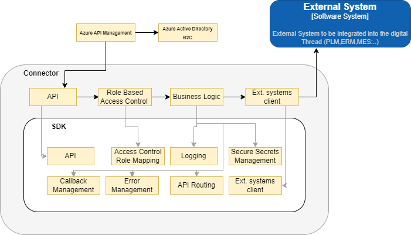
| Component | Description |
| --- | --- |
| API | This component provides service-level exposure based on the RESTful paradigm and is compliant with DT API Guidelines, enabling exposure to the Connector business logic through the standard API Gateway. |
| Access Control Role Mapping | This component comprises utility libraries enabling the SDK user to implement Role-based Access Logic leveraging on the User Role concept implemented on the standard API Gateway. |
| Logging | This component comprises logging libraries and configurations compliant with DT technical guidelines. |
| Secure Secrets Management | Comprises utility libraries and standard configurations to provide access to a Secure Vault and facilitate compliance with security guidelines. |
| Callback Management | Comprises utility libraries to accept callback requests within an asynchronous execution context. |
| Error Management | Comprises utility libraries to manage execution errors and generate error messages, error codes, and status code mapping, which are compliant with DT technical guidelines. |
| API routing | Comprises utility libraries to route inbound API requests to External System Clients methods by configuring the application properties. |
| External System Client | This component is a collection of external system clients the SDK user can interact with. Low-level capabilities are available to create new External System Clients as well. Note that each connector can rely on the capabilities provided by the SDK to implement the connector-specific business requirements. []\{#_Toc220422214 .anchor\}**Installation** Download and install the IX Thread connector SDK from the Azure artifact repository. Open the SDK code in an IDE and modify it as required. The project folder structure is depicted in the below images for reference. |
##### SDK Project Structure

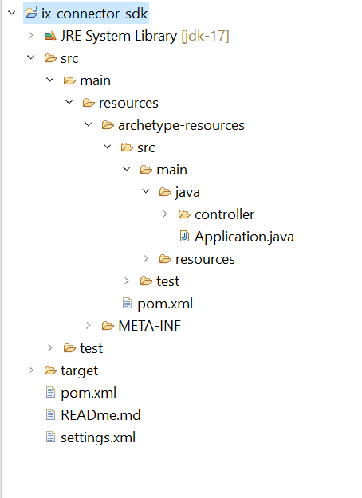

##### Structure of project generated by SDK

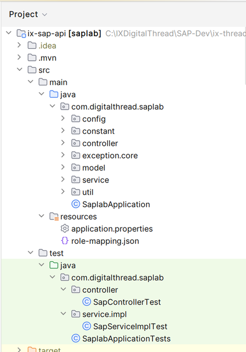

**Structure of an Ix-common-api**

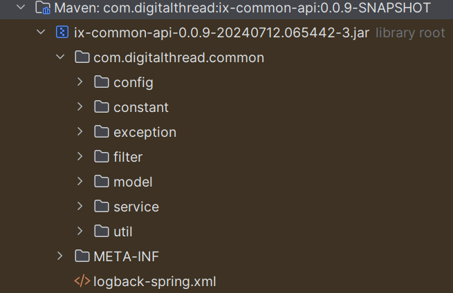

This library is used within the SDK and provides common classes like message constant, exception constant, etc.

## 

# Capabilities

The following capabilities are discussed in this section:

1.  Logging

2.  Secure Secrets Management

3.  Error management

4.  Role-based Access Control

5.  Message Queuing Telemetry Transport (MQTT)

### **Logging**

SDK is built to log with logback and slf4j. The required format for the application logging is as follows:

  -------------------------------------------------------------------------------------------------------------------------------------------------------------------------------------
  -------------------------------------------------------------------------------------------------------------------------------------------------------------------------------------

| &gt; \ |
| --- |
| &gt; |
| &gt; \ |
| &gt; |
| &gt; \ |
| &gt; |
| &gt; \ |
| &gt; |
| &gt; \ |
| &gt; |
| &gt; %d\{yyyy-MM-dd\'T\'HH:mm:ss.SSS\'Z\'\}\ | %level\ | %thread\ | %X\{APPLICATION-LABEL\}\ | %X\{TRANSACTION-ID\}\ | %X\{PLATFORM-TRANSACTION-ID\}\ | %logger\ | %method\ | %msg%n |
| &gt; |
| &gt; \ |
| &gt; |
| &gt; \ |
| &gt; |
| &gt; \ |
| &gt; |
| &gt; \ |
| &gt; |
| &gt; \ |
| &gt; |
| &gt; \ |
| &gt; |
| &gt; \ |
| &gt; |
| &gt; \ |
| &gt; |
| &gt; \ |
| &gt; |
| &gt; \ |
### **Secure Secrets Management**

Secret management is a practice that allows developers to securely store sensitive data such as passwords, keys, and tokens, in a secure environment with strict access controls.

Azure Key Vault enables users to securely store and manage sensitive data like keys, passwords, certificates, and other sensitive information. These are kept in centralized storage that is protected by industry-standard algorithms and hardware security modules.

Using this feature on SDK, the user will be able to store various access information in the key vaults. This information will be picked up by the various APIs securely and on the basis of the access level provided on the credential the actions should be performed.

#### Azure Key Vault Dependency

> \
>
> \com.azure.spring\
>
> \spring-cloud-azure-starter-[keyvault]-secrets\

[\5.13.0\]

> \
>
> \
>
> \
>
> \
>
> \com.azure.spring\
>
> \spring-cloud-azure-dependencies\
>
> \5.3.0\
>
> \[pom]\
>
> \import\
>
> \
>
> \
>
> \

#### Key Vault Configuration 

The following depicts the key vault configuration in springboot application.properties.

spring.cloud.azure.keyvault.secret.property-source-enabled=true

spring.cloud.azure.keyvault.secret.property-sources\[0\].credential.client-secret=\

spring.cloud.azure.keyvault.secret.property-sources\[0\].credential.client-id=\

spring.cloud.azure.keyvault.secret.property-sources\[0\].profile.tenant-id=\

spring.cloud.azure.keyvault.secret.property-sources\[0\].endpoint=\

### Error Management

Whenever a certain operation encounters an error, the same structure should be returned by all the DigitalThread components.

| **OUTPUT BODY** |  |  |  |
| --- | --- | --- | --- |
| ***Parameter*** | ***Description*** | ***M/O*** \* | ***Type*** |
| errorManagement | *Object identifying the error* | O\* | Object |
| &gt; errorCode | *Code that identifies the error occurred* | O\* | String |
| &gt; errorDescription | *Error description* | O\* | String |
\*Mandatory/Optional

| \{ |
| --- |
| \"errorManagement\": \{ |
| \"errorCode\": \"CMPNT_02.100004\", |
| \"errorDescription\": \"db connection error\" |
| \} |
| \} |
*Example: error response message*

### **Role-based Access Control**

Role-based Access Control (RBAC) is a mechanism that restricts system access. Also known as role-based security, it involves setting permissions and privileges to enable access to authorized users. Users can consume the API exposed, based on the RBAC system. Users may have different access to the external system. SDK can control the second layer of authorization.

The following diagram depicts a high-level design flow for RBAC. The numbered callouts in the diagram are explained below.

0 - User authentication via web UI uses a JWT token from Azure AD.

1 - UI retrieves the JWT token which is passed via header using bearer token authentication and is sent to API gateway.

2 - The API gateway validates the JWT token. The user-role is extracted and is passed to the connector as a header.

3 - Connector validates the user-role against the role mapping file.

4 - If the validation against the role is successful then the respective external system API will be accessible.

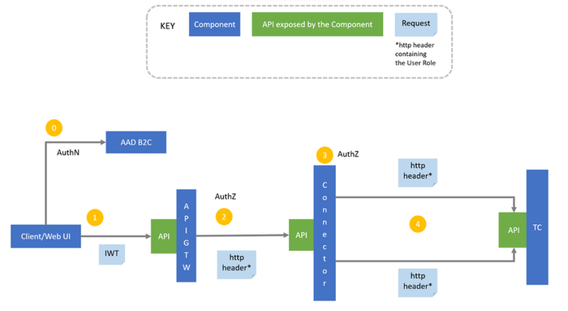

#### User-Role Validation Sequence Diagram

This sequence diagram represents the flow of user-role validation against a role mapping file in an SDK.

The user role is extracted at the APIM level from the JWT token and is passed to the connector as a header. The user role is validated against the [role mapping config file](https://ts.accenture.com/sites/GlobalDocTemplates/Published%20Documents/IX%20Thread/Linked%20Files/DT_Role_Mapping_Config.txt) in the filter layer. The extract role service is part of the filter layer where the user role is extracted from the header and validated against the config file.

#### Connector Filter

The following image explains the skeleton of the connector filter service using three methods, each of which performs specific validation and filtering. These three methods are:

-   doFliter: Uses a servlet filter to intercept requests.

-   extractUserRole: Extracts the user from the header.

-   loadRoleConfig(): Loads the RBAC config file.

-   IsValidRole(): Validates the role extracted from the header against the RBAC config file.

### Using Azure IOT Hub as MQTT Broker

Digital Thread Foundations SDK supports the MQTT protocol, which is a simple and lightweight messaging protocol (subscribe and publish) designed for limited devices and networks with high latency, low bandwidth, and unreliable networks. The network configuration of Azure IOT Hub must include the IP address of the client PC.

####  Dependency Required

> \
>
> \org.apache.camel.springboot\
>
> \camel-spring-boot-starter\
>
> \4.5.0\
>
> \
>
> \
>
> \org.apache.camel.springboot\
>
> \camel-paho-starter\
>
> \4.5.0\
>
> \

#### Azure IOT Hub Configuration 

The following depicts the Azure IOT Hub configuration in in springboot application.properties.

> azure.iot.resourceuri= iot resourceuri details
>
> azure.iot.key= iotHub device Primerykey details
>
> camel.component.paho.broker-url= broker url details
>
> camel.component.paho.client-id= client id details
>
> camel.component.paho.user-name= User name details
>
> consumer.topic= topic to consumer
>
> producer.topic= topic to producer

## Development of SDK

Follow the steps below to develop an SDK (archetype). The SDK functions as a template for generating ix-digitalthread applications. Before proceeding, verify that all prerequisites outlined earlier in the document are fulfilled.

1.  Create a quick start Maven project using the following command:

> mvn archetype:generate

2.  Incorporate prototype packages, files, and dependencies for the DigitalThread Connector SDK into the project.

3.  Add distribution management in pom.xml.

> \
>
> \
>
> \IXThreadComponents\
>
> \https://pkgs.dev.azure.com/IXDigitalThread/IXThreadComponents/\_packaging/IXThreadComponents/maven/v1\
>
> \
>
> \true\
>
> \
>
> \
>
> \true\
>
> \
>
> \
>
> \

4.  Execute the command below to create an archetype from the existing project, ensuring that Maven updates are forced:

> mvn -U clean archetype:create-from-project

5.  Navigate to the generated-sources/archetype/ directory within the target folder:

> cd target/generated-sources/archetype/

6.  While in the target/generated-sources/archetype/ directory, save the settings.xml file under the \~/.m2 folder.

-   \# Be sure to be in the target/generated-sources/archetype folder

-   \# Save settings.xml under \~/.m2 folder

-   mvn deploy

-   Once the archetype is uploaded, it can be used to generate new projects.

## Project Generation using SDK

Follow the six steps below to generate a new project (Digital Thread Foundations application) using the SDK created above:

1.  Generate a file named \"settings.xml\" and include the following [XML code](https://ts.accenture.com/:u:/r/sites/GlobalDocTemplates/Published%20Documents/IX%20Thread/Linked%20Files/SDK_settings.xml?csf=1&amp;web=1&amp;e=fUfXL0). Save this file as \"settings.xml.\"

2.  Place the settings.xml file under the \~/.m2 directory.

3.  Create a project directory.

4.  In the command prompt, execute the below command in the project path.

5.  C:\\IXDigitalThread\\sdk-com-digitalthred\&gt;mvn archetype:generate -DarchetypeGroupId=com.digitalthread -DarchetypeArtifactId=ix-connector-sdk -DarchetypeVersion=0.0.44-SNAPSHOT

    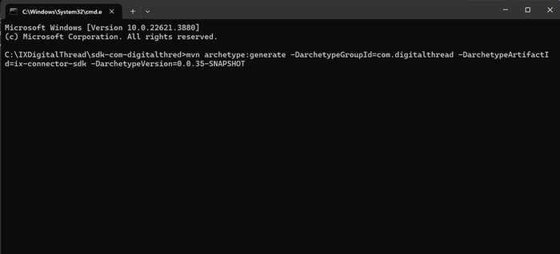

> Before executing the command, ensure that the latest version of the SDK is entered in the command.
>
> **NOTE:**

-   update \"-DarchetypeVersion\" to the latest SDK version, or the version required.

-   For reference, find the **Release Version Table** history of the SDK below.

| GroupID | ArtifactID Version |
| --- | --- |
| com.digitalthread | ix-connector-sdk 0.0.44-SNAPSHOT |
| com.digitalthread | ix-connector-sdk 0.0.30-SNAPSHOT |
| com.digitalthread | ix-connector-sdk 0.0.16-SNAPSHOT &gt; To specify just the SDK or to download it with a library, refer to the commands below. |
| Download type | Command |
| SDK | mvn archetype:generate -DarchetypeGroupId=com.digitalthread -DarchetypeArtifactId=ix-connector-sdk -DarchetypeVersion=0.0.44-SNAPSHOT |
| SDK with Teamcenterlab library | mvn archetype:generate -DarchetypeGroupId=com.digitalthread -DarchetypeArtifactId=ix-connector-sdk -DarchetypeVersion=0.0.44-SNAPSHOT -DincludeTeamcenterlab=true |
| SDK with SAPlab library | mvn archetype:generate -DarchetypeGroupId=com.digitalthread -DarchetypeArtifactId=ix-connector-sdk -DarchetypeVersion=0.0.44-SNAPSHOT -DincludeSaplab=true |
| SDK with Iiotlab library | mvn archetype:generate -DarchetypeGroupId=com.digitalthread -DarchetypeArtifactId=ix-connector-sdk -DarchetypeVersion=0.0.44-SNAPSHOT -DincludeIiotlab=true This command initiates the download of the SDK and prompts user for project details in interactive mode. Enter the values for groupld , artifactId, and version for the new project. An example is shown in the table below. |
| Value | Description Example |
| GroupId | The name that groups a set of projects or modules that is helpful to identify the project amongst other projects com.digitalthread |
| ArtifactId | The name of the project, which must be unique within a groupId, is used to identify and name the output files (such as JAR files) generated by the project. IXConnectorlab |
| Version | The stage or progress of the project 0.0.1-SNAPSHOT |
| Package | The organization of classes and interfaces com.digitalthread.IXConnectorlab Upon the successful completion of the build, a new project is generated in the specified project directory as shown below. &gt; 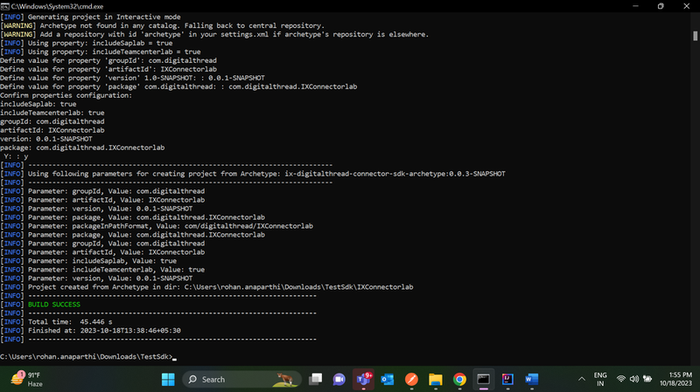

6. |
| 7. | Import the project into IntelliJ from the project directory. After importing, the project structure should resemble the following example. &gt; 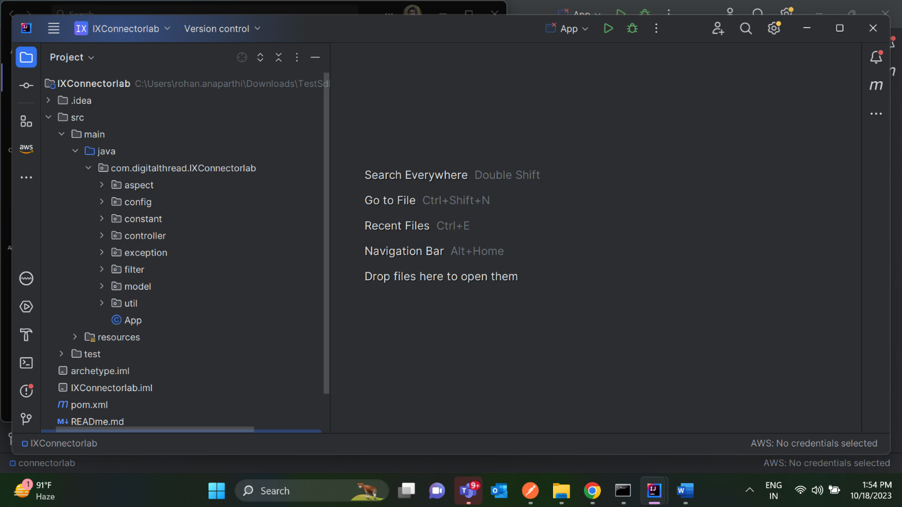
|  |

## 

# Project Application Execution

**Understand Application Structure**

-   The application uses a common API library to handle functionalities such as logging, user role validation, intercepting, and processing incoming requests.

**Ensure Package Scanning**

-   Ensure that all necessary packages are scanned before running the application.

**Check the Group ID**

-   If Group ID is com.digitathered:

    -   Proceed to run the application without additional configuration.

-   If Group ID is Different:

    -   Open the main application class or configuration class with the component scan.

    -   Locate the \@ComponentScan annotation.

    -   Add your group ID to the annotation.

> Example: Created the Project generation with \"groupId: com.dt \"

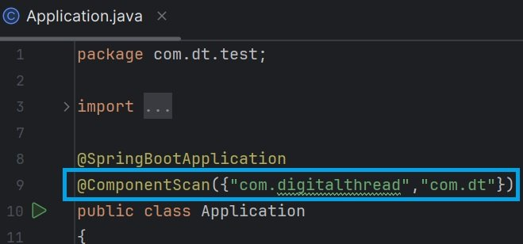

-   Run the Application

## 

# Connector Inclusion to the SDK

Follow the below steps to include the SAP connector, IIOT connector, and Teamcenter (TC) Connector jar to the SDK.

1.  Include the following snippet to add the TC, IIOT, and SAP connector dependencies in the pom.xml file located at src/main/resources/archetype-resources/pom.xml.

> \
>
> #if (\$\{includeSaplab\} == \'true\' \|\| \$\{includeSaplab\} == \'yes\' \|\| \$\{includeSaplab\} == \'y\')
>
> \
>
> \com.digitalthread\
>
> \saplab\
>
> \0.0.4-20231013.075730-1\
>
> \compile\
>
> \
>
> #end
>
> #if (\$\{includeTeamcenterlab\} == \'true\' \|\| \$\{includeTeamcenterlab\} == \'yes\' \|\| \$\{includeTeamcenterlab\} == \'y\')
>
> \
>
> \com.digitalthread\
>
> \teamcenterlab\
>
> \0.0.18-20231012.131719-1\
>
> \compile\
>
> \
>
> #end
>
> #if (\$\{includeIiotlab\} == \'true\' \|\| \$\{includeIiotlab\} == \'yes\' \|\| \$\{includeIiotlab\} == \'y\')
>
> \
>
> \com.digitalthread\
>
> \ix-iiot-api\
>
> \\_\_iiotVersion\_\_\
>
> \compile\
>
> \
>
> #end
>
> \

2.  Include the following snippet in the src/main/resources/META-INF/maven/archetype-metadata.xml.

> \
>
> \
>
> \false\
>
> \
>
> \
>
> \false\
>
> \
>
> \
>
> \false\
>
> \
>
> \

3.  Insert the following content into the archetype.properties file located at src/test/resources/projects/basic/archetype.properties.

> includeSaplab=saplab
>
> includeTeamcenterlab=teamcenterlab
>
> includeIiotlab=iiotlab

4.  Insert the following in the ix-connector-sdk/pom.xml

> \
>
> \
>
> \IXThreadComponents\
>
> \https://pkgs.dev.azure.com/IXDigitalThread/IXThreadComponents/\_packaging/IXThreadComponents/maven/v1\
>
> \
>
> \true\
>
> \
>
> \
>
> \true\
>
> \
>
> \

\

5.  mvn deploy. Execute the following command to generate the project Including SAP, IIOT, and Teamcenter Connector Jar. Note that the version number in the screenshot corresponds to the saplab version and not the SDK version.

mvn archetype:generate -DarchetypeGroupId=com.digitalthread -DarchetypeArtifactId=ix-connector-sdk -DarchetypeVersion=0.0.25-SNAPSHOT -DincludeSaplab=true -DincludeTeamcenterlab=true -DincludeIiotlab=true

6.  Teamcenter, IIOT, and SAP jar files are now included in the project.

> 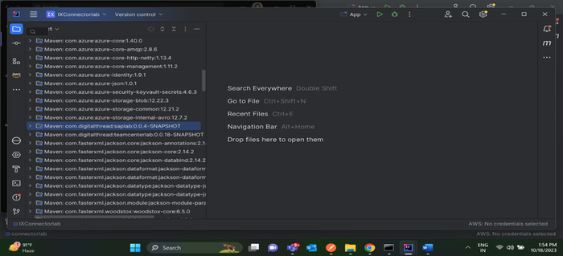
## 

# Network Configuration

-   Configure the IP address of the server or laptop running the connector.

-   Ensure this IP address is added to the Azure IoT Hub\'s network configuration to allow communication.

-   Refer to the Azure IoT Hub documentation for guidance on configuring network rules and firewall settings.

## Testing

Follow these steps to test the SDK.

1.  Run the required command from the below table to generate the required project.

> To generate the required project for testing the SDK, use the following Maven commands based on your integration:

-   For Teamcenter: mvn archetype:generate -DarchetypeGroupId=com.digitalthread -DarchetypeArtifactId=ix-connector-sdk -DarchetypeVersion=0.0.33-SNAPSHOT -DincludeTeamcenterlab=true

-   For SAP: mvn archetype:generate -DarchetypeGroupId=com.digitalthread -DarchetypeArtifactId=ix-connector-sdk -DarchetypeVersion=0.0.33-SNAPSHOT -DincludeSaplab=true

-   For IIOT: mvn archetype:generate -DarchetypeGroupId=com.digitalthread -DarchetypeArtifactId=ix-connector-sdk -DarchetypeVersion=0.0.33-SNAPSHOT -DincludeIiotlab=true

2.  Once the project is generated, add the corresponding annotation:

-   \@ComponentScan(\"com.digitalthread.teamcenterlab\")

-   \@ComponentScan(\"com.digitalthread.saplab\")

-   \@ComponentScan(\"com.digitalthread.iiot\")

> Note that the annotation is added to ensure Spring looks for the correct classes, as the framework uses class names similar to common class names. Also, to avoid errors in searching for classes, test the SDK one project at a time.

3.  Update the application.properties with server details. Refer to this [[example cod](https://ts.accenture.com/:t:/r/sites/GlobalDocTemplates/Published%20Documents/IX%20Thread/Linked%20Files/SDK%20Guide/SDK_Guide_Application_Properties_Example.txt)e](https://ts.accenture.com/:t:/r/sites/GlobalDocTemplates/Published%20Documents/IX%20Thread/Linked%20Files/SDK%20Guide/SDK_Guide_Application_Properties_Example.txt) for SAP to understand how the server details are updated.

4.  Run the application.

5.  In Postman, add \"user-role\" in the header and trigger the SAP/Teamcenter/IIOT APIs.

> 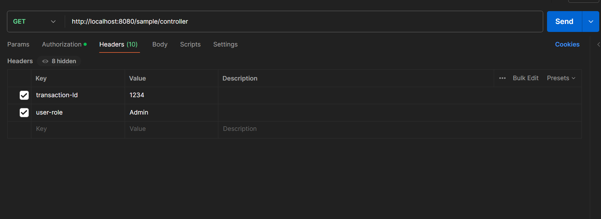
