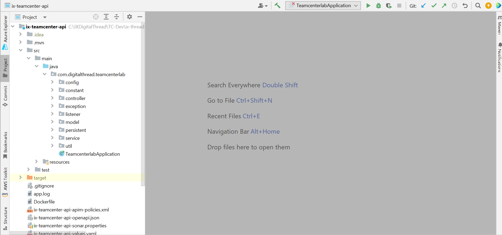

Digital Thread Foundations

Teamcenter Connector

INTEGRATION GUIDE

Release Version: 1.2

##  \{#section .TOC-Heading\}

## 
Contents \{#contents .TOC-Heading\}

[Introduction [3](#section-1)](#section-1)

[Purpose [3](#purpose)](#purpose)

[Target Audience [3](#target-audience)](#target-audience)

[Prerequisites [4](#prerequisites)](#prerequisites)

[Related Links [3](#related-links)](#related-links)

[Business Contacts [3](#business-contacts)](#business-contacts)

[Technical Contacts [3](#technical-contacts)](#technical-contacts)

[CRU API [4](#_Toc210651436)](#_Toc210651436)

[Logging [4](#logging)](#logging)

[Secure Secrets Management [5](#secure-secrets-management)](#secure-secrets-management)

[Error Management [6](#section-2)](#section-2)

[Role-based Access Control [6](#role-based-access-control)](#role-based-access-control)

[Download and Usage [6](#_Toc210651441)](#_Toc210651441)

[APIs [8](#section-4)](#section-4)

[Get Item Revision [9](#get-item-revision)](#get-item-revision)

[Post Item Revision [10](#section-5)](#section-5)

[Put Item Revision [11](#section-6)](#section-6)

[Patch Item Revision [12](#section-7)](#section-7)

[Delete Item [13](#section-8)](#section-8)

[Search BOM Item Details [14](#section-9)](#section-9)

[Get BOM Item Details [15](#section-10)](#section-10)

[Get BOM Items for CDC [16](#get-bom-items-for-cdc)](#get-bom-items-for-cdc)

[Post Create BOM Item [17](#section-11)](#section-11)

[Put Update BOM Item [18](#section-12)](#section-12)

[Delete BOM Item [19](#section-13)](#section-13)

[Get Metadata [20](#section-14)](#section-14)

[Get Item Details [21](#section-15)](#section-15)

[Fetch Bulk Import Template [22](#fetch-bulk-import-template)](#fetch-bulk-import-template)

[Set Workflow for Teamcenter Items [23](#section-16)](#section-16)

[Get Bulk Import [24](#section-17)](#section-17)

[BOM Conversion [25](#section-18)](#section-18)

[Get Batch Processing [26](#get-batch-processing)](#get-batch-processing)

[Post Set Preferences [27](#section-19)](#section-19)

## 

# Introduction

A digital thread refers to the continuous and consistent flow of information throughout the entire lifecycle of a product or system - from design and development to operation and maintenance. It enables the integration of data from different stages and sources, allowing effective traceability, seamless collaboration, and efficient decision-making by unleashing the power of sleeping data. Digital Thread is a communication framework that helps integrate various enterprise systems involved in the engineering and manufacturing product life cycle.

Teamcenter is a comprehensive product lifecycle management (PLM) system. Digital Thread Foundations leverages Teamcenter by utilizing the Teamcenter Connector Too. This connector is designed to bridge the gap between disparate systems, providing a robust solution for managing product lifecycle data across different platforms. The connector enables users to effortlessly connect with Teamcenter and execute operations such as fetching, creating, updating, and deleting the data. The Teamcenter Connector Tool is an essential solution for organizations looking to enhance their PLM capabilities and integrate their systems seamlessly. By providing efficient data management and ensuring data consistency.

The implemented Change Data Capture (CDC) mechanism ensures real-time, bidirectional synchronization between Teamcenter and Polarion, so any change made in one system is automatically reflected in the other without manual intervention.

Some of the APIs described in this document are specific to the Change Data Capture (CDC) use case.

### Purpose

This document describes IX Digital Thread\'s Teamcenter Connector. It includes information on its usage, as well as descriptions of the APIs used for configuration and middleware functionality.

### Target Audience

Software architects, developers, and integrators with IT backgrounds.

### Related Links

-   [DT_Role_Mapping_Config.txt](https://ts.accenture.com/:t:/r/sites/GlobalDocTemplates/Published%20Documents/IX%20Thread/Linked%20Files/DT_Role_Mapping_Config.txt?csf=1&amp;web=1&amp;e=CLRCB8)

-   [Digital Thread documentation](https://industryxdevhub.accenture.com/asset-home;search_text=IX%20Digital%20Thread)

### Business Contacts

-   [florian.tournier@accenture.com](mailto:florian.tournier@accenture.com)

-   [laura.mosconi@accenture.com](mailto:laura.mosconi@accenture.com)

-   [karthik.ramachandra@accenture.com](mailto:karthik.ramachandra@accenture.com)

### Technical Contacts

-   [laura.mosconi@accenture.com](mailto:laura.mosconi@accenture.com)

-   [janos.puskas@accenture.com](mailto:janos.puskas@accenture.com)

-   [zsolt.tofalvi@accenture.com](mailto:zsolt.tofalvi@accenture.com)

-   [shristy.b.kumari@accenture.com](mailto:shristy.b.kumari@accenture.com)

-   [stefano.giacco@accenture.com](mailto:stefano.giacco@accenture.com)

[]\{#_Toc210651436 .anchor\}

### Prerequisites

-   [Download](https://www.java.com/download) and [install](https://ts.accenture.com/sites/GlobalDocTemplates/ixthread/Shared%20Documents/RC1/•%09https:/docs.oracle.com/en/java/javase/16/install/installation-jdk-microsoft-windows-platforms.html) Java (version 17)

-   [Download](https://www.jetbrains.com/idea/download/) and [install](https://www.jetbrains.com/idea/download/) IntelliJ IDEA (version: 2023.1.1)

-   [Download](https://maven.apache.org/download.cgi) and [install](https://maven.apache.org/install.html) Apache Maven (version: 3.9.1)

-   Azure Artifact Repository Access

-   Azure Storage Access.

-   API testing tools such as Postman.

## CRU API

The Create/Read/Update (CRU) API enables interaction with Teamcenter to perform essential operations such as fetching Item or BOM (Bill of Materials) details, updating existing Item or BOM, and creating new ones. This provides the flexibility needed to manage items or BOM IDs directly from external systems or custom applications, enhancing integration possibilities.

The following capabilities are discussed in this section:

1.  Logging

2.  Secure Secrets Management

3.  Error management

4.  Role-based Access Control

### Logging

Teamcenter connector is built to log with logback and slf4j. The required format for the application logging is as follows:

\\|\\|\\|\\|\\|\\|\\|\

Refer logback-spring.xml under the directory \"src/main/resources\"

> \
>
> \
>
> \
>
> \
>
> \
>
> %d\{yyyy-MM-dd\'T\'HH:mm:ss.SSS\'Z\'\}\|%level\|%thread\|%X\{APPLICATION-LABEL\}\|%X\{TRANSACTION-ID\}\|%X\{PLATFORM-TRANSACTION-ID\}\|%logger\|%method\|%msg%n
>
> \
>
> \
>
> \
>
> \
>
> \
>
> \
>
> \
>
> \
>
> \
>
> \

### **Secure Secrets Management**

Secret management is a practice that allows developers to securely store sensitive data such as passwords, keys, and tokens, in a secure environment with strict access controls.

Azure Key Vault enables users to securely store and manage sensitive data like keys, passwords, certificates, and other sensitive information. These are kept in centralized storage that is protected by industry-standard algorithms and hardware security modules.

Using this feature on Teamcenter, the user will be able to store various access information in the key vaults. This information will be picked up by the various APIs securely and on the basis of the access level provided on the credential the actions should be performed.

#### Azure Key Vault Dependency

> \
>
> \com.azure.spring\
>
> \spring-cloud-azure-starter-[keyvault]-secrets\
>
> \
>
> \
>
> \
>
> \
>
> \com.azure.spring\
>
> \spring-cloud-azure-dependencies\
>
> \5.3.0\
>
> \[pom]\
>
> \import\
>
> \
>
> \
>
> \

#### Key Vault Configuration

In springboot application.properties:

spring.cloud.azure.keyvault.secret.property-source-enabled=true

spring.cloud.azure.keyvault.secret.property-sources\[0\].credential.client-secret=\

spring.cloud.azure.keyvault.secret.property-sources\[0\].credential.client-id=\

spring.cloud.azure.keyvault.secret.property-sources\[0\].profile.tenant-id=\

spring.cloud.azure.keyvault.secret.property-sources\[0\].endpoint=\

### 

## Error Management

Whenever a certain operation encounters an error, the same structure should be returned by all the DigitalThread components.

#### Output Body

| Parameter | Description Mandatory / Optional Type |
| --- | --- |
| errorManagement | Object identifying the error O\* Object |
| errorCode | Code that identifies the error occurred O\* String |
| errorDescription | Error description O\* String |

#### Example Error Response

> \{
>
> \"errorManagement\": \{
>
> \"errorCode\": \"CMPNT_02.100004\",
>
> \"errorDescription\": \"db connection error\"
>
> \}
>
> \}

### Role-based Access Control

Role-based Access Control (RBAC) is a mechanism that restricts system access. Also known as role-based security, it involves setting permissions and privileges to enable access to authorized users. Users can consume the API exposed, based on the RBAC system. Users may have different access to the external system. Role Based Access Control (RBAC) in the Teamcenter connector application is managed through Azure management services. Policies are defined at the product level, dictating the access rights for various methods within the application. The table below shows the permissions granted to each role.

[]\{#_Toc210651441 .anchor\}Permissions are assigned to various roles within the Teamcenter connector application as follows:

-   Admin: Granted full permissions, including POST, PUT, and GET operations.

-   QE (Quality Engineer): Granted full permissions, including POST, PUT, and GET operations.

-   Tester: Granted full permissions, including POST, PUT, and GET operations.

-   Dev (Developer): Granted full permissions, including POST, PUT, and GET operations.

-   User: Granted limited permissions, specifically GET operations only.

## 

# Download and Usage

The steps mentioned below are to access the Teamcenter Connector code:

1.  Access must be provided to the Azure repository () by the DevOps team.

2.  Clone the project with the help of Git into local.

3.  Use this path to access the Teamcenter connector code in IntelliJ IDEA: IXDigitalThread\\TC-Dev\\ix-thread-components\\connector\\ix-teamcenter-api

4.  Import the project into IntelliJ from the project directory. After importing, the project structure should resemble the following example.

5.  After importing the project into local, Update the application.properties with server details.

6.  Run the application.

7.  Use Postman, add \"user-role\" in the header Trigger the APIs.

## 

# APIs

The TC Connector offers a suite of APIs designed to streamline interactions with TC, enabling a range of operations including creating, updating, reading, and deleting data. The primary APIs provided by the connector are listed in the below table.

The table below includes a short description of every Product Name API.

| Name | Description |
| --- | --- |
| GET Item Revision Details | This API retrieves item revision details from Teamcenter. |
| POST Create Item Revision | This API creates an item, revision, and dataset depending on the request object as well as different request bodies it will update the revision properties and add the dataset with the file uploaded in Teamcenter. |
| PUT Create Item Revision | This API creates a revision object in Teamcenter. |
| PATCH Update Item Properties | This API updates the properties of an Item in Teamcenter on the provided request body. |
| DELETE Item or Specific Revision or Dataset | This API is used to delete an Item or specific revision of an Item or dataset assigned to the revision of an item, depending on the request body. |
| Search BOM Item Details | This API allows searching for BOM details in Teamcenter using a keyword |
| GET BOM Item Details | This API retrieves BOM details based on item id &amp; rev id or modifiedAfter and maxResults. |
| GET BOM Item Details for CDC | This API fetches BOM data from Teamcenter specifically for CDC (Change Data Capture) use cases. |
| POST Create BOM Item | This API creates BOM items in Teamcenter based on the provided request object. |
| PUT Update BOM Item | This API is used to update BOM IDs in Teamcenter. |
| DELETE BOM Item | This API is used to delete BOM IDs. |
| GET Metadata | This API retrieves metadata and relationship details for a particular type or all types when the \'type\' parameter is not provided. |
| GET Item Details | This API retrieves item-related details from Teamcenter. |
| Fetch Bulk Import Template | This API fetches a template from Teamcenter for a specified object type and pushes it to blob storage. |
| Set Workflow for Teamcenter Items | This API triggers workflow actions for specified Teamcenter items. |
| GET Bulk Import | This API is for importing data for a particular object type in Teamcenter. |
| BOM Conversion | This API performs BOM conversion operations in Teamcenter, typically EBOM-to-MBOM conversions |
| GET Batch Processing | This API is used for posting requests to generate .csv files at the TC Server. |
| POST Set Preferences | This API is used to add items in Teamcenter based on the provided request object. Each API is detailed on the pages that follow. |

### Get Item Revision

This API facilitates the retrieval of item revisions from Teamcenter. It is designed to fetch specific items based on various parameters, including but not limited to id, type, attributes, and modifiedAfter. Users can tailor their requests to efficiently obtain the desired information from Teamcenter, enhancing flexibility and precision in data retrieval.

| PROTOCOL | HTTPS |
| --- | --- |
| DEV ENDPOINT | [https://ixts-dev-apim.azure-api.net/teamcenter-api/v1/](https://ix-dev-apimgmt.azure-api.net/teamcenter-api/)items/revisions |
| QA ENDPOINT | [https://ix-qa-apimgmt.azure-api.net/teamcenter-api/v1/](https://ix-qa-apimgmt.azure-api.net/teamcenter-api/)items[/revisions] |
| METHOD | GET |
| CONTENT TYPE | application / json |
| SAMPLE RESPONSE | [LINK](https://ts.accenture.com/:t:/r/sites/GlobalDocTemplates/Published%20Documents/IX%20Thread/Linked%20Files/Teamcenter%20Connector/GET_Item_Revision_Sample_Response.txt) |

#### Path Parameters

| Parameter | Description |
| --- | --- |
| id | Optional param added to fetch response only for mentioned id/s |
| type | Optional param added to fetch response only for mentioned type |
| attributes | Optional param added to fetch response only for specified attributes |
| modifiedAfter | Optional param to fetch records which modified on or after specified date |
| cdc | Optional param added for cdc specific use case. |
| maxResults | Used to fetch specific number of records from TC in the cdc use case. This will work only if CDC is true. Max value allowed 50. |

#### Pagination Parameters

| Parameter | Description |
| --- | --- |
| offset | Page number of the dataset to retrieve (greater than 0), Mandatory param added for pagination. |
| limits | Mandatory param added for pagination. Max Value allowed is 100. |

#### Result

| HTTP Code | Result Description |
| --- | --- |
| 200 | Item Revision details fetched successfully |

#### Error Management

| HTTP Code | Error Code Error Description |
| --- | --- |
| 500 | 500 Project Specific error |
| 404 | 404 Not Found |
| 403 | 403 Forbidden |
| 401 | 401 Invalid Subscription key / Invalid Token |
| 400 | 400 Bad request |

### 

## Post Item Revision

This API allows the creation of items in Teamcenter based on the provided request object. It supports the creation of multiple objects along with their respective revisions. The request should include the necessary parameters to define the items and their revisions.

| PROTOCOL | HTTPS |
| --- | --- |
| DEV ENDPOINT | [https://ixts-dev-apim.azure-api.net/teamcenter-api/v1/](https://ix-dev-apimgmt.azure-api.net/teamcenter-api/)items |
| QA ENDPOINT | [https://ix-qa-apimgmt.azure-api.net/teamcenter-api/v1/](https://ix-qa-apimgmt.azure-api.net/teamcenter-api/)items |
| METHOD | POST |
| CONTENT TYPE | application / json |
| SAMPLE REQUEST | [LINK](https://ts.accenture.com/:t:/r/sites/GlobalDocTemplates/Published%20Documents/IX%20Thread/Linked%20Files/Teamcenter%20Connector/POST_Item_Revision_Sample_Request.txt) |
| SAMPLE RESPONSE | [LINK](https://ts.accenture.com/:t:/r/sites/GlobalDocTemplates/Published%20Documents/IX%20Thread/Linked%20Files/Teamcenter%20Connector/GET_Item_Revision_Sample_Response.txt) |

#### Result

| HTTP Code | Result Description |
| --- | --- |
| 200 | Item Revision details fetched successfully |

#### Error Management

| HTTP Code | Error Code Error Description |
| --- | --- |
| 500 | 500 Project Specific error |
| 404 | 404 Not Found |
| 403 | 403 Forbidden |
| 401 | 401 Invalid Subscription key / Invalid Token |
| 400 | 400 Bad request Note that: |
| 1. | To upload a file to Teamcenter, the user must upload it to the [Azure](https://portal.azure.com/?feature.tokencaching=true&amp;feature.internalgraphapiversion=true) blob storage path given below first. |
| a. | DEV: ixdevstorage/digitalthreadpod1/BatteryManagement/cad_files |
| b. | QA: ixqastorage/digitalthreadpod1/BatteryManagement/cad_files |
| 2. | CAD, PDF, and Text files can be uploaded. The request body structure for uploading the file is as follows. |
| a. | Sample Request body to upload the file at the time of creation of Item ID - [LINK](https://ts.accenture.com/:t:/r/sites/GlobalDocTemplates/Published%20Documents/IX%20Thread/Linked%20Files/Teamcenter%20Connector/File_Upload_Creation_Request_Body.txt) |
| b. | Sample Request body to upload file to existing item - [LINK](https://ts.accenture.com/:t:/r/sites/GlobalDocTemplates/Published%20Documents/IX%20Thread/Linked%20Files/Teamcenter%20Connector/File_Upload_Existing_Request_Body.txt) |

### 

## Put Item Revision

This API facilitates the creation of a revision object in Teamcenter and subsequently updates the property values on the newly created revision. Supply the required parameters, including the client ID, item ID, revision ID, and the updated property values, in the request to initiate the process.

| PROTOCOL | HTTPS |
| --- | --- |
| DEV ENDPOINT | [https://ixts-dev-apim.azure-api.net/teamcenter-api/v1/](https://ix-dev-apimgmt.azure-api.net/teamcenter-api/)items[/revisions] |
| QA ENDPOINT | [https://ix-qa-apimgmt.azure-api.net/teamcenter-api/v1/](https://ix-qa-apimgmt.azure-api.net/teamcenter-api/)items[/revisions] |
| METHOD | PUT |
| CONTENT TYPE | application / json |
| SAMPLE REQUEST | \[ \{ \"clientId\": \"Digital-Thread\", \"itemId\": \"003674\", \"revId\": \"A\", \"properties\": \{ \"object_name\": \"DriverAirBag\", \"object_desc\": \"This is a Demo Part to Create DriverAirBag\" \} \} \] |
| SAMPLE RESPONSE | [LINK](https://ts.accenture.com/:t:/r/sites/GlobalDocTemplates/Published%20Documents/IX%20Thread/Linked%20Files/Teamcenter%20Connector/PUT_Item_Revision_Sample_Response.txt) |

#### Result

| HTTP Code | Result Description |
| --- | --- |
| 200 | Item Revision details fetched successfully |

#### Error Management

| HTTP Code | Error Code Error Description |
| --- | --- |
| 500 | 500 Project Specific error |
| 404 | 404 Not Found |
| 403 | 403 Forbidden |
| 401 | 401 Invalid Subscription key / Invalid Token |
| 400 | 400 Bad request |

### 

## Patch Item Revision

This API allows updating the properties of an item in Teamcenter. Provide the item ID, revision ID, and the updated properties in the request to modify the existing item attributes.

| PROTOCOL | HTTPS |
| --- | --- |
| DEV ENDPOINT | [https://ixts-dev-apim.azure-api.net/teamcenter-api/v1/](https://ix-dev-apimgmt.azure-api.net/teamcenter-api/)items[/revisions] |
| QA ENDPOINT | [https://ix-qa-apimgmt.azure-api.net/teamcenter-api/v1/](https://ix-qa-apimgmt.azure-api.net/teamcenter-api/)items[/revisions] |
| METHOD | PATCH |
| CONTENT TYPE | application / json |
| SAMPLE REQUEST | \[ \{ \"clientId\": \"Digital-Thread\", \"itemId\": \"003676\", \"revId\": \"A\", \"properties\": \{ \"object_name\": \"003666_ItemObjectNameA\", \"object_desc\": \"Demo Item related to Air Bag\" \} \} \] |
| SAMPLE RESPONSE | [LINK](https://ts.accenture.com/:t:/r/sites/GlobalDocTemplates/Published%20Documents/IX%20Thread/Linked%20Files/Teamcenter%20Connector/PATCH_Item_Revision_Sample_Response.txt) |

#### Result

| HTTP Code | Result Description |
| --- | --- |
| 200 | Item Revision details fetched successfully Error Management |
| HTTP Code | Error Code Error Description |
| 500 | 500 Project Specific error |
| 404 | 404 Not Found |
| 403 | 403 Forbidden |
| 401 | 401 Invalid Subscription key / Invalid Token |
| 400 | 400 Bad request |

### 

## Delete Item

This API enables the deletion of items or a specific revision or dataset in Teamcenter. Depending on the request, you can either delete the entire item or a particular revision of the item or only the dataset assigned to the Item and revision. Provide the item ID and, if applicable, the revision ID and if applicable dataset type in the request to specify the target for deletion.

| PROTOCOL | HTTPS |
| --- | --- |
| DEV ENDPOINT | [https://ixts-dev-apim.azure-api.net/teamcenter-api/v1/](https://ix-dev-apimgmt.azure-api.net/teamcenter-api/)items[/revisions] |
| QA ENDPOINT | [https://ix-qa-apimgmt.azure-api.net/teamcenter-api/v1/](https://ix-qa-apimgmt.azure-api.net/teamcenter-api/)items[/revisions] |
| METHOD | DELETE |
| CONTENT TYPE | application / json |

#### Sample Request and Response

[LINK](https://ts.accenture.com/:t:/r/sites/GlobalDocTemplates/Published%20Documents/IX%20Thread/Linked%20Files/DT_Delete_Item_Request_Response.txt)

#### Result

| HTTP Code | Result Description |
| --- | --- |
| 204 | Entry deleted successfully |

#### Error Management

| HTTP Code | Error Code Error Description |
| --- | --- |
| 500 | 500 Project Specific error |
| 404 | 404 Not Found |
| 403 | 403 Forbidden |
| 401 | 401 Invalid Subscription key / Invalid Token |
| 400 | 400 Bad request |

### 

## Search BOM Item Details

This API allows searching for BOM details in Teamcenter using a keyword.

It supports keyword-based searches along with attribute filtering and pagination.

-   If the user provides a keyword, the API returns BOMs that match the given keyword.

-   The attributes parameter can be used to restrict the response to specific BOM properties by providing them as a comma-separated list.

-   The results can be paginated using the offset (page number) and limits (number of records per page) parameters.

| PROTOCOL | HTTPS |
| --- | --- |
| DEV ENDPOINT |  |
| QA ENDPOINT |  |
| METHOD | GET |
| CONTENT TYPE | application / json |

#### Path Parameters

| Parameter | Description |
| --- | --- |
| keyword | Optional. Search keyword used to find BOM details in Teamcenter. |
| attributes | Optional. Comma-separated list of attributes to fetch from parent BOM properties. |
| offset | Required. Page number for pagination. |
| limits | Required. Maximum number of records to fetch per page. |

#### Result

| HTTP Code | Result Description |
| --- | --- |
| 200 | BOM details fetched successfully |

#### Error Management

| HTTP Code | Error Code Error Description |
| --- | --- |
| 500 | 500 Project Specific error |
| 404 | 404 Not Found |
| 403 | 403 Forbidden |
| 401 | 401 Invalid Subscription key / Invalid Token |
| 400 | 400 Bad request |

### 

## Get BOM Item Details

This API facilitates the retrieval of BOM details from Teamcenter. It supports fetching BOM details either by specifying a BOM ID and BOM Revision ID or by using filters such as modifiedAfter, type, and pagination controls.

-   If the user provides bom_id and bom_rev_id, the API returns the details for the specific BOM revision.

-   If the user provides modifiedAfter, the API retrieves BOMs that were created or updated after the specified date/time.

-   The results can be paginated using offset and limits.

-   The policyType parameter allows users to restrict the response to specific attributes by passing them as a comma-separated list.

-   By default, only top-level BOM details are fetched. To also retrieve child items, the user can set fetch_children=1.

| PROTOCOL | HTTPS |
| --- | --- |
| DEV ENDPOINT | [https://ixts-dev-apim.azure-api.net/teamcenter-api/v1/](https://ix-dev-apimgmt.azure-api.net/teamcenter-api/)items/bom |
| QA ENDPOINT | [https://ix-qa-apimgmt.azure-api.net/teamcenter-api/v1/](https://ix-qa-apimgmt.azure-api.net/teamcenter-api/)items/[bom] |
| METHOD | GET |
| CONTENT TYPE | application / json |
| SAMPLE RESPONSE | [LINK](https://ts.accenture.com/:t:/r/sites/GlobalDocTemplates/Published%20Documents/IX%20Thread/Linked%20Files/Teamcenter%20Connector/GET_BOM_Item_Details_Sample_Response.txt) |

#### Path Parameters

| Parameter | Description |
| --- | --- |
| bom_id | Optional param added to fetch response only for mentioned id and with this revId is required to get response. |
| bom_rev_id | Optional param added to fetch response only for mentioned revId and with this itemId is required to get response. |
| modifiedAfter | Optional param to fetch records which modified on or after specified date, accepts format dd-MMM-yyyy HH:mm and with this maxResult needs to provide. |
| type | Optional param for filter based on BOM type. |
| policyType | To get specific attributes in response, users need to provide those attributes as a parameter to this field. |
| fetch_children | Optional. Default 0. If set to 1, includes child BOM items in the response. |
| offset | Required. Starting index for paginated results. |
| limits | Required. Maximum number of records to fetch in one request. |

#### Result

| HTTP Code | Result Description |
| --- | --- |
| 200 | Item Revision details fetched successfully |

#### Error Management

| HTTP Code | Error Code Error Description |
| --- | --- |
| 500 | 500 Project Specific error |
| 404 | 404 Not Found |
| 403 | 403 Forbidden |
| 401 | 401 Invalid Subscription key / Invalid Token |
| 400 | 400 Bad request |

### Get BOM Items for CDC

This API fetches BOM data from Teamcenter specifically for CDC (Change Data Capture) use cases.

It retrieves BOMs that have been created or updated after the specified modified_after date.

-   The modified_after parameter is mandatory and specifies the cutoff date/time.

-   The max_results parameter limits the number of BOM records returned (maximum allowed value is 50).

| PROTOCOL | HTTPS |
| --- | --- |
| DEV ENDPOINT |  |
| QA ENDPOINT |  |
| METHOD | GET |
| CONTENT TYPE | application / json |

#### Path Parameters

| Parameter | Description |
| --- | --- |
| modified_after | Required. Fetch BOM records created or modified on or after the specified date (dd-MMM-yyyy HH:mm). |
| max_results | Required. Maximum number of records to fetch (for CDC use case). Max allowed: 50. |

#### Result

| HTTP Code | Result Description |
| --- | --- |
| 200 | Item Revision details fetched successfully |

#### Error Management

| HTTP Code | Error Code Error Description |
| --- | --- |
| 500 | 500 Project Specific error |
| 404 | 404 Not Found |
| 403 | 403 Forbidden |
| 401 | 401 Invalid Subscription key / Invalid Token |
| 400 | 400 Bad request |

### 

## Post Create BOM Item

This API allows the creation of BOM items in Teamcenter based on the provided request object. It supports the creation of multiple objects along with their respective revisions. The request should include the necessary parameters to define the items and their revisions.

| PROTOCOL | HTTPS |
| --- | --- |
| DEV ENDPOINT | [https://ixts-dev-apim.azure-api.net/teamcenter-api/v1/](https://ix-dev-apimgmt.azure-api.net/teamcenter-api/)items/[bom] |
| QA ENDPOINT | [https://ix-qa-apimgmt.azure-api.net/teamcenter-api/v1/](https://ix-qa-apimgmt.azure-api.net/teamcenter-api/)items/[bom] |
| METHOD | POST |
| CONTENT TYPE | application / json |
| SAMPLE REQUEST | \[ \{ \"parentProperties\": \{ \"item\": \"003409/A\" \}, \"childProperties\": \{ \"item\": \[\"003410/A\",\"003412/A\"\] \} \} \] |
| SAMPLE RESPONSE | [LINK](https://ts.accenture.com/:t:/r/sites/GlobalDocTemplates/Published%20Documents/IX%20Thread/Linked%20Files/Teamcenter%20Connector/POST_Create_BOM_Item_Sample_Response.txt) |

#### Result

| HTTP Code | Result Description |
| --- | --- |
| 200 | Item Revision details fetched successfully |

#### Error Management

| HTTP Code | Error Code Error Description |
| --- | --- |
| 500 | 500 Project Specific error |
| 404 | 404 Not Found |
| 403 | 403 Forbidden |
| 401 | 401 Invalid Subscription key / Invalid Token |
| 400 | 400 Bad request |

### 

## Put Update BOM Item

This API allows the updating of BOM items in Teamcenter based on the provided request object. It supports the updating of multiple objects along with their respective revisions. The request should include the necessary parameters to define the items and their revisions.

| PROTOCOL | HTTPS |
| --- | --- |
| DEV ENDPOINT | [https://ixts-dev-apim.azure-api.net/teamcenter-api/v1/](https://ix-dev-apimgmt.azure-api.net/teamcenter-api/)items/[bom] |
| QA ENDPOINT | [https://ix-qa-apimgmt.azure-api.net/teamcenter-api/v1/](https://ix-qa-apimgmt.azure-api.net/teamcenter-api/)items/[bom] |
| METHOD | PUT |
| CONTENT TYPE | application / json |
| SAMPLE REQUEST | \[ \{ \"parentBOMLineItem\": \{ \"itemId\": \"003409\", \"revId\": \"A\" \}, \"childBOMLineItems\": \{ \"oldItemId\": \"003410\", \"oldRevId\": \"A\", \"newItemId\": \"003413\", \"newRevId\": \"A\" \} \} \] |
| SAMPLE RESPONSE | [LINK](https://ts.accenture.com/:t:/r/sites/GlobalDocTemplates/Published%20Documents/IX%20Thread/Linked%20Files/Teamcenter%20Connector/PUT_Update_BOM_Item_Sample_Response.txt) |

#### Result

| HTTP Code | Result Description |
| --- | --- |
| 200 | Item Revision details fetched successfully |

#### Error Management

| HTTP Code | Error Code Error Description |
| --- | --- |
| 500 | 500 Project Specific error |
| 404 | 404 Not Found |
| 403 | 403 Forbidden |
| 401 | 401 Invalid Subscription key / Invalid Token |
| 400 | 400 Bad request |

### 

## Delete BOM Item

This API enables the deletion of BOM details in Teamcenter. Depending on the request, you can delete the entire BOM details of the item.

| PROTOCOL | HTTPS |
| --- | --- |
| DEV ENDPOINT | [https://ixts-dev-apim.azure-api.net/teamcenter-api/v1/](https://ix-dev-apimgmt.azure-api.net/teamcenter-api/)items/[bom] |
| QA ENDPOINT | [https://ix-qa-apimgmt.azure-api.net/teamcenter-api/v1/](https://ix-qa-apimgmt.azure-api.net/teamcenter-api/)items/[bom] |
| METHOD | DELETE |
| CONTENT TYPE | application / json |
| SAMPLE REQUEST | \[ \{ \"itemId\": \"003409\", \"revId\": \"A\" \} \] |
| SAMPLE RESPONSE | **HttpStatusCode: 204 No Content** \{ \"statusCode\": \"204\", \"statusMessage\": \"Entry deleted successfully.\" \} |

#### Result

| HTTP Code | Result Description |
| --- | --- |
| 200 | Item Revision details fetched successfully |

#### Error Management

| HTTP Code | Error Code Error Description |
| --- | --- |
| 500 | 500 Project Specific error |
| 404 | 404 Not Found |
| 403 | 403 Forbidden |
| 401 | 401 Invalid Subscription key / Invalid Token |
| 400 | 400 Bad request |

### 

## Get Metadata

This API retrieves metadata and relationship details for a particular type or all types when the \'type\' parameter is not provided. Specify the \'type\' parameter in the request to fetch details for a specific type.

| PROTOCOL | HTTPS |
| --- | --- |
| DEV ENDPOINT | [https://ixts-dev-apim.azure-api.net/teamcenter-api/v1/](https://ix-dev-apimgmt.azure-api.net/teamcenter-api/)items/metadata |
| QA ENDPOINT | [https://ix-qa-apimgmt.azure-api.net/teamcenter-api/v1/](https://ix-qa-apimgmt.azure-api.net/teamcenter-api/)items/metadata |
| METHOD | GET |
| CONTENT TYPE | application / json |
| SAMPLE RESPONSE | [LINK](https://ts.accenture.com/:t:/r/sites/GlobalDocTemplates/Published%20Documents/IX%20Thread/Linked%20Files/Teamcenter%20Connector/GET_Metadata_Sample_Response.txt) |

#### Result

| HTTP Code | Result Description |
| --- | --- |
| 200 | Item Revision details fetched successfully |

#### Error Management

| HTTP Code | Error Code Error Description |
| --- | --- |
| 500 | 500 Project Specific error |
| 404 | 404 Not Found |
| 403 | 403 Forbidden |
| 401 | 401 Invalid Subscription key / Invalid Token |
| 400 | 400 Bad request |

### 

## Get Item Details

This API facilitates the retrieval of items from Teamcenter, a comprehensive product lifecycle management (PLM) system. It is designed to fetch specific items based on various parameters, including but not limited to id, type, attributes, and modifiedAfter. Users can tailor their requests to efficiently obtain the desired information from Teamcenter, enhancing flexibility and precision in data retrieval.

| PROTOCOL | HTTPS |
| --- | --- |
| DEV ENDPOINT | [https://ixts-dev-apim.azure-api.net/teamcenter-api/v1/](https://ix-dev-apimgmt.azure-api.net/teamcenter-api/)items |
| QA ENDPOINT | [https://ix-qa-apimgmt.azure-api.net/teamcenter-api/v1/](https://ix-qa-apimgmt.azure-api.net/teamcenter-api/)items |
| METHOD | GET |
| CONTENT TYPE | application / json |
| SAMPLE RESPONSE | [LINK](https://ts.accenture.com/:t:/r/sites/GlobalDocTemplates/Published%20Documents/IX%20Thread/Linked%20Files/Teamcenter%20Connector/GET_Item_Details_Sample_Response.txt) |

#### Path Parameters

| Parameter | Description |
| --- | --- |
| id | Optional param added to fetch response only for mentioned id/s |
| type | Optional param added to fetch response only for mentioned type |
| attributes | Optional param added to fetch response only for specified attributes |
| modifiedAfter | Optional param to fetch records which modified on or after specified date, accepts format dd-MMM-yyyy and yyyy-MM-dd\'T\'HH:mm:ss\'Z\' |

#### Pagination Parameters

| Parameter | Description |
| --- | --- |
| offset | Optional param added for pagination. It represents Page Number. Default value is 1. Offset should be greater than 0 |
| limits | Optional param added for pagination. It represents Page Size. Default Value is 100. Max Value allowed is 100. |

#### Result

| HTTP Code | Result Description |
| --- | --- |
| 200 | Item Revision details fetched successfully |

#### Error Management

| HTTP Code | Error Code Error Description |
| --- | --- |
| 500 | 500 Project Specific error |
| 404 | 404 Not Found |
| 403 | 403 Forbidden |
| 401 | 401 Invalid Subscription key / Invalid Token |
| 400 | 400 Bad request |

### Fetch Bulk Import Template

This API fetches a template from Teamcenter for a specified object type and pushes it to blob storage. It is primarily used to provide users with a pre-defined template for bulk importing BOM or other Teamcenter items.

The \'type\' parameter specifies the type of object for which the template is to be fetched.

| PROTOCOL | HTTPS |
| --- | --- |
| DEV ENDPOINT |  |
| QA ENDPOINT |  |
| METHOD | GET |
| CONTENT TYPE | application / json |

#### Path Parameters

| Parameter | Description |
| --- | --- |
| type | Optional param added to fetch response only for mentioned type |

#### Result

| HTTP Code | Result Description |
| --- | --- |
| 200 | Template fetched and pushed to blob storage successfully |

#### Error Management

| HTTP Code | Error Code Error Description |
| --- | --- |
| 500 | 500 Project Specific error |
| 404 | 404 Not Found |
| 403 | 403 Forbidden |
| 401 | 401 Invalid Subscription key / Invalid Token |
| 400 | 400 Bad request |

### 

## Set Workflow for Teamcenter Items

This API triggers workflow actions for specified Teamcenter items. It allows updating workflow states for multiple items based on their compliance status or other workflow rules.

-   The request body must include an array of TeamcenterRequest objects.

-   Each TeamcenterRequest object should contain the following mandatory fields:

    -   itemId - the Teamcenter item ID

    -   revId - the revision ID of the item

    -   policyStatus - the policy verification status (e.g., compliant or not-compliant)

-   The array must not be null or empty.

| PROTOCOL | HTTPS |
| --- | --- |
| DEV ENDPOINT |  |
| QA ENDPOINT |  |
| METHOD | POST |
| CONTENT TYPE | application / json |

#### Path Parameters

| Parameter | Description |
| --- | --- |
| itemId | Required. The ID of the Teamcenter item. |
| revId | Required. The revision ID of the Teamcenter item. |
| policyStatus | Required. Policy verification status (compliant / not-compliant). |

#### Result

| HTTP Code | Result Description |
| --- | --- |
| 200 | Workflow action applied successfully |

#### Error Management

| HTTP Code | Error Code Error Description |
| --- | --- |
| 500 | 500 Project Specific error |
| 404 | 404 Not Found |
| 403 | 403 Forbidden |
| 401 | 401 Invalid Subscription key / Invalid Token |
| 400 | 400 Bad request |

### 

## Get Bulk Import

This API is used for importing data for a particular object type in Teamcenter.

| PROTOCOL | HTTPS |
| --- | --- |
| DEV ENDPOINT | [https://ixts-dev-apim.azure-api.net/teamcenter-api/v1/](https://ix-dev-apimgmt.azure-api.net/teamcenter-api/)items/export/bulk |
| QA ENDPOINT | [https://ix-qa-apimgmt.azure-api.net/teamcenter-api/v1/](https://ix-qa-apimgmt.azure-api.net/teamcenter-api/)items/export/bulk |
| METHOD | GET |
| CONTENT TYPE | application / json |
| SAMPLE RESPONSE | HttpStatusCode: 202 Accepted \{ \"statusCode\": \"202\", \"statusMessage\": \"Accepted\" \} |

#### Result

| HTTP Code | Result Description |
| --- | --- |
| 202 | Accepted |

#### Error Management

| HTTP Code | Error Code Error Description |
| --- | --- |
| 500 | 500 Project Specific error |
| 404 | 404 Not Found |
| 403 | 403 Forbidden |
| 401 | 401 Invalid Subscription key / Invalid Token |
| 400 | 400 Bad request |

### 

## BOM Conversion

This API performs BOM conversion operations in Teamcenter, typically used for EBOM-to-MBOM conversions.\
It tracks the conversion using a unique conversionId.

-   The request requires the following parameters:

    -   bom_id - the Teamcenter BOM ID to be converted.

    -   bom_rev_id - the revision ID of the BOM.

    -   conversion_id - a unique identifier to track the conversion process for a user or session.

-   The API returns information about the converted BOM and associated IDs.

| PROTOCOL | HTTPS |
| --- | --- |
| DEV ENDPOINT |  |
| QA ENDPOINT |  |
| METHOD | POST |
| CONTENT TYPE | application / json |

#### Path Parameters

| Parameter | Description |
| --- | --- |
| bom_id | Required. The BOM ID in Teamcenter to be converted. |
| bom_rev_id | Required. The revision ID of the BOM. |
| conversion_id | Required. Unique ID used to track the conversion process. |

#### Result

| HTTP Code | Result Description |
| --- | --- |
| 202 | Request for bom id and conversion id has been processed successfully. |

#### Error Management

| HTTP Code | Error Code Error Description |
| --- | --- |
| 500 | 500 Project Specific error |
| 404 | 404 Not Found |
| 403 | 403 Forbidden |
| 401 | 401 Invalid Subscription key / Invalid Token |
| 400 | 400 Bad request |

### Get Batch Processing

This API is for posting requests to generate .csv files at the Teamcenter Server.

| PROTOCOL | HTTPS |
| --- | --- |
| DEV ENDPOINT | [https://ixts-dev-apim.azure-api.net/teamcenter-api/v1/](https://ix-dev-apimgmt.azure-api.net/teamcenter-api/)items/import/bulk |
| QA ENDPOINT | [https://ix-qa-apimgmt.azure-api.net/teamcenter-api/v1/](https://ix-qa-apimgmt.azure-api.net/teamcenter-api/)items/import/bulk |
| METHOD | GET |
| CONTENT TYPE | application / json |
| SAMPLE RESPONSE | HttpStatusCode: 202 Accepted \{ \"statusCode\": \"202\", \"statusMessage\": \"Accepted\" \} |

#### Result

| HTTP Code | Result Description |
| --- | --- |
| 200 | Item Revision details fetched successfully |

#### Error Management

| HTTP Code | Error Code Error Description |
| --- | --- |
| 500 | 500 Project Specific error |
| 404 | 404 Not Found |
| 403 | 403 Forbidden |
| 401 | 401 Invalid Subscription key / Invalid Token |
| 400 | 400 Bad request |

### 

## Post Set Preferences

This API allows the set preferences for items in Teamcenter based on the provided request object.

| PROTOCOL | HTTPS |
| --- | --- |
| DEV ENDPOINT | [https://ixts-dev-apim.azure-api.net/teamcenter-api/v1/](https://ix-dev-apimgmt.azure-api.net/teamcenter-api/)[preferences] |
| QA ENDPOINT | [https://ix-qa-apimgmt.azure-api.net/teamcenter-api/v1/](https://ix-qa-apimgmt.azure-api.net/teamcenter-api/)[preferences] |
| METHOD | POST |
| CONTENT TYPE | application / json |
| SAMPLE REQUEST | \{ \"mode\":\"Add\", \"ids\": \[ \{ \"src\": \"TC\", \"object_type\": \"Dtt5_Air_Bag\", \"id\": \"001824\" \} \] \} |

#### Result

| HTTP Code | Result Description |
| --- | --- |
| 200 | Item Revision details fetched successfully |

#### Error Management

| HTTP Code | Error Code Error Description |
| --- | --- |
| 500 | 500 Project Specific error |
| 404 | 404 Not Found |
| 403 | 403 Forbidden |
| 401 | 401 Invalid Subscription key / Invalid Token |
| 400 | 400 Bad request |
