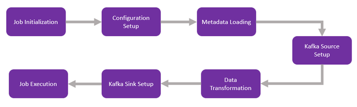
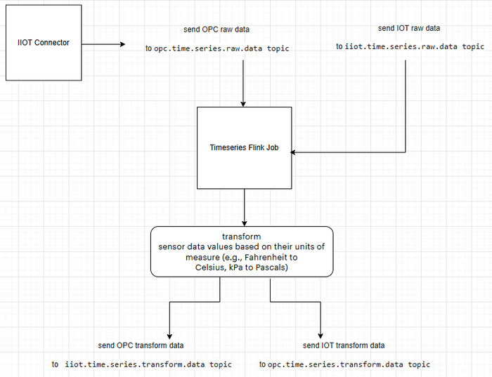

DIGITAL THREAD FOUNDATIONS

Timeseries Flink Job

Release Version: 1.2

**Metadata Table**

| **Field** | **Value** |
| --- | --- |
| **Asset / Solution Name** | Digital Thread |
| **Domain / Area** | Engineering |
| **Owner (Team/Person)** | Karthik Ramachandra |
| **Reviewers** | Karthik Ramachandra |
| **Status** | Approved / Complete |
| **Confidentiality** | Internal / Confidential |
| **Source of Truth** |  |
| **Related Assets / Alternatives** | AOT / Engineering Orch / Engineering Agents |

## Introduction

An IX Assets refers to the continuous and consistent flow of information throughout the entire lifecycle of a product or system -- from design and development to operation and maintenance. It enables the integration of data from different stages and sources, allowing effective traceability, seamless collaboration, and efficient decision-making by unleashing the power of sleeping data. The IX Assets is considered a key aspect of Industry 4.0 and the digital transformation of the manufacturing industry. It is the core of what we call the Enterprise Operating System (EOS). IX Assets is a communication framework that helps integrate various enterprise systems involved in the engineering and manufacturing product life cycle.

The Timeseries Flink job applies transformation rules to time series data, so that raw sensor streams can be normalized, resampled, and aligned in a configurable and reusable manner.

For the Flink job, a transformation pipeline is implemented using Apache Flink that processes time series data from industrial sources. The job handles both simulated and real-time data streams and produces aligned outputs for downstream analytics.

### Purpose

This document provides an overview of the Timeseries Flink job, which is designed to handle time-series data from IoT and OPC sensors.

### Target Audience

-   IoT and IIoT Engineers: Developers working with IoT/IIoT sensor data, focusing on data ingestion, transformation, and integration with systems like Kafka and Azure Data Explorer.

-   DevOps Engineers: Those responsible for deploying and managing fault-tolerant, scalable data processing jobs in cloud environments (e.g., Azure, AWS).

-   Quality Assurance Teams: Teams responsible for validating the correctness, reliability, and performance of data processing pipelines, ensuring compliance with functional and non-functional requirements.

-   API Developers: To transform sensor data values based on their units of measure (e.g., Fahrenheit to Celsius, kPa to Pascals).

-   Data Scientists/Analysts: Individuals interested in understanding how sensor data is pre-processed and transformed for downstream analytics.

###  Prerequisites

-   The IIOT Connector application should be deployed.

-   ADX should be configured in Azure environment.

-   Access to the application (provided by [IX_DT_DEVOPS_INFRA@accenture.com](mailto:IX_DT_DEVOPS_INFRA@accenture.com))

### Contacts

-   [florian.tournier@accenture.com](mailto:florian.tournier@accenture.com)

-   [karthik.ramachandra@accenture.com](mailto:karthik.ramachandra@accenture.com)

-   [stefano.giacco@accenture.com](mailto:stefano.giacco@accenture.com)

-   [phani.kumar.koduri@accenture.com](mailto:phani.kumar.koduri@accenture.com)

-   [d.choukse@accenture.com](mailto:d.choukse@accenture.com)

### Related Links

-   [Digital Thread documentation](https://industryxdevhub.accenture.com/asset-home;search_text=digital%20thread%20foundations)

## Flink Job Workflow

The Flink job is comprised of the following steps:

1.  **Job Initialization:** The Flink job starts by configuring the StreamExecutionEnvironment using the configureFlinkEnvironment method. This method sets up Flink\'s restart strategy, heartbeat intervals, and other configurations dynamically based on application properties.

2.  **Configuration Setup:** The Flink job is configured with a fixed delay restart strategy and other parameters like checkpointing interval, timeout, and storage path.

3.  **Metadata Loading:** Metadata for OPC and IoT sensors is loaded from Azure Data Explorer (ADX) using the AdxConfig class. This metadata is used for data transformation.

4.  **Kafka Source Setup:** A Kafka source is created using the KafkaConfig.createKafkaSource() method. Kafka sources are created for both OPC and IoT topics using the KafkaConfig class.

5.  **Data Transformation:** Data from Kafka topics is consumed and transformed using RichMapFunction implementations (MetadataTransformOPCFunction and MetadataTransformIOTFunction). The transformation involves converting sensor data values based on their units of measure (e.g., Fahrenheit to Celsius, kPa to Pascals).

6.  **Kafka Sink Setup:** A Kafka sink is created using the KafkaConfig.createKafkaSink() method. This sink is used to publish the results back to Kafka sinks for both OPC and IoT topics.

7.  **Job Execution:** The Flink job is executed with the env.execute() method.

> 

## Key Configuration Parameters

These parameters ensure that the Flink environment is properly configured for distributed processing, storage integration, and monitoring.

The parameters listed below ensure that the Flink environment is properly configured for distributed processing, storage integration, and monitoring. Blank fields are intended as the default value is not applicable to those parameters.

| **Parameter** | **Description** **Default Value** |
| --- | --- |
| FLINK_VERSION | Specifies the version of Apache Flink to be installed. |
| SCALA_VERSION | Specifies the Scala version compatible with the Flink version. |
| FLINK_HOME | Defines the installation directory for Flink. |
| rest.port | Configures the REST API port for Flink. containerPort |
| taskmanager.memory.process.size | Sets the memory size allocated to the TaskManager process. 2048m |
| s3.access-key | Specifies the access key for S3 storage integration. |
| s3.secret-key | Specifies the secret key for S3 storage integration. |
| fs.azure.account.key.\.blob.core.windows.net | Configures the secret key for Azure Blob Storage access. azureBlobStorageSecretKey |
| javaagent | Adds the Application Insights Java agent for monitoring and telemetry at /deployments/applicationinsights-agent-3.7.3.jar. |
| rest.profiling.enabled | Enables profiling for Flink. true |
| pekko.framesize | Configures the maximum frame size for Pekko. 512MiB |
| pekko.remote.maximum-frame-size | Sets the maximum frame size for remote communication. 512MiB **Flink Plugins** |
| **Plugin** | **Path** |
| S3 Plugin | \$FLINK_HOME/plugins/s3-fs-hadoop |
| Azure Plugin | \$FLINK_HOME/plugins/azure-fs-hadoop |

##  

# Flink Timeseries Overview Diagram

The diagram for the Timeseries Flink job is shown below. The flow primarily comprises the IIOT connector, the Timeseries Flink job, and the transformation process.

**IIOT Connector -** The IIOT Connector fetches raw sensor data from OPC/IIOT devices and triggering events that publish raw sensor data to published to the respective Kafka topics (opc.time.series.raw.data or iiot.time.series.raw.data) at regular intervals (e.g., 5 or 10 minutes).

**Timeseries Flink Job -** The Flink job (TimeSeriesTransformationJob) consumes data from these topics, applies transformations (e.g., unit conversions), and writes the transformed data to other Kafka topics or sinks.

**Transform -** Applies transformations and writes the results to transformed Kafka topics, which are either of the following:

-   opc.time.series.transform.data

-   iiot.time.series.transform.data

### 

# 

## APIs

### 

## List Jobs

This API retrieves a list of all running or completed Flink jobs

#### API Specifications

| PROTOCOL | HTTPS |
| --- | --- |
| Azure DEV ENDPOINT | [https://ixts-dev-apim.azure-api.net/timeseries-data-api/jobs](https://ixts-dev-apim.azure-api.net/bomComparision-flink-file-reader-api/jobs) |
| Azure QA ENDPOINT | [https://ixts-qa-apim.azure-api.net/timeseries-data-api/jobs](https://ixts-qa-apim.azure-api.net/bomComparision-flink-file-reader-api/jobs) |
| METHOD | GET |
| CONTENT TYPE | application / json |

#### Header Parameters

| Parameter | Description |
| --- | --- |
| Ocp-Apim-Subscription-Key | Unique identifier and specifies subscription key |
| Authorization | JWT token |

#### Result

| HTTP Code | Result Description |
| --- | --- |
| 200 | ok |

#### Error Management

| HTTP Code | Error Code Error Description |
| --- | --- |
| 500 | 500 Project Specific error |
| 403 | 403 Forbidden |
| 401 | 401 Invalid Subscription key / Invalid Token |
| 400 | 400 Bad request |

#### Sample JSON Response

| \{ |
| --- |
| \"jobs\": \[ |
| \{ |
| \"id\": \"9afdbd9371dc550f8844ed6bece1327f\", |
| \"status\": \"RUNNING\" |
| \} |
| \] |
| \} |

###  Taskmanagers

This API retrieves a list of task managers in the Flink cluster.

#### API Specifications

| PROTOCOL | HTTPS |
| --- | --- |
| Azure DEV ENDPOINT | [https://ixts-dev-apim.azure-api.net/timeseries-data-api/taskmanagers](https://ixts-dev-apim.azure-api.net/bom-data-quality-engine-api/taskmanagers) |
| Azure QA ENDPOINT | [https://ixts-qa-apim.azure-api.net/timeseries-data-api/taskmanagers](https://ixts-qa-apim.azure-api.net/bomComparision-flink-file-reader-api/taskmanagers) |
| METHOD | GET |
| CONTENT TYPE | application / json |
| JSON Response | [Link](https://ts.accenture.com/:t:/r/sites/GlobalDocTemplates/Published%20Documents/IX%20Thread/Linked%20Files/Flink%20Job/Timeseries/GET_Taskmanager_Sample_Response.txt?csf=1&amp;web=1&amp;e=7GKtsg) |

#### Header Parameters

| Parameter | Description |
| --- | --- |
| Ocp-Apim-Subscription-Key | Unique identifier and specifies subscription key |
| Authorization | JWT token |

#### Result

| HTTP Code | Result Description |
| --- | --- |
| 200 | ok |

#### Error Management

| HTTP Code | Error Code Error Description |
| --- | --- |
| 500 | 500 Project Specific error |
| 403 | 403 Forbidden |
| 401 | 401 Invalid Subscription key / Invalid Token |
| 400 | 400 Bad request |

### 

## Taskmanager Log

This API retrieves the log of a specific task manager.

#### API Specifications

| PROTOCOL | HTTPS |
| --- | --- |
| AZURE DEV ENDPOINT | [https://ixts-dev-apim.azure-api.net/timeseries-data-api/taskmanagers/\{tm-id\}/log] |
| AZURE QA ENDPOINT | [https://ixts-qa-apim.azure-api.net/timeseries-data-api/taskmanagers/\{tm-id\}/log] |
| METHOD | POST |
| CONTENT TYPE | application / json |
| JSON Response | [Link](https://ts.accenture.com/:t:/r/sites/GlobalDocTemplates/Published%20Documents/IX%20Thread/Linked%20Files/Flink%20Job/Timeseries/POST_Taskmanager_Logs_Sample_Response.txt) |

#### Path Parameters

| Parameter | Description |
| --- | --- |
| Tm-id | Unique identifier and specifies the type of data to retrieve |

#### Header Parameters

| Parameter | Description |
| --- | --- |
| Ocp-Apim-Subscription-Key | Unique identifier and specifies subscription key |
| Authorization | JWT token |

#### Result

| HTTP Code | Result Description |
| --- | --- |
| 200 | ok |

#### Error Management

| HTTP Code | Error Code Error Description |
| --- | --- |
| 500 | 500 Project Specific error |
| 403 | 403 Forbidden |
| 401 | 401 Invalid Subscription key / Invalid Token |
| 400 | 400 Bad request |
| ## | JobManager Log This API retrieves the log of the job manager. |

#### API Specifications

| PROTOCOL | HTTPS |
| --- | --- |
| AZURE DEV ENDPOINT | [https://ixts-dev-apim.azure-api.net/timeseries-data-api/jobmanager/log](https://ixts-dev-apim.azure-api.net/bom-data-quality-engine-api/jobmanager/log) |
| AZURE QA ENDPOINT | [https://ixts-qa-apim.azure-api.net/timeseries-data-api/jobmanager/log](https://ixts-qa-apim.azure-api.net/bom-data-quality-engine-api/jobmanager/log) |
| METHOD | POST |
| CONTENT TYPE | application / json |
| JSON Response | [Link](https://ts.accenture.com/:t:/r/sites/GlobalDocTemplates/Published%20Documents/IX%20Thread/Linked%20Files/Flink%20Job/Timeseries/POST_Jobmanager_Logs_Sample_Response.txt?csf=1&amp;web=1&amp;e=hhjWRk) |

#### Header Parameters

| Parameter | Description |
| --- | --- |
| Ocp-Apim-Subscription-Key | Unique identifier and specifies subscription key |
| Authorization | JWT token |

#### Result

| HTTP Code | Result Description |
| --- | --- |
| 200 | ok |

#### Error Management

| HTTP Code | Error Code Error Description |
| --- | --- |
| 500 | 500 Project Specific error |
| 403 | 403 Forbidden |
| 401 | 401 Invalid Subscription key / Invalid Token |
| 400 | 400 Bad request |

## 

# 

## Request and Response Topics and Message Formats

Flink jobs integrate with Kafka or other messaging systems. Below are guidelines for defining request/response topics and message schemas.

### 

## IIOT Request Topics

| **Topic Name/Event Hub Name** | **Usage** **Sample Message Format (JSON):** |
| --- | --- |
| iiot.time.series.raw.data | Incoming requests for sensor, value and timestamp. \{\"sensor\":\"TagMFG1005.PV\",\"value\":\"62\",\"timestamp\":\"2025-11-07T18:10:29.582317330Z\"\} |

### IIOT Response Topics

| **Topic Name/Event Hub Name** | **Usage** **Sample Message Format (JSON):** |
| --- | --- |
| iiot.time.series.transform.data | Outgoing responses from Flink jobs or APIs after transforming the request. \{\"sensor\":\"TagMFG1005.PV\",\"value\":\"16.67\",\"timestamp\":\"2025-11-07T18:10:29.582317330Z\"\} |

### OPC Request Topics

| **Topic Name/Event Hub Name** | **Usage** **Sample Message Format (JSON):** |
| --- | --- |
| opc.time.series.raw.data | Incoming requests for sensor, value and timestamp. \{\"sensor\":\"TagMFG1005.PV\",\"value\":\"62\",\"timestamp\":\"2025-11-07T18:10:29.582317330Z\"\} |

### OPC Response Topics

| **Topic Name/Event Hub Name** | **Usage** **Sample Message Format (JSON):** |
| --- | --- |
| opc.time.series.transform.data | Outgoing responses from Flink jobs or APIs after transforming the request. \{\"sensor\":\"TagMFG1004.PV\",\"value\":\"33.33\",\"timestamp\":\"2025-11-07T18:10:29.580159916Z\"\} |
