

Digital Thread Foundations

ADF Battery Management

PIPELINES AND DATA MANAGEMENT GUIDE

Release Version: 1.2

Metadata Table

| **Field** | **Value** |
| --- | --- |
| **Asset / Solution Name** | Digital Thread |
| **Domain / Area** | Engineering |
| **Owner (Team/Person)** | Karthik Ramachandra |
| **Reviewers** | Karthik Ramachandra |
| **Status** | Approved / Complete |
| **Confidentiality** | Internal / Confidential |
| **Source of Truth** | [link](https://dev.azure.com/IXAssets/IXAssetsProject/\_git/ixassets) |
| **Related Assets / Alternatives** | AOT / Engineering Orchestration / Engineering Agents |

## Introduction

A digital thread is a continuous flow of information across a product or system\'s entire lifecycle, from design to maintenance. It integrates data from multiple stages and sources, improving traceability, collaboration, and decision-making. Central to Industry 4.0, it forms the core of the Enterprise Operating System (EOS) by connecting enterprise systems involved in engineering and manufacturing.

The Battery Management System (BMS) use case, part of the IX Digital Thread Foundations framework, enables communication between components and simplifies data handling. It supports all industrial data types. Azure Data Factory (ADF) pipelines transfer and validate data from various sources into a PostgreSQL database.

### Purpose

This document describes how Azure Data Factory pipelines execute the Battery Management System (BMS) workflow within the IX Digital Thread framework. It explains how data is moved, transformed, and triggered across the system.

It covers the end to end BMS data process, focusing on integrating and validating data from SAP, Teamcenter (TC), and Aveva MES. It details the execution of:

-   PL_BMS_TC_FetchTransformLoad_BOM

-   PL_BMS_SAP_FetchTransformLoadOdata_zixdtResponse

-   PL_BMS_MES_FetchTransformLoad_AvevaData

-   PL_BMS_GE_DataContract_Validation

-   PL_BatteryManagementSystem_YAML

This document guides users through extracting, transforming, and loading data into PostgreSQL, followed by validation using PL_BMS_GE_DataContract_Validation, supporting accurate, high quality data for the BMS use case.

### Target Audience

-   Software Architects

-   Developers

-   Integrators with IT Background

### Technology Stack

-   Azure Data Factory

-   Postgres SQL Database

### Business Contacts

-   [florian.tournier@accenture.com](mailto:florian.tournier@accenture.com)

-   [laura.mosconi@accenture.com](mailto:laura.mosconi@accenture.com)

-   [karthik.ramachandra@accenture.com](mailto:karthik.ramachandra@accenture.com)

### 

## Technical Contacts

-   [laura.mosconi@accenture.com](mailto:laura.mosconi@accenture.com)

-   [stefano.giacco@accenture.com](mailto:stefano.giacco@accenture.com)

-   [florian.tournier@accenture.com](mailto:florian.tournier@accenture.com)

### Related Links

-   [IX Digital Thread Documentation](https://industryxdevhub.accenture.com/asset-home;search_text=ix%20digital%20thread)

-   [ADF Workflows Documentation](https://industryxdevhub.accenture.com/assetdetails/106)

### Prerequisites

-   Access to [ix-dev-adf](https://portal.azure.com/#@ACP202552.onmicrosoft.com/resource/subscriptions/4abb1610-04fc-4c33-a644-913cdab11195/resourceGroups/ix-dev-dtspokerg/providers/Microsoft.DataFactory/factories/ix-dev-adf) in the ixdtc Directory:

    -   Developers need relevant access like reader, contributor, or custom roles.

    -   This access can be obtained by contacting the infrastructure team.

### Glossary

| Term | Definition |
| --- | --- |
| ADF | Azure Data Factory, a cloud-based data integration service that allows the creation, scheduling, and orchestration of data pipelines. |
| Pipeline | A set of data processing steps that automate the movement and transformation of data from source to destination. |
| Data Contract | A set of rules that define the expected structure and quality of data exchanged between systems, validated in the process workflow. |
| Great Expectations API | An open-source tool used for data validation, ensuring data meets predefined expectations for quality and integrity. |
| SAP | An enterprise resource planning (ERP) software used to manage business operations and customer relations. |
| Teamcenter (TC) | A product lifecycle management (PLM) system used for managing product data and processes. |
| Aveva MES | Manufacturing Execution System software from Aveva, used to monitor and control manufacturing operations. |
| Data Extraction | The process of retrieving data from different source systems for processing and analysis. |
| Data Transformation | Converting data from its original format into a structure suitable for analysis or integration. |
| Contributor Role | An access role that allows users to make changes and contribute to resources within a directory or system. |
| Reader Role | An access role that allows users to view resources without making changes. |

## 

# PL_BatteryManagementSystem Pipeline

The PL_BatteryManagementSystem pipeline, triggered by TR_PL_BatteryManagementSystem, efficiently manages and integrates data from three different source systems:

-   SAP

-   Teamcenter (TC)

-   Aveva MES

It achieves this by invoking three separate pipelines in parallel as shown in the screenshot on the right.

-   PL_BMS_TC_FetchTransformLoad_BOM

-   PL_BMS_SAP_FetchTransformLoadOdata_zixdtResponse

-   PL_BMS_MES_FetchTransformLoad_AvevaData

Upon the completion of data extraction and transformation from these systems, the pipeline triggers the Data Contracts (PL_BMS_GE_DataContract_Validation) pipeline. This pipeline calls the Great Expectations API to validate the data, ensuring its quality and integrity. Additionally, as shown below, the PL_BatteryManagementSystem is scheduled to run every two hours, ensuring timely and consistent data processing and validation across all integrated systems.

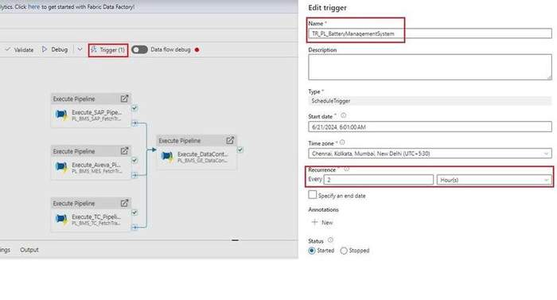

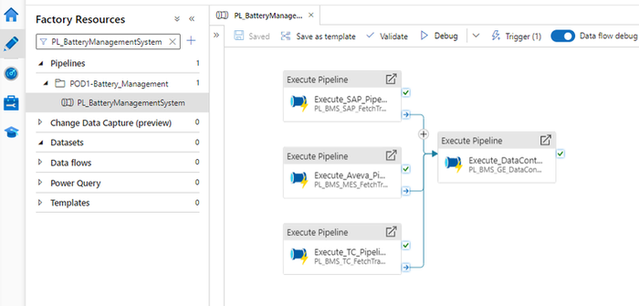

Each of these pipelines is described in detail in the sections that follow.

## 

## PL_BMS_TC_FetchTransformLoad_BOM

This pipeline efficiently orchestrates fetching, transforming, and loading BOM data from Teamcenter to PostgreSQL tables (bms.tc_bomheader, bms.tc_bomcomponent). It leverages a watermark table to ensure incremental data loads, fetching only new or updated data since the last run. The fetched data is stored as JSON in Azure Blob Storage and converted to CSV using an Azure Function. The pipeline then verifies the presence of the CSV files and performs necessary transformations, including removing nulls and duplicates, before upserting the data into PostgreSQL target tables. Finally, it updates the watermark and archives processed files, to ensure continuous and accurate BOM data synchronization between Teamcenter and PostgreSQL.

Each step in the pipeline is described in the sections that follow.

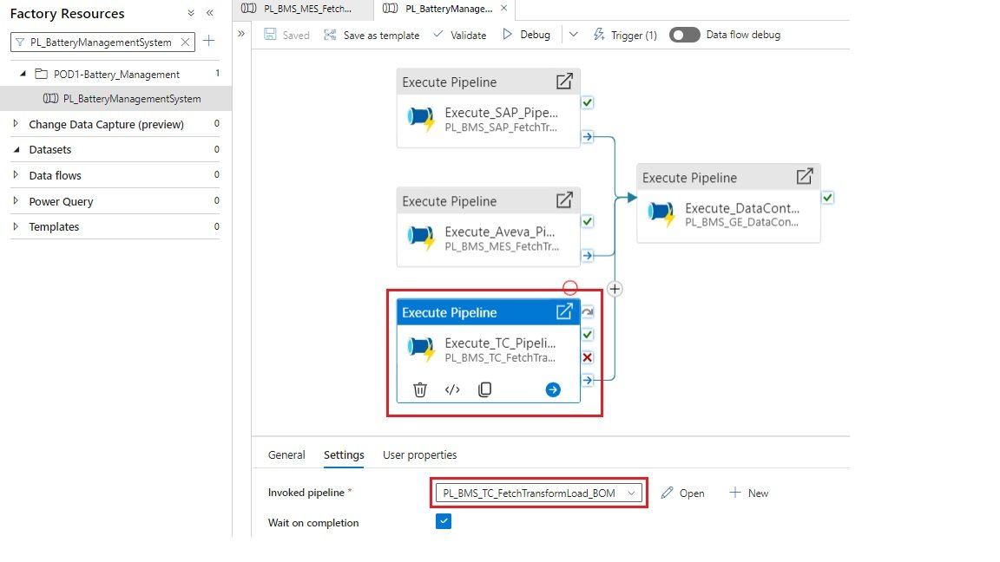

#### 

### Lookup Config File

This activity looks up a CSV file that lists the table names created in PostgreSQL for different services related to Teamcenter. The file, located in Azure Blob Storage at BatteryManagement/tc_files /tc_config.csv, serves as a configuration file that specifies the Teamcenter-related services from which data needs to be fetched.

Each row in the CSV file represents a service and its corresponding table name in the PostgreSQL database. This lookup is crucial as it guides the pipeline on which services/models to target and how to map the fetched data to the appropriate tables.

The content of the CSV file is as shown in the image on the right.:

  ---------------------------------------------------------------------------------------------------------------------------------------------------------------------------------------------------------------------------------------------------------------------------------------------------------------------------------------

#### Azure Function - Get Access Token

This activity initiates an Azure Function named UserAuthRopc to obtain an access token essential for authenticating requests sent to the Teamcenter (TC) system. The function operates through a linked service, with parameters passed using global parameters. The Python code within the function dynamically generates the access token required for authorization purposes, ensuring secure communication between the pipeline and TC.

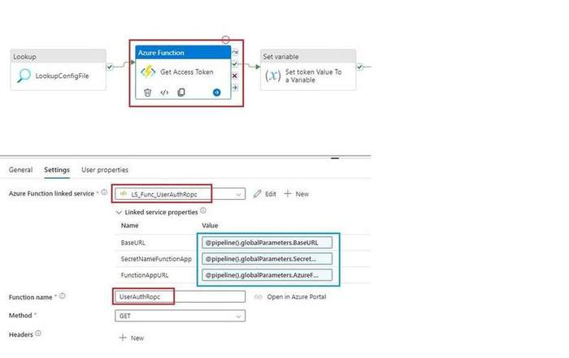

#### 

### Set Variable - Set Access Token Value

After acquiring the access token from the Azure Function, this activity stores its value in a variable named Access_token_value for subsequent use. This token, crucial for authenticating with Teamcenter (TC), ensures secure interactions between the pipeline and TC services.

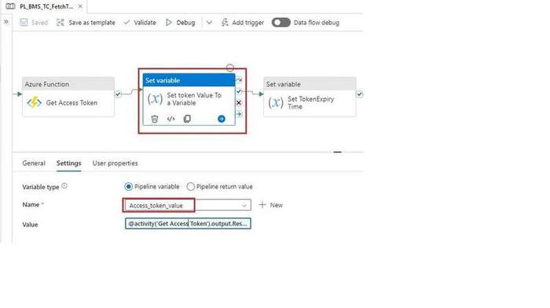

***Set Variable - Set TokenExpiry Time***

The Set Token Expiry Time variable stores the token\'s expiration time using the expression \'@addMinutes(utcNow(),55)\'. It calculates the time by adding 55 minutes to the current UTC time (\'utcNow()\'). Tokens typically expire after one hour, but 55 minutes is set to provide a 5-minute buffer. This variable is then used in subsequent pipeline activities to check token validity and ensure seamless execution by renewing the token if needed before it expires.

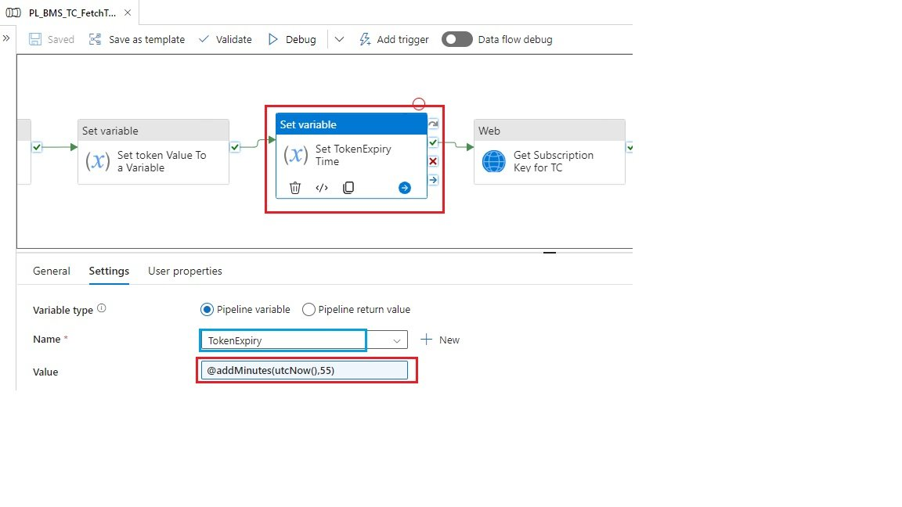

#### 

### Web - Get Subscription Key for TC

In this activity, the pipeline retrieves the subscription key associated with the Teamcenter product policies. The subscription key is essential for accessing Teamcenter services securely. The value for the subscription key is fetched from global parameters, where the secret name is used to retrieve the value from Azure Key Vault. This ensures that sensitive information such as keys and secrets are securely managed.

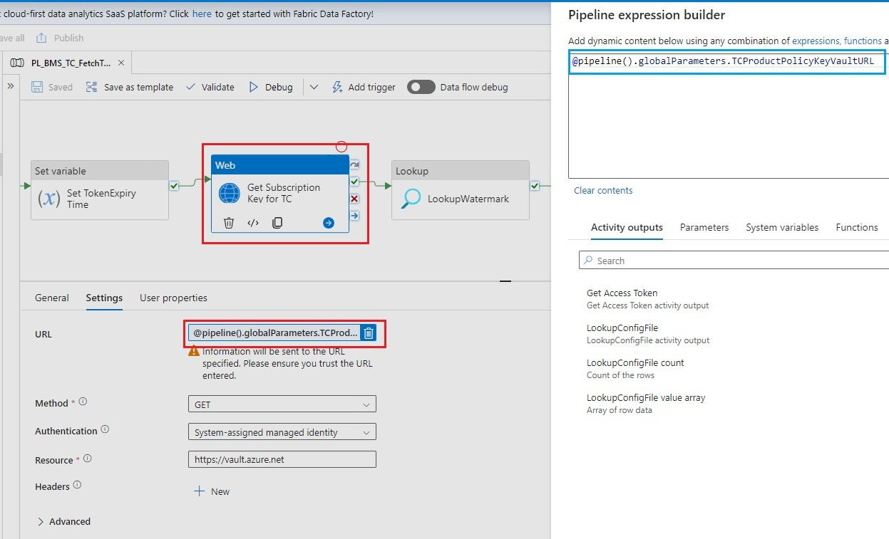

#### 

### Lookup - Lookup Watermark

This activity looks up the watermark, which typically tracks the last successful data extraction timestamp. The watermark ensures that only new or updated data is fetched from Teamcenter, avoiding duplication, and ensuring efficient data processing.

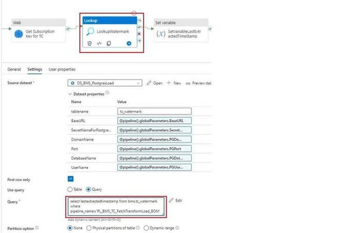

This activity involves querying a PostgreSQL table named bms.tc_watermark to retrieve the last extracted timestamp for the pipeline. This timestamp ensures that only new or updated data is fetched from the Teamcenter system.

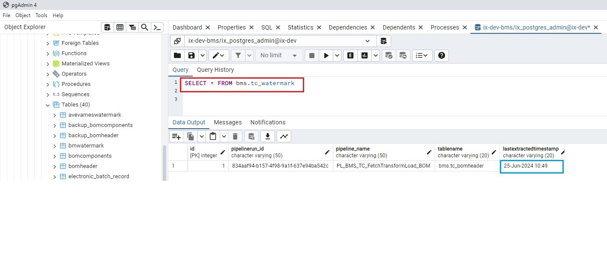

#### Set Variable - Set Last Extracted Timestamp

This activity sets the value of the variable lastextractedtimestamp.

**Variable Name:** \'lastextractedtimestamp\'

**Value:** The timestamp value retrieved from the watermark lookup query.

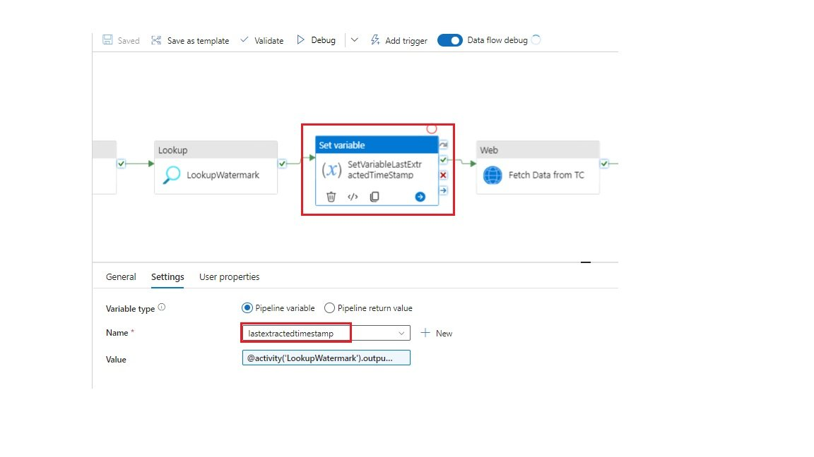

#### Web Activity- Get Total Number of Records

The Get Total Number of Records web activity retrieves the total record count from a paginated API. By using offset=1 and limit=1, it fetches only one record along with metadata that includes the total count. This count is used to calculate the number of pages for subsequent pagination. The activity uses necessary authentication headers and ensures efficient data retrieval without fetching unnecessary records.

URL: The URL is dynamically constructed using the following expression:

BMSTCRelativeURL: A global parameter containing the base URL for the Teamcenter API.

()

modifiedAfter: The lastextractedtimestamp to fetch data modified after this timestamp.

Headers**:** The web activity includes the following headers for the API request:

-   Authorization: The access token acquired from the Azure function (Get Access token)

-   Subscription-Key: The subscription key retrieved from the Web activity (Get Subscription Key for TC)

-   Transaction-ID: A unique transaction ID

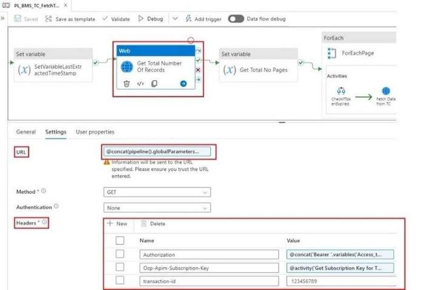

\@concat(pipeline().globalParameters.BMSTCRelativeURL, activity(\'LookupConfigFile\').output.value\[0\].Models,\'?modifiedAfter=\', variables(\'lastextractedtimestamp\'), \'&amp;offset=1&amp;limits=1\')\|

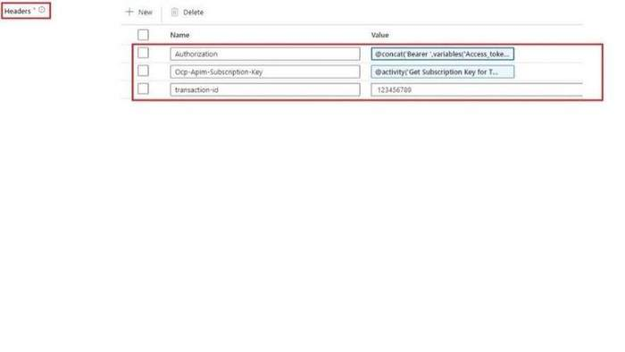

#### 

### Set Variable Activity- Get Total No of pages

The Set variable activity calculates the total number of pages required to fetch all records from a paginated API, based on the total record count and the page size.

Variable name: totalPages

Value: *The expression shown in the \'Value\' field example on the side*

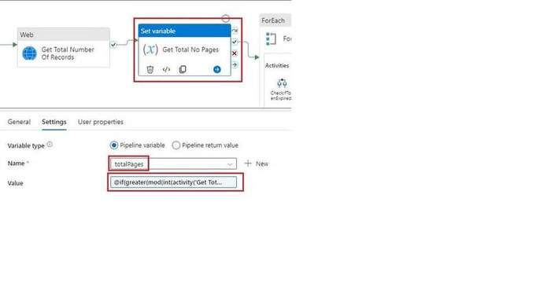

The expression dynamically divides the total records by 100 and adds an extra page if there are leftover records. This ensures the pipeline efficiently handles pagination without missing or over-fetching records, adapting seamlessly to varying record counts.

For example, if there are 250 records, the variable calculates 3 pages: 2 full pages and 1 additional for the remaining 50 records.

\@if(greater(mod(int(activity(\'Get Total Number Of Records\').output.totalRecords), 100), 0), add(div(int(activity(\'Get Total Number Of Records\').output.totalRecords), 100), 1), div(int(activity(\'Get Total Number Of Records\').output.totalRecords), 100))

#### 

### Foreach Activity- ForEachPage

The ForEach (ForEachPage) activity iterates through a range of values, representing each page of records to be processed sequentially.

The items for the ForEach loop are set using the expression \'@range(1, variables(\'totalPages\'))\'. This generates a range from 1 to the total number of pages stored in totalPages Variable.

This ensures that the pipeline processes each page one at a time, in order, without any parallel execution. By processing each page sequentially, the pipeline prevents any potential issues that could arise from simultaneous data retrieval and ensures that records are fetched and processed in the correct order.

For example, if totalPages = 3, the loop will iterate through pages 1, 2, and 3 one after the other, fetching and processing the records sequentially.

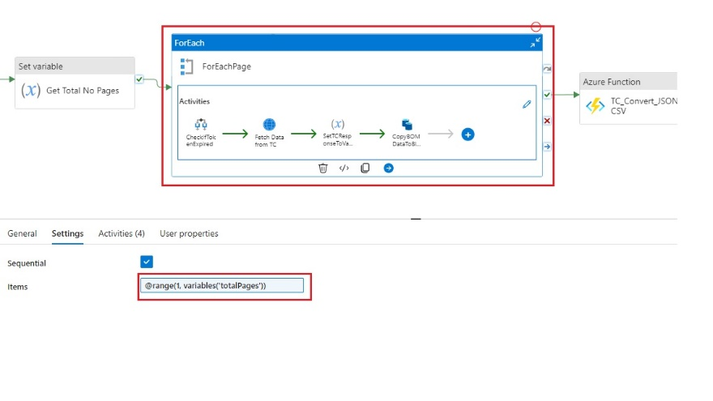

#### 

### If Condition - CheckIfTokenExpired

Inside the ForEach activity, the first operation is an If Condition activity, which checks if the token has expired. The expression \@greaterOrEquals(utcNow(), variables(\'TokenExpiry\')) compares the current UTC time (utcNow()) with the stored token expiry time (TokenExpiry).

If the current time is greater than or equal to the expiry time, it indicates that the token has expired, triggering the True branch.

-   True branch: In this branch, an Azure Function is called to get a new access token. The response from this function is then used to update the Access_token_value variable, storing the new token. Following this, the Set Updated Token Expiry Time activity updates the TokenExpiry variable by adding 55 minutes to the current UTC time (@addMinutes(utcNow(), 55)). This ensures that the token\'s expiry time is extended with a buffer.

-   False branch: If the token has not expired, no activities are executed in this branch, and the pipeline proceeds to the next operation without any changes to the token.

This structure ensures that the token is checked and renewed automatically when expires, maintaining continuous access to the required resources throughout the pipeline\'s execution.

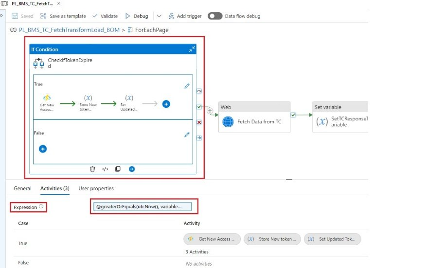

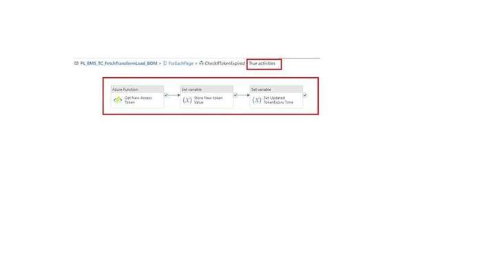

.

**Web Activity - Fetch Data from TC**

After the If Condition activity, the pipeline proceeds with a Web Activity that fetches data from Teamcenter (TC). The URL for this activity is dynamically constructed using the expression:

\@concat(pipeline().globalParameters.BMSTCRelativeURL, activity(\'LookupConfigFile\').output.value\[0\].Models, \'?modifiedAfter=\', variables(\'lastextractedtimestamp\'), \'&amp;offset=\', item(), \'&amp;limits=100\')

This URL concatenates several components:

-   The BMSTCRelativeURL parameter from the pipeline\'s global parameters, provides the base URL for the Teamcenter service. ()

-   The model type is fetched from the output of the LookupConfigFile activity.

-   The modifiedAfter query parameter uses the lastextractedtimestamp variable to fetch data modified after the last extraction.

-   The offset parameter uses item() to determine the page number (from the ForEach loop).

-   The limits=100 ensures that only 100 records are retrieved per request.

Headers: The web activity includes the following headers for the API request:

-   Authorization: The access token acquired from the Azure function (Get Access token)

-   Subscription-Key: The subscription key retrieved from the Web activity (Get Subscription Key for TC)

-   Transaction-ID: A unique transaction ID

This Web Activity enables efficient and secure fetching of data from Teamcenter, adhering to pagination logic (by using the offset and limits parameters) and ensuring that only relevant and updated data is retrieved for further processing.

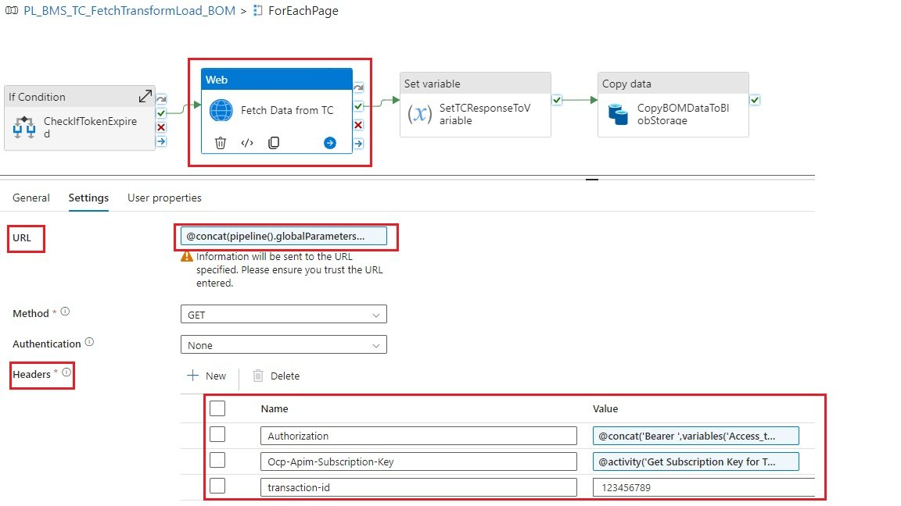

#### Set Variable - Set TC Response to Variable

After fetching data from Teamcenter, the Set Variable activity stores the response in a variable.

Variable name: TCResponseJson

Value: \@activity(\'Fetch Data from TC\').output.bomInstances

The above expression extracts the bomInstances field from the fetched data enabling the pipeline to store and use the retrieved Teamcenter data for further processing.

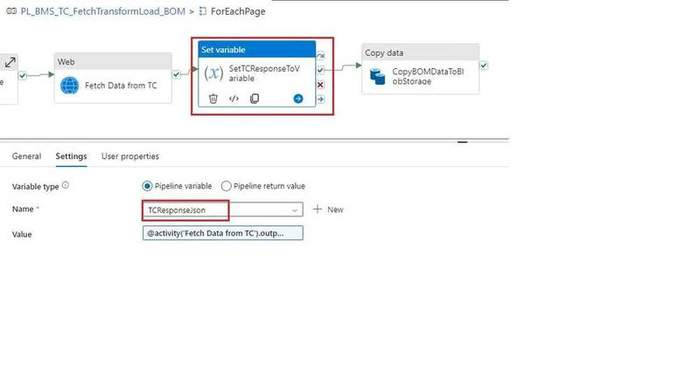

#### Copy Data- Copy BOM Data to Blob Storage

This activity is responsible for transferring the data fetched from Teamcenter to the designated Azure Blob Storage container(digitalthreadpod1). This ensures that the raw data is securely backed up before any transformations are applied.

The JSON response from the Web Activity (Fetch data from TC) is included as an additional column in the data to be copied. Necessary settings are applied to copy the complete response that the web(fetch data from TC) is providing.

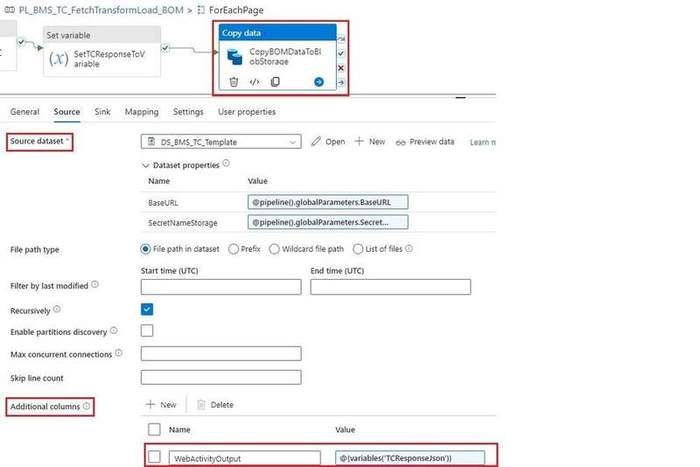

After the data is copied as per the sink dataset\'s specified path, the Json file can be viewed in the designated location of Azure blob storage as shown in the below screenshot.

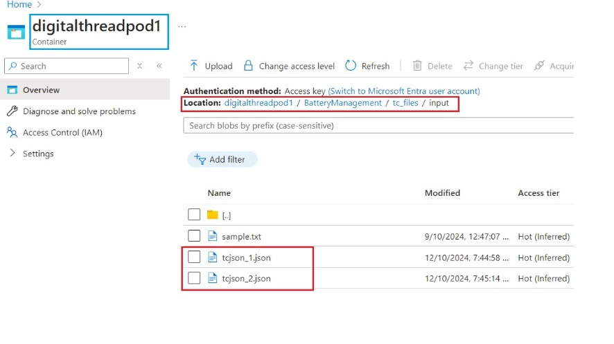

#### Azure Function - TC_Convert_JSONtoCSV

After the ForEach loop, the Azure Function - TC_Convert_JSONtoCSV activity initiates an Azure Function that uses a Python script to read all paginated JSON files from the specified blob storage location, combines them into a single CSV file, and writes the resulting CSV file back to blob storage. This conversion is necessary due to the complex structure of the JSON data, making it challenging to perform the required transformations directly. By converting the data into CSV format, the pipeline ensures that the data is structured correctly for efficient loading into PostgreSQL tables.

The function operates through a linked service, \'LS_Func_BatteryMgmt\', which ensures a secure connection to the Azure Function app. The parameters BaseURL, FunctionAppURL, and SecretNameFunctionApp are dynamically injected using global parameters, which ensures that sensitive information such as URLs and secret names are securely managed and easily configurable.

By utilizing this Azure Function, the pipeline ensures that data is transformed into a structured format suitable for loading into the PostgreSQL database, thereby facilitating efficient data processing and analysis. This activity also underscores the pipeline\'s capability to handle complex data transformations seamlessly within the Azure ecosystem.

**Function Details**

-   Function Name: batterymanagement_tcjson

-   Method: GET

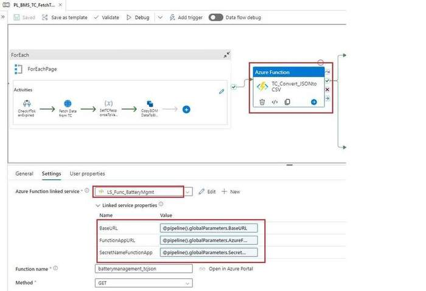

After the JSON data is transformed into CSV format by the Azure Function TC_Convert_JSONtoCSV, the resulting CSV files are saved to the blob storage location designated for this purpose. This ensures that the data is stored in an accessible and structured format, ready for further processing or analysis.

The converted CSV files can be viewed in the below path in blob storage.

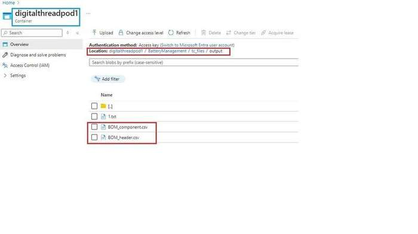

#### 

### Get Metadata - Get Metadata for BOM Header CSV

This activity retrieves the metadata for the BOM Header CSV file. This is crucial for verifying the existence of the files, as well as for extracting metadata such as the file size, last modified date, and more.

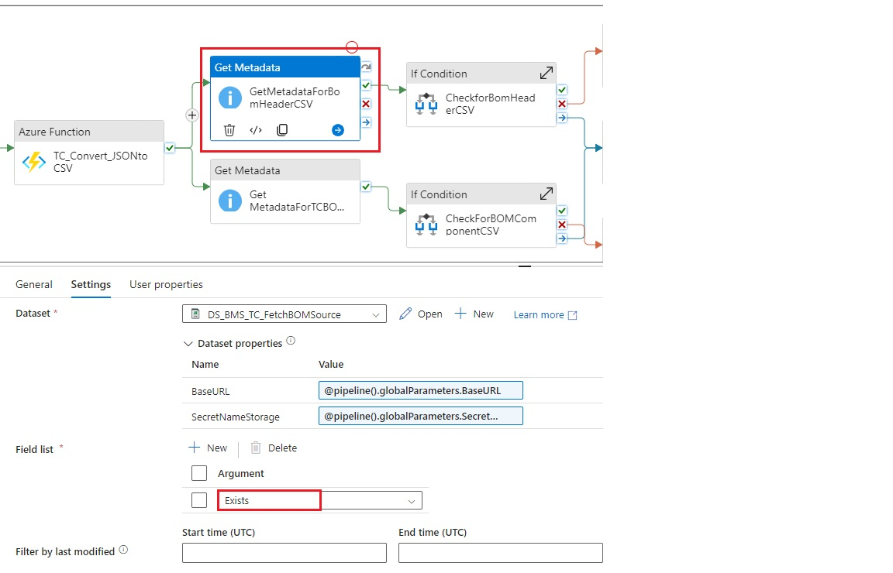

#### 

### If Condition - Check for BOM Header CSV

As shown right, a conditional check is performed to ensure that the BOM Header CSV file exists. If the file is present, the pipeline proceeds with the transformation of the BOM Header data; otherwise, it triggers a waiting step on not finding the BOMheader CSV file.

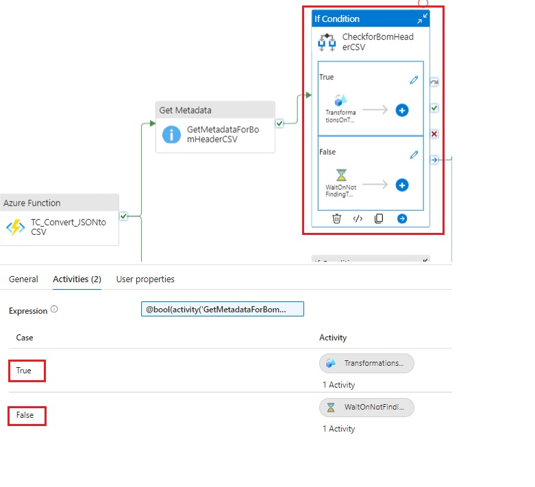

##### 

#### True Branch

As shown below, upon confirming the presence of the BOM Header CSV file in Azure Blob Storage, it enters the true branch where data transformations take place on the BomHeader data.

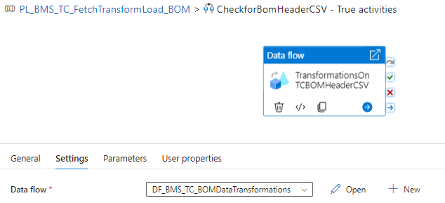

**BOM Header CSV Data Transformations**

-   The pipeline removes any null values on the primary key columns from the BOM Header CSV data to ensure data integrity.

-   Duplicate records are identified and removed to maintain unique entries in the BOM Header data.

-   The cleaned data is upserted (inserted or updated) into the PostgreSQL bomheader table. This ensures that the table is always updated with the latest data from Teamcenter.

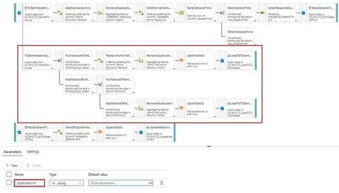

The data loaded into the PostgreSQL bms.tc_bomheader table after transforming within the Azure Data Factory data flow will be structured as shown below:

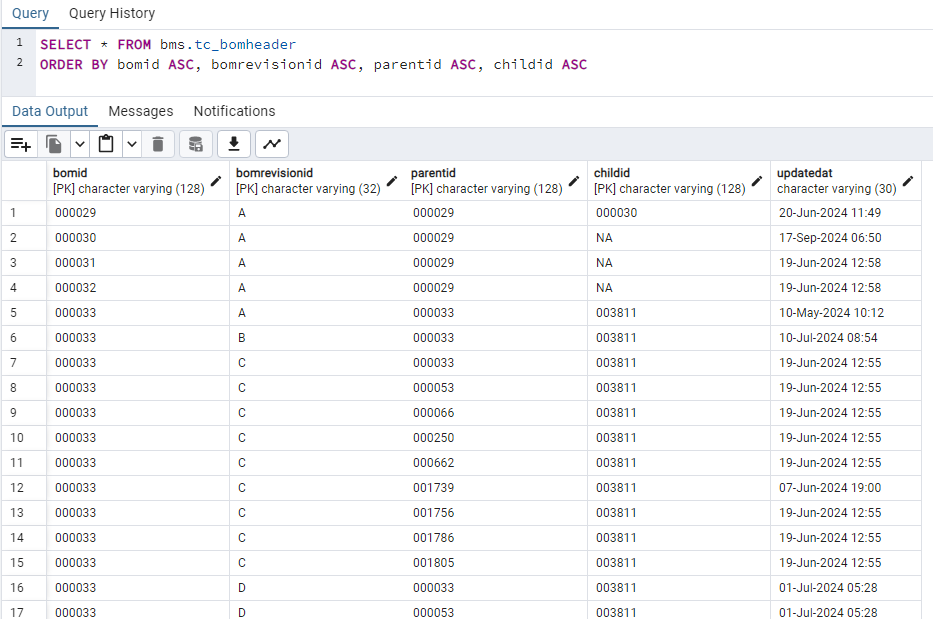

**Storing lastextractedtimestamp in a CSV file to update the watermark table**

Using the same BOM Header CSV as a source, additional columns are added to the file such as pipeline_name, table_name, and lastextractedtimestamp.

-   Pipeline Name: The name of the pipeline processing the data. (PL_BMS_TC_FetchTransformLoad_BOM)

-   Table Name: The target table in PostgreSQL (bms.bomheader)

-   Last Extracted Timestamp: The latest updated timestamp from the UpdatedAt column in the BOM Header CSV.

-   Ranking and Timestamp Extraction: For every run, the pipeline fetches the maximum date and time by ranking the \'UpdatedAt\' column to determine the lastextractedtimestamp. It then selects the required columns to be present in the destination file.

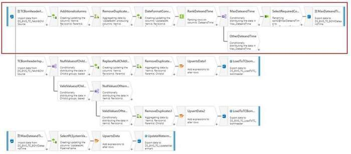

All these details are stored in a PL_FetchTransformLoad_BMS_TC_BOM.csv file in the blob storage which would be acting as a source for updating the watermark table in Postgres.

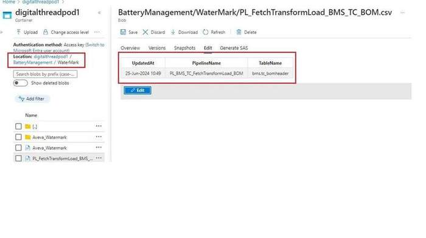

**Transformations to Update Watermark Table**

By taking PL_FetchTransformLoad_BMS_TC_BOM.csv as a source, it also captures the current pipelinerunID. The watermark (bms.tc_watermark) table is upserted based on the table name(bms.tc_bomheader), ensuring that the latest extracted timestamp is recorded for subsequent runs.

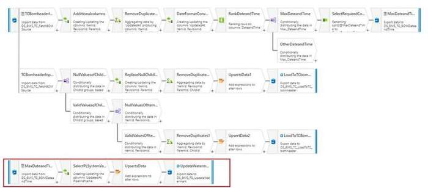

##### 

#### False Branch:

If the BOM Header CSV file is not found, the pipeline triggers a waiting step. This ensures that the pipeline does not proceed without the necessary input file, preventing potential errors and data inconsistencies.

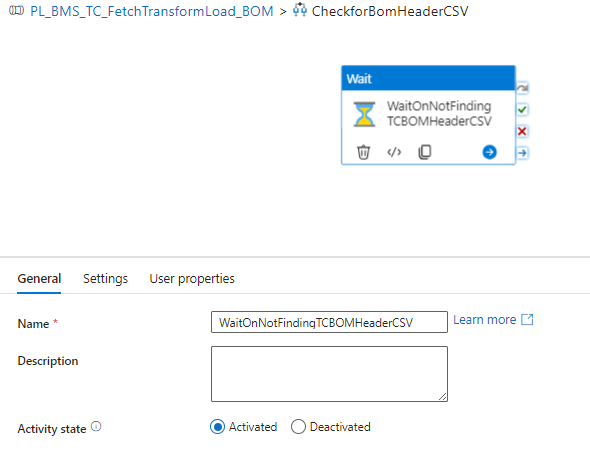

#### 

### Get Metadata (Get Metadata for TCBOMComponentCSV)

This activity retrieves the metadata for the BOM Component CSV file. This is crucial for verifying the existence of the files, as well as for extracting metadata such as the file size, last modified date, and more.

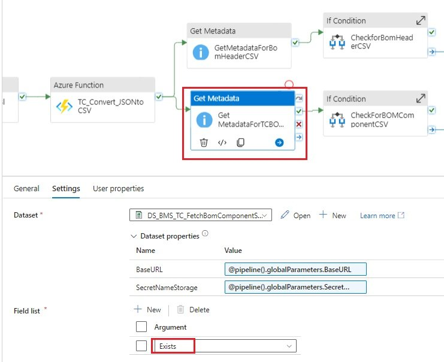

#### 

### If Condition - Check for BOM Component CSV

A conditional check ensures that the BOM Component CSV file exists. If the file is present, the pipeline proceeds with the activities present under the True branch, otherwise it executes the activities present under the False branch.

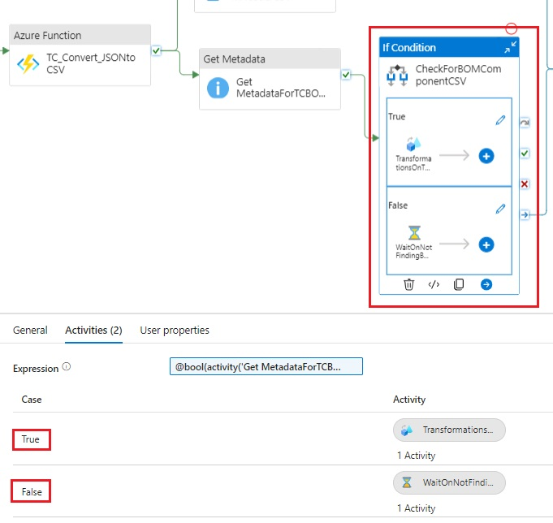

##### 

#### True Branch

If the BOM Component CSV file is found, the pipeline performs the Data transformations on BomComponent data.

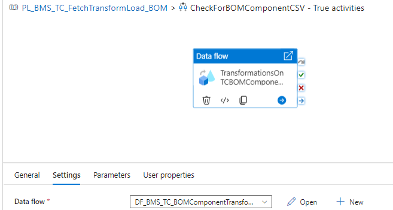

**BOM Component CSV Data Transformations**

-   Null values on primary key columns are removed from the BOM Component CSV data.

-   Duplicate records are identified and removed.

-   The cleaned data is upserted into the PostgreSQL bomcomponent table.

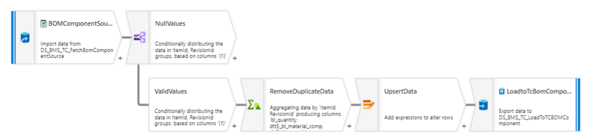

The data loaded into the PostgreSQL bms.tc_bomcomponent table after undergoing transformations within the Azure Data Factory data flow will be structured as shown below:

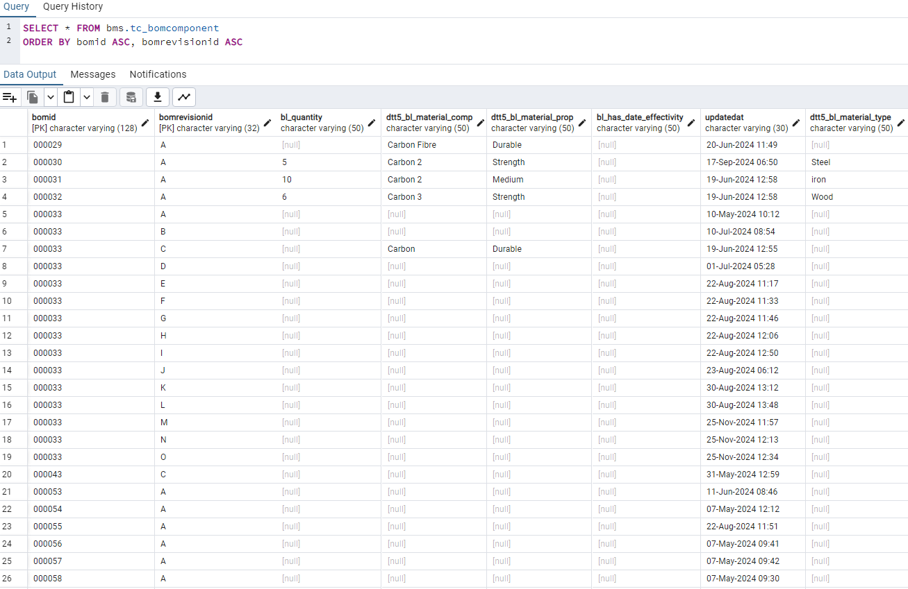

##### False Branch:

If the BOM Component CSV file is not found, the pipeline triggers a waiting step to handle the absence of the file.

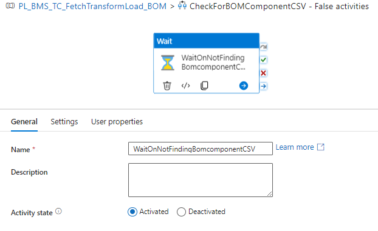

***Fail Activity***

After the If Condition activities that handle the transformation of the BOMHeaderCSV and BOMComponentCSV files, two separate Fail Activities (FailureOnBOMHeaderTransformations, FailureOnBOMComponentsTransformations) are implemented to capture transformation failures. If the transformations for any of the CSV files fail, the respective Fail Activity triggers a failure message.

These fail messages ensure that the pipeline properly handles and reports any errors encountered during the transformation process. This step provides clear visibility into the failure points, allowing for effective troubleshooting and resolution of issues related to the transformation activities.

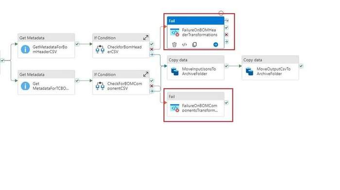

CopyData - CopyInputJSONsToArchiveUpon completing the execution of both conditional checks for the BOM Header and BOM Component CSV files, the pipeline moves to the final steps of post-processing and archiving files. The first post-processing action involves a Copy Data activity named \'CopyInputJSONsToArchive\'.

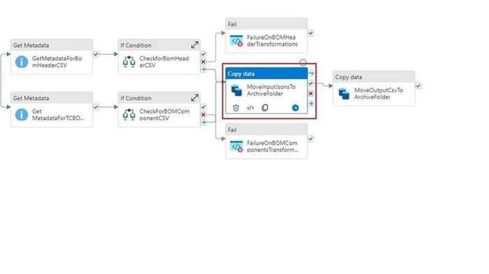

This activity sources the input JSON files located in the input folder of the blob storage and moves them to the archive folder within the same container as shown in the below picture. This ensures that the input folder is cleared of processed JSON files, maintaining a clean state for subsequent runs.

#### 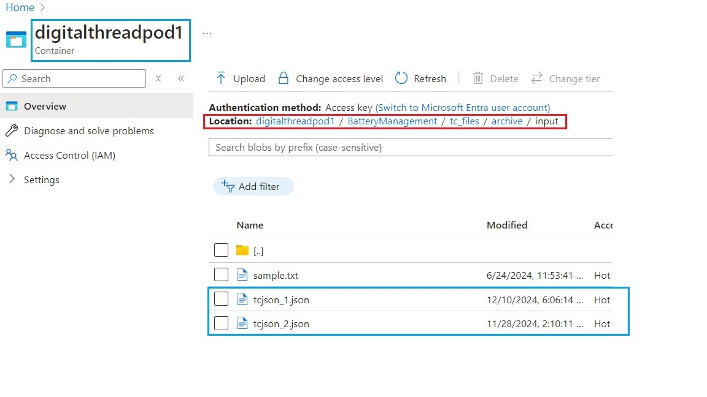
Copy Data - CopyOutputCSVstoArchive

Following the previous copy data activity, the pipeline executes another Copy Data activity named \'CopyOutputCSVstoArchive.\'

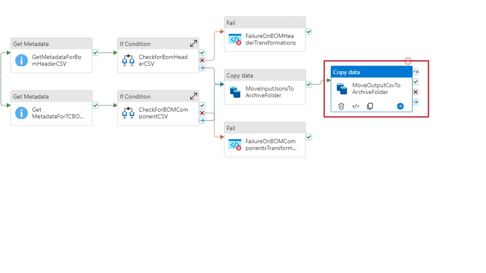

This activity targets the output CSV files generated after converting JSON files to CSV using the Azure Function. These CSV files are moved from the output folder to the archive folder, ensuring that only fresh files are present in the output folder for each run.

These steps serve to organize the blob storage by segregating processed files from fresh ones, maintaining data accuracy, and preventing the re-processing of old files. By archiving both the input JSONs and the output CSVs, the pipeline ensures that each run starts with a fresh set of input files, thereby upholding data integrity and consistency. This structured approach facilitates efficient data processing and simplifies the management and tracing of data flow within the pipeline.

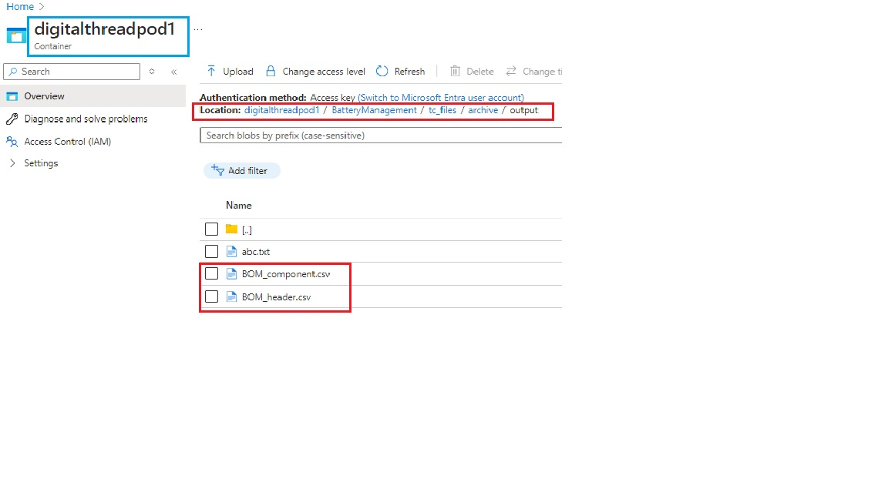

### 

## PL_BMS_MES_FetchTransformLoad_AvevaData

The PL_BMS_MES_FetchTransformLoad_AvevaData pipeline is designed to streamline the process of fetching, transforming, and loading data from multiple Aveva MES services into PostgreSQL tables. It utilizes a watermark table to perform incremental data loads, fetching only new or updated data since the last run. The fetched data is stored as JSON in Azure Blob Storage and converted to CSV using an Azure Function. After verifying the existence of these CSV files, the pipeline conducts necessary transformations, such as removing nulls and duplicates, before upserting the cleaned data into PostgreSQL target tables. Finally, it updates the watermark and archives the processed files, maintaining consistent and accurate data synchronization between Aveva MES and PostgreSQL.

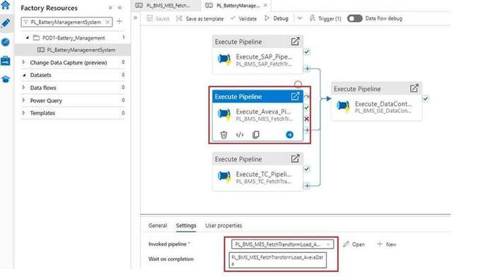

#### Lookup - FetchTableNames

This activity looks up a CSV file that lists the table names created in PostgreSQL for different services related to Aveva MES. The file, located in Azure Blob Storage at BatteryManagement/Aveva/TableNamesConfiguration.csv, serves as a configuration file that specifies the various Aveva services from which data needs to be fetched.

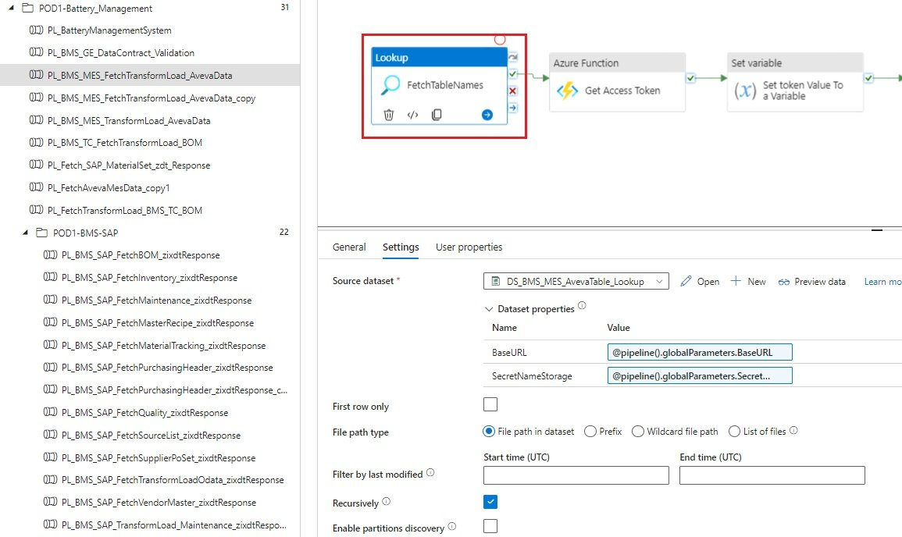

Each row in the CSV file represents a service and its corresponding table name in the PostgreSQL database. This lookup is crucial as it guides the pipeline on which services to target and how to map the fetched data to the appropriate tables.

The content of the CSV file is as follows:

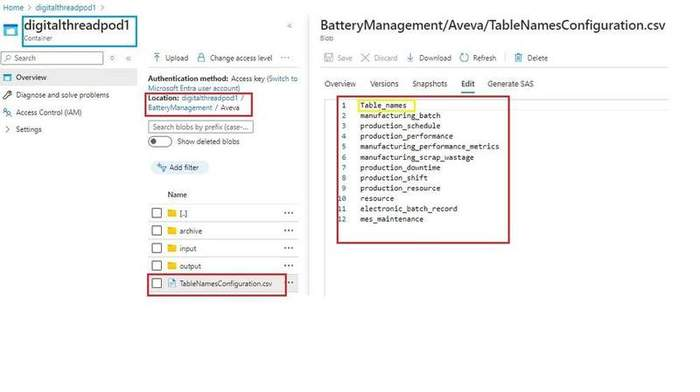

#### 

### Azure Function - Get Access Token

This activity initiates an Azure Function named UserAuthRopc to obtain an access token essential for authenticating requests sent to Aveva MES. The function operates through a linked service, with parameters passed using global parameters. The Python code within the function dynamically generates the access token required for authorization purposes, ensuring secure communication between the pipeline and Aveva MES. This token is necessary for all subsequent requests to the Aveva MES services, allowing the pipeline to fetch the required data securely.

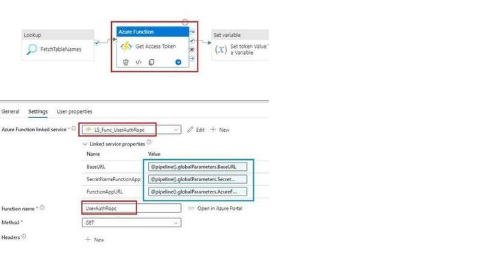

#### 

### Set Variable (Set Access Token Value)

After acquiring the access token from the Azure Function, this activity stores its value in a variable named Access_token_value for subsequent use. This token, crucial for authenticating with Aveva MES, ensures secure interactions between the pipeline and Aveva MES services. By storing the token in a variable, the pipeline can easily reference it in subsequent activities that require authentication.

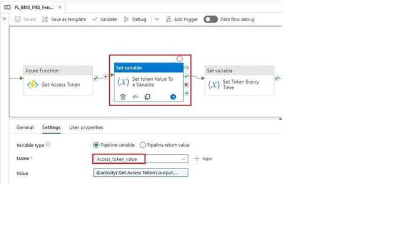

#### 

### Set Variable - Set TokenExpiry Time

The Set Token Expiry Time variable stores the token\'s expiration time using the expression \'@addMinutes(utcNow(),55)\'.

It calculates the time by adding 55 minutes to the current UTC time (\'utcNow()\'). Tokens typically expire after one hour, but 55 minutes is set to provide a 5-minute buffer. This variable is then used in subsequent pipeline activities to check token validity and ensure seamless execution by renewing the token if needed before it expires.

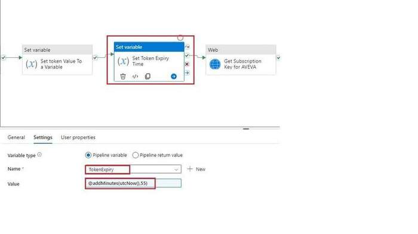

#### 

### Web - Get Subscription Key for Aveva MES

In this activity, the pipeline retrieves the subscription key associated with the Aveva MES services. The subscription key is essential for accessing Aveva MES services securely. The value for the subscription key is fetched from global parameters, where the secret name is used to retrieve the value from Azure Key Vault. This ensures that sensitive information such as keys and secrets are securely managed.

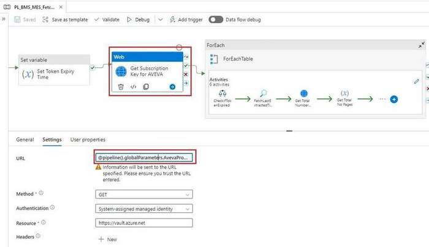

#### 

### ForEach - ForEachTable

The ForEach activity iterates over each table name fetched from the CSV file in the initial Lookup activity. For each table, the following steps are performed:

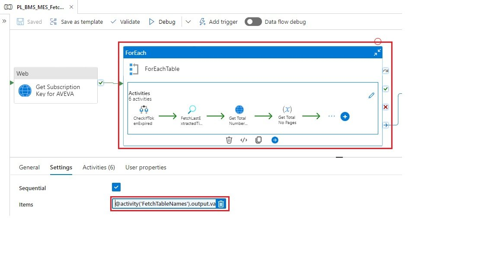

#### 

### If Condition - CheckIfTokenExpired

Inside the ForEachTable activity, the first operation is an If Condition activity, which checks if the token has expired. The expression \@greaterOrEquals(utcNow(), variables(\'TokenExpiry\')) compares the current UTC time (utcNow()) with the stored token expiry time (TokenExpiry).

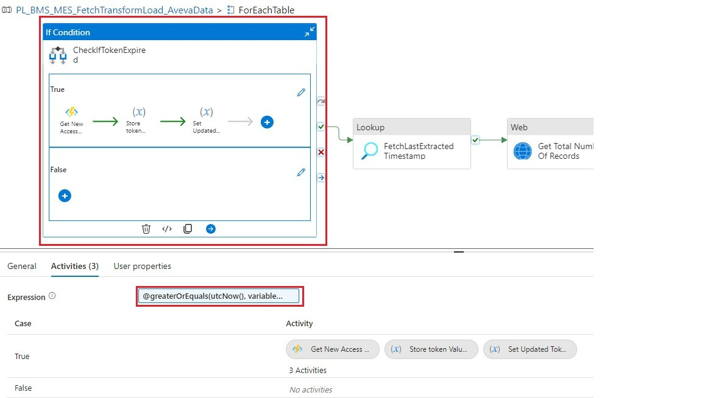

If the current time is greater than or equal to the expiry time, it indicates that the token has expired, triggering the True branch.

-   **True branch:** In this branch, an Azure Function is called to get a new access token. The response from this function is then used to update the Access_token_value variable, storing the new token. Following this, the Set Updated Token Expiry Time activity updates the TokenExpiry variable by adding 55 minutes to the current UTC time (@addMinutes(utcNow(), 55)). This ensures that the token\'s expiry time is extended with a buffer.

-   **False branch:** If the token has not expired, no activities are executed in this branch, and the pipeline proceeds to the next operation without any changes to the token.

This structure ensures that the token is checked and renewed automatically when expires, maintaining continuous access to the required resources throughout the pipeline\'s execution.

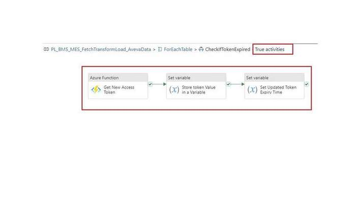

##### Lookup - FetchLastExtractedTimestamp

This activity queries the PostgreSQL database to fetch the last extracted timestamp for the current table. This timestamp is used to ensure that only new or updated data is fetched from the Aveva MES system, avoiding duplication and ensuring efficient data processing.

The query used in this lookup activity is:

> *\@concat(\'SELECT lastextractedtimestamp FROM bms.avevameswatermark WHERE tablename = \'\'\',item().Table_names, \'\'\'\')*

The watermark table, bms.avevameswatermark, tracks the last successful data extraction timestamp for each table. By using this timestamp, the pipeline ensures efficient data retrieval and processing. Below is a screenshot of the avevameswatermark table present in PostgreSQL.

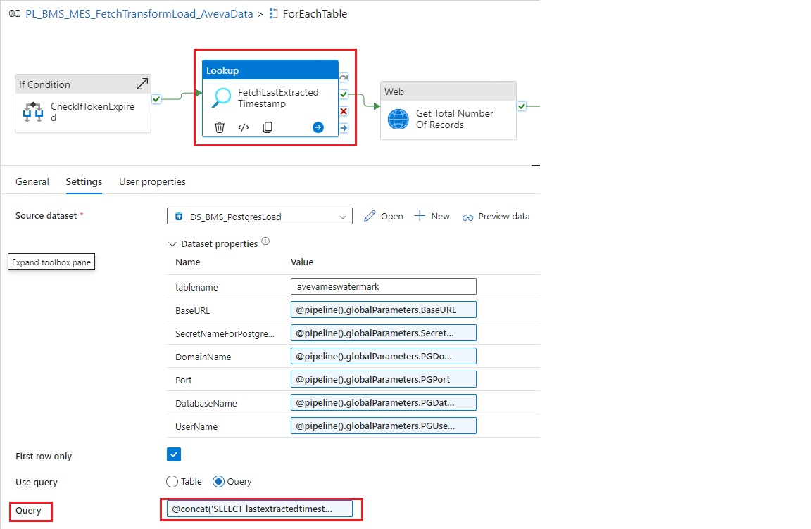

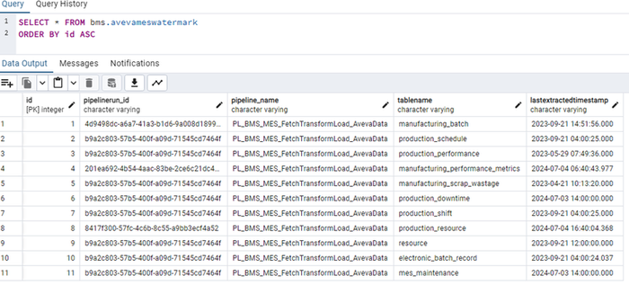

#### Web Activity- Get Total number of Records

The Get Total Number of Records web activity retrieves the total record count from a paginated API. By using offset=1 and limit=1, it fetches only one record along with metadata that includes the total count. This count is used to calculate the number of pages for subsequent pagination. The activity uses necessary authentication headers and ensures efficient data retrieval without fetching unnecessary records.

**URL**: The URL is dynamically constructed using the following expression:

RelativeURLAveva: A global parameter containing the base URL for the Aveva MES API.

(? )

**Source**: The current table name from the ForEach activity

modified_after: The last extracted timestamp fetched from the FetchLastExtractedTimestamp activity

offset: A pipeline parameter used for pagination

limits: A pipeline parameter used for pagination

**Headers:** This activity uses the following headers for fetching data

-   Authorization: The access token acquired from the Azure function (Get Access token)

-   Ocp-Apim-Subscription-Key: The subscription key retrieved from the Web activity (Get Subscription Key for Aveva)

-   Transaction-ID: A unique transaction ID

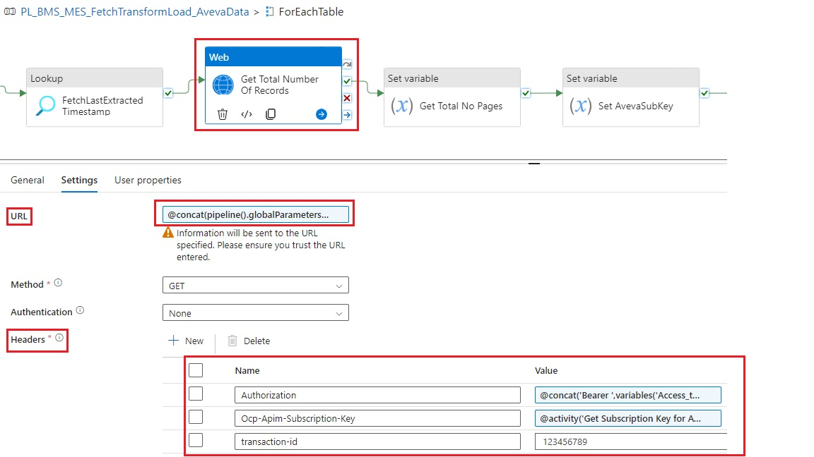

\@concat(pipeline() .globalParameters. RelativeURLAveva,\'source=\',item() . Table_names,\'&amp;modified_after=\',activity(\'FetchLastExtractedTimestamp\' ).output.firstRow.lastextractedtimestamp,\'&amp;offset=1&amp;limits=1\')

#### Set Variable- Get Total No of Pages

The Set variable activity calculates the total number of pages required to fetch all records from a paginated API, based on the total record count and the page size.

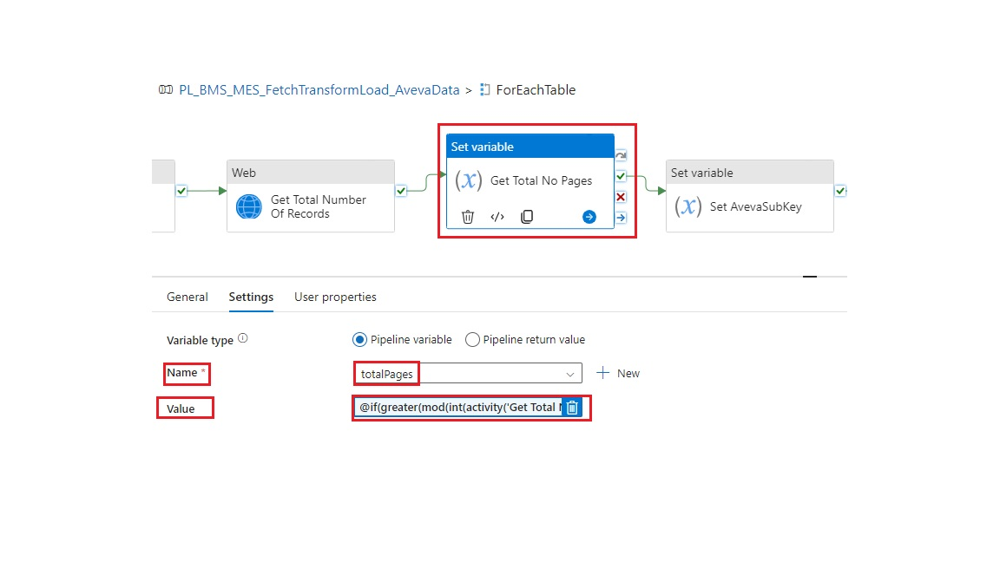

**Variable name**: totalPages

**Value:** Value is shown in the alongside image.

The above expression dynamically divides the total records by 500 and adds an extra page if there are leftover records. This ensures the pipeline efficiently handles pagination without missing or over-fetching records, adapting seamlessly to varying record counts.

For example, if there are 1200 records, the variable calculates 3 pages: 2 full pages and 1 additional for the remaining 200 records.

\@if(greater(mod(int(activity(\'Get Total Number Of Records\').output.totalRecords), 500), 0), add(div(int(activity(\'Get Total Number Of Records\').output.totalRecords), 500), 1), div(int(activity(\'Get Total Number Of Records\').output.totalRecords), 500))

#### Set Variable - SetAvevaSubscriptionKey

After retrieving the subscription key for Aveva MES, this activity stores its value in a variable named Aveva_Subscription_Key. This key is crucial for authenticating with Aveva MES services and ensures secure interactions between the pipeline and Aveva MES.

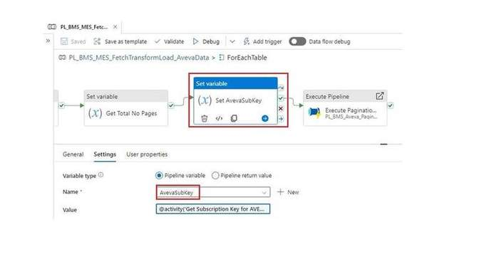

#### 

### Execute Pipeline - PL_BMS_Aveva_Pagination

This activity triggers the PL_BMS_Aveva_Pagination pipeline to handle pagination for each service or table identified from the Lookup activity. Key parameters such as LastExtractedTimestamp, totalNoOfPages, TableName, AccessTokenValue, AvevaSubsKey, and TokenExpiry are dynamically passed to ensure seamless data fetching.

By enabling Wait on Completion, the parent pipeline ensures that the pagination process finishes for the current service before proceeding to the next.

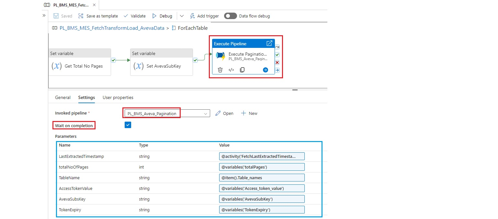

#### Inside Execute Pipeline - PL_BMS_Aveva_Pagination

##### 

#### Set Variable- AccessTokenValueFromParentPipeline

This activity initializes the Access_token_value variable by retrieving the value passed from the parent pipeline as a parameter. This ensures that the pipeline has the necessary token for authentication while interacting with Aveva MES.

Name: Access_token_value

Value: \@pipeline().parameters.AccessTokenValue

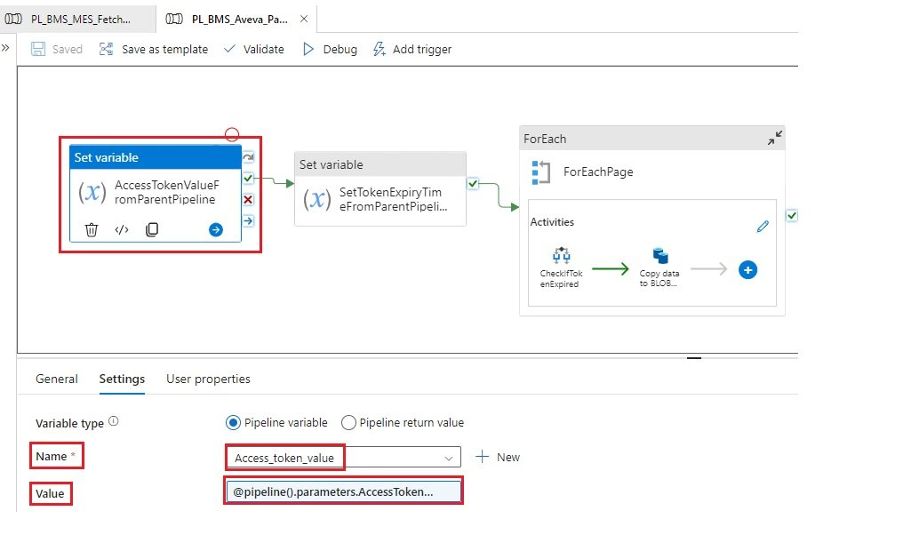

##### 

#### Set Variable - SetTokenExpiryTimeFromParentPipeline

This activity sets the TokenExpiry variable to the value passed from the parent pipeline. This timestamp is crucial for determining when the current token will expire and whether a new one needs to be generated during execution.

Name: TokenExpiry

Value: \@pipeline().parameters.TokenExpiry

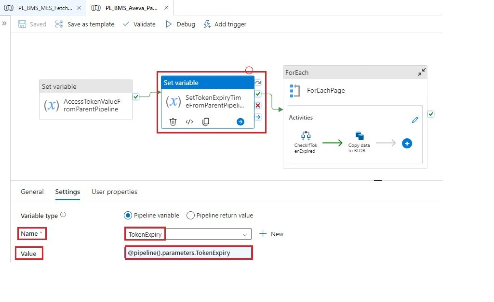

##### 

#### ForEach activity - ForeachPage

This activity iterates through the paginated data using the specified range of pages. The Items property dynamically calculates the total number of pages using the parent pipeline\'s parameter (totalNoOfPages). Sequential execution is enabled to ensure each page is processed one after another.

Items: \@range(1, pipeline().parameters.totalNoOfPages)

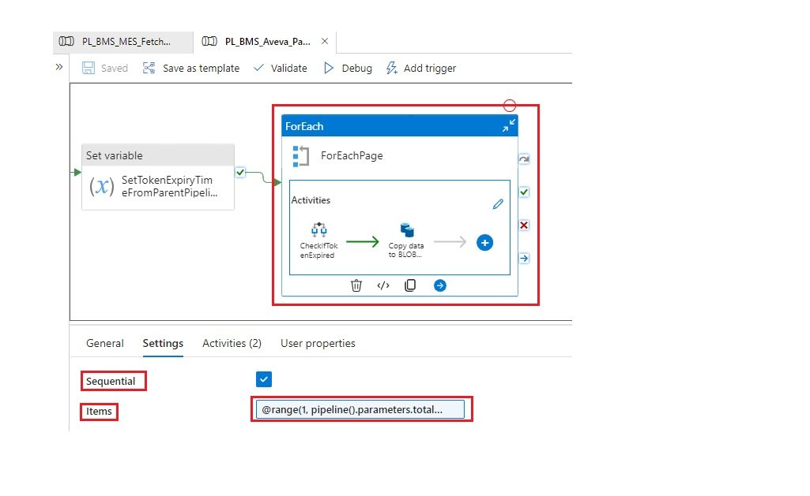

##### 

#### If Condition - CheckIfTokenExpired

Inside the ForEachPage activity, the first operation is an If Condition activity, which checks if the token has expired. The expression \@greaterOrEquals(utcNow(), variables(\'TokenExpiry\')) compares the current UTC time (utcNow()) with the stored token expiry time (TokenExpiry).

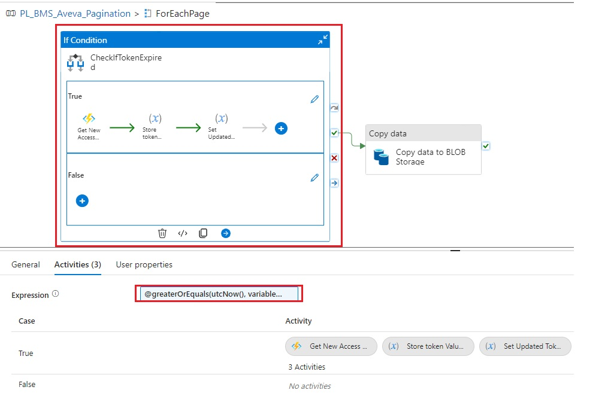

If the current time is greater than or equal to the expiry time, it indicates that the token has expired, triggering the True branch.

-   True branch:

    -   Get New Access Token: This activity fetches a new access token to ensure uninterrupted authentication.

    -   Set Variable - Access_token_value: Updates the Access_token_value variable with the newly acquired token for subsequent requests.

    -   Set Variable - TokenExpiry: Updates the TokenExpiry variable with a new expiry time calculated as 55 minutes from the current time using the expression \@addMinutes(utcNow(), 55).

-   False branch: No actions are performed when the token is still valid.

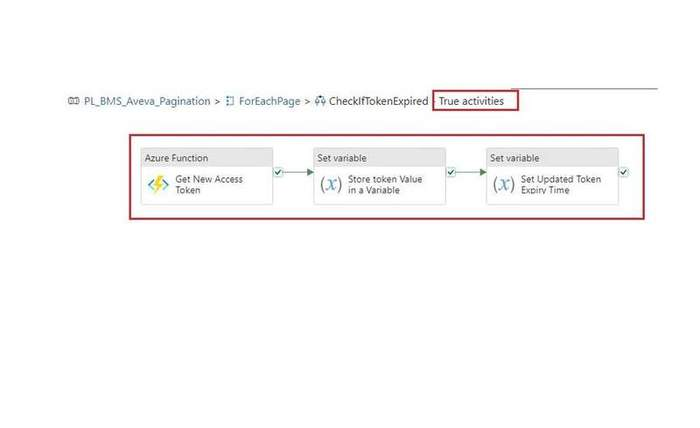

**Copy Data - Copy data to blob storage**

This activity utilizes the acquired access token and subscription key as headers, crucial for authentication and authorization, to initiate a web request for fetching the desired data from Aveva MES. The input parameters necessary for data retrieval are combined into a URL using an expression. This allows for specific data retrieval based on the provided parameters.

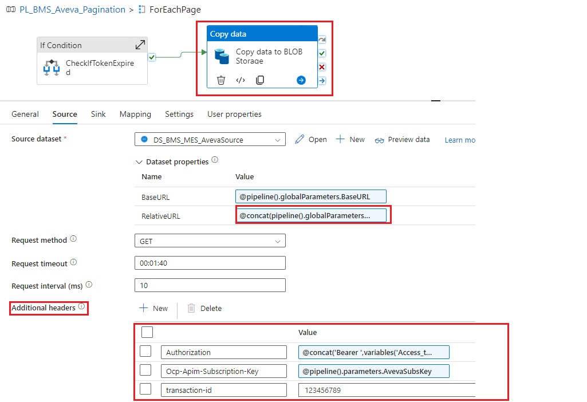

**URL:** The URL is dynamically generated to enable paginated responses and retrieve specific data based on input parameters. The construction expression is as follows:

\@concat(pipeline().globalParameters.RelativeURLAveva,\'source=\',pipeline().parameters.TableName,\'&amp;modified_after=\',pipeline().parameters.LastExtractedTimestamp,\'&amp;offset=\',item(),\'&amp;limits=500\')

Key Components of URL

RelativeURLAveva: A global parameter containing the base URL for the Aveva MES API.

(? )

source: Specifies the current table name being processed. The table name is dynamically passed from the ForEach activity in the parent pipeline.

Example: source= resource

modified_after: A filter parameter to retrieve data modified after a specific timestamp. This value is fetched from the FetchLastExtractedTimestamp activity in the parent pipeline. Example: modified_after= 2023-09-21 12:00:56.000

offset: Specifies the starting point for pagination. The offset value is dynamically set based on the current iteration of the ForEach activity, allowing the API to return a specific page of results. Ex: offset=2

limits: Sets the maximum number of records fetched per request. Here, the limit is fixed at 500 records, optimizing API performance and ensuring manageable payload sizes.

Example URL:  12:00:56.000&amp;offset=2&amp;limits=500

**Headers**: This activity uses the following headers for fetching data

-   Authorization: The access token acquired from the Azure function (Get Access token)

-   Ocp-Apim-Subscription-Key: The subscription key retrieved from the Web activity (Get Subscription Key for Aveva)

-   Transaction-ID: A unique transaction ID

The fetched data, in JSON format, is copied to the designated Azure Blob Storage container. This ensures that the raw data is securely backed up before any transformations are applied.

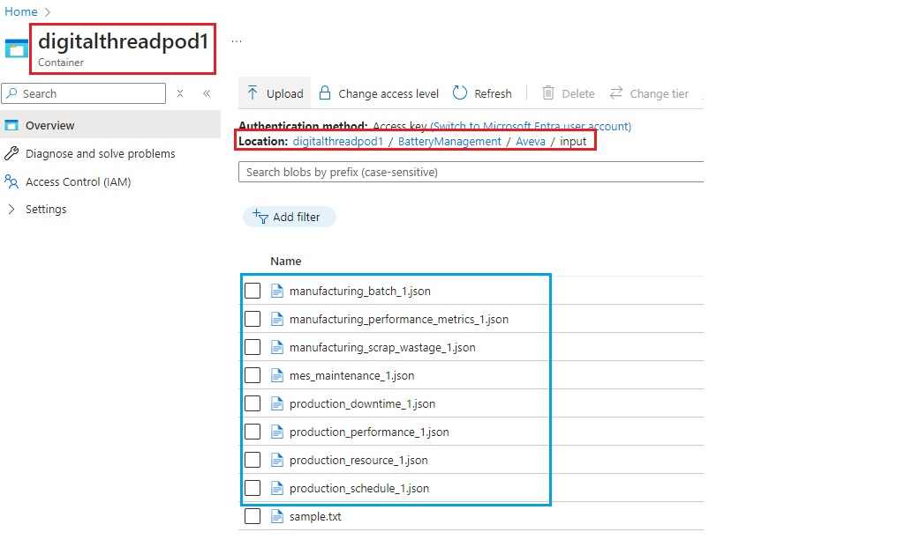

##### 

#### WaitOnCompletion

This activity ensures that the data fetching operation from Aveva MES is completed before proceeding to the next steps. It acts as a synchronization point in the pipeline, making sure all preceding operations are finished.

By introducing this wait step, the pipeline ensures that the fetched data is fully written to the Blob Storage before any subsequent processing or transformation activities commence. This helps maintain data integrity and consistency throughout the pipeline execution.

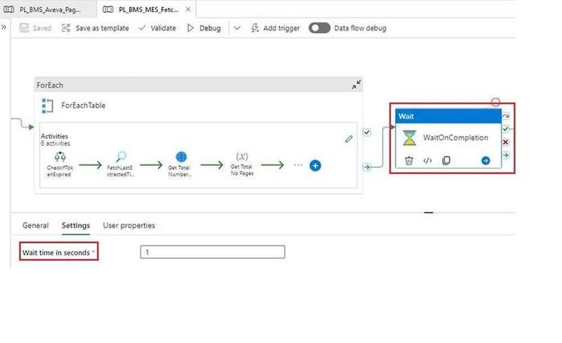

##### 

#### Azure Function - Convert JSON to CSV

This activity invokes an Azure Function to convert JSON data fetched from Aveva MES into CSV format. For each service, the function reads all paginated JSON files from Blob Storage, merges them into a single consolidated file, and writes the resulting CSV back to Blob Storage.

This merging process ensures that all related JSON data for a specific service is consolidated into one file, simplifying downstream processing. The CSV format is essential for structured data handling, making it ready for further transformations and loading into PostgreSQL tables.

The function operates through a linked service, \'LS_Func_BatteryMgmt\', which ensures a secure connection to the Azure Function app. The parameters BaseURL, FunctionAppURL, and SecretNameFunctionApp are dynamically injected using global parameters, which ensures that sensitive information such as URLs and secret names are securely managed and easily configurable.

The converted CSV files are viewable in the blob storage at the path indicated in the right image.

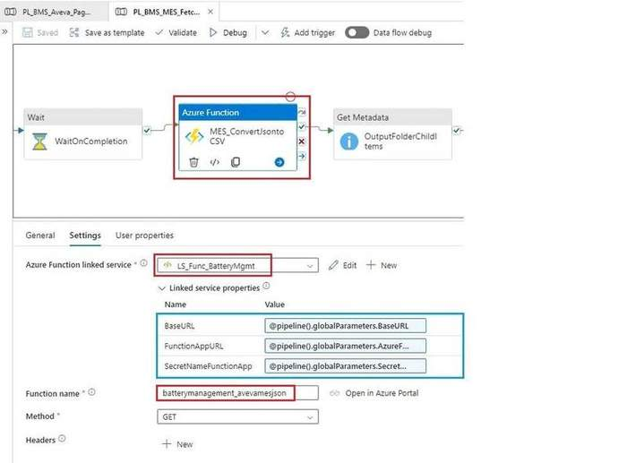

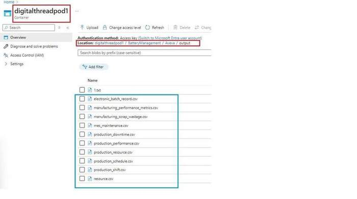

##### 

#### Get Metadata- OutputFolderChildItems

This activity retrieves the list of files from the specified directory in Azure Blob Storage. The required path is defined in the dataset as digitalthreadpod1/BatteryManagement/Aveva/output. The Field List is set to Child Items, which returns metadata about the files present in the directory. This metadata is then used to identify the available files for further processing in subsequent activities.

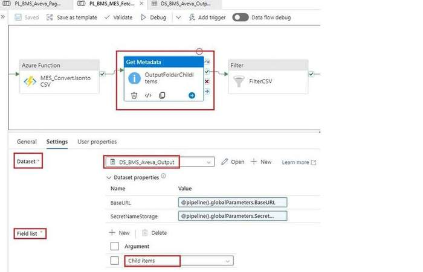

##### 

#### Filter activity- Filter CSV

This activity filters the list of files retrieved from the previous Get Metadata activity to select only the files with a .csv extension. It uses the expression \@endswith(item().name, \'.csv\') to ensure that only CSV files are included for further processing. This step ensures that only CSV files are passed along to the next stages of the pipeline.

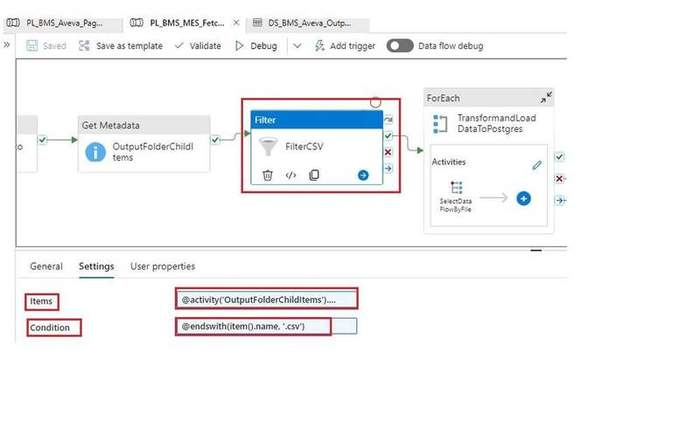

##### 

#### ForEach Activity- TransformandLoadDataToPostgres

The ForEach activity iterates over the filtered CSV files provided by the Filter CSV Files activity. The Items property is set to \@activity(\'FilterCSV\').output.Value, which holds the list of CSV files. Parallel execution is enabled with a Batch Count of 15, meaning up to 15 files will be processed concurrently. This activity applies the appropriate transformations and loading steps to each CSV file based on the logic defined in the subsequent Switch activity.

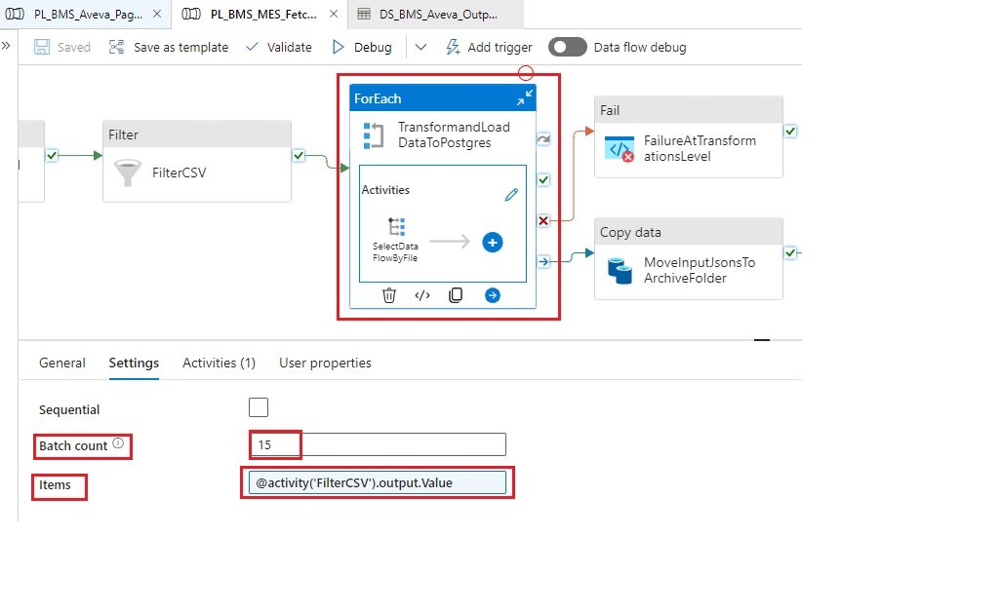

##### 

#### Switch Activity (SelectDataFlowByFile)

Inside the ForEach activity, the Switch activity is used to determine the appropriate data transformation flow based on the CSV filename. The expression \@split(item().name, \'.csv\')\[0\] extracts the service name from the filename (e.g., production_downtime from production_downtime.csv).

Each case in the Switch activity corresponds to a specific service, such as production_downtime, and triggers the associated data flow for that service. These data flows handle transformations based on the service identified from the filename.

While the detailed steps for one service\'s transformations will be explained in the subsequent sections, other services follow a similar approach.

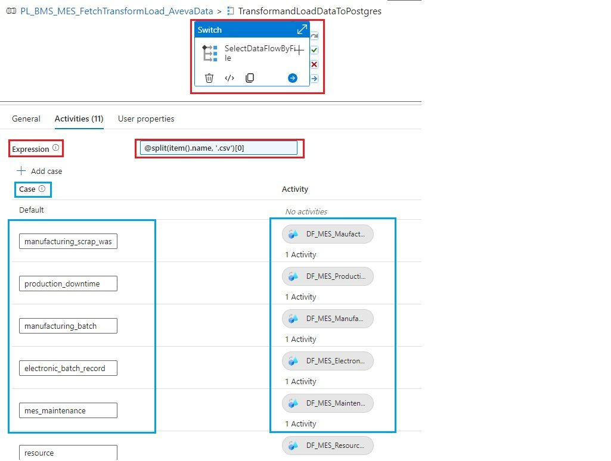

##### Production_downtime Service\'s transformations:

Transformations are performed to ensure data integrity and consistency before loading it into the respective PostgreSQL tables. These transformations include:

-   Ensuring that data quality is maintained by removing any null values and duplicates.

-   Inserting new records and updating existing ones in the PostgreSQL table.

-   The cleaned and transformed data is then loaded into the PostgreSQL table designated for the service.

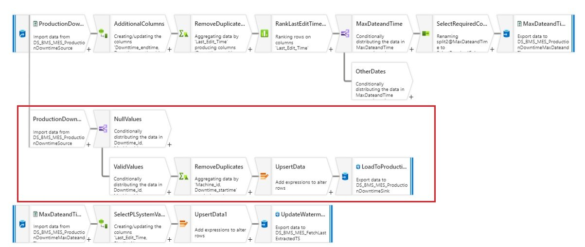

In this example, If the ProductionDowntime.csv file exists, data transformations would be performed on the same including removing nulls, removing duplicates, and inserting data into the bms.avevames_production_downtime table in PostgreSQL.

PostgreSQL allows the viewing of the loaded data into the bms.production_donwtime table as shown below:

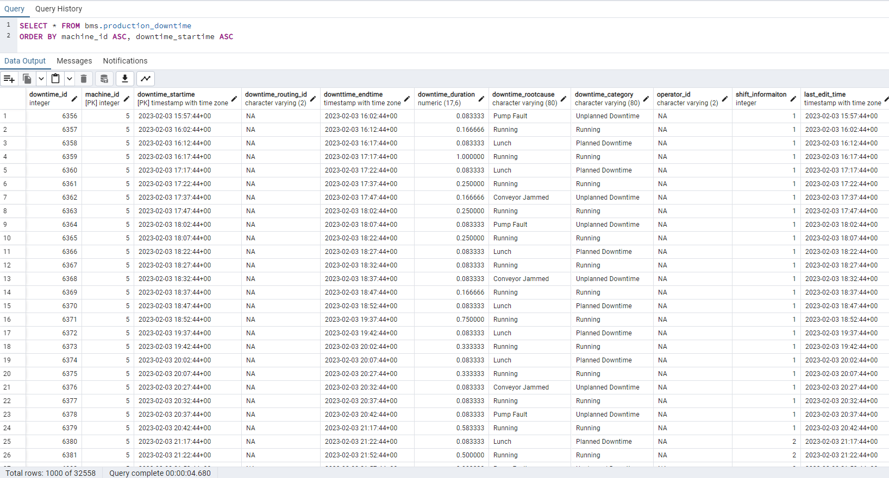

##### Storing last_edit_time in CSV file to update the watermark table

Using the same Production_Downtime CSV as the source, additional columns are added to the file such as pipeline_name, table_name, and last_edit_time.

-   Pipeline Name: The name of the pipeline processing the data. (PL_BMS_MES_FetchTransformLoad_AvevaData)

-   Table Name: The target table in PostgreSQL (bms.production_downtime)

-   Last Extracted Timestamp: The latest updated timestamp from the last_edit_time column in the Production_Downtime CSV file.

-   Ranking and Timestamp Extraction: For every run, the pipeline ranks the last_edit_time column and extracts the maximum value to determine the latest extracted timestamp. It then selects the required columns to be present in the destination file.

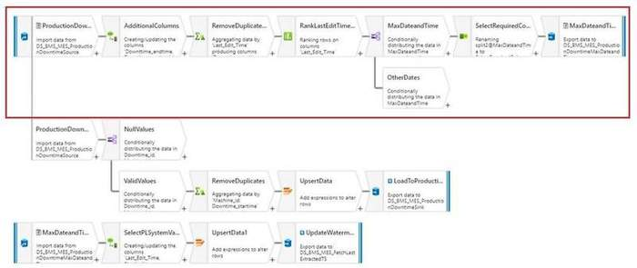

All these details are stored in a \'ProductionDowntime_MaxDateandTime.csv\' file in the blob storage which would act as the source for updating the watermark table in Postgres.

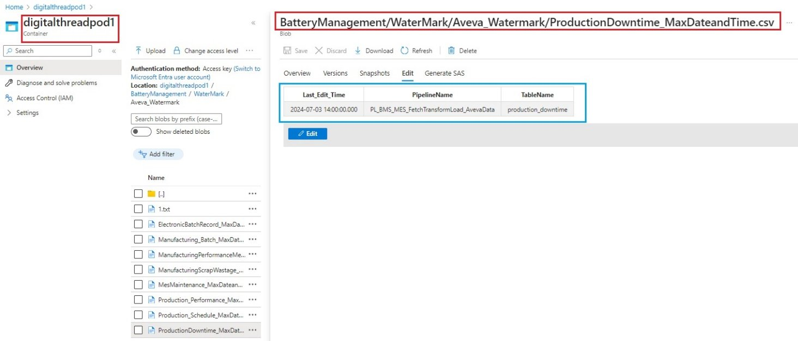

##### Transformations to Update Watermark

By taking ProductionDowntime_MaxDateandTime.csv as the source, it also captures the current pipelinerunID. The watermark (bms.avevameswatermark) table is upserted based on the table name(bms.production_downtime), ensuring that the latest extracted timestamp is recorded for subsequent runs.

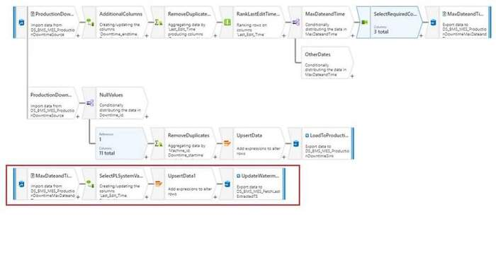

##### Fail Activity - FailureAtTransformationsLevel

If the ForEach Activity (TransformAndLoadDataToPostgres) encounters a failure during its execution, a Fail Activity named FailureAtTransformations is triggered. This activity logs an error indicating a failure at the transformation level, ensuring that any issues encountered during data processing are properly tracked and can be addressed.

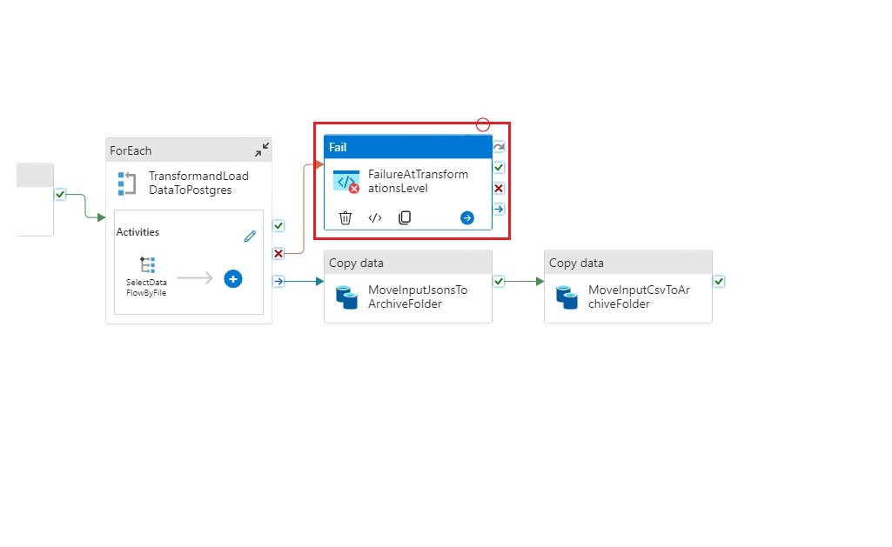

##### 

#### Copy Data - MoveInputJsonsToArchiveFolder

After all the transformations and data loading are completed, the pipeline initiates the process of archiving the processed JSON files. The activity MoveInputJsonsToArchiveFolder is responsible for this task.

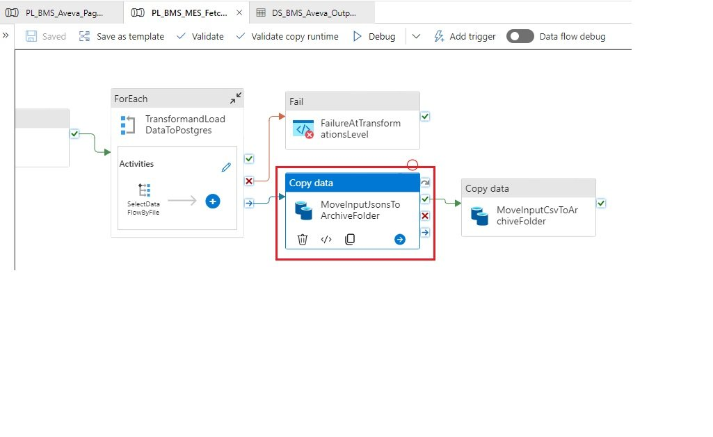

This step ensures that the raw JSON files, which have been processed during the pipeline\'s execution, are moved to a designated archive folder as shown on the right.

##### 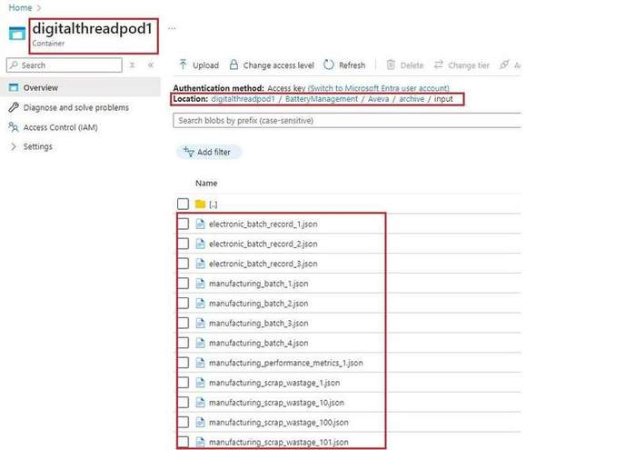
Copy Data - MoveInputCsvToArchiveFolder

Following the archiving of JSON files, the pipeline proceeds to archive the generated CSV files through the MoveInputCsvToArchiveFolder activity.

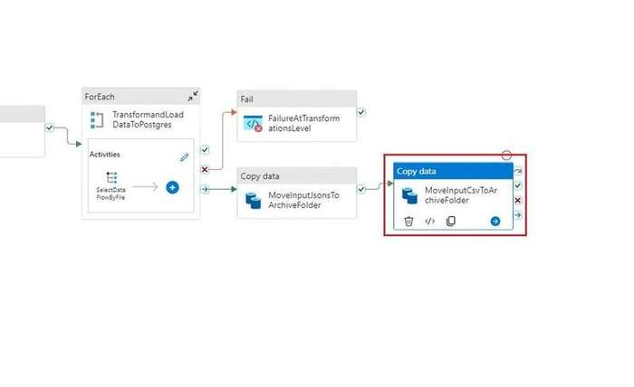

This step ensures that the transformed and processed data, now in CSV format, is also stored securely in an output archive folder.

Archiving the CSV files is essential for preserving the results of the pipeline\'s data transformations and processing, allowing for future validation and analysis if needed. By moving these files to a structured and secure location within Azure Blob Storage, the pipeline maintains a clean working directory and complies with data retention policies, ensuring that historical data is readily accessible and well-organized.

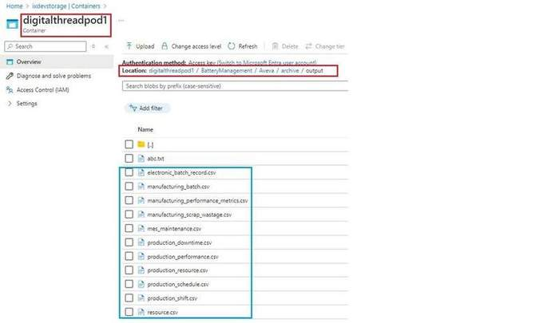

## 

## PL_BMS_SAP_FetchTransformLoadOdata_zixdtResponse

The PL_BMS_SAP_FetchTransformLoadOdata_zixdtResponse pipeline is designed to efficiently integrate data from a range of SAP OData services, such as BOM, MasterRecipe, VendorMaster, Inventory, Maintenance, MaterialTracking, PurchasingHeader, SupplierPO, SourceList, and Quality. It also manages dependent services like BOMComponents (associated with BOM) and Ingredients (linked to MasterRecipe).

The pipeline\'s workflow begins with extracting data in JSON format, which is then converted into CSV format using Azure Functions due to the complexity of the JSON responses. After confirming the availability of these CSV files via a GetMetadata activity, the pipeline performs essential data transformations, including removing null values, eliminating duplicates, and converting data types as needed.

The transformed data is then upserted into PostgreSQL tables. Finally, the pipeline updates the watermark table to capture the most recent processed records and archives both the original JSON files and the converted CSV files to ensure data freshness for future processing.

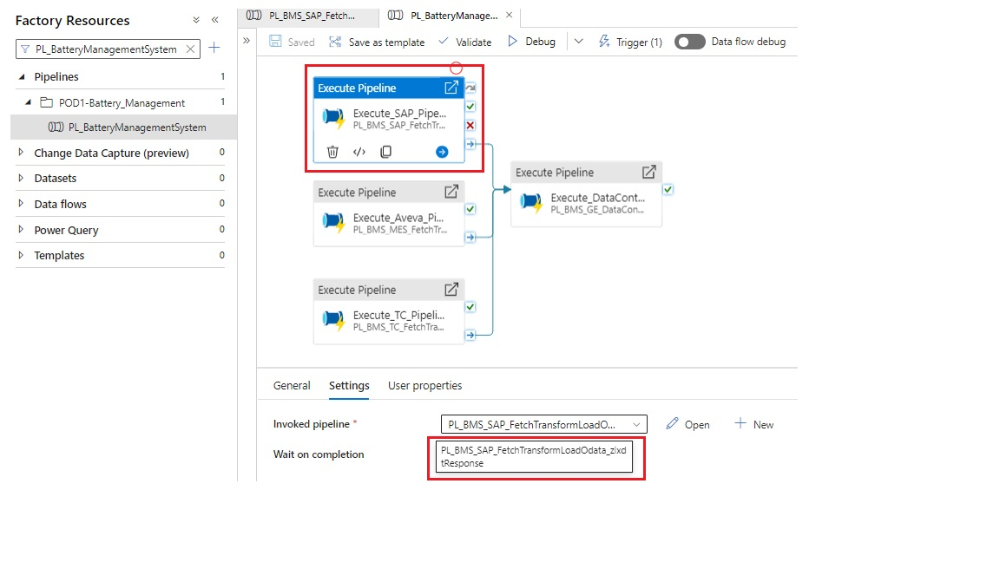

#### Lookup Activity- (LookupForODataServiceNames)

This activity looks up a CSV file that lists the different OData services related to SAP. The file, located in Azure Blob Storage at BatteryManagement/sap_files / SAPOdataServiceNames.csv, serves as a configuration file that specifies the various SAP Odata services from which data needs to be fetched.

This activity performs a lookup operation to retrieve data from a configuration CSV file that lists the different SAP OData services to be integrated into the pipeline. The file is located in Azure Blob Storage at the path BatteryManagement/sap_files/SAPOdataServiceNames.csv.

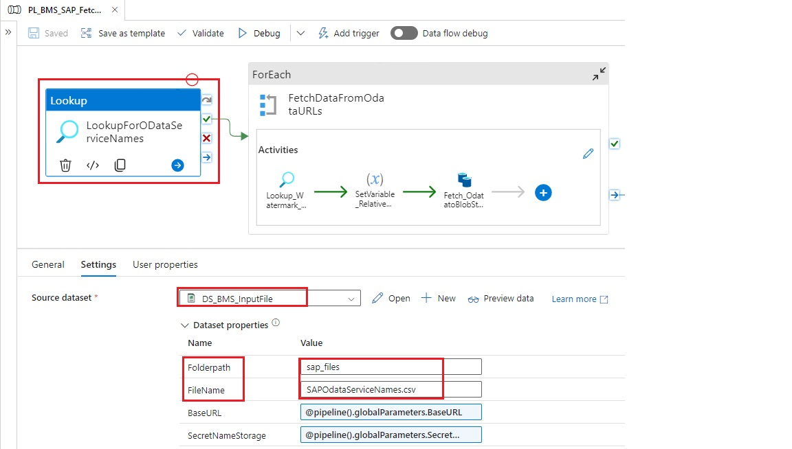

The CSV file acts as a central reference, specifying which SAP OData services- such as BOM, MasterRecipe, and others- require data extraction. By using this lookup, the pipeline dynamically identifies and processes the services, ensuring that the data extraction and subsequent transformations are aligned with the services listed in the configuration file.

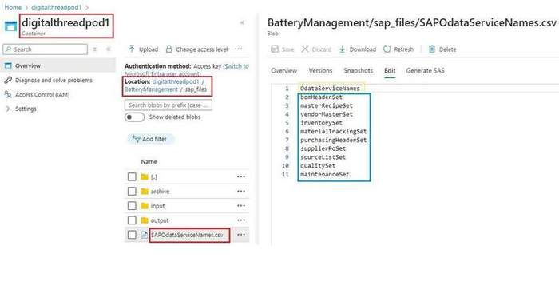

#### ForEach Activity: FetchDataFromOdataURLs

This activity iterates over the list of OData services retrieved from the LookupForODataServiceNames activity.

The items property is set to \@activity(\'LookupForODataServiceNames\').output.value, dynamically passing the list of services. With batch count set to 10, it enables parallel execution for efficient processing. Inside the loop, several activities handle the extraction and setup of data for each service, which are detailed in subsequent sections.

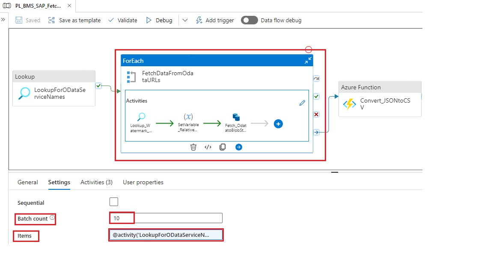

#### 

### Lookup Watermark

The Lookup Watermark activity queries the PostgreSQL table \'bms.bmwatermark\' to retrieve the \'table_name\', \'created_date\', and \'lastextractedtimestamp\' for the current OData service being processed. These timestamps are critical for ensuring that only new or updated records are fetched from the SAP system, optimizing data integration by avoiding the reprocessing of old records.

The dynamic query executed is:

\@concat(

\'SELECT tablename, created_date, lastextractedtimestamp FROM bms.bmwatermark WHERE tablename = \'\'bms.\',

toLower(replace(item().OdataServiceNames, \'Set\', \'\')),

\'\'\'\'

)

This approach ensures data integrity and enhances workflow efficiency by processing only the most recent and relevant records for each service.

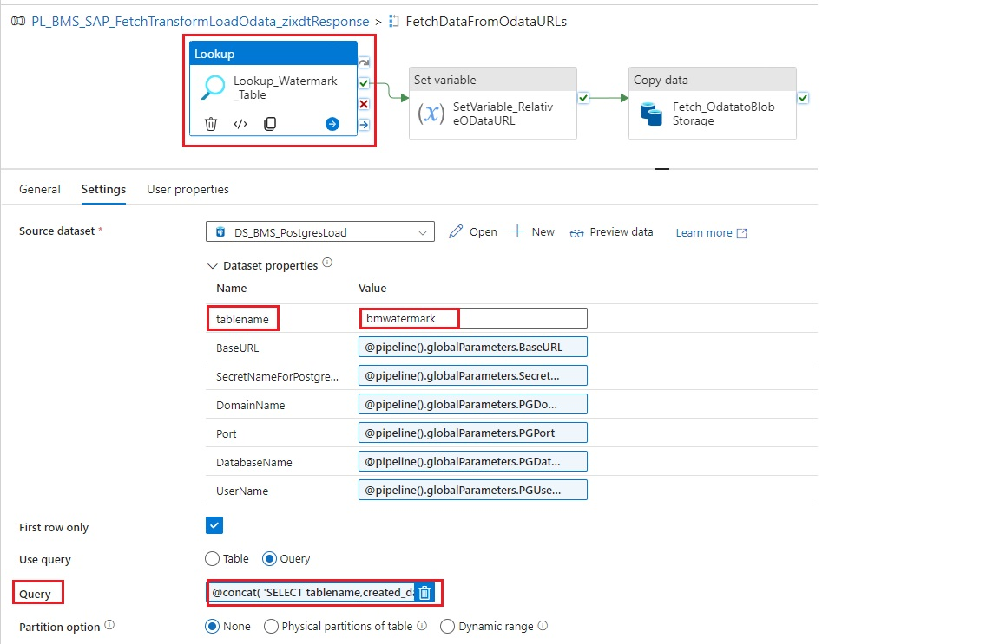

#### 

### Set Variable Activity- SetVariable_RelativeODataURL

The SetVariable_RelativeODataURL activity assigns the dynamically constructed relative OData URL to the ODataURL variable. While this value is primarily used in the subsequent Copy Data activity for fetching data, the variable is set here to provide visibility during execution, especially since the pipeline operates within a ForEach loop for multiple services.

Variable Name: ODataURL

Value: \@concat(item().OdataServiceNames

**Explanation of the above query:**

The query dynamically constructs the SAP OData service URL by concatenating the service name (\'item().OdataServiceNames\') with a \'\$filter\' condition. It filters records based on \'createdOn\' and \'createdAt\' timestamps, using values from the Lookup_Watermark_Table activity for the most recent extraction dates.

For specific services like \'bomHeaderSet\' and \'masterRecipeSet\', it adds an \'\$expand\' parameter to include related entities (\'bom_to_comps\' for BOM and \'recipe_to_ingredients\' for MasterRecipe).

Example:

For **vendorMasterSet**, it would be:

> vendorMasterSet?\$filter=(createdOn ge \'20240705\' and createdAt ge \'131605\')

For **\'bomHeaderSet\'**, it would be:

> [link](https://momssap.accenture.com:44300/sap/opu/odata/sap/zixdt_battery_mgmt_src_srv/bomHeaderSet?\$filter=(createdOn) ge \'20240705\' and createdAt ge \'131605\')&amp;\$expand=bom_to_comps

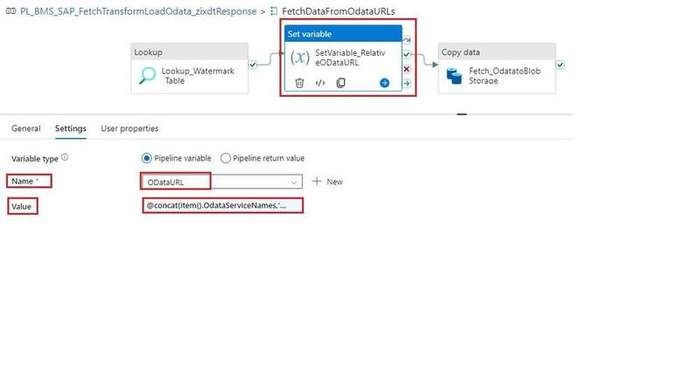

> \@concat(item().OdataServiceNames,\'?\$filter=(createdOn ge \'\'\',
>
>     activity(\'Lookup_Watermark_Table\').output.firstRow.created_date,
>
>     \'\'\' and createdAt ge \'\'\',
>
>     activity(\'Lookup_Watermark_Table\').output.firstRow.lastextractedtimestamp,
>
>     \'\'\'\')
>
> if(
>
>     or(
>
>         equals(item().OdataServiceNames, \'bomHeaderSet\'),
>
>         equals(item().OdataServiceNames, \'masterRecipeSet\')
>
>     ),
>
>     concat(\'&amp;\$expand=\', if(equals(item().OdataServiceNames, \'bomHeaderSet\'), \'bom_to_comps\', \'recipe_to_ingredients\')),
>
>     ..
>
> )

***Copy Data- Fetch_OdatatoBlobStorage***

This activity is configured to retrieve data from the SAP OData service and store it in Azure Blob Storage as JSON files. It utilizes the DS_BMS_SAP_FetchOdata source dataset, which includes all necessary connection details for the SAP OData service.

**Dataset Properties**

-   BaseURL: The base URL for accessing Azure Key Vault, defined using the global pipeline parameter BaseURL (https://ix-dev-keyvault.vault.azure.net/).

-   SAP_OData_BaseURL: A global parameter that contains the base URL for the SAP OData service (https://momssap.accenture.com:44300/sap/opu/odata/sap/zixdt_battery_mgmt_src_srv/)

-   SecretNameForSAP: The name of the secret for SAP credentials, stored in Azure Key Vault, defined using the global pipeline parameter SecretNameForSAP.

-   SAP_UserName: The SAP username for authentication, defined using the global pipeline parameter SAP_UserName.

-   SAP_Path: The SAP_Path is constructed using the same query as in the SetVariable_RelativeODataURL activity, which filters records based on the createdOn and createdAt timestamps and includes \$expand parameters for specific services like bomHeaderSet and masterRecipeSet.

**Example URL:**

For a service like **vendorMasterSet**, the constructed URL would look like:

[link](https://momssap.accenture.com:44300/sap/opu/odata/sap/zixdt_battery_mgmt_src_srv/vendorMasterSet?\$filter=(createdOn) ge \'20240705\' and createdAt ge \'131605\')

**Additional Headers**

-   Source: An additional header is set with the name Source and the value ADF, indicating that the request is originating from Azure Data Factory.

The fetched data, in JSON format, is copied to the designated Azure Blob Storage container as shown below. This ensures that the raw data is securely backed up before any transformations are applied.

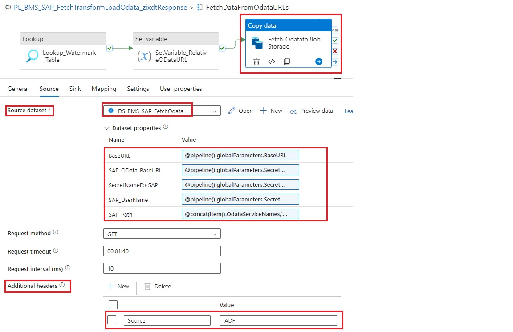

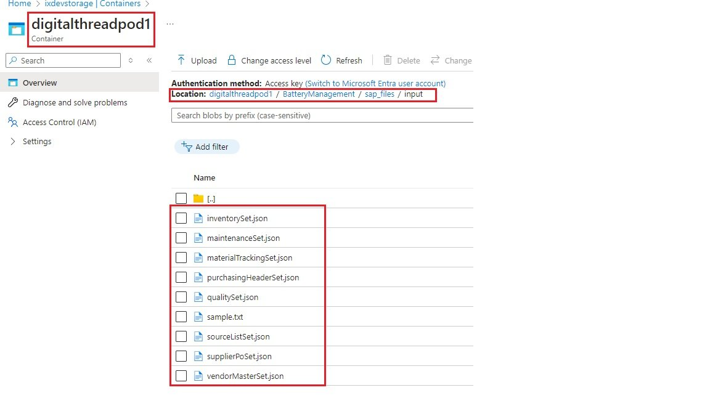

#### Azure Function - Convert_JSONtoCSV

The Convert_JSONtoCSV Azure Function transforms complex JSON data fetched from SAP OData services into a more manageable CSV format, simplifying further data transformations and integration into PostgreSQL. This step is essential for improving the efficiency of data processing.

The batterymanagement_sapjson function connects through a linked service, \'LS_Func_BatteryMgmt\', which ensures a secure connection to the Azure Function app. The parameters BaseURL, FunctionAppURL, and SecretNameFunctionApp are dynamically injected using global parameters, which ensures that sensitive information such as URLs and secret names are securely managed and easily configurable.

The converted CSV files are viewable in the blob storage at the path indicated in the image below.

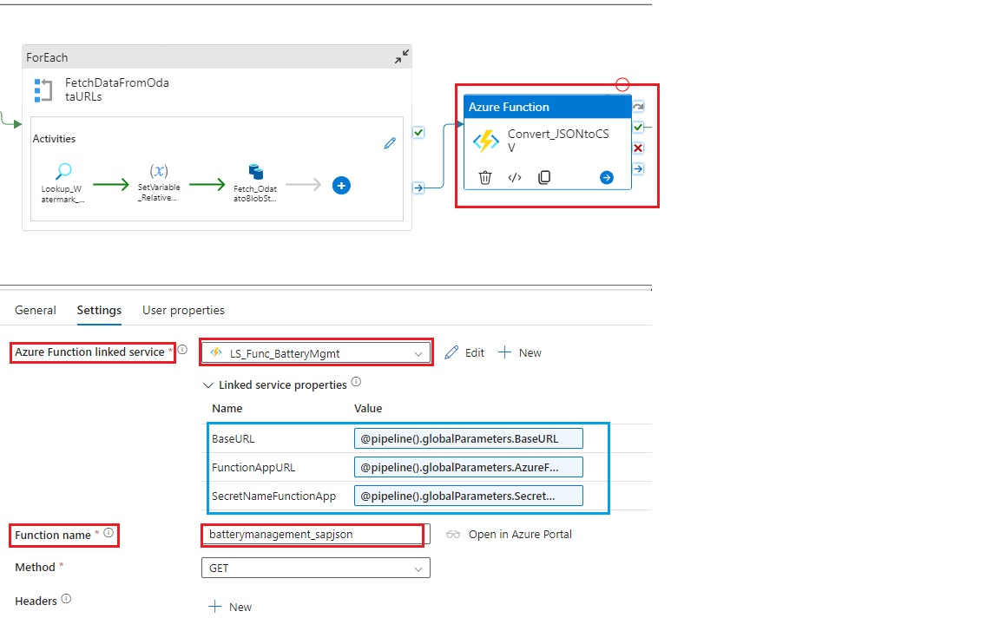

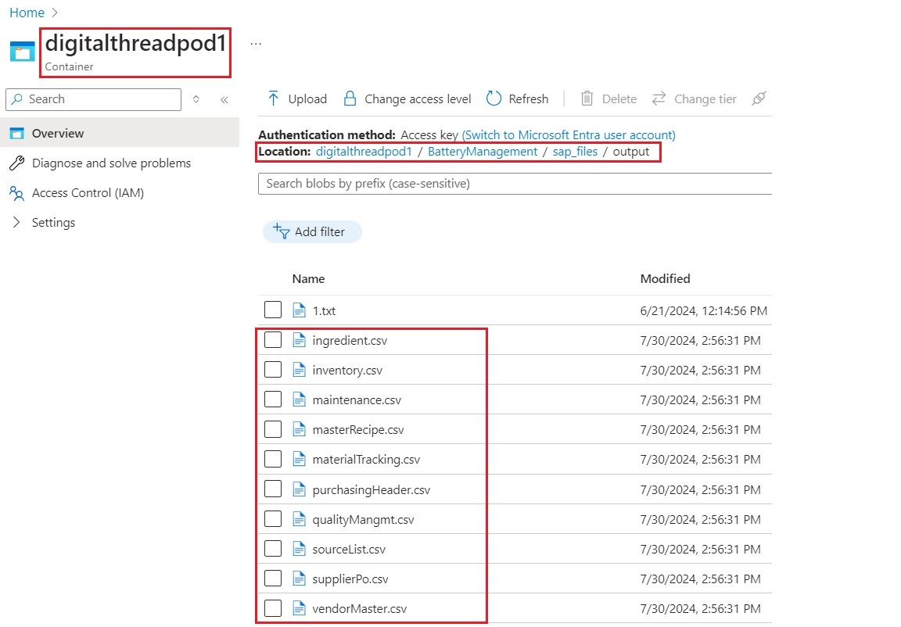

#### Get Metadata- OutputFolderChildItems

This activity retrieves the list of files from the specified directory in Azure Blob Storage. The required path is defined in the dataset as digitalthreadpod1/BatteryManagement/sap_files/output. The Field List is set to Child Items, which returns metadata about the files present in the directory. This metadata is then used to identify the available files for further processing in subsequent activities.

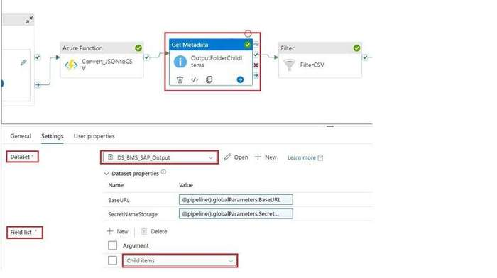

#### 

### Filter activity- Filter CSV

This activity filters the list of files retrieved from the previous Get Metadata activity to select only the files with a .csv extension. It uses the expression \@endswith(item().name, \'.csv\') to ensure that only CSV files are included for further processing. This step ensures that only CSV files are passed along to the next stages of the pipeline.

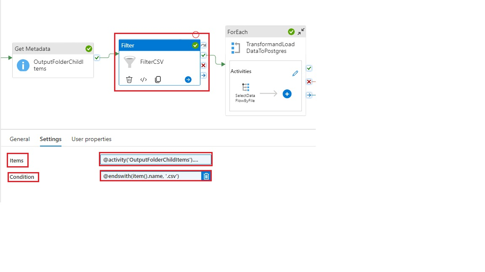

#### 

### ForEach Activity- TransformandLoadDataToPostgres

The ForEach activity iterates over the filtered CSV files provided by the Filter CSV Files activity. The Items property is set to \@activity(\'FilterCSV\').output.Value, which holds the list of CSV files. Parallel execution is enabled with a Batch Count of 12, meaning up to 12 files will be processed concurrently. This activity applies the appropriate transformations and loading steps to each CSV file based on the logic defined in the subsequent Switch activity.

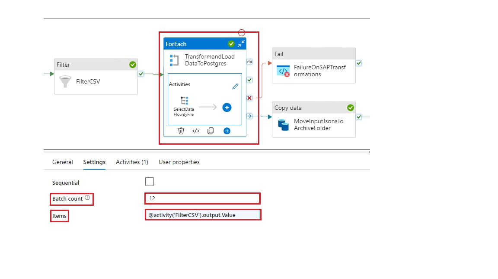

#### 

### Switch Activity (SelectDataFlowByFile)

Inside the ForEach activity, the Switch activity is used to determine the appropriate data transformation flow based on the CSV filename. The expression \@split(item().name, \'.csv\')\[0\] extracts the service name from the filename (e.g., vendorMaster from vendorMaster.csv).

Each case in the Switch activity corresponds to a specific service, such as vendorMaster, and triggers the associated data flow for that service. These data flows handle transformations based on the service identified from the filename.

While the detailed steps for one service\'s transformations will be explained in the subsequent sections, other services follow a similar approach.

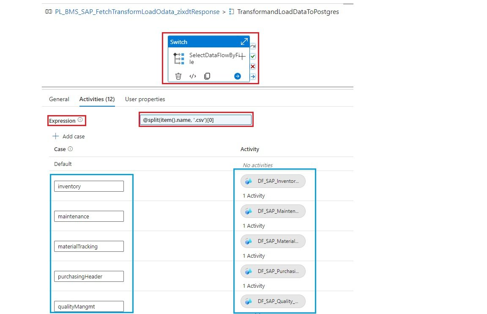

#### DF_SAP_VendorMaster_ODataTransfromations

If the switch activity case is vendorMaster, it triggers the corresponding data flow, which performs the necessary transformations on the data.

During this step, dataflows execute various transformations on the CSV data:

-   Ensures data quality by eliminating any null values and duplicates.

-   Adjusts data types to match the schema of target PostgreSQL tables.

-   Inserts new records and updates existing ones in PostgreSQL.

-   Loads the cleaned and transformed data into the designated PostgreSQL tables.

> 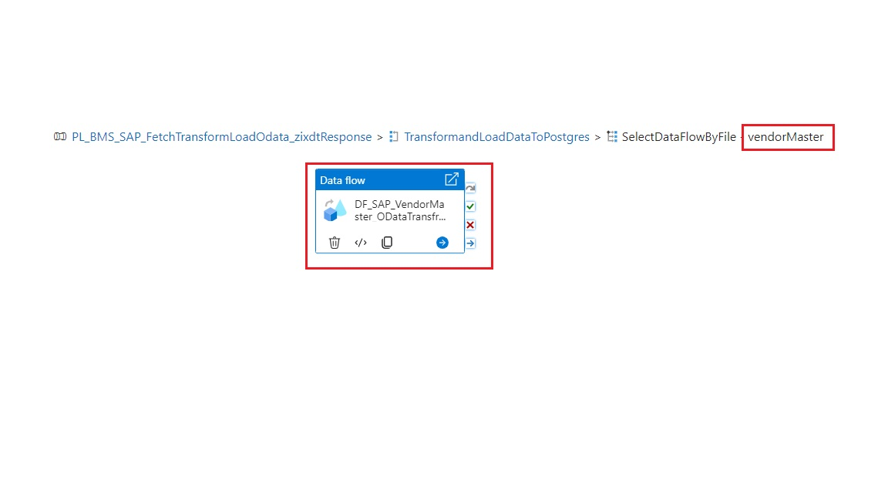
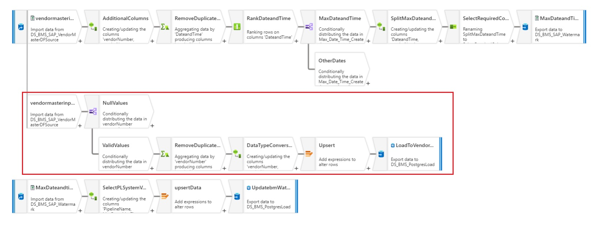

PostgreSQL allows the viewing of the loaded data into the bms.vendormaster table as shown below:

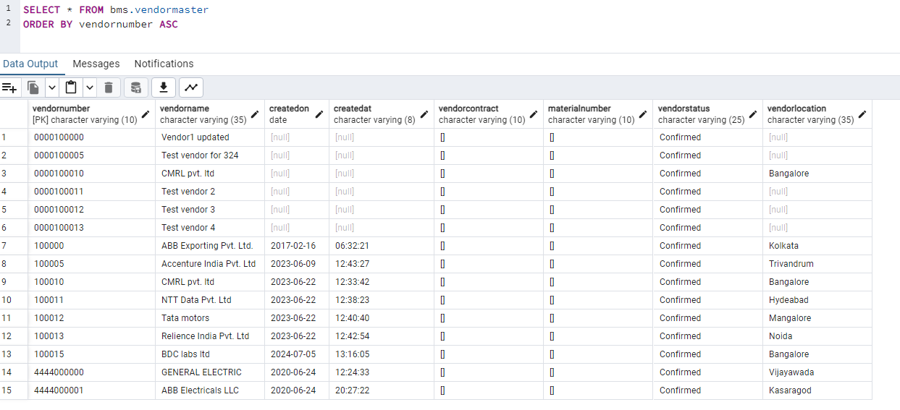

######### Storing Max Date and Time in CSV File to Update Watermark Table \{#storing-max-date-and-time-in-csv-file-to-update-watermark-table .Style4\}

The DF_SAPVendorMaster dataflow performs more transformations by taking the same vendorMaster.csv as the source to store the date and time in the CSV file in blob storage. It includes:

Using the same vendormaster.csv as the source, additional columns are added to the file such as pipeline_name, table_name, and last_edit_time.

-   Pipeline Name: The name of the pipeline processing the data. (PL_BMS_SAP_TransformLoadVendorMaster_zixdtResponse)

-   Table Name: The target table in PostgreSQL (bms.vendormaster)

-   Combining Date and Time: Combines date and time into one column.

-   Removing Duplicates: Ensures unique entries in the date and time column.

-   Ranking and Splitting Date and Time: For every pipeline run, it ranks entries to get the latest date and time and separates them into Max_date and Max_time columns.

-   Select Required Columns: The essential columns of PipelineName, TableName, MaxDate, and MaxTime have been selected for extraction. This data will subsequently be stored within a destination file located in blob storage.

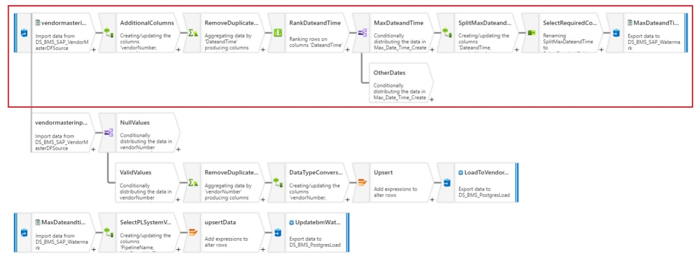

All these details are stored in a \'ProductionDowntime_MaxDateandTime.csv\' file in the blob storage which would act as the source for updating the watermark table in Postgres.

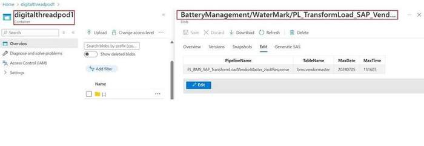

######### Transformations to update Watermark \{#transformations-to-update-watermark-1 .Style4\}

By taking PL_BMS_SAP_TransformLoadVendorMaster_zixdtResponse as the source, it also captures the current pipelinerunID. The watermark (bms.bmwatermark) table is upserted based on the table name(bms.vendormaster), ensuring that the latest extracted date and timestamp are recorded for subsequent runs.

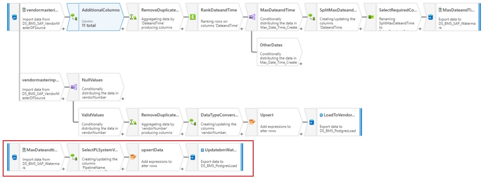

#### Fail Activity - FailureonSAPTransformations

If the ForEach Activity (TransformAndLoadDataToPostgres) encounters a failure during its execution, a Fail Activity named FailureonSAPTransformations is triggered. This activity logs an error indicating a failure at the transformation level, ensuring that any issues encountered during data processing are properly tracked and can be addressed.

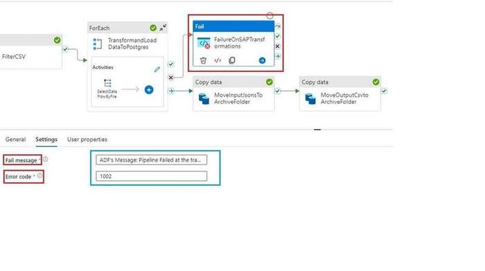

#### Copy Data - MoveInputJsonsToArchive

After all the transformations and data loading are completed, the pipeline initiates the process of archiving the processed JSON files. The activity \"MoveInputJsonsToArchiveFolder\" is responsible for this task.

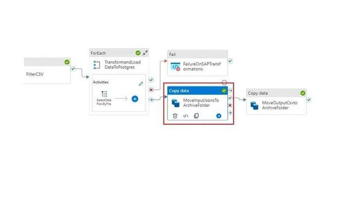

This step ensures that the raw JSON files, which have been processed during the pipeline\'s execution, are moved to a designated archive folder as shown below.

Archiving these JSON files is crucial for maintaining data integrity and providing a reference point for future audits or reviews. By securely storing these files in a separate location within Azure Blob Storage, the pipeline ensures that the working directory remains organized and free from clutter, facilitating efficient data management.

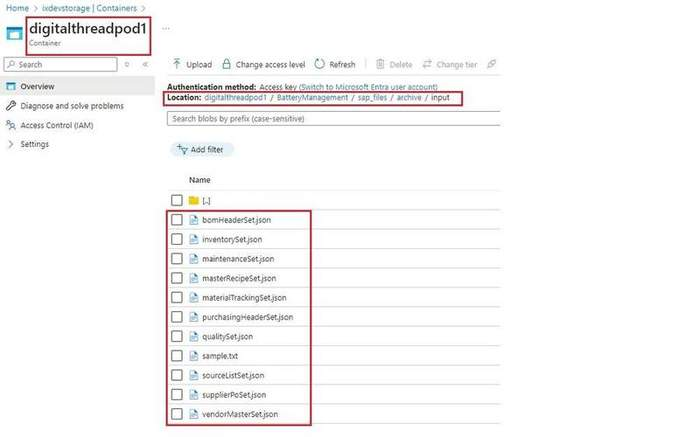

#### Copy Data - MoveOutputCsvtoArchiveFolder)

Following the archiving of JSON files, the pipeline proceeds to archive the generated CSV files through the \"MoveOutputCsvToArchiveFolder\" activity.

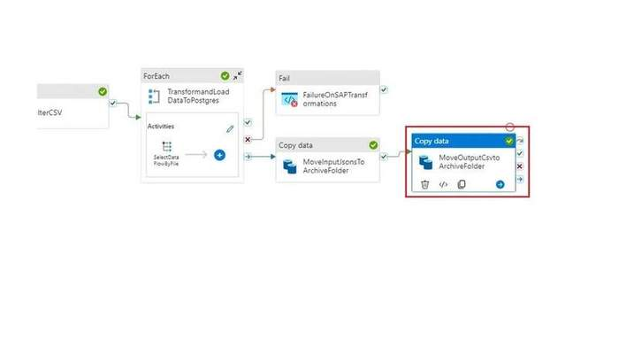

This step ensures that the transformed and processed data, now in CSV format, is also stored securely in an output archive folder.

Archiving the CSV files is essential for preserving the results of the pipeline\'s data transformations and processing, allowing for future validation and analysis if needed. By moving these files to a structured and secure location within Azure Blob Storage, the pipeline maintains a clean working directory and complies with data retention policies, ensuring that historical data is readily accessible and well-organized

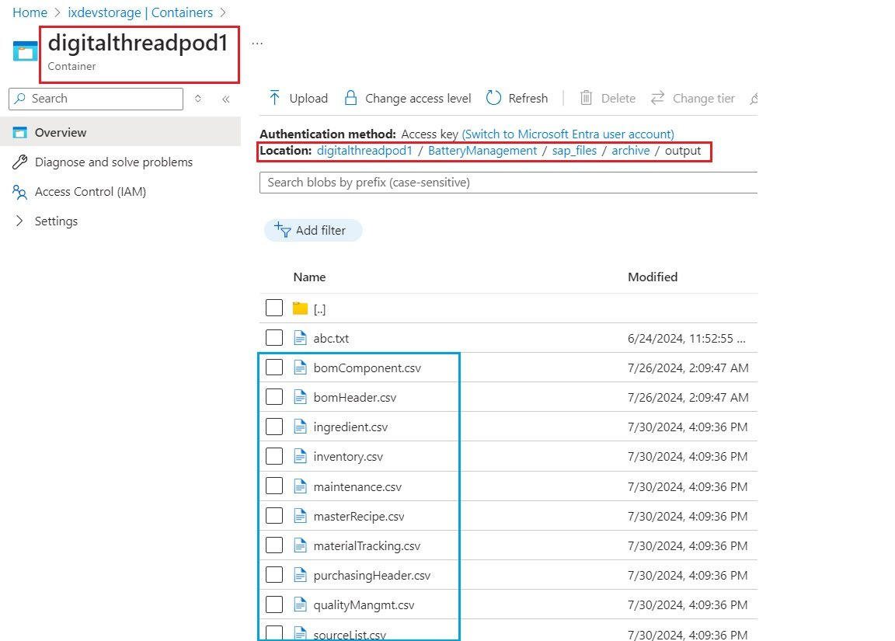

### PL_BMS_GE_DataContract_Validation

The PL_BMS_GE_DataContract_Validation pipeline plays a crucial role in ensuring that the data extracted from SAP, Teamcenter, and Aveva MES systems meets high-quality standards before it is used further in business processes. This validation process is essential to guarantee that the data is accurate, consistent, and reliable for decision-making and operational purposes.

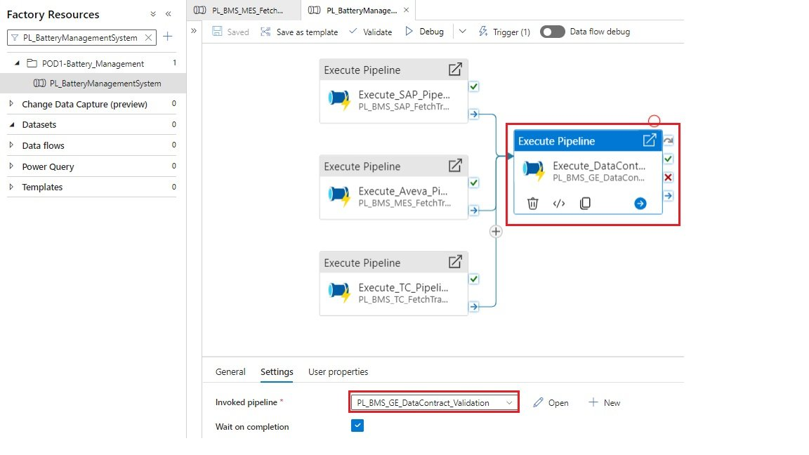

#### Web - Get ClientSecret

The pipeline initiates with the Get Client Secret activity, which retrieves the client secret required for subsequent token generation.

This is achieved by accessing a URL specified through the global parameter GXC*lientSecret*. The request utilizes System Assigned Managed Identity to securely access the Azure Key Vault, ensuring that sensitive information is handled securely. This setup ensures that the client secret is fetched securely and without exposing sensitive information. The managed identity authentication mechanism provides a secure and streamlined way to access Azure resources.

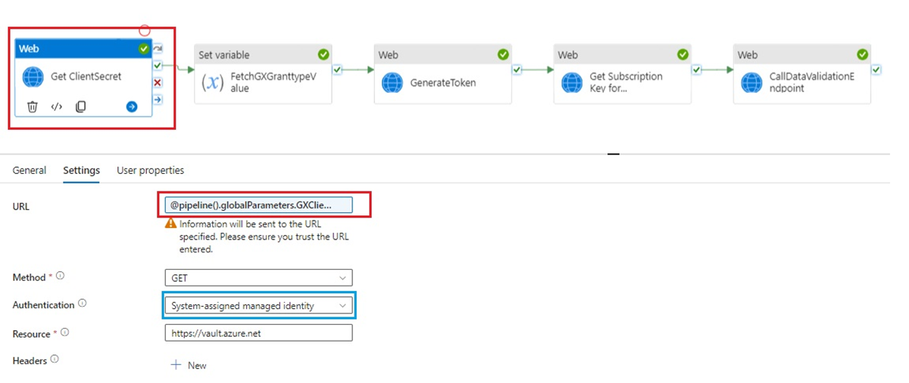

#### Set Variable - FetchGXGranttypeValue

This activity sets a variable named GXURL by concatenating the necessary values to generate the authentication token. The expression used in this activity is:

> \@concat(\'grant_type=client_credentials&amp;client_id=\', pipeline().globalParameters.GXClientID, \'&amp;client_secret=\', activity(\'Get_ClientSecret\').output.value, \'&amp;scope=\', pipeline().globalParameters.GXScope)

This concatenated string forms the complete request body needed for generating the authorization token in the subsequent web activity. Specifically, the expression includes:

-   **grant_type:** Specifies the type of grant being requested. In this case, it is set to client_credentials.

-   **GXClientID:** Retrieved from the global parameter as follows: pipeline().globalParameters.GXClientID.

-   **GXClientSecret:** Obtained dynamically from the output of the Get_ClientSecret activity, using the expression as follows: activity(\'Get_ClientSecret\').output.value.

-   **GXScope:** Retrieved from the global parameter as follows: pipeline().globalParameters.GXScope.

By combining these values, the GXURL variable holds the complete query string required for generating the authorization token. This string is then used in the body of the request sent by the GenerateToken web activity, ensuring the pipeline can securely authenticate and interact with protected APIs and services.

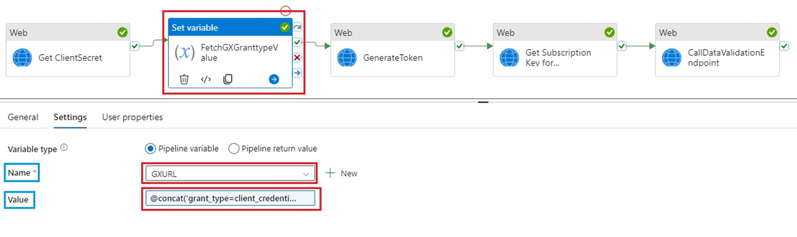

#### Web Activity - GenerateToken

Using the concatenated value obtained from the FetchGXGranttypeValue activity, this activity generates an authentication token or access token required for authorizing subsequent requests to access protected resources or endpoints. The token is obtained by sending a request to a URL defined by the global parameter dataqualitytokenURL. The body of this request dynamically incorporates the concatenated values fetched from the previous activity, which contains the global parameters *GXClientID*, *GXClientSecret*, and *GXScope*. This step is crucial as it provides the pipeline with the necessary authentication token, enabling secure communication and interaction with various APIs and services.

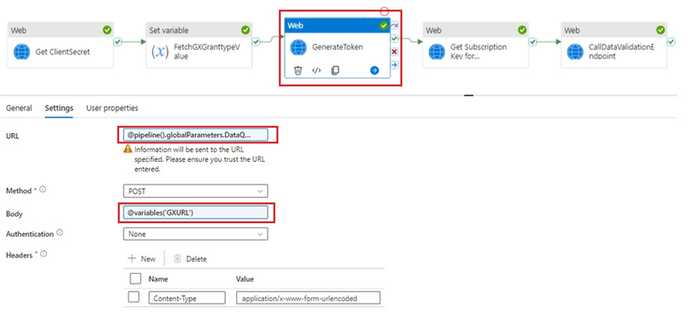

#### 

### Web Activity - Get Subscription Key for GEValidation

This activity fetches the subscription key associated with the GEValidation service, essential for identifying and authorizing access to specific APIs or services provided by GEValidation.

This key is fetched from a URL provided by the global parameter *GXproductpolicykeyvaultURL* using System Assigned Managed Identity*.* This step is crucial for ensuring authorized access to the validation service, allowing the pipeline to utilize *GEValidation\'s* capabilities effectively. By securely retrieving and using this subscription key, the pipeline ensures that it adheres to security protocols while accessing external validation services.

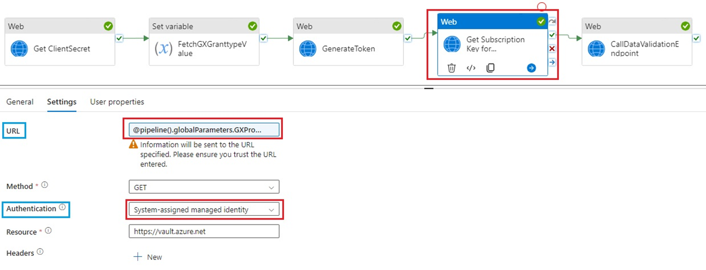

#### Web Activity - CallDataValidationEndpoint

Finally, the *CallDataValidationEndpoint* activity executes the core validation process. It accesses the data validation endpoint using a URL specified by the global parameter *DataContractCheckpointURL*. The request body includes detailed parameters for the data validation process, such as *dataContextPath*, *checkpointName*, and additional flags to control the validation behavior:

> \{
>
> dataContextPath: /app/great_expectations,
>
> checkpointName: ix_dc_bt_checkpoint,
>
> overrideContextPath: true,
>
> validateMultiFile: false,
>
> validationsToEventHub: true,
>
> dq_aggregator: true
>
> \}

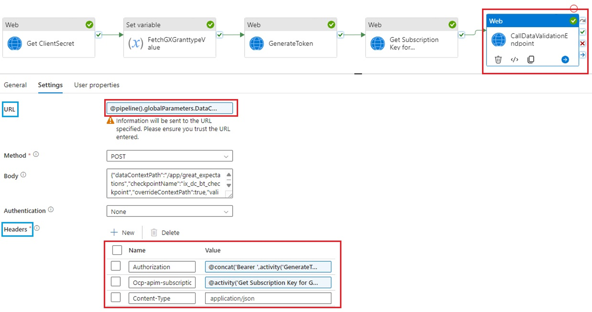

### PL_BatteryManagementSystem_YAML

The PL_BatteryManagementSystem_YAML pipeline automates data processing for configurations defined in YAML files stored in a Postgres table. It identifies active configurations (status = 1), triggers pipelines based on data freshness rules, and updates timestamps of pipelines\' run time to maintain data consistency. The pipeline executes in three phases: fetching configuration details, running data pipelines specific to the system (e.g., SAP, Teamcenter, or MES), and handling post-execution tasks like updating execution timestamps and resetting statuses. It also includes robust error handling, ensuring smooth sequential or parallel execution for multiple configurations while adhering to pagination and token management where required.

#### Lookup activity- LookupConfig

The pipeline starts with a Lookup activity that queries the dp_dc_config table in PostgreSQL using the fetch_and_update_yamldata() function. This function dynamically retrieves records meeting the following conditions:

-   **Status Check:** The status column is set to 1, indicating the configuration is ready for processing.

-   **Freshness Check:** Either the data_freshness_last_run_datetime exceeds the interval defined by data_frequency_in_hours, or the data_freshness_last_run_datetime is null, and the status is not 2.

Below is the screenshot of some of the columns present in dp_dc_config table(present in the PostgreSQL Database)

The function returns the columns **source_name, config_name,** and **dq_checkpoint_name**, which are then used to drive subsequent activities in the pipeline. This mechanism ensures that only fresh, relevant configurations are processed, optimizing resource utilization and maintaining pipeline efficiency.

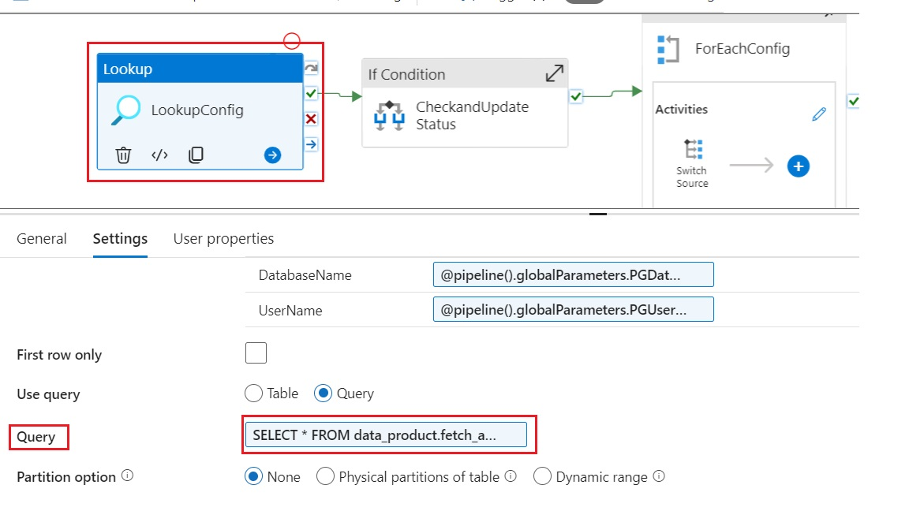

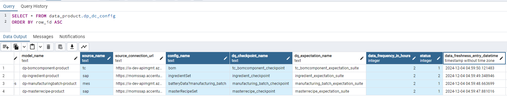

#### If Condition- CheckandUpdateStatus

The If Condition activity named Check and Update Status evaluates whether the LookupConfig activity successfully retrieved any records.

The conditions used are:

\@not(empty(activity(\'LookupConfig\').output.value))

**True Branch**

If records are found (the output is not empty):

1.  The pipeline executes a Lookup activity named Set YAML Status.

> Query: SELECT \* FROM data_product.update_status_yamldata();

2.  This activity runs the PostgreSQL function update_status_yamldata(), which updates the status column of matching records in the dp_dc_config table to 2.

**Purpose:** This marks the records as \"processed,\" preventing them from being processed again in future runs.

**False Branch**

If no records are found (the output is empty) then the pipeline takes no further action, effectively skipping the update process.

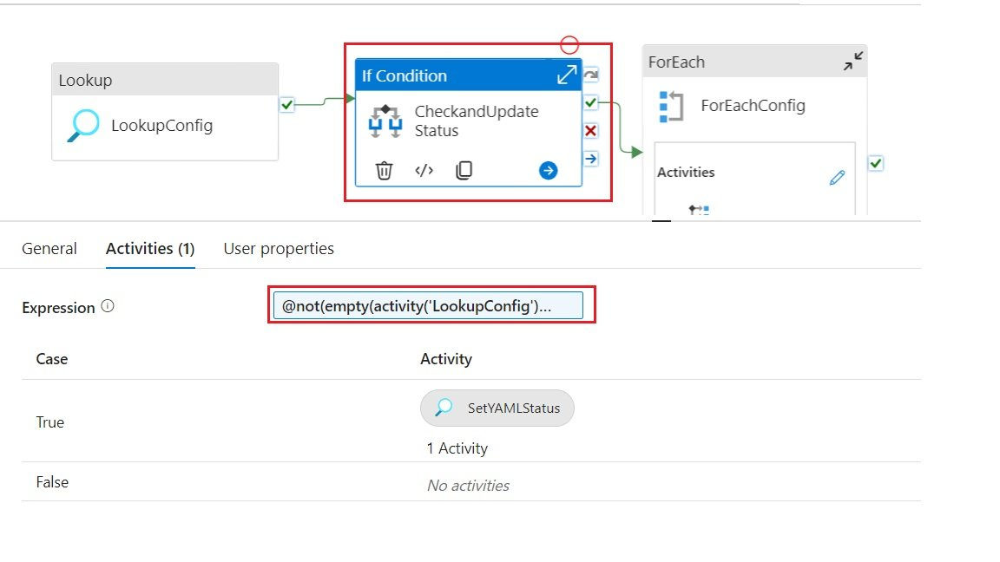

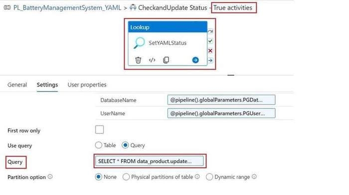

#### Foreach activity- Foreach Config

The ForEach activity processes items from \@activity(\'LookupConfig\').output.value in batches of 5. These items originate from the fetch_and_update_yamldata function, which retrieves records that need processing based on their status and data freshness criteria.

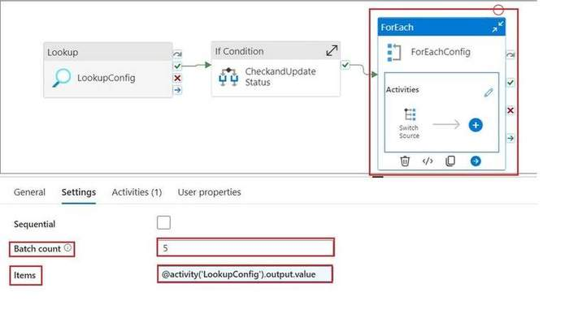

#### 

### Switch activity- Switch Source

The Switch activity inside the ForEach loop evaluates the source_name of each item and routes the flow to one of three cases: SAP, TC, or MES. Based on the source type, it triggers the respective pipeline for further processing, ensuring that the correct data processing workflow is executed for each source.

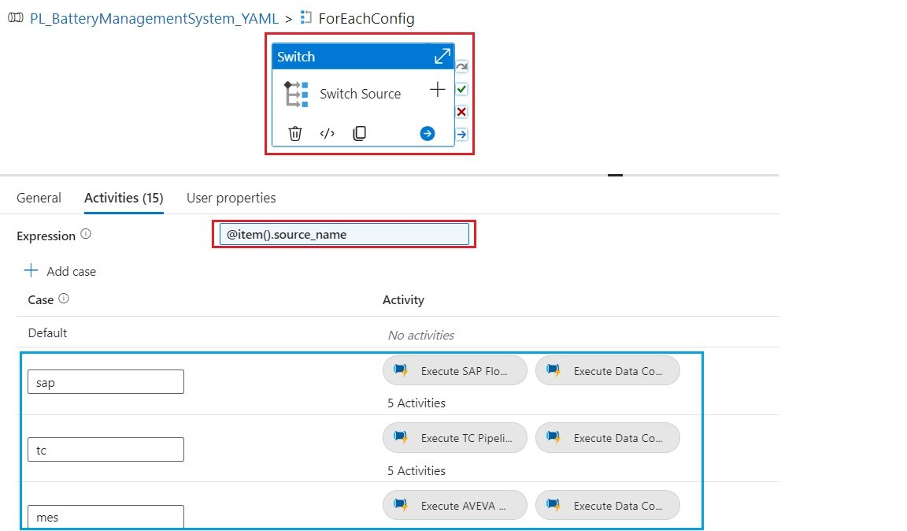

#### 

### SAP Case

The **SAP case** in the pipeline involves the following flow:

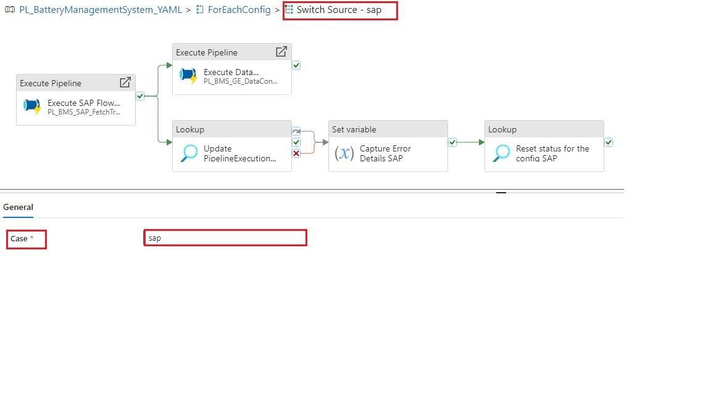

##### Execute SAP Pipeline 

The process starts by invoking the SAP Pipeline (PL_BMS_SAP_FetchTransformLoadOdata_zixdtResponse_YAML), where the parameter config_name1 is dynamically passed using the value \@item().config_name. This ensures the pipeline processes the configuration corresponding to the current iteration in the ForEachConfig loop.

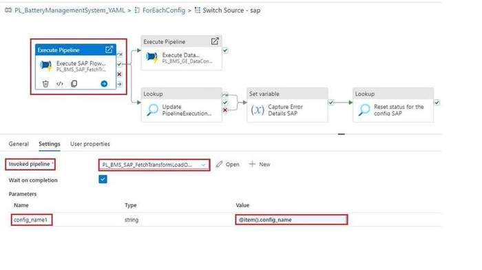

##### Invoked SAP Pipeline Sub-Activities 

###### Lookup Activity- Lookup_Watermark_Table:

This activity retrieves the watermark data from the bmwatermark table using a query dynamically built with the config_name1 parameter.

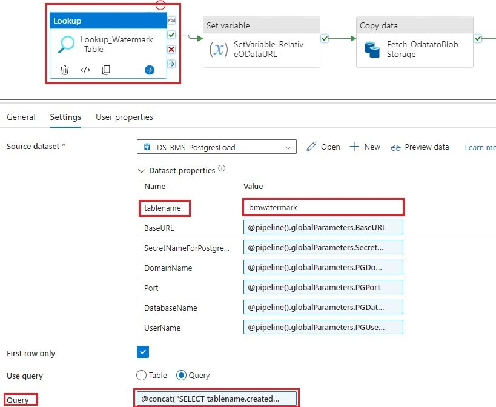

The query ensures that the table name matches the current configuration, processed by replacing \"Set\" in the parameter name to match the naming convention in the table.

Example: If the config_name1 is bomHeaderSet, the query translates to:

> SELECT tablename, created_date, lastextractedtimestamp
>
> FROM bms.bmwatermark
>
> WHERE tablename = \'bms.bomHeader\'

**Query used:**

\@concat(

    \'SELECT tablename,created_date, lastextractedtimestamp FROM bms.bmwatermark WHERE tablename = \'\'bms.\',

    toLower(replace(pipeline().parameters.config_name1, \'Set\', \'\')),

    \'\'\'),

)

\`\`

###### Set Variable- SetVariable_RelativeODataURL:

The SetVariable_RelativeODataURL activity assigns the dynamically constructed relative OData URL to the OData URL variable. While this value is primarily used in the subsequent Copy Data activity for fetching data, the variable is set here to provide visibility during execution, especially since the pipeline operates within a ForEach loop for multiple services.

Variable Name: OdataURL

Value: As shown in the screenshot

The RelativeOdataURL variable is dynamically built using:

-   The config_name1 parameter.

-   The created_date and lastextractedtimestamp retrieved from the Lookup_Watermark_Table activity.

This builds a URL for querying SAP data.

For certain configurations like bomHeaderSet and masterRecipeSet, an \$expand clause is added to include additional related data (e.g., bom_to_comps or recipe_to_ingredients).

Example:

If config_name1 is bomHeaderSet, the URL becomes:

> bomHeaderSet?\$filter=(createdOn ge \'\\' and createdAt ge \'\\')&amp;\$expand=bom_to_comps

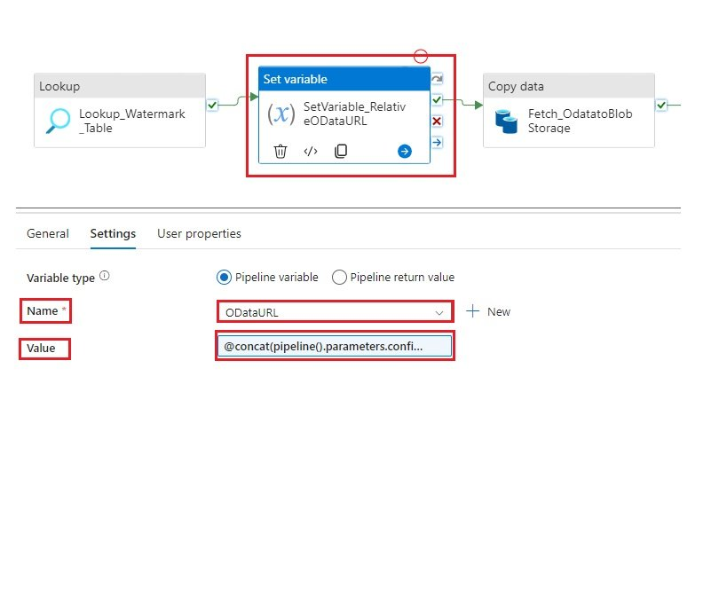

\@concat(pipeline().parameters.config_name1,\'?\$filter=(createdOn ge \'\'\',

    activity(\'Lookup_Watermark_Table\').output.firstRow.created_date,

    \'\'\' and createdAt ge \'\'\',

    activity(\'Lookup_Watermark_Table\').output.firstRow.lastextractedtimestamp,

    \'\'\'\'),

if(

    or(

        equals(pipeline().parameters.config_name1, \'bomHeaderSet\'),

        equals(pipeline().parameters.config_name1, \'masterRecipeSet\')

    ),

    concat(\'&amp;\$expand=\',

        if(

            equals(pipeline().parameters.config_name1, \'bomHeaderSet\'),

            \'bom_to_comps\',

            \'recipe_to_ingredients\'

        )

    ),

    ..

)

)

###### Copy Data- Fetch_OdatatoBlobStorage

This activity is configured to retrieve data from the SAP OData service and store it in Azure Blob Storage as JSON files. It utilizes the DS_BMS_SAP_FetchOdata source dataset, which includes all necessary connection details for the SAP OData service.

**Dataset Properties**

-   BaseURL: The base URL for accessing Azure Key Vault, defined using the global pipeline parameter BaseURL (https://ix-dev-keyvault.vault.azure.net/).

-   SAP_OData_BaseURL: A global parameter that contains the base URL for the SAP OData service (https://momssap.accenture.com:44300/sap/opu/odata/sap/zixdt_battery_mgmt_src_srv/).

-   SecretNameForSAP: The name of the secret for SAP credentials, stored in Azure Key Vault, defined using the global pipeline parameter SecretNameForSAP.

-   SAP_UserName: The SAP username for authentication, defined using the global pipeline parameter SAP_UserName.

-   SAP_Path: The SAP_Path is constructed using the same query as in the SetVariable_RelativeODataURL activity, which filters records based on the createdOn and createdAt timestamps and includes \$expand parameters for specific services like bomHeaderSet and masterRecipeSet.

**Example URL:** For a service like **vendorMasterSet**, the constructed URL would look like:

[link](https://momssap.accenture.com:44300/sap/opu/odata/sap/zixdt_battery_mgmt_src_srv/vendorMasterSet?\$filter=(createdOn) ge \'20240705\' and createdAt ge \'131605\')

**Additional Headers:** *Source*: An additional header is set with the name Source and the value ADF, indicating that the request is originating from Azure Data Factory.

Remaining Flow: The rest of the SAP pipeline flow remains the same as the PL_BMS_SAP_FetchTransformLoadOdata_zixdtResponse, performing transformations, loading, and logging steps as described earlier.

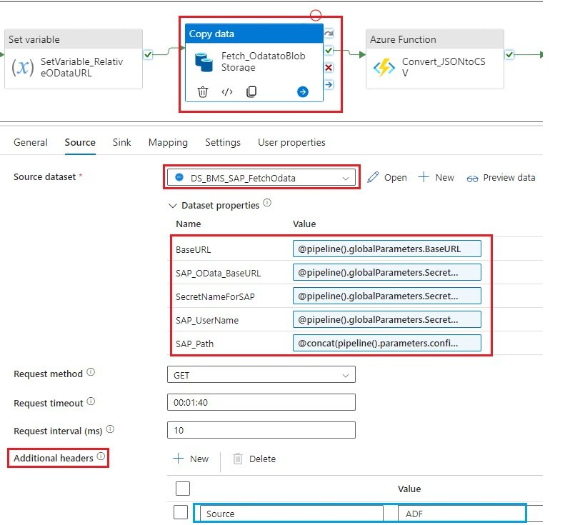

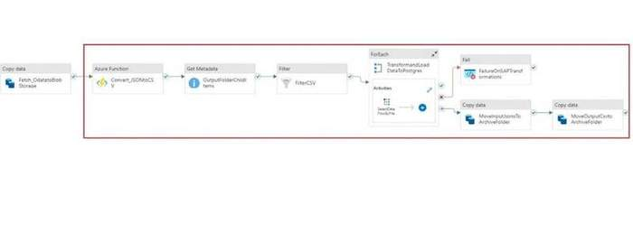

##### Post Execution

###### Execute Data Contract Pipeline SAP 

Post successful execution of SAP Pipeline, PL_BMS_GE_DataContract_Validation_YAML pipeline is invoked.

The parameter checkpoint_name is passed with the value:

> \@item().dq_checkpoint_name

Example of dq_checkpoint_name list present in dp_dc_config table, as shown in the screenshot.

This ensures the pipeline processes data specific to the corresponding checkpoint.

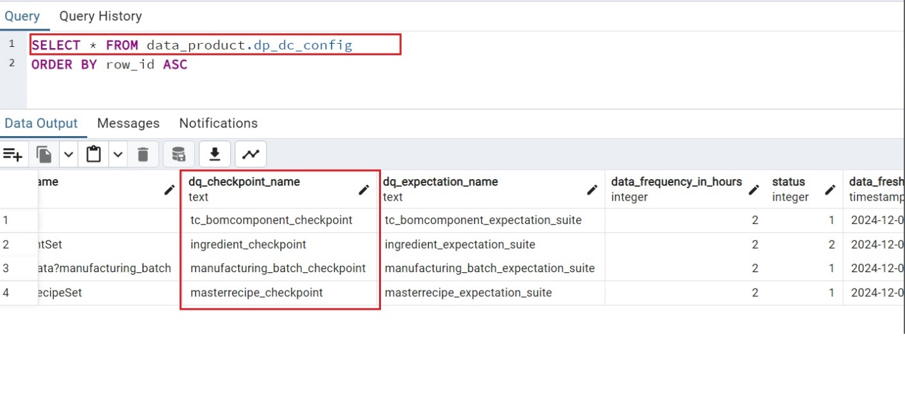

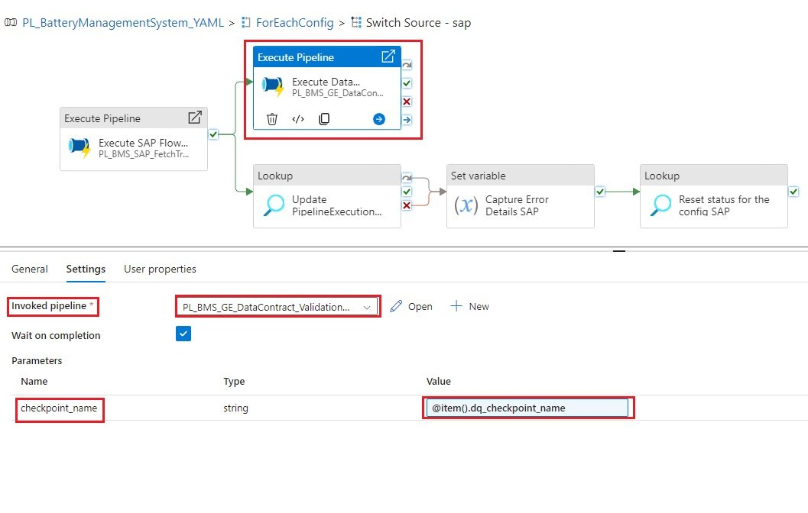

##### Invoked Data Contracts Pipeline

The overall flow of the pipeline remains the same as the existing **PL_BMS_GE_DataContract_Validation** pipeline.

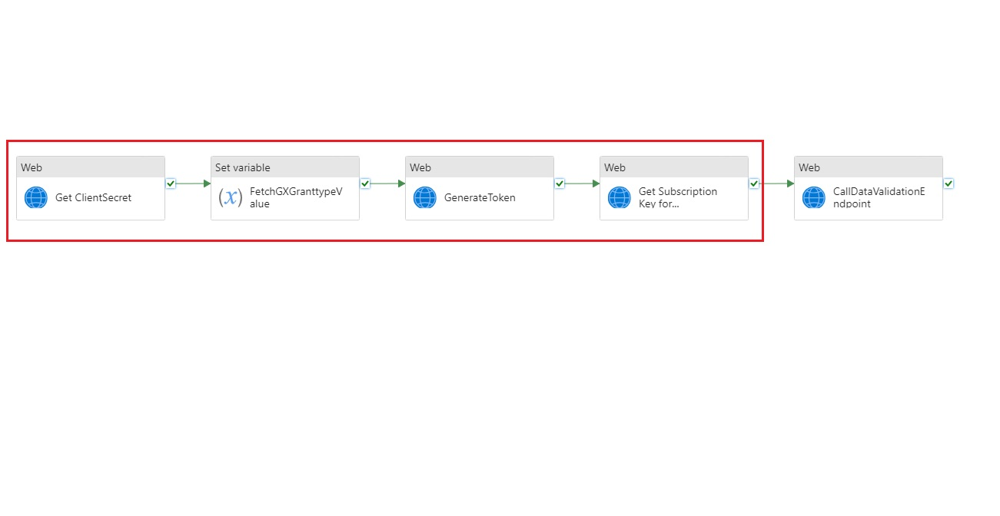

The Key change is in the CallDataValidationEndpoint (Web Activity) step, the body is updated dynamically to include the new checkpoint_name parameter and additional configurations.

Apart from the updated web activity body, the flow of this pipeline aligns with the existing Data Contract Validation pipeline. It ensures that data quality checks are performed using Great Expectations, results are sent to Event Hub, and data is aggregated effectively.

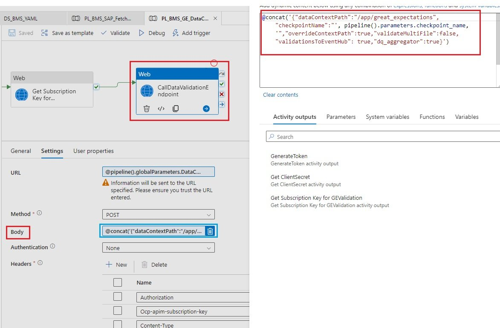

###### 

##### 

###### Lookup Activity (Update PipelineExecutionTimestamp SAP)

The Lookup activity is used to update the data_freshness_last_run_datetime and status for the given config_name in the data_product.dp_dc_config table.

The query executed in the Lookup is:

\@concat(\'SELECT \* FROM data_product.upd_dp_dc_config_yamldata (\'\'\', item().config_name, \'\'\', 1, NOW() :: TIMESTAMP);\')

This query calls a Postgres function upd_dp_dc_config_yamldata which updates the status to 1 (indicating ready for reprocessing) and sets the data_freshness_last_run_datetime to the current timestamp (NOW()).

If the SAP pipeline fails, this lookup will be skipped, ensuring that no incorrect updates are made.

**Set Variable (Capture Error Details SAP):**

Capture Error Details (SAP) activity stores error details when the SAP pipeline fails, or the Lookup is skipped. It helps log the failure reasons and ensures proper error handling by capturing the issue for further action, like resetting the status.

**Variable Name: ErrorDetails**

Value:

\@concat(activity(\'Execute SAP Flow Pipeline\' ) ?. Error ?. message, \' \|\', \'\|\', activity(\'Update PipelineExecutionTimestamp SAP\') ?.Error ?. message)

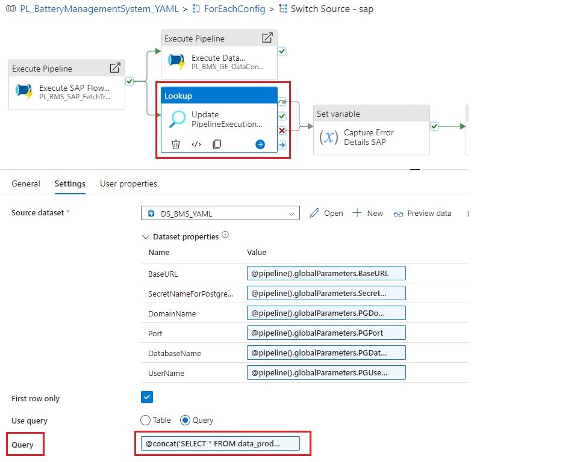

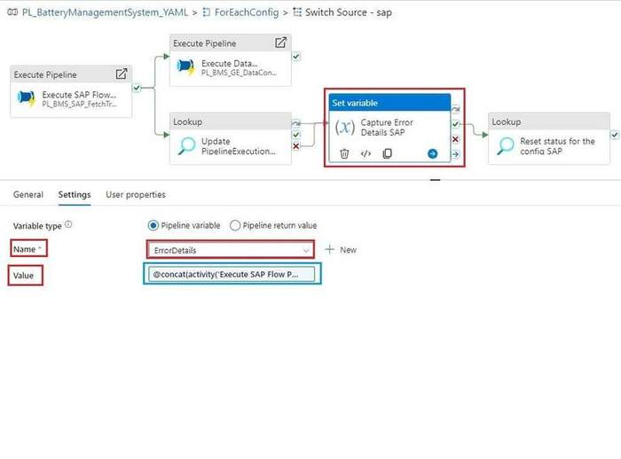

###### Lookup (Reset Status for the config SAP)

The Lookup (Reset Status for the config SAP) activity is used to call the PostgreSQL function(resetstatus_dp_dc_config_yamldata) to reset the status back to 1 after the SAP pipeline execution. If the pipeline succeeds or fails, this lookup ensures that the configuration status is set back to its initial state, allowing the pipeline to be retried or processed again. It ensures the flow continues smoothly by resetting the pipeline execution status.

Query used:

\@concat(\'SELECT \* FROM data_product.resetstatus_dp_dc_config_yamldata(\'\'\', item().config_name,\"\"\', 1);\')

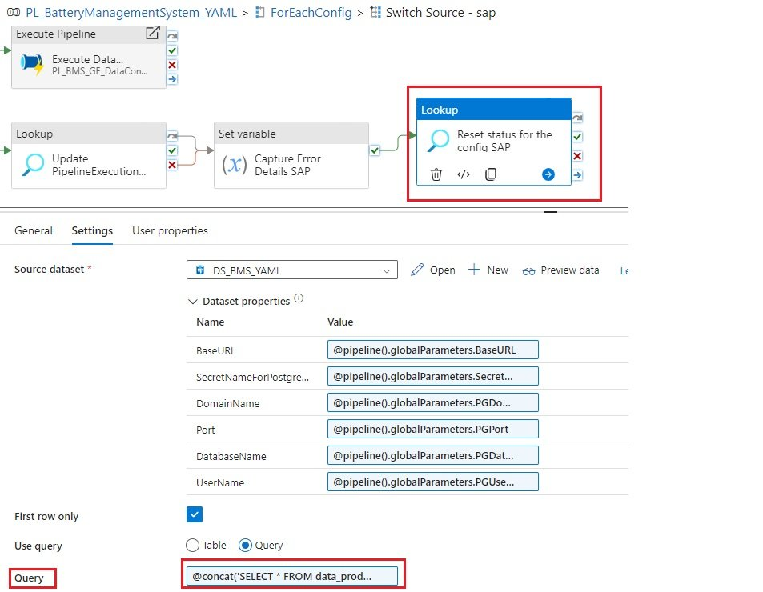

#### 

### TC Case

##### Execute TC Pipeline:

In the TC case, the Execute Pipeline activity invokes the TC pipeline(PL_BMS_TC_FetchTransformLoad_BOM_yaml) with the following parameters:

-   config_name1: This is passed as \@item().config_name, representing the configuration name for the current iteration in the loop.

-   offset: Set to a default value of 1, indicating the starting point for data extraction.

-   limit: Set to a default value of 100, which determines the maximum number of records to fetch.

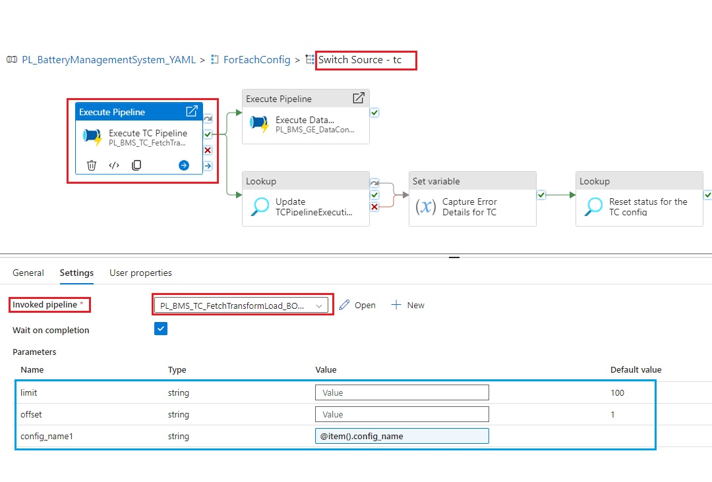

##### 

#### PL_BMS_TC_FetchTransformLoad_BOM_yaml

In the PL_BMS_TC_FetchTransformLoad_BOM_YAML pipeline, the flow begins with the following activities:

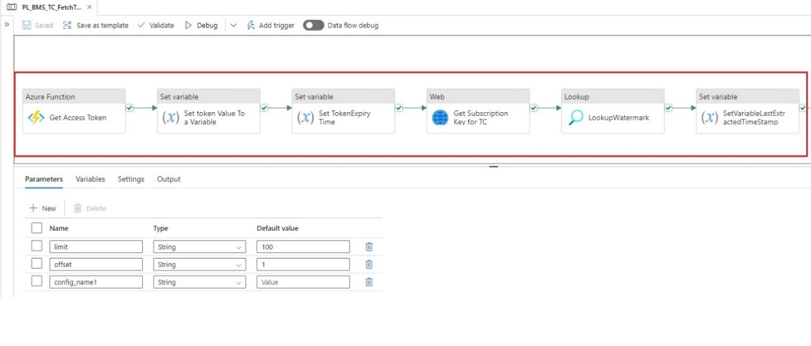

1.  Azure Function (Get Access Token): Fetches the access token required for authentication.

2.  Set Variable (Set Token Value to Variable): Stores the retrieved token value for subsequent use.

3.  Set Variable (Set Token Expiry Time): Captures the token expiration timestamp for validation.

4.  Web (Get Subscription Key for TC): Retrieves the subscription key specific to Teamcenter.

5.  Lookup (Lookup Watermark): Fetches the latest watermark values for the configuration.

6.  Set Variable (Set Variable Last Extracted Timestamp): Updates the timestamp of the last extracted data.

These activities align with similar steps detailed in the PL_BMS_TC_FetchTransformLoad_BOM pipeline.

##### Web Activity(Get Total Number of Records)

The Get Total Number of Records web activity retrieves the total record count from a paginated API. By using offset=1 and limit=1, it fetches only one record along with metadata that includes the total count. This count is used to calculate the number of pages for subsequent pagination. The activity uses necessary authentication headers and ensures efficient data retrieval without fetching unnecessary records.

**URL**: The URL is dynamically constructed using the following expression:

\@concat(pipeline().globalParameters. BMSTCRelativeURL, pipeline().parameters.config_name1,\'?modifiedAfter=\', variables (\'lastextractedtimestamp\' ), \'&amp;offset=1&amp;limits=1\')

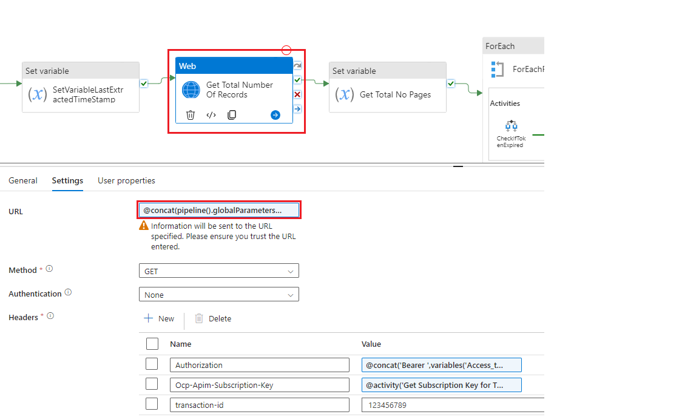

**Explanation:**

-   pipeline().globalParameters.BMSTCRelativeURL: A global parameter(BMSTCRelativeURL) containing the base URL for the Teamcenter API.

> ()

-   pipeline().parameters.config_name1: Adds the configuration name to the URL for querying specific data. Example: bom

-   ?modifiedAfter=: Specifies the filter for fetching records modified after the last extracted timestamp.

-   variables(\'lastextractedtimestamp\'): Refers to the timestamp of the last successfully extracted data.

-   &amp;offset=1&amp;limits=1: Requests the first record (offset 1) and limits the response to a single record, which is typically used to retrieve metadata about the total number of records available.

**Headers:** The web activity includes the following headers for the API request:

-   Authorization: The access token acquired from the Azure function (Get Access token)

-   Subscription-Key: The subscription key retrieved from the Web activity (Get Subscription Key for TC)

-   Transaction-ID: A unique transaction ID

For example, if there are 250 records, the variable calculates 3 pages: 2 full pages and 1 additional for the remaining 50 records.

-   Set Variable - Get Total No of Pages: Calculates the total number of pages required to fetch all records based on the record count and page size

-   ForEach Activity - ForEachPage: Iterates through each page number to process the records sequentially, ensuring pagination is handled correctly

-   If Condition - CheckIfTokenExpired: Checks if the access token has expired and renews it if necessary to ensure continuous access

-   Web Activity - Fetch Data from TC: Data is fetched from Teamcenter (TC) using the config_name1 parameter dynamically inside the Web Activity to access the appropriate data source.

-   Set Variable - Set TC Response to Variable: Stores the fetched data (bomInstances) from Teamcenter into a variable for further processing

-   Copy Data - Copy BOM Data to Blob Storage: Copies the Teamcenter BOM data to Azure Blob Storage for secure storage and backup.

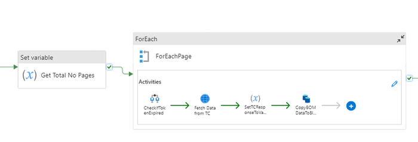

The rest of the SAP pipeline flow remains the same as the PL_BMS_SAP_FetchTransformLoadOdata_zixdtResponse, performing transformations, loading, and logging steps as described earlier.

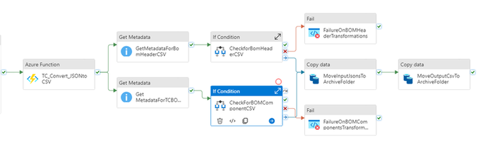

For detailed workflow explanations and the flow logic, please refer to PL_BMS_TC_FetchTransformLoad_BOM pipeline section.

##### Post Execution of PL_BMS_TC_FetchTransformLoad_BOM_YAML:

1.  **Execute Data Contracts (DC) Pipeline:**

-   Once the TC pipeline executes successfully, the DC pipeline is triggered to handle further data processing.

2.  **Lookup - Update Pipeline Execution Timestamp TC:**

-   A query is executed to update the timestamp and status for the TC configuration in the database.

3.  **Set Variable- CaptureError Details**

-   If any error occurs during the TC pipeline execution or the lookup step, the error details are captured in a variable errordetails.

4.  **Lookup - Reset Status for TC Configuration:**

-   Another lookup is used to reset the status of the TC configuration in the database irrespective of pipeline succeeds or fails

For a detailed explanation, please refer to the *Post Execution of PL_BMS_SAP_FetchTransformLoadOdata_zixdtResponse_YAML* Pipeline section.

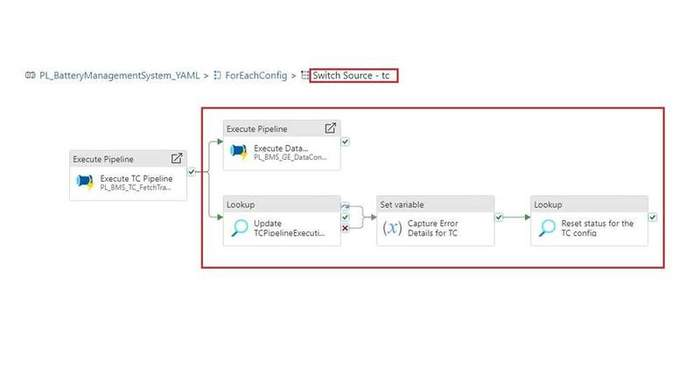

#### MES Case

##### Execute MES Pipeline

In the MES case, the Execute Pipeline activity invokes the MES pipeline (PL_BMS_MES_FetchTransformLoad_AvevaData_yaml) with the following parameters:

-   config_name1: This is passed as \@item().config_name, representing the configuration name for the current iteration in the loop.

-   offset: Set to a default value of 1, indicating the starting point for data extraction.

-   limit: Set to a default value of 500, which determines the maximum number of records to fetch.

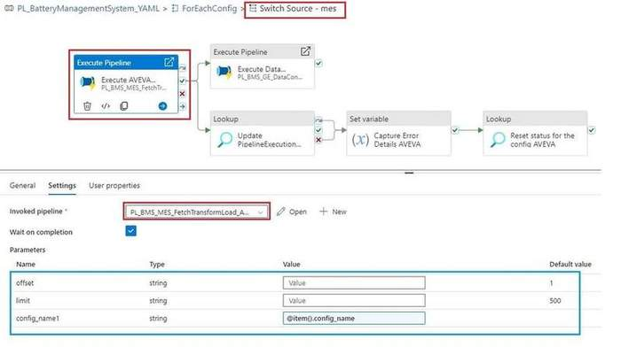

##### 

#### PL_BMS_MES_FetchTransformLoad_AvevaData_yaml

In the PL_BMS_MES_FetchTransformLoad_AvevaData_yaml pipeline, the flow begins with the following activities:

1.  Azure Function (Get Access Token): Fetches the access token required for authentication.

2.  Set Variable (Set Token Value to Variable): Stores the retrieved token value for subsequent use.

3.  Set Variable (Set Token Expiry Time): Captures the token expiration timestamp for validation.

4.  Web (Get Subscription Key for TC): Retrieves the subscription key specific to Aveva MES. Note: These activities align with similar steps detailed in the PL_BMS_MES_FetchTransformLoad_AvevaData pipeline)

5.  Set Variable (Extract config name): This Set Variable activity is used to extract the part of the configuration name that comes after the ? in the config_name1 parameter(Eg: batteryData?manufacturing_batch). It splits the config_name1 string by the ? delimiter and assigns the second part (after ?) to the variable ExtractConfigName (manufacturing_batch). This is useful when the config_name1 includes query parameters, and we need only the relevant part for further processing. Example: if the config_name is batteryData?manufacturing_batch, ExtractConfigName variable would store it as manufacturing_batch for subsequent use in different activities

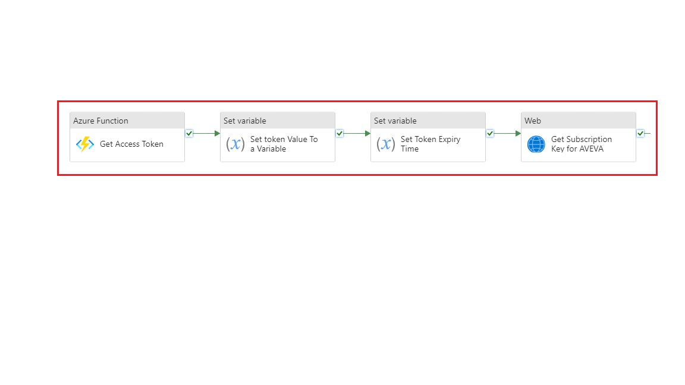

**Variable Name**: ExtractConfigName

**Value:** \@split(pipeline().parameters.config_name1, \'?\')\[1\]

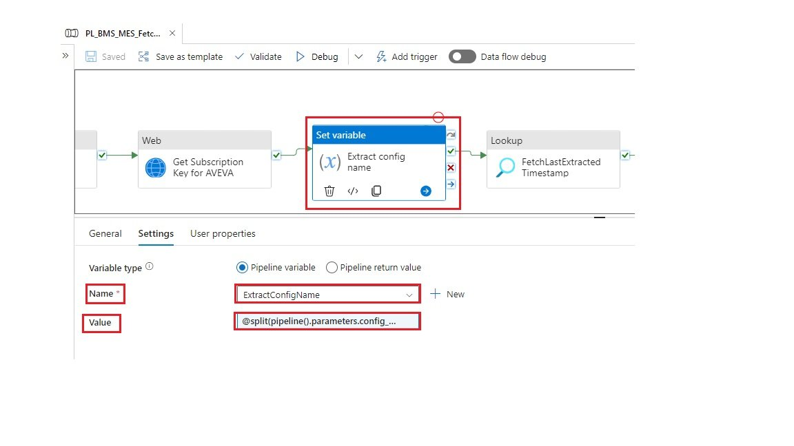

##### 

#### Lookup (FetchLastExtractedTimestamp)

This activity queries the PostgreSQL database to fetch the last extracted timestamp from the bms.avevameswatermark table. The query dynamically selects the timestamp based on the ExtractConfigName variable, which contains the relevant configuration name (extracted from config_name1).

This timestamp is used to ensure that only new or updated data is fetched from the Aveva MES system, avoiding duplication and ensuring efficient data processing.

The query used in this lookup activity is:

\@concat(\'SELECT lastextractedtimestamp FROM bms.avevameswatermark WHERE tablename = \'\'\', variables(\'ExtractConfigName\'),\'\'\'\')

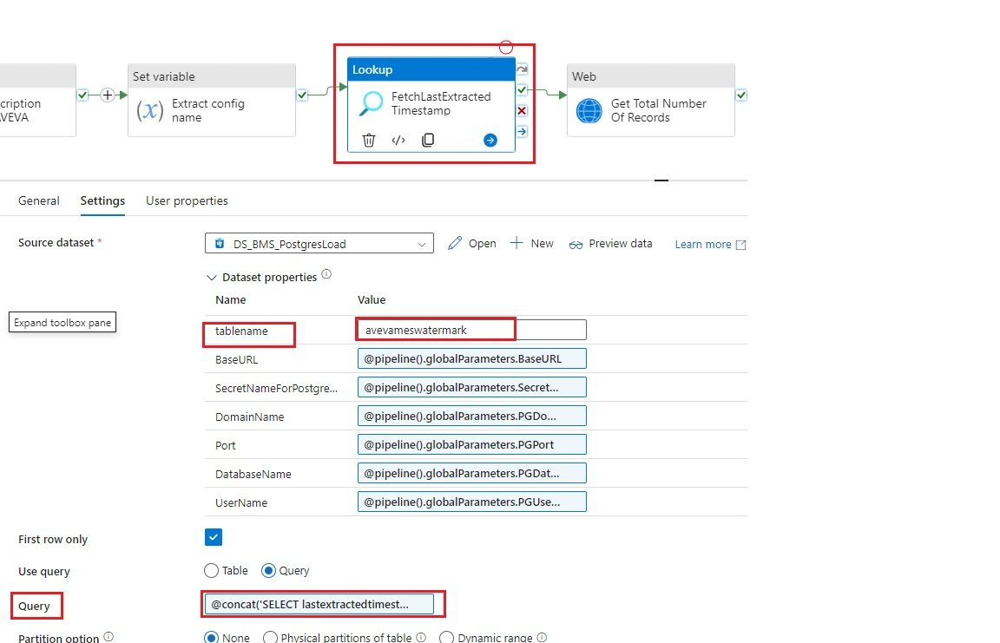

##### 

#### Web Activity- Get Total number of Records

The Get Total Number of Records web activity retrieves the total record count from a paginated API. By using offset=1 and limit=1, it fetches only one record along with metadata that includes the total count. This count is used to calculate the number of pages for subsequent pagination. The activity uses necessary authentication headers and ensures efficient data retrieval without fetching unnecessary records.

**URL**: The URL is dynamically constructed using the following expression:

\@concat(pipeline().globalParameters. RelativeURLAveva,\'source=\',variables(\'ExtractConfigName\'),\'&amp;modified_after=\',activity(\'FetchLastExtractedTimestamp\' ).output.firstRow.lastextractedtimestamp, \'&amp;offset=1&amp;limits=1\')

RelativeURLAveva: A global parameter containing the base URL for the Aveva MES API.

(? )

source: The ExtractConfigName variable, specifies the configuration for which data is to be fetched.

modified_after: The last extracted timestamp fetched from the FetchLastExtractedTimestamp activity

offset: A pipeline parameter used for pagination

limits: A pipeline parameter used for pagination

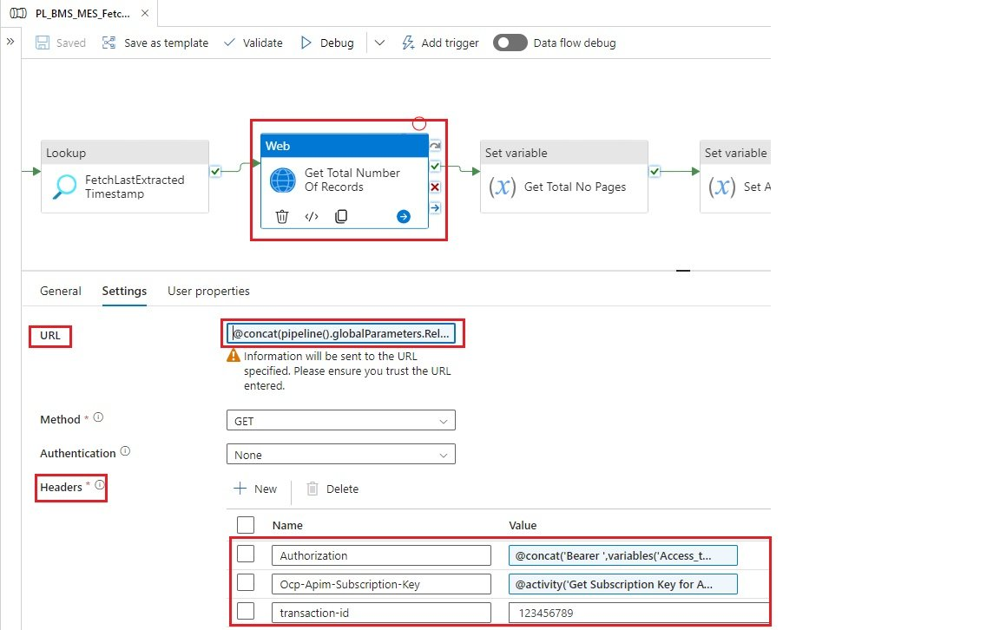

**Headers:** This activity uses the following headers for fetching data

-   Authorization: The access token acquired from the Azure function (Get Access token)

-   Ocp-Apim-Subscription-Key: The subscription key retrieved from the Web activity (Get Subscription Key for Aveva)

-   Transaction-ID: A unique transaction ID

##### 

#### Set Variable- Get Total No of Pages

The Set variable activity calculates the total number of pages required to fetch all records from a paginated API, based on the total record count and the page size.

Variable name: totalPages

Value:

\@if(greater(mod(int(activity(\'Get Total Number Of Records\').output.totalRecords), 500), 0), add(div(int(activity(\'Get Total Number Of Records\').output.totalRecords), 500), 1), div(int(activity(\'Get Total Number Of Records\').output.totalRecords), 500))

The expression (as depicted in the image) dynamically divides the total records by 500 and adds an extra page if there are leftover records. This ensures the pipeline efficiently handles pagination without missing or over-fetching records, adapting seamlessly to varying record counts.

For example, if there are 1200 records, the variable calculates 3 pages: 2 full pages and 1 additional for the remaining 200 records.

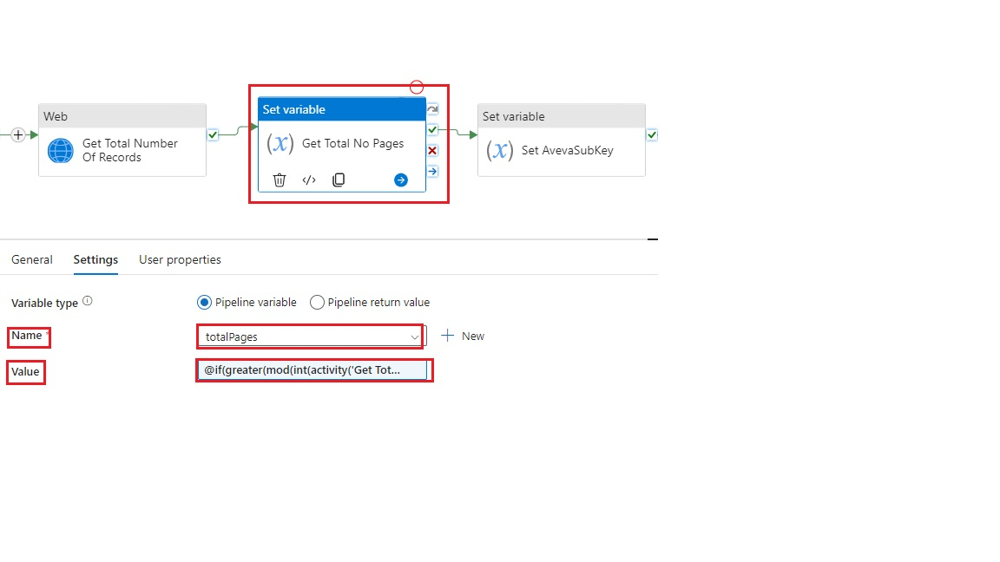

##### 

#### Set Variable - SetAvevaSubscriptionKey

After retrieving the subscription key for Aveva MES, this activity stores its value in a variable named Aveva_Subscription_Key. This key is crucial for authenticating with Aveva MES services and ensures secure interactions between the pipeline and Aveva MES.

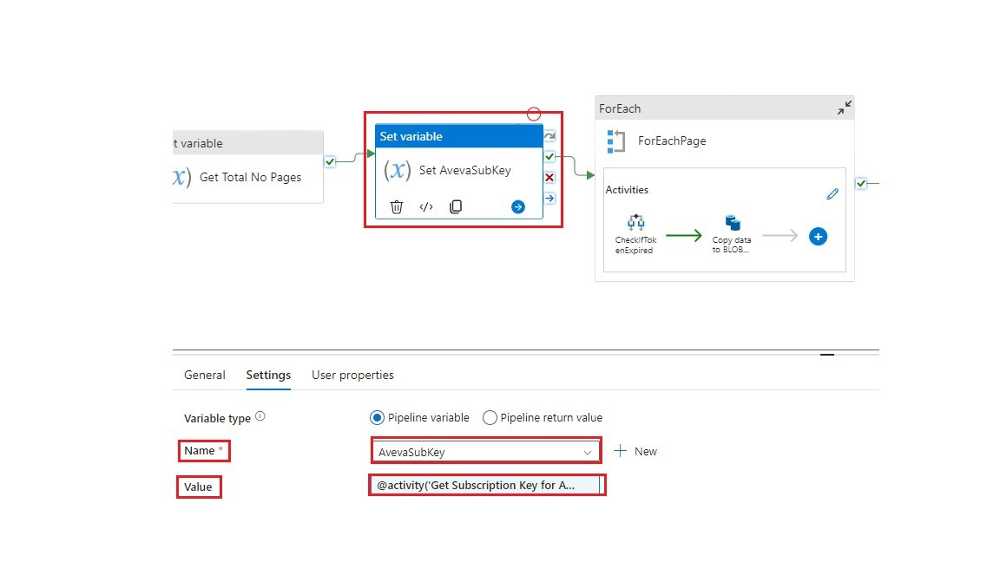

##### 

#### ForEach activity - ForeachPage

This activity iterates through the paginated data using the specified range of pages. The Items property dynamically calculates the total number of pages using the variable (totalNoOfPages). Sequential execution is enabled to ensure each page is processed one after another.

Items: \@range(1, variables(\'totalPages\'))

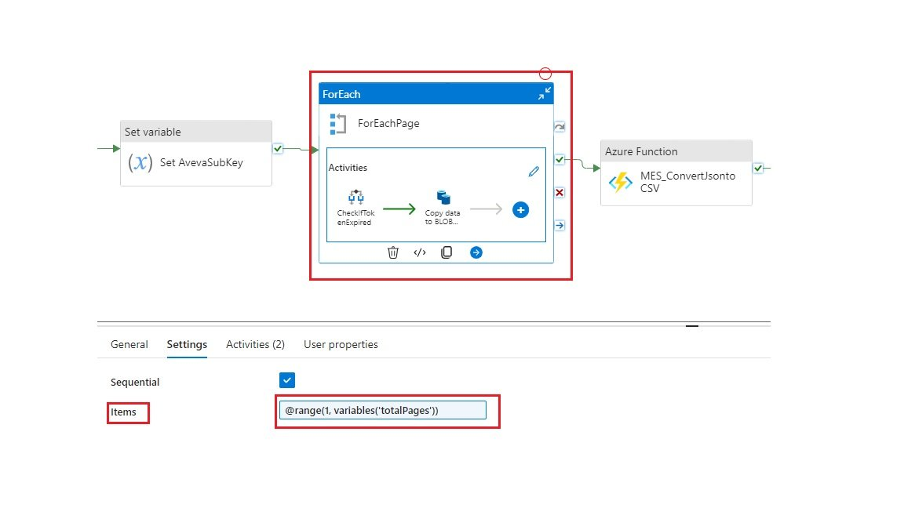

##### 

#### If Condition - CheckIfTokenExpired

Inside the ForEachPage activity, the first operation is an If Condition activity, which checks if the token has expired. The expression \@greaterOrEquals(utcNow(), variables(\'TokenExpiry\')) compares the current UTC time (utcNow()) with the stored token expiry time (TokenExpiry).

If the current time is greater than or equal to the expiry time, it indicates that the token has expired, triggering the True branch.

-   True branch:

    -   Get New Access Token: This activity fetches a new access token to ensure uninterrupted authentication.

    -   Set Variable - Access_token_value: Updates the Access_token_value variable with the newly acquired token for subsequent requests.

    -   Set Variable - TokenExpiry: Updates the TokenExpiry variable with a new expiry time calculated as 55 minutes from the current time using the expression \@addMinutes(utcNow(), 55).

-   False branch: No actions are performed when the token is still valid.

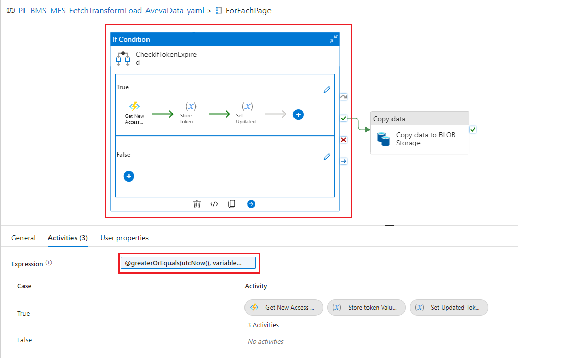

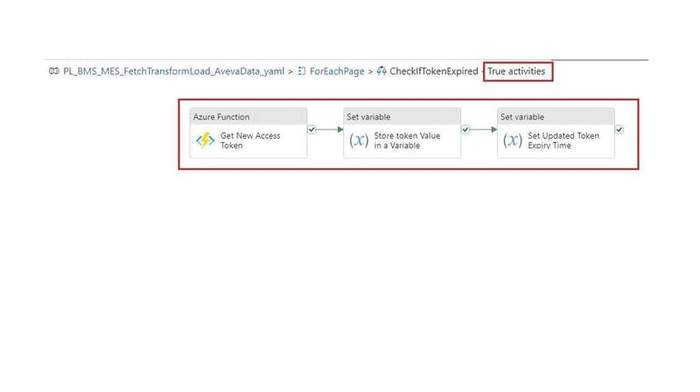

##### Copy Data - Copy data to blob storage

This activity utilizes the acquired access token and subscription key as headers, crucial for authentication and authorization, to initiate a web request for fetching the desired data from Aveva MES. The input parameters necessary for data retrieval are combined into a URL using an expression. This allows for specific data retrieval based on the provided parameters.

URL**:** The URL is dynamically generated to enable paginated responses and retrieve specific data based on input parameters. The construction expression is as follows:

\@concat(pipeline().globalParameters.RelativeURLAveva,\'source=\',variables(\'ExtractConfigName\'),\'&amp;modified_after=\',activity(\'FetchLastExtractedTimestamp\').output.firstRow.lastextractedtimestamp,\'&amp;offset=\',item(),\'&amp;limits=500\')

**Key Components of URL**

RelativeURLAveva: A global parameter containing the base URL for the Aveva MES API.

(? )

source: Specifies the current table name being processed. The table name is dynamically passed from the ForEach activity in the parent pipeline.

Example: source= resource

modified_after: A filter parameter to retrieve data modified after a specific timestamp. This value is fetched from the FetchLastExtractedTimestamp activity in the parent pipeline. Example: modified_after= 2023-09-21 12:00:56.000

offset: Specifies the starting point for pagination. The offset value is dynamically set based on the current iteration of the ForEach activity, allowing the API to return a specific page of results. Ex: offset=2

limits: Sets the maximum number of records fetched per request. Here, the limit is fixed at 500 records, optimizing API performance and ensuring manageable payload sizes.

Example URL:  12:00:56.000&amp;offset=2&amp;limits=500

Headers: This activity uses the following headers for fetching data

-   Authorization: The access token acquired from the Azure function (Get Access token)

-   Ocp-Apim-Subscription-Key: The subscription key retrieved from the Web activity (Get Subscription Key for Aveva)

-   Transaction-ID: A unique transaction ID

##### 

#### Copy Data - Copy data to blob storage

This activity utilizes the acquired access token and subscription key as headers, crucial for authentication and authorization, to initiate a web request for fetching the desired data from Aveva MES. The input parameters necessary for data retrieval are combined into a URL using an expression. This allows for specific data retrieval based on the provided parameters.

**URL:** The URL is dynamically generated to enable paginated responses and retrieve specific data based on input parameters. The construction expression is as follows:

\@concat(pipeline().globalParameters.RelativeURLAveva,\'source=\',variables(\'ExtractConfigName\'),\'&amp;modified_after=\',activity(\'FetchLastExtractedTimestamp\').output.firstRow.lastextractedtimestamp,\'&amp;offset=\',item(),\'&amp;limits=500\')

**Key Components of URL**

RelativeURLAveva: A global parameter containing the base URL for the Aveva MES API.

(? )

source: Specifies the current table name being processed. The table name is dynamically passed via the variable \'ExtractConfigName\' .

Example: source= manufacturing_batch

modified_after: A filter parameter to retrieve data modified after a specific timestamp. This value is fetched from the FetchLastExtractedTimestamp activity in the parent pipeline. Example: modified_after= 2023-09-21 12:00:56.000

offset: Specifies the starting point for pagination. The offset value is dynamically set based on the current iteration of the ForEach activity, allowing the API to return a specific page of results. Ex: offset=2

limits: Sets the maximum number of records fetched per request. Here, the limit is fixed at 500 records, optimizing API performance and ensuring manageable payload sizes.

Example URL: [https://ix-dev-apimgmt.azure-api.net/avevames-api/mes/batteryData?source=manufacturing_batch &amp;modified_after=2023-09-21](https://ix-dev-apimgmt.azure-api.net/avevames-api/mes/batteryData?source=manufacturing_batch%20&amp;modified_after=2023-09-21) 12:00:56.000&amp;offset=2&amp;limits=500

**Headers**: This activity uses the following headers for fetching data

-   Authorization: The access token acquired from the Azure function (Get Access token)

-   Ocp-Apim-Subscription-Key: The subscription key retrieved from the Web activity (Get Subscription Key for Aveva)

-   Transaction-ID: A unique transaction ID

The fetched data, in JSON format, is copied to the designated Azure Blob Storage container. This ensures that the raw data is securely backed up before any transformations are applied.

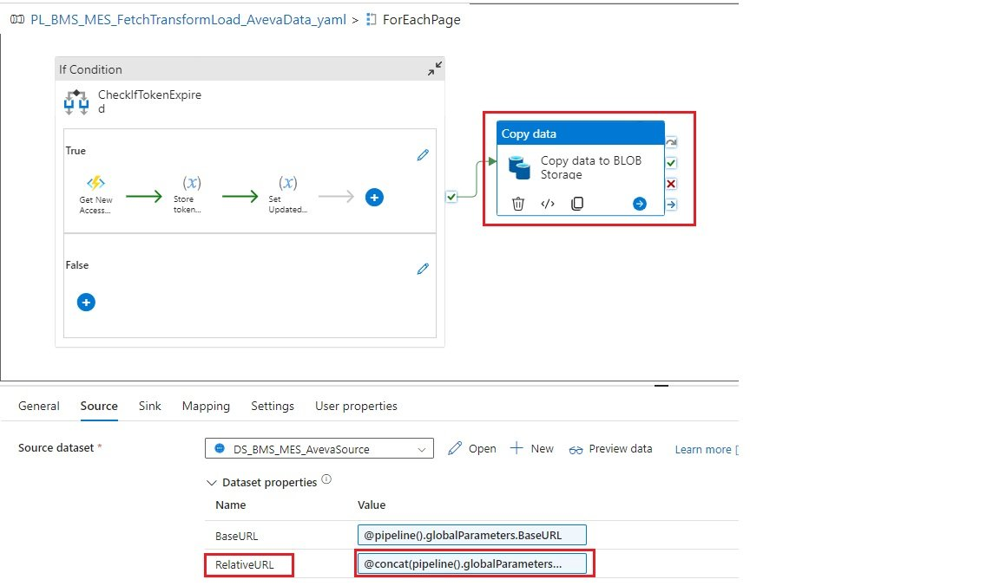

##### 

#### Remaining Flow

The rest of the MES pipeline flow remains the same as the PL_BMS_MES_FetchTransformLoad_AvevaData, performing transformations, loading, and logging steps as described earlier.

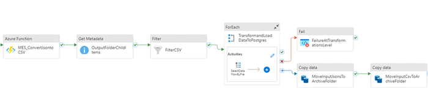

##### Post Execution

1.  **Execute Data Contracts (DC) Pipeline:**

-   Once the MES pipeline executes successfully, the DC pipeline is triggered to handle further data processing.

2.  **Lookup - Update Pipeline Execution Timestamp MES:**

-   A query is executed to update the timestamp and status for the MES configuration in the database.

3.  **Set Variable- CaptureError Details**

-   If any error occurs during the MES pipeline execution or the lookup step, the error details are captured in a variable errordetails.

4.  **Lookup - Reset Status for MES Configuration:**

-   Another lookup is used to reset the status of the MES configuration in the database irrespective of pipeline succeeds or fails

For a detailed explanation, please refer to the Post Execution of PL_BMS_SAP_FetchTransformLoadOdata_zixdtResponse_YAML Pipeline section.

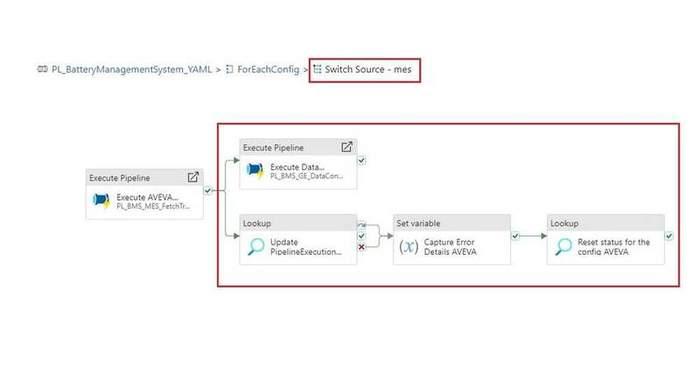
