

Digital Thread Foundations

ADF Battery Management System

WORKFLOW

Release Version: 1.2

Metadata Table

| **Field** | **Value** |
| --- | --- |
| **Asset / Solution Name** | Digital Thread |
| **Domain / Area** | Engineering |
| **Owner (Team/Person)** | Karthik Ramachandra |
| **Reviewers** | Karthik Ramachandra |
| **Status** | Approved / Complete |
| **Confidentiality** | Internal / Confidential |
| **Source of Truth** | [link](https://dev.azure.com/IXAssets/IXAssetsProject/\_git/ixassets) |
| **Related Assets / Alternatives** | AOT / Engineering Orchestration / Engineering Agents |

## Introduction

A digital thread refers to the continuous and consistent flow of information throughout the entire lifecycle of a product or system - from design and development to operation and maintenance. It enables the integration of data from different stages and sources, allowing effective traceability, seamless collaboration, and efficient decision-making by unleashing the power of sleeping data. The digital thread is considered a key aspect of Industry 4.0 and the digital transformation of the manufacturing industry. It is the core of what we call the Enterprise Operating System (EOS). Digital Thread is a communication framework that helps integrate various enterprise systems involved in the engineering and manufacturing product life cycle.

The Battery Management System (BMS) use case is part of the IX Digital Thread framework. It is a data product that helps different components communicate and work together. This makes it easier for users to work with data. The system can handle any type of industrial data. Azure Data Factory (ADF) pipelines are used to move data from different sources into a PostgreSQL database. ADF also checks the data to make sure it is correct.

### Purpose

This document delves into a specific Azure Data Factory (ADF) workflow designed for the Software-defined Battery Management System (BMS) use case within the Digital Thread\'s framework. This workflow demonstrates how ADF streamlines data movement, transformation, and integration across diverse sources related to battery management data.

### Target Audience

-   Azure Data Factory Developers

-   Software Architects

-   Integrators with IT Background

### Prerequisites

-   Access to Azure subscription with relevant resources.

-   Basic/Working knowledge of ADF.

-   Basic understanding of data integration concepts

###  Technology Stack

-   Azure Data Factory

-   PostgreSQL

-   SAP

-   Teamcenter

-   Aveva MES

### Business Contacts

-   [florian.tournier@accenture.com](mailto:florian.tournier@accenture.com)

-   [laura.mosconi@accenture.com](mailto:laura.mosconi@accenture.com)

-   [karthik.ramachandra@accenture.com](mailto:karthik.ramachandra@accenture.com)

### Technical Contacts

-   [laura.mosconi@accenture.com](mailto:laura.mosconi@accenture.com)

-   [stefano.giacco@accenture.com](mailto:stefano.giacco@accenture.com)

-   [florian.tournier@accenture.com](mailto:florian.tournier@accenture.com)

### Related Links

-   [IX Digital Thread Documentation](https://industryxdevhub.accenture.com/asset-home;search_text=ix%20digital%20thread)

-   [Data Products Documentation](https://industryxdevhub.accenture.com/assetdetails/104)

### Definitions

| **Term** | **Definition** |
| --- | --- |
| ADF | Azure Data Factory |
| ADX | Azure Data Explorer |
| GE | Great Expectations |
## 

# 

## Workflow

This diagram illustrates the data processing flow for BMS. The workflow involves the extraction, transformation, validation, and loading of data from three different source systems: SAP, Teamcenter (TC), and Aveva MES. Each step is designed to ensure efficient and secure data handling, from initial extraction to final validation and visualization.

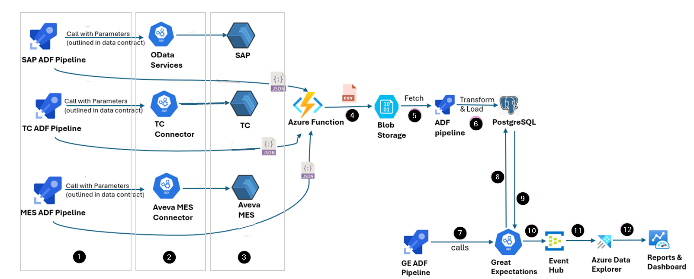

The subsequent sections describe the comprehensive workflow depicted in the image above.

### 

## 

### Step 1 - Initiate ADF Pipelines

The first step is to initiate the three pipelines-SAP, TC, and MES-with parameters to establish a secure and verified connection with the respective source system.

-   SAP ADF Pipeline calls parameters such as URLs for OData services, authorization credentials, and other linked service parameters specific to SAP. This step ensures necessary authentications and authorizations are in place to fetch data from SAP.

-   TC ADF Pipeline calls parameters for the TC Connector such as URLs, authentication tokens, and other configurations required to connect to Teamcenter and retrieve data.

-   MES ADF Pipeline invokes parameters related to the Aveva MES Connector, using the provided URLs and credentials to fetch data from Aveva MES.

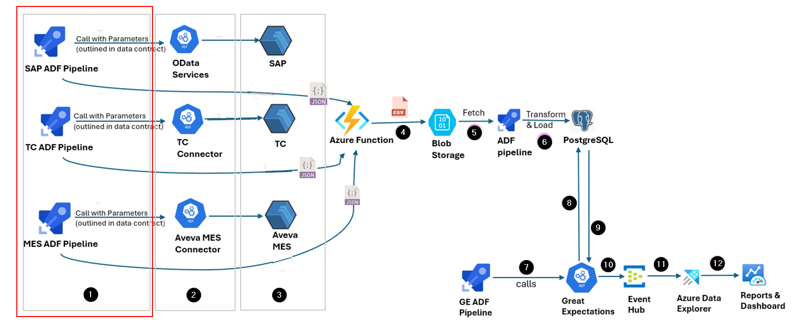

### 

## 

### Step 2- Extract Data from Source Systems 

In the second step, the pipelines extract data from the respective source systems.

-   SAP ADF Pipeline utilizes OData services to extract data from SAP.

-   TC ADF Pipeline uses the TC Connector to extract data from Teamcenter.

-   MES ADF Pipeline leverages the Aveva MES Connector to fetch data from Aveva MES.

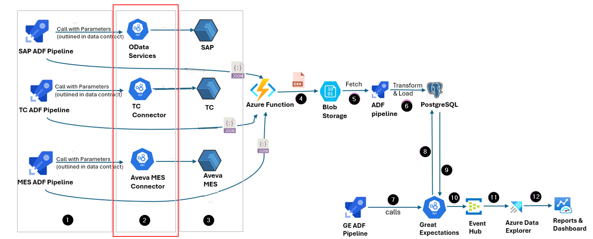

### 

## Step 3 - Store Extracted Data

The extracted data from the three source systems is initially in JSON format. This JSON data is temporarily stored in Azure Blob Storage. Blob Storage provides scalable and secure storage for large volumes of unstructured data, ensuring that the extracted JSON files are safely stored before further processing.

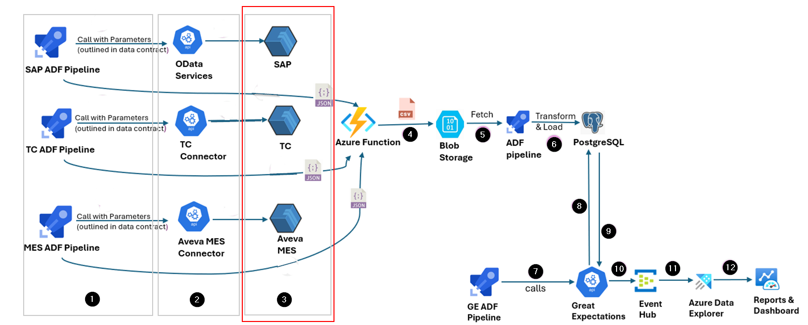

### 

## Step 4 - Convert Extracted Data 

The extracted data is converted by triggering an Azure function. The function processes the JSON data stored in Blob Storage by:

-   Reading the JSON files from Blob Storage.

-   Converting the complex JSON structure into CSV format for easier processing and analysis.

-   Writing the resulting CSV files back to Blob Storage, making them ready for the next steps.

### 

## 

### Step 5 - Fetch and Transform Data 

ADF pipelines designed to perform data transformations specific to the source (SAP, TC, MES) are triggered to fetch the CSV data from the Blob Storage. This pipeline performs several transformation tasks, such as:

-   Data cleansing: Null values are removed, and data inconsistencies are rectified.

-   Deduplication: Duplicate records are identified and removed.

    Applying business logic: Data is transformed as per the business requirements specified in the logic.

The transformed data is then prepared for loading into the target database.

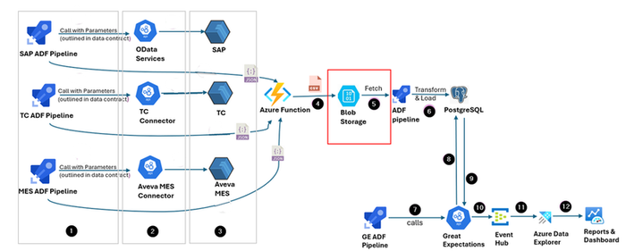

### 

## Step 6 - Load Transformed Data 

The transformed CSV data is loaded into PostgreSQL target tables, where it is stored for further processing and validation. PostgreSQL is a powerful, open-source relational database system that provides robust data management capabilities. The loading process involves:

-   Connecting to the PostgreSQL database.

-   Inserting the transformed data into the appropriate tables.

-   Ensuring data integrity and consistency during the loading process.

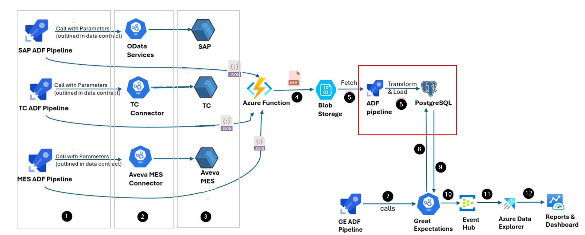

### 

## 

### Step 7 - Trigger GE Pipeline

After the data is loaded into PostgreSQL, the GE ADF pipeline is triggered. This pipeline calls the Great Expectations (GE) API, which is a tool for validating, documenting, and profiling data. The GE pipeline performs the following tasks:

-   Initiates the GE API to start the validation process.

-   Passes the necessary parameters to the GE API to specify the validation rules and expectations.

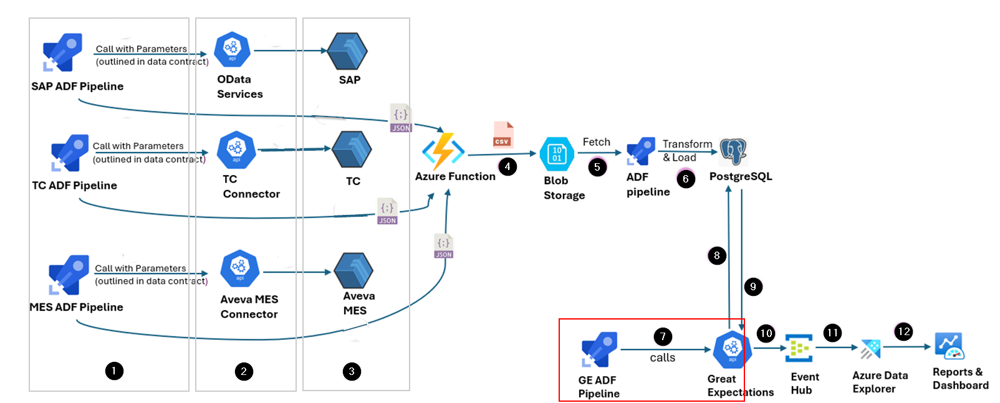

### 

## Step 8 - Validate Data with GE API 

The GE API performs data validations to ensure that the data meets the required quality standards. Its tasks include:

-   Reading data from PostgreSQL tables.

-   Applying validation rules to check for data accuracy, completeness, and consistency.

-   Generating validation reports and logs for review.

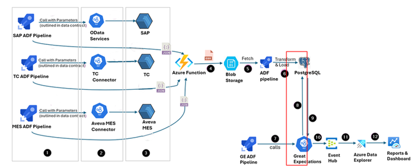

### 

## Step 9 - Store Validated Data 

The validated data is handled as well as stored by Great Expectations, ensuring it conforms to all specified rules and quality checks.

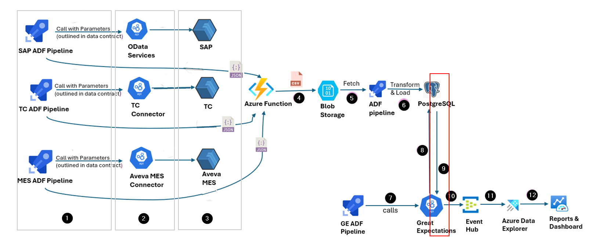

###  Step 10 - Send Data to Event Hub 

After validation, the data is sent to Azure Event Hub. Event Hub is a big data streaming platform and event ingestion service that can receive and process millions of events per second. This step involves:

-   Streaming the data that has been validated with the status of validations and other logs to the Event Hub.

-   Ensuring that the data is securely transmitted.

-   Preparing the data for further processing and analysis.

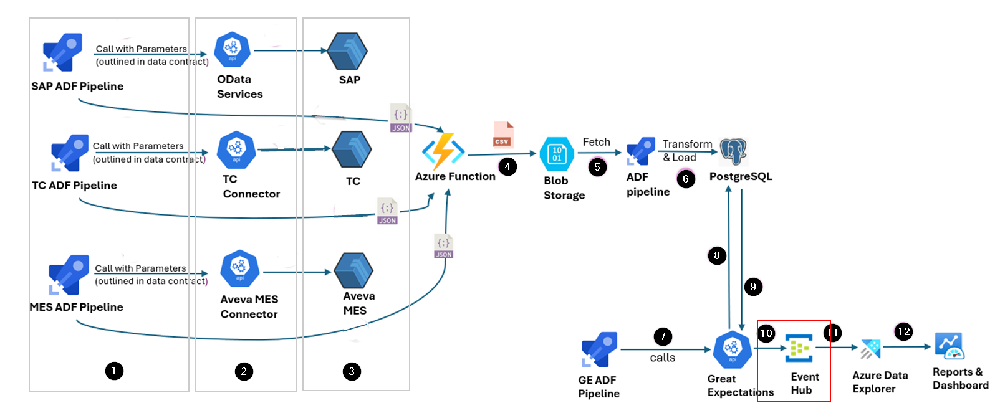

### 

## 

### Step 11 - Ingest Data into ADX

ADX provides powerful querying capabilities, allowing users to perform advanced data analysis and gain insights from the validated data. The following tasks are performed at this step:

-   A connection between Event Hub and ADX is established for data ingestion.

-   Data is ingested into ADX for real-time analysis.

-   Complex queries are performed on the data to derive insights.

###  Step 12 - Visualize Data 

Finally, the results of the data analysis are visualized in dashboards and as reports. These visualization methods provide end-users with actionable insights, enabling informed decision-making based on the processed and validated data. The following tasks are performed at this step:

-   The queried results are pinned to workbooks in Azure Data Explorer.

-   These workbooks are then used to create interactive dashboards that provide visual insights and facilitate decision-making.

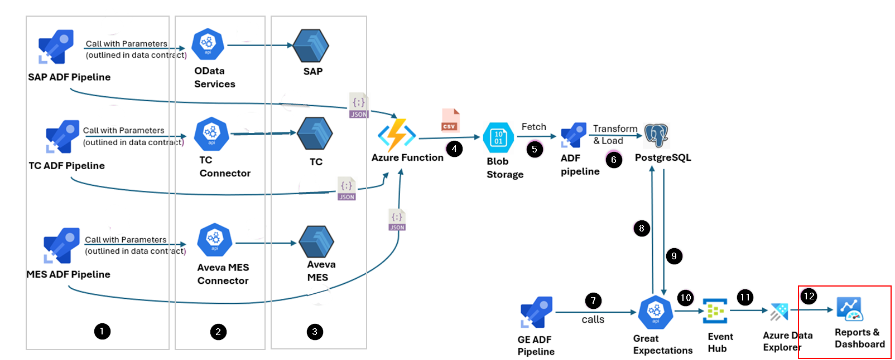
