Accenture Operations Twin

Azure Deployment

ARCHITECTURE BLUEPRINT
hy
Release Version: 2.5

**Metadata Table**

  -------------------------------------------------------------------------------------------------------------------------------
  **Field**                           **Value**
  ----------------------------------- -------------------------------------------------------------------------------------------
  **Asset / Solution Name**           Accenture Operations Twin / AOT

  **Domain / Area**                   Digital Twin / Architecture

  **Owner (Team/Person)**             Tournier, Florian

  **Reviewers**                       Susarla, Aditya, Takó, István

  **Status**                          Draft / In Progress

  **Confidentiality**                 Internal / Confidential

  **Source of Truth**                 [[Summary - Overview]](https://dev.azure.com/DigitalPlantProject/Marilyn%20V)

  **Related Assets / Alternatives**   
  -------------------------------------------------------------------------------------------------------------------------------

**Contents**

[Introduction [3](#introduction)](#introduction)

[Purpose [3](#purpose)](#purpose)

[Target Audience [3](#target-audience)](#target-audience)

[Prerequisites [3](#prerequisites)](#prerequisites)

[Contacts [3](#contacts)](#contacts)

[Related Links [3](#related-links)](#related-links)

[Glossary [3](#glossary)](#glossary)

[Structure [4](#structure)](#structure)

[Enterprise Landscape [5](#enterprise-landscape)](#enterprise-landscape)

[Components and Services [6](#components-and-services)](#components-and-services)

[DataOps [7](#dataops)](#dataops)

[Containers [8](#containers)](#containers)

[Deployment [8](#deployment)](#deployment)

[Platform Tools [10](#platform-tools)](#platform-tools)

[Scheduler service [10](#scheduler-service)](#scheduler-service)

[Data Analytics Models [11](#data-analytics-models)](#data-analytics-models)

[MLOps [12](#mlops)](#mlops)

[Internationalization and Localization [14](#internationalization-and-localization)](#internationalization-and-localization)

[People Management [16](#people-management)](#people-management)

[System context [16](#system-context)](#system-context)

[Containers [17](#containers-1)](#containers-1)

[Deployment diagrams [18](#deployment-diagrams)](#deployment-diagrams)

[Intelligent Advisor [19](#intelligent-advisor)](#intelligent-advisor)

[Domain Model [20](#domain-model)](#domain-model)

[Containers [21](#containers-2)](#containers-2)

[Insight Generation [22](#insight-generation)](#insight-generation)

[Deployment [23](#deployment-2)](#deployment-2)

[Expert Knowledge [24](#expert-knowledge)](#expert-knowledge)

[Domain model [26](#section-16)](#section-16)

[Smart KPIs [27](#smart-kpis)](#smart-kpis)

[Domain Model [28](#domain-model-2)](#domain-model-2)

[Full Domain Model [29](#full-domain-model)](#full-domain-model)

[Containers [30](#containers-3)](#containers-3)

[Calculation Integrations [31](#calculation-integrations)](#calculation-integrations)

[Deployment [32](#deployment-3)](#deployment-3)

[Operation Hierarchy [33](#operation-hierarchy)](#operation-hierarchy)

[Containers [34](#containers-4)](#containers-4)

[Deployment [35](#deployment-4)](#deployment-4)

[Production Manager [36](#production-manager)](#production-manager)

[3D Visualization [40](#section-27)](#section-27)

[Containers [42](#containers-5)](#containers-5)

[Deployment diagrams [43](#deployment-diagrams-1)](#deployment-diagrams-1)

[Reporting [44](#reporting)](#reporting)

[System context [44](#system-context-1)](#system-context-1)

[Containers [45](#containers-6)](#containers-6)

[Deployment diagrams [46](#section-31)](#section-31)

[Applications [47](#applications-5)](#applications-5)

[Host App [48](#host-app)](#host-app)

[Configuration Apps [48](#configuration-apps)](#configuration-apps)

[Appendix [49](#appendix)](#appendix)

[Guiding Principles [49](#guiding-principles)](#guiding-principles)

[Patterns [49](#patterns)](#patterns)

# Introduction

An Accenture Asset, Accenture Operations Twin (AOT) is a collection of software accelerators and tools that can be assembled to deliver client solutions. AOT accelerates the integration of product, process, and live data from disparate IT and OT systems, creating a comprehensive and contextualized view of operations to enable better decisions and optimized processes.

## Purpose

The purpose of this document is to provide an overview of an Azure-based architecture for AOT. After reading, the target audience should understand the overall architecture of the system and the technical implementation of its modules.

## Target Audience

Software architects, developers, and integrators with IT background, familiarity with a digital twin, data ingestion, data contextualization, knowledge graph, advanced analytics, artificial intelligence, Cognite, and Azure services and artifacts.

## Prerequisites

Familiarity with Azure services:

-   Azure Digital Twin

-   Azure Data Explorer

-   Azure Cosmos DB

-   Azure Data Factory

-   Azure IOT Hub

## Contacts

-   istvan.tako@accenture.com

-   janos.puskas@accenture.com

-   florin.horodinca@accenture.com

##  Related Links

-   [[AOT Documents]](https://industryxdevhub.accenture.com/asset-home;search_text=AOT)

-   [[Release Notes]](https://industryxdevhub.accenture.com/assetdetails/45)

-   [[AOT Twin Builder and Twin Viewer Architecture Blueprint]](https://industryxdevhub.accenture.com/assetdetails/47)

-   [[AOT_People Management_Context Diagram]](https://ts.accenture.com/:u:/r/sites/GlobalDocTemplates/Published%20Documents/AOT/Linked%20Files/AOT_People%20Management_Context.svg?csf=1&web=1&e=jiA5Ip)

-   [[AOT People Management Architecture Blueprint]](https://industryxdevhub.accenture.com/assetdetails/64)

## Glossary

| **Term** | **Description** |
| --- | --- |
| Ingestion | Consuming data taken from external systems and storing it in the central data model of the DataOps platform |
| Data model | The data model is the central point of the DataOps platform on which AOT features are built and executed. It is optimized for modeling operations data and creating a knowledge graph. |
| Contextualization | Contextualization means creating relationships between entities inside the Knowledge Graph, this way giving a more complete context to each entity (data entry). The more complete the knowledge graph becomes, the more possibilities for finding patterns and gaining knowledge will be. |
|  | A trivial example would be measurements stored in a time series linked to an asset, representing a piece of equipment, on which the measurements were performed. |
| Business Logic | The business logic can appear in several forms inside AOT, including Insight generator data analytics models and KPI value calculation functions. The logic can involve advanced analytics, AI, ML, or conventional business logic to consume and manipulate the knowledge graph. |
| APIs | Exposes data and business logic toward the external world. |
| Applications | Business applications, reports, and dashboards are implemented on top of the business logic and knowledge graph of the solution. |

# Structure

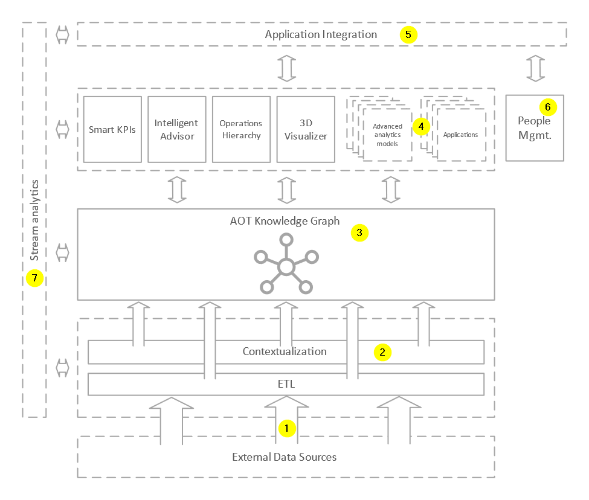

**Building Blocks**

The numbered list below corresponds to the numbered callouts on the diagram in the left column.

1.  Raw data from external IT and OT systems is extracted, transformed, and then loaded into AOT.

2.  The contextualization layer facilitates fast and scalable contextualization of data. Relationships between discrete data elements coming from siloed data sources need to be built and stored to make possible logical navigation and reasoning, hence transform the data into knowledge.

3.  The contextualized data is stored and provided as a knowledge graph, which also serves as the domain model of the business.

4.  Applications and advanced analytics models live on top of the knowledge graph.

5.  The individual applications interoperate with other business applications via the application integration layer. This involves collaboration between the AOT applications but also with external applications.

6.  AOT provides a People Management module.

7.  At any point in time where data is generated and/or exchanged, stream analytics possibility is provided.

A simplified flow is shown in the graphic below.

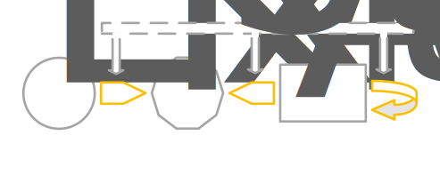

# 

# Enterprise Landscape

The concepts mentioned above are delivered below as technical artifacts in the AOT System landscape. The system landscape diagram also indicates how AOT integrates into a customer\'s ecosystem.

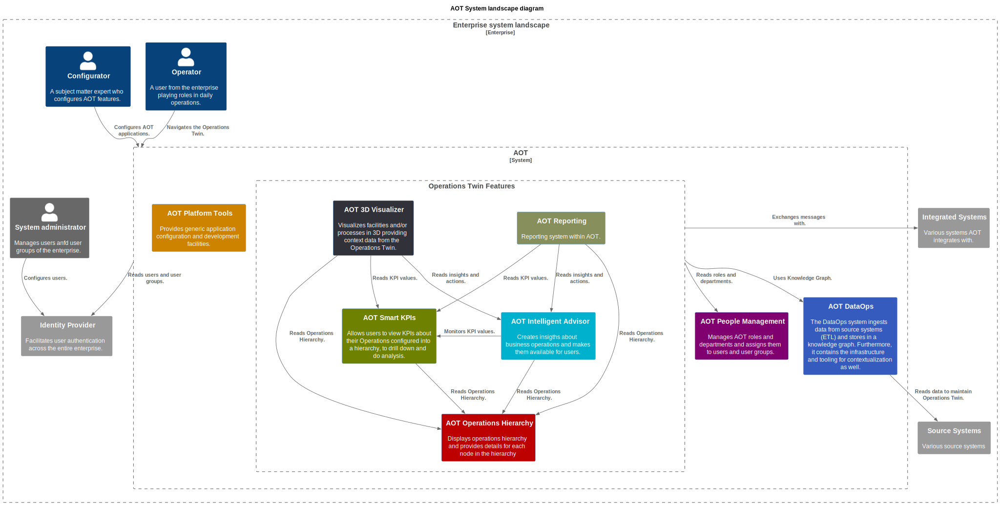

# 

# Components and Services

The diagram below shows how AOT systems are implemented on top of Azure services.

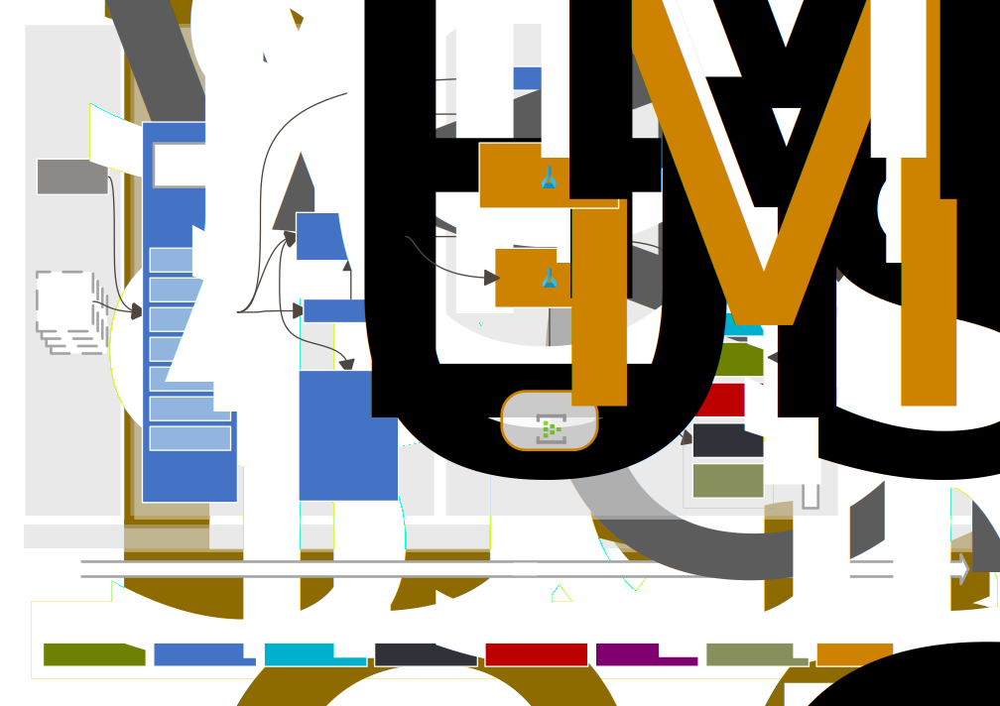

-   Real-time data is integrated through an edge component and middleware into an IoT Hub, then processed by stream analytics, and ultimately stored in Azure Data Explorer (ADX) or updated in Azure Digital Twin (ADT) as needed.

-   The stream analytics component provides the possibility to identify outstanding data points near-real time and to generate events into the Event Hub (Message Broker) whenever needed.

-   Batch data to be integrated via Data Factory. Assuming that there is some sort of edge environment, the Data Factory Integration runtime will be deployed there.

-   The Knowledge Graph will be composed of multiple services. ADT is the central piece, keeping the connection and context between the objects of the system. ADX is primarily responsible for time series data, events, and records. Azure Data Lake Storage (ADLS) will host the nonstructured data, while Structured Query Language (SQL) Databases will hold configuration and master data.

-   On Azure, the primary Machine Learning model execution environment is Azure ML Ops. These are the services leveraged for teaching a model, deploying to cloud execution and on Edge execution, and executing on top of the Knowledge Graph or the live data stream.

-   The microservices responsible for the business logic are impacted only on the data access layer level. The executed business logic does not depend on the underlying DataOps platform.

The subsystems shown above are described in the sections that follow.

# DataOps

The DataOps system of AOT ingests data from various source systems and stores it in a knowledge graph to maintain the Operations Twin. Furthermore, it contains the infrastructure and tooling for contextualization as well.

AOT sub-systems including Smart KPIs, Intelligent Advisor, 3D Visualizer, and Operations Hierarchy can use this knowledge graph to perform their operations.

The following diagram depicts the context of the DataOps system within the AOT landscape.

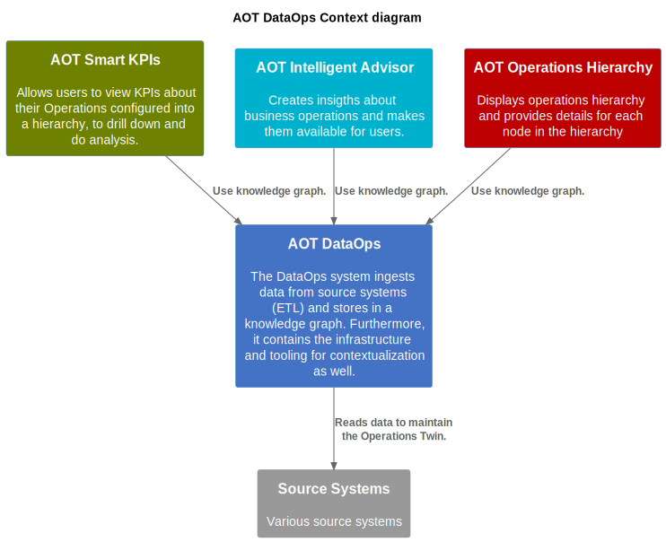\
#### Dependencies

Any external IT and OT source systems can be a dependency on the AOT DataOps system.

#### Consumers

As detailed in the table below, AOT subsystems are the usual consumers of the AOT DataOps system.

  
| **AOT Subsystem** | **Purpose** |
| --- | --- |
| Smart KPIs | Allows users to view KPIs about their Operations configured into a hierarchy, to drill down, and do analysis.
| Intelligent Advisor | Creates insights about business operations and makes them available for users.
| 3D Visualizer | Visualizes facilities and/or processes in 3D, providing context data from the Operations Twin.
| Operations Hierarchy | Displays operations hierarchy and provides details for each node in the hierarchy.
 
## Containers

This architecture outlines how the AOT DataOps system is built using Azure services. Every component of AOT DataOps is set up and managed within Azure.

The container diagram below illustrates each part of the system, highlighting the key connections between components.

The tables that follow explain the function and purpose of each part of the DataOps module.

### Data storage

| **Name** | **Responsibility** |
| --- | --- |
| AOT Knowledge Graph | Represents the different entities of AOT (Assets, KPIs, Insights, Actions, etc.) and the relationship between these entities. |
| AOT Knowledge Data | Stores Data belonging to the Knowledge Graph. |
| AOT Knowledge Data Lake | Stores all Raw data coming from data sources |
| AOT Knowledge Relational Data | Stores Reference Data coming from the source system |

### Edge / On-Premise

| **Name** | **Responsibility** |
| --- | --- |
| Azure IoT Edge | This microservice is a data access microservice. It enables OH data querying for authenticated users based on their role assignments. |
| Azure Data Factory | Enables Extract/Load/Transform (ETL) Pipelines to move data from On Prem to the cloud. |

### Source Systems

| **Name** | **Responsibility** |
| --- | --- |
| Knowledge Graph | Various source systems. |

As shown in the diagram, the Azure-based DataOps architecture consists of:

-   Containers that are specific to DataOps

-   The different other modules of AOT (Smart KPIs, Intelligent Advisor, etc\...) consuming information needed to generate the correct predictions and actions.

Check the legend of the diagrams to learn color coding. Click on the image to enlarge it.

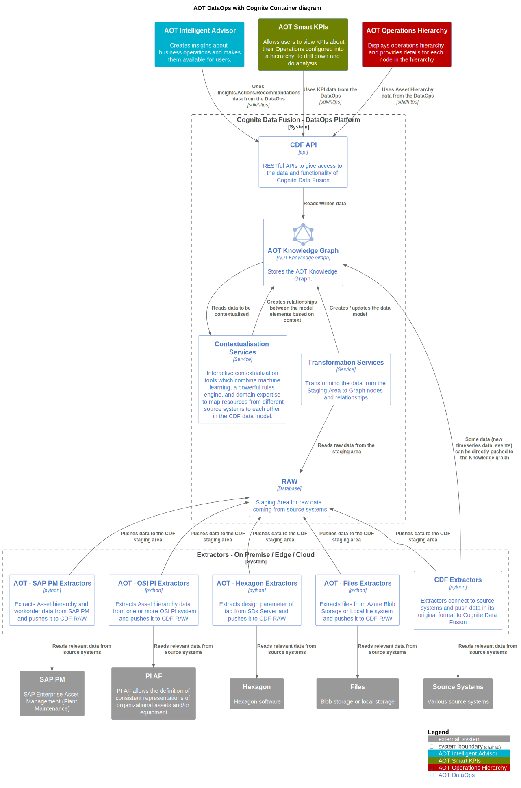

## Deployment 

The diagram shows where each of the system components are hosted, along with lines of communication. Click the image to enlarge it.

# Platform Tools

Platform Tools is a collection of general-purpose components that are available to multiple sub-systems of AOT. Each of the individual tools is described in the sections that follow.

## Scheduler service

The Scheduler Service in AOT is a microservice in Python.

This microservice is implemented in a multiprocessing/multi thread manner. All tasks that need to be executed will be stored as scheduler configurations in SQL Database.

The API of the microservice exposes the possibility to create, modify, and delete tasks. Every time a task is created, the scheduler instantiates and schedules the task to run at the desired time. When a task is modified, the scheduler determines the process of the current task and stops it, and then instantiates a new task with the new settings.

When a task is deleted, the scheduler identifies its process and terminates it. Every task operation is also reflected in the database configuration of the scheduler.

When a task is executed, it raises an event as a message through the Message Broker, and then writes an execution log to SQL Table to use later in case of system stop/restart. When system start/restart the Microservice loads all the tasks to be executed.

### Microservices

| **Name** | **Responsibility** |
| --- | --- |
| Scheduler Microservice | This microservice has the role of triggering events based on user-defined schedules. It exposes an API to set up the required scheduler jobs and, based on the configured period, it creates the necessary event needed to trigger the job, which is sent to a Kafka topic. These events are consumed by subscribers to the topic, which trigger business logic in the backend (KPI calculations, Insight creation, etc.) |

### Data storage

| **Name** | **Responsibility** |
| --- | --- |
| Scheduler Configuration Database | Stores the scheduler configuration, historical information about scheduler executions. |

The following container diagram describes the individual components of the system, with the most relevant connections highlighted.

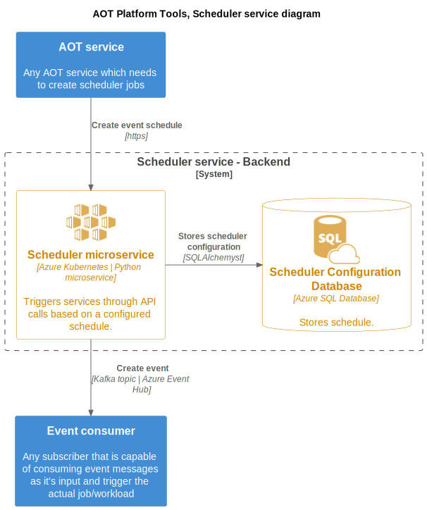

## 

## **Data Analytics Models**

Data Analytics Models are algorithms that identify patterns for specific use cases in the data. There are multiple types of models, implemented and hosted in a huge number of different ways. The AOT Data Analytics Models provides patterns to utilize these algorithms within the AOT solution.

One of the use cases of advanced analytics / machine learning models in AOT is to enhance the Intelligent Advisor microservice\'s ability to create predictions about the future possible functional state of an asset and react accordingly on the output.

The generic Data Analytics Model execution microservice provides a generic way of integrating models into the AOT solution. The following diagram shows the approach and the generic reusable components. Click on the diagram to enlarge it.

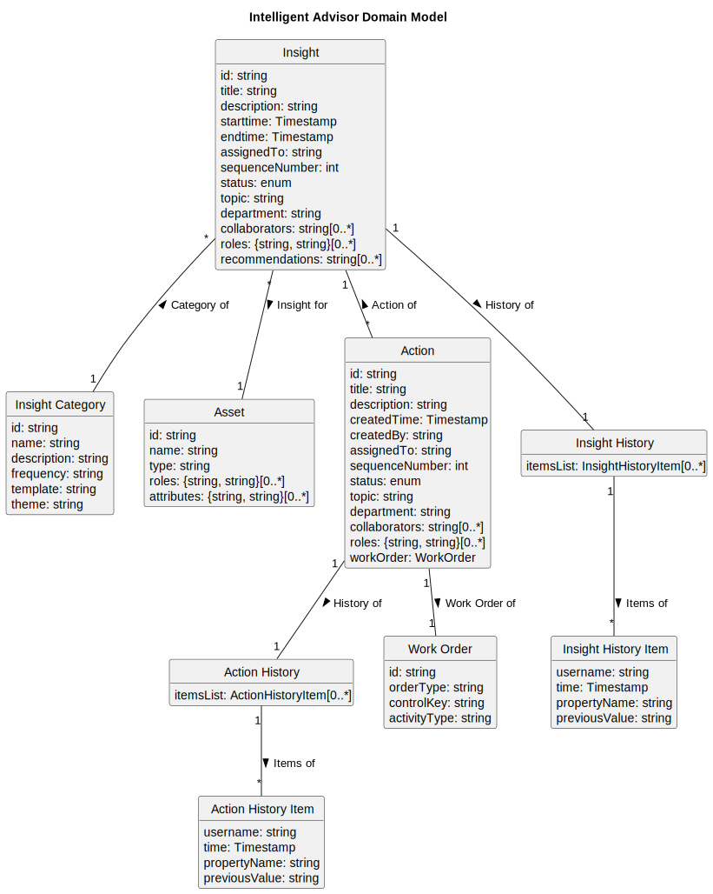

### 

## MLOps

Machine learning operations (MLOps) contains pipelines for developing, publishing, training, evaluating, and registering Machine Learning models. It also provides services that can be used to gather insights and analytical data about the performance of models. The following diagram shows the end-to-end process of ML model training, deployment, and execution as it applies to Intelligent Advisor Insights.

Model training and deployment are not included within the scope of the AOT suite; instead, use is made of the existing machine learning environment available through Azure. The AOT application leverages these pre-deployed trained models to perform various functions-such as maintenance predictions and production optimizations-tailored to specific customer requirements.

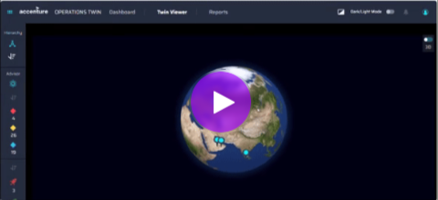

### Model training

Models are trained on preprocessed data from various sources, using subsets for training, validation, and testing. Selecting the right algorithm is key, with performance checked through validation and testing. Version control tracks changes to code, data, and configurations, allowing monitoring of model evolution and reverting to prior versions if needed. After deployment, analytics help assess performance and guide further retraining and improvements.

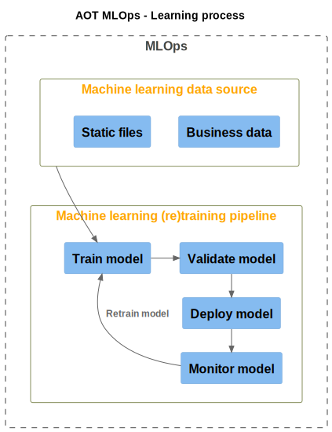

### MLOps Model Deployment

The ML model can be deployed in a Kubernetes service in two ways: directly inside the Data Model microservice as a .pkl file, which will be loaded into memory and executed inside that microservice or in a separate Azure Kubernetes Service (AKS), which will be exposed by an endpoint and consumed by Data Model microservice through the HTTP API.

Another option is to directly deploy the model on an edge machine.

**Model Execution**

In AOT, ML model execution is controlled by the Data Model Microservice. This microservice listens for a message from an event hub (pushed either by an AOT or external system) which contains information needed to execute the model, like model type and identification data. Then, based on the type, a specific handler will be invoked which takes care of calling the appropriate MLOps model, providing all the necessary data as input to execute it. When it completes, another message containing the result is pushed to event hub, which can be consumed by an AOT or external system.

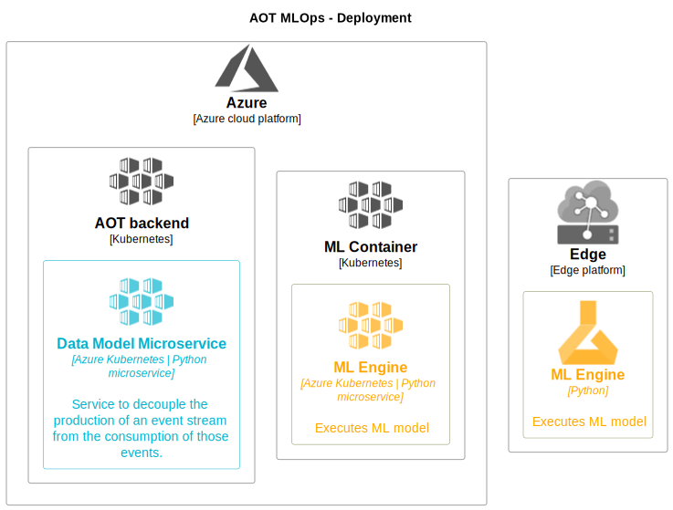

## Internationalization and Localization

Internationalization readies a product for consumption across multiple countries. This process is used by companies looking to expand their global footprint beyond their own domestic market, understanding consumers abroad may have different tastes or habits. Localization, on the other hand, is about meeting the needs of a particular language or culture.

Users of the AOT Application Platform can select the desired language when logging in and the system will store the user\'s preferences in the localization system. A caching mechanism allows the micro-frontend to load the language translations once on initialization and then apply them on run-time.

Localization data is stored across multiple tables in the localization database:

| **Table** | **Purpose** |
| --- | --- |
| Languages | The languages table stores a list of languages and their ISO code (i18n) ex: en-US, es-PR, de-CZ. |
| Translations | The translations table stores all the string assets from the application that will be mapped to a certain language ID, providing a key to identify the element with unique name in the UI and the corresponding language translation. |
| User Preferences | The user preferences table stores the selected language for the AOT UI. |

The following diagram shows how the internationalization component is used across AOT.

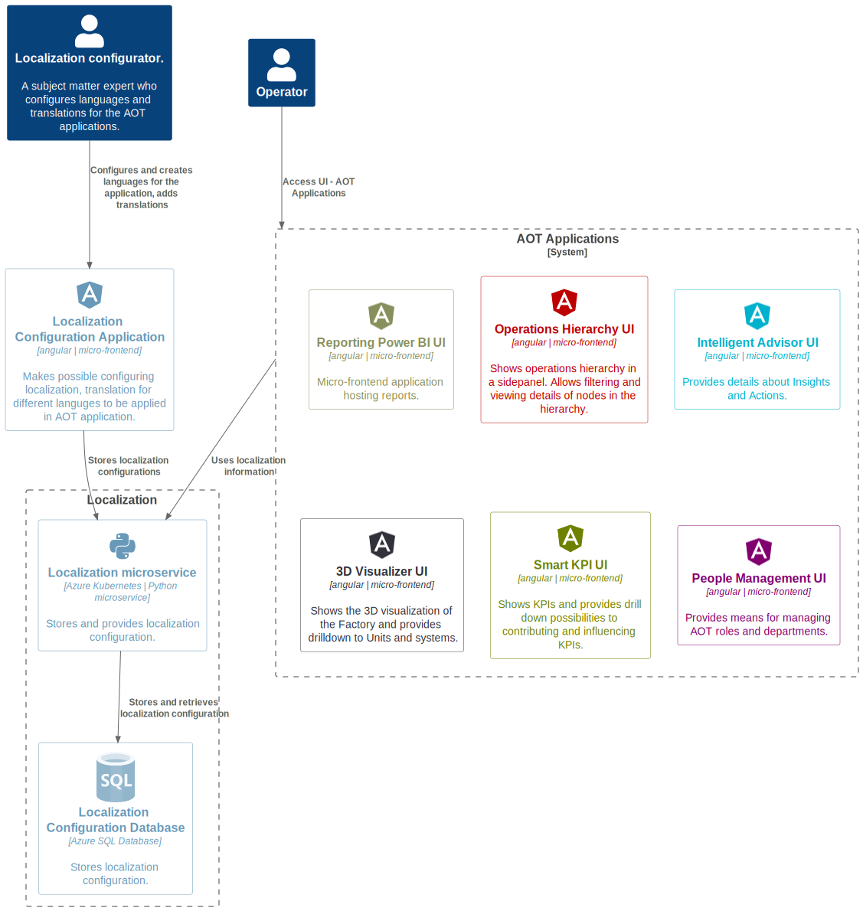

### Deployment

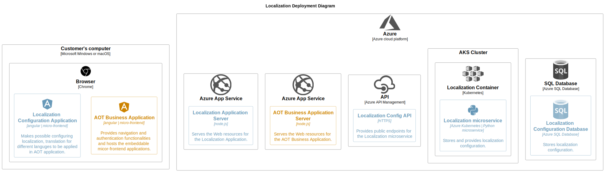

# People Management

The role of the People Management system is to enable administrators to control which users have access to data and functionality in the AOT platform. This is done through the integration of an Identity Provider System (Azure Active Directory) which provides the user profiles and the groups to which the users can be assigned.

## System context

People Management stores the assignments of users and groups to AOT roles and departments. It is being used by most of the AOT systems and plays an important role for data access and roles assignment.

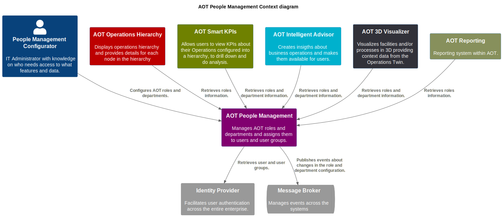

## Containers

This section explains how AOT is implemented on top of Azure services.

The following diagrams show the details of the Azure-based People Management architecture including:

-   containers that are specific to People Management

-   containers that are common and shared, hence provided by the Platform Tools

-   integration with the Identity Provider (in this case Azure Active Directory)

The following container diagram describes the individual components of the system, with the most relevant connections highlighted.

### Applications

| Name | Description |
|------|-------------|
| People‑Management Application | This application allows People Management Configurator admin users to configure the roles assignments in the scope of AOT for users and groups. |

### Microservices

| Name | Description |
|------|-------------|
| People‑Management Microservice | The Smart KPI, Intelligent Advisor, 3D Visualization, Operations Hierarchy, and the Reporting systems are the consumers of the role mapping from People Management because all these systems need to validate each interaction with the signed‑in user based on the user’s roles. Therefore, this service provides the APIs needed for these operations. |
| Notification Service | It pushes notifications to the People Management application whenever changes are made. |

### Data storage

| Name | Description |
|------|-------------|
| People‑Management Database | Stores AOT users, roles, and departments. |

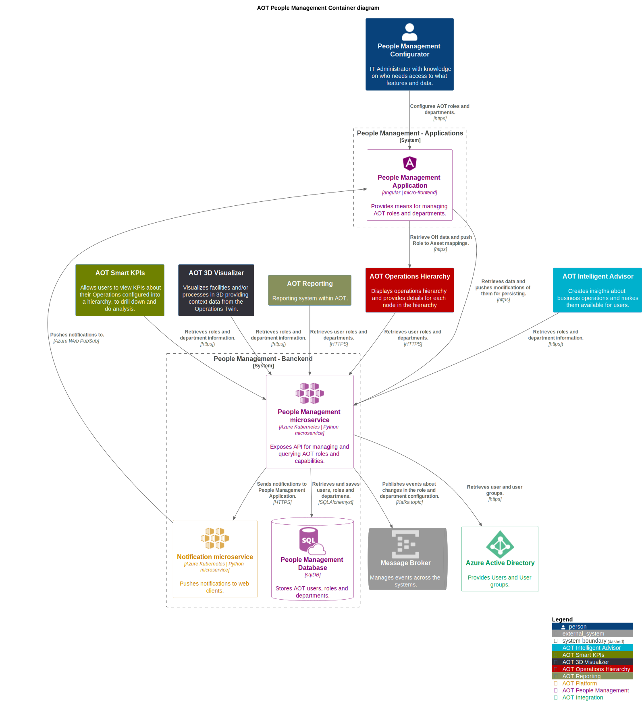

## Deployment diagrams

The following two deployment diagrams explain where each of these system components are hosted.

[Diagram without connections]

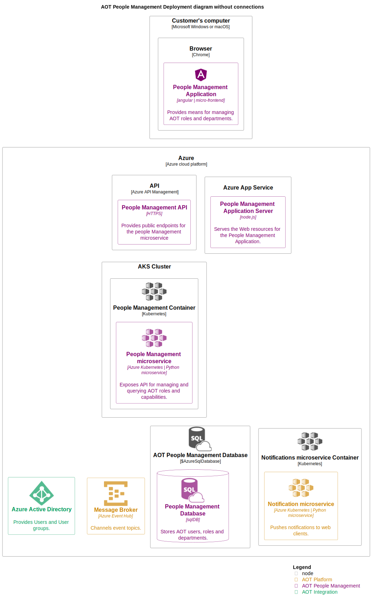\
[Diagram showing communication connections]

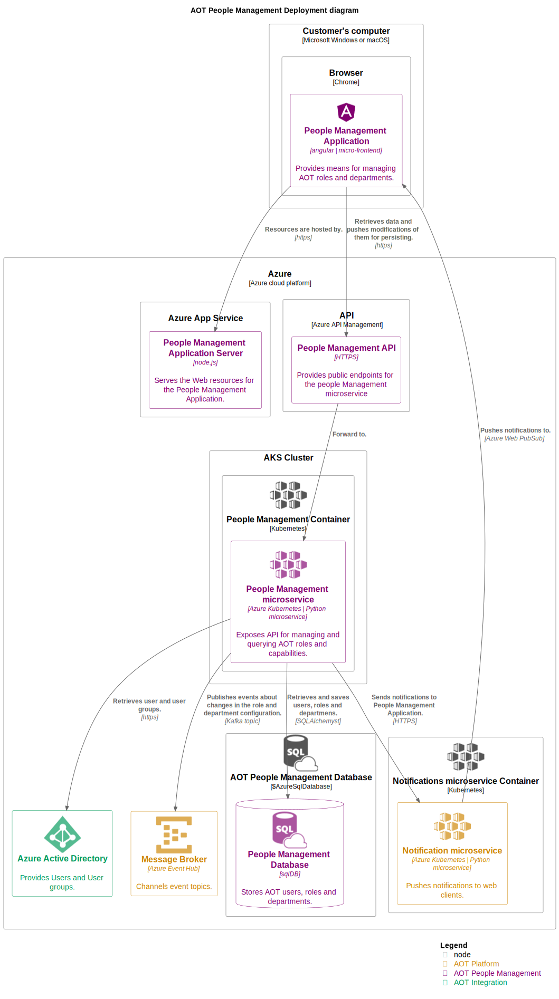

# Intelligent Advisor

The Intelligent Advisor (IA) is an AI-based solution that enables users of all types - from shop floor workers to top management - to focus on their most critical issues, with real-time-generated, prioritized, and contextualized insights and recommendations.

The IA system can help all levels of the value chain by predicting useful insights, highlighting the root causes, notifying relevant colleagues, recommending appropriate actions, and ultimately improving the performance of end-to-end operations.

The following diagram depicts the context of the Intelligent Advisor system within the AOT landscape.

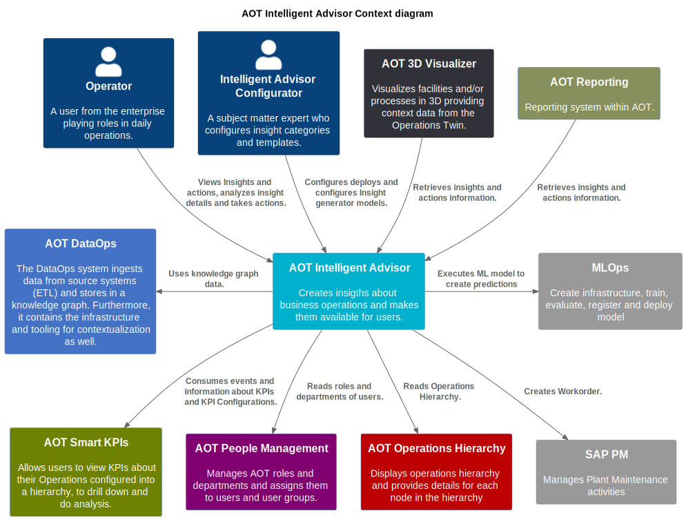

Intelligent Advisor enables the AOT user to run analytics models on the Knowledge Graph, which identifies patterns/issues and creates Insights. The configuration of IA consists of two domain objects:

-   Insight Category

-   Insight Template

The Insight categories represent the different types of Insights to be created. They are linked in a relationship to the Insight Templates that represent the configuration of the Insight screens with all the linked data to be displayed. The Intelligent Advisor is using the following AOT systems:

-   DataOps - uses time-series data to create predictions using Machine Learning.

-   MLOps - a platform tool used to execute a machine learning model so that predictions can be created based on historical and live data. It also includes a pipeline for training, evaluation, and deployment of the model.

-   Smart KPIs - based on machine learning output and KPIs values, Intelligent Advisor will generate insights and actions if needed.

-   Operations Hierarchy - reads assets hierarchy to generate insights and actions.

The Intelligent Advisor is using the following AOT systems:

-   Reporting - uses insights and actions to generate reports.

-   3D Visualizer - requires the Insights/Actions information for the context of the 3D visualization.

## Domain Model

The Intelligent Advisor domain model consists of two parts, the configuration, and the operational models. Both parts are included in the diagram on the right.

The **configuration** domain model has just one entity, the Insight Category, keeping the following information:

-   Identifiers, which also helps identify the related data analytics model

-   Frequency for executing the model

-   Insight template to be used for visualizing the generated insights

-   Theme of the generated insights

The **operational** model consists of:

-   The Insight entity that is generated from the definition model

-   One or more Action entities assigned to the Insight that represent the actions needed to be taken.

-   The Asset entity that has one or more insights linked to it

See the diagram for other relationships and attributes.

## Containers

IA combines the following functional components: Insight generation engine, collaboration, Actions, Advisor panel, Insight Details, and Insight lifecycle management. The diagram on the right shows the detailed architecture of Intelligent Advisor, consisting of:

-   containers specific to Intelligent Advisor

-   common and shared containers provided by the Platform Tools

-   various other modules of AOT (Smart KPIs, People Management) providing information needed to generate the correct predictions and actions.

The containers shown in the diagram are described in the table below.

### Applications

| Name | Responsibility |
|------|----------------|
| Intelligent Advisor Configuration Application | The Intelligent Advisor Configuration Application is a standalone configuration application used to create insight category configurations. Currently, two categories exist: KPI‑based and Predictive. Each insight category has a different configuration page, with both common and category‑specific fields based on the selected category. |
| Intelligent Advisor Side Panel Application | A small micro‑frontend application where insights and actions can be viewed and edited. |
| Intelligent Advisor Insight Details Application | An application that displays a detailed view of an insight, including recommendations, related actions, comments, graphical representations, and impacted KPIs. |

### Microservices

| Name | Responsibility |
|------|----------------|
| Intelligent Advisor Configurations | Provides APIs for creating and saving insight configurations. |
| Scheduler | Based on a configuration, the Scheduler invokes the machine‑learning microservice to generate recommendations. |
| Data Model | A microservice responsible for executing the machine‑learning model. It is triggered by the Scheduler microservice at periodic intervals using a Kafka topic. When execution finishes, a new message is published to the output Kafka topic. This microservice can execute the model either using a platform‑provided machine‑learning implementation or an in‑memory module. |
| Insight Generator Engine | Consumes messages generated by the Data Model microservice and, based on the output values, determines whether insights need to be created. |

### Data storage

| Name | Responsibility |
|------|----------------|
| Intelligent Advisor Configurations | Stores insight configuration data. |
| Scheduler | Stores scheduling configuration used to invoke machine‑learning jobs. |
| Data Model | Stores model execution inputs, outputs, or intermediate results as required by the machine‑learning workflow. |
| Insight Generator Engine | Stores generated insights prior to retrieval by downstream services. |
| Intelligent Advisor Microservice | Provides APIs to access insights and actions based on assigned roles. |

Click on the diagram to view a larger version.

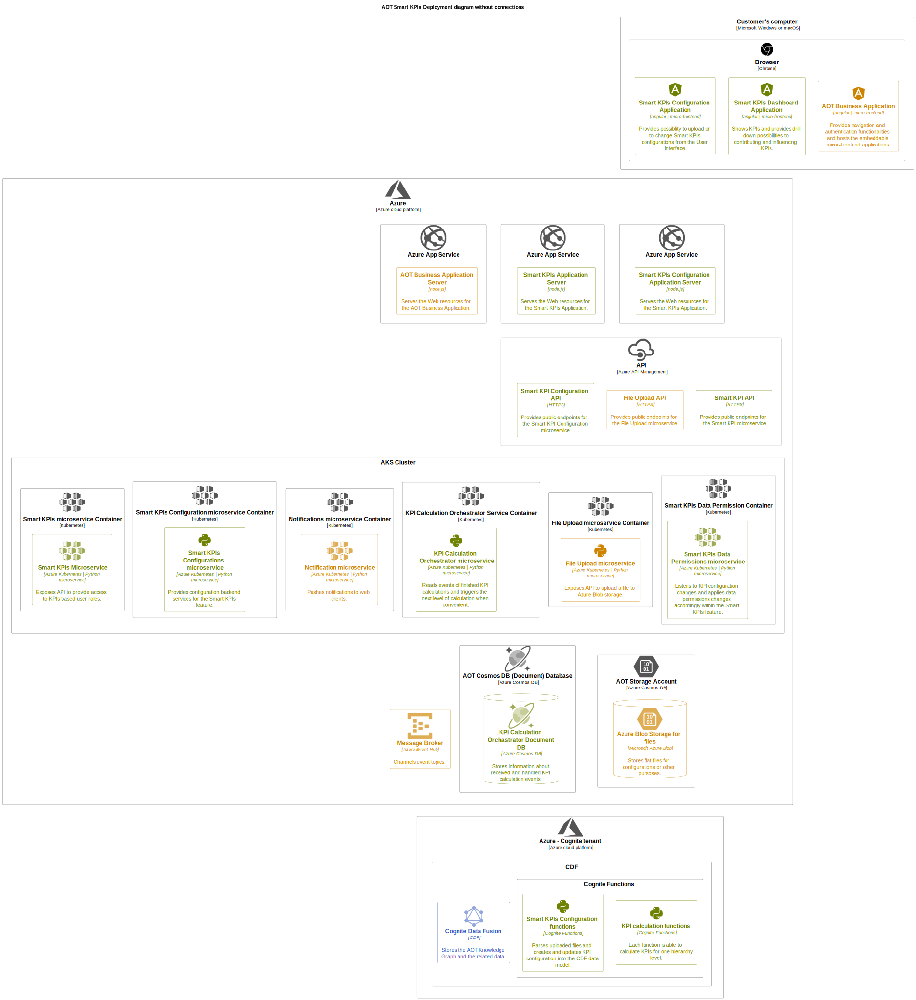

## Insight Generation

Using the IA Configuration Application, a user can create a configuration object used to generate insights based on a predefined frequency. The Scheduler microservice is responsible for triggering the Data Analytics microservice, which in turn will execute the MLOps service to create predictions. The output of the ML model execution is compared against the KPI values and Insight generator engine will decide if a new Insight must be generated or not.

The diagram on the right shows the flow of insight generation inside AOT. Click on the image to view a larger version.

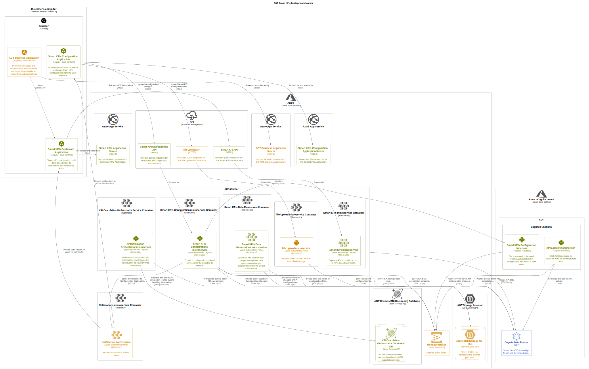

## Deployment 

The diagram below shows where each of the IA system components are hosted, along with communication connections. Click the image to enlarge it.

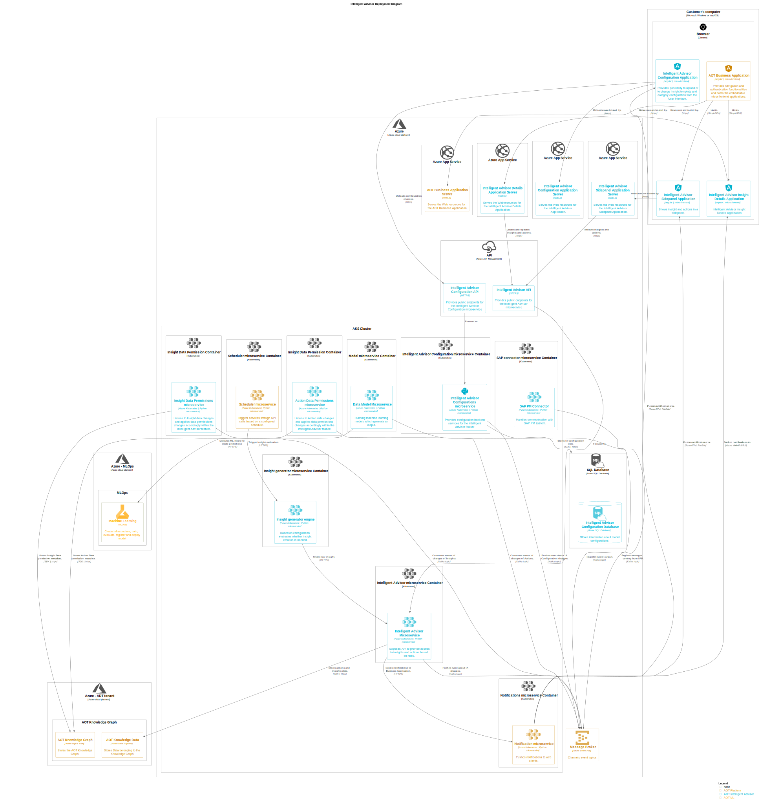

# Expert Knowledge

Expert Knowledge introduces a new capability that combines human expertise with AI scalability to enhance productivity and decision-making. It enables users to capture, document, and share valuable insights and learnings gained from real operational experience. It serves as a structured mechanism to preserve human expertise, ensuring that effective solutions and best practices are available for reuse across similar future scenarios. Submissions are automatically evaluated by the Knowledge Validation Agent for clarity, professionalism, actionability, and toxicity, and reviewed by designated Validator. Once validated, the knowledge becomes part of AOT\'s Recommendation Framework, generating actionable insights for similar scenarios and driving continuous improvement across operations.

This functionality splits up into two main components: Knowledge Validation flow and Recommendation Generation flow.

The Validation flow follows these steps:

1.  User submits expert knowledge at the time of Insight closing

2.  Expert knowledge is validated by the Validation agent

3.  Result of validation and expert knowledge information is reviewed by a reviewer which will approve or reject it

4.  Once it is approved, the information can be used to generate recommendations

The flow is shown in the following diagrams:

 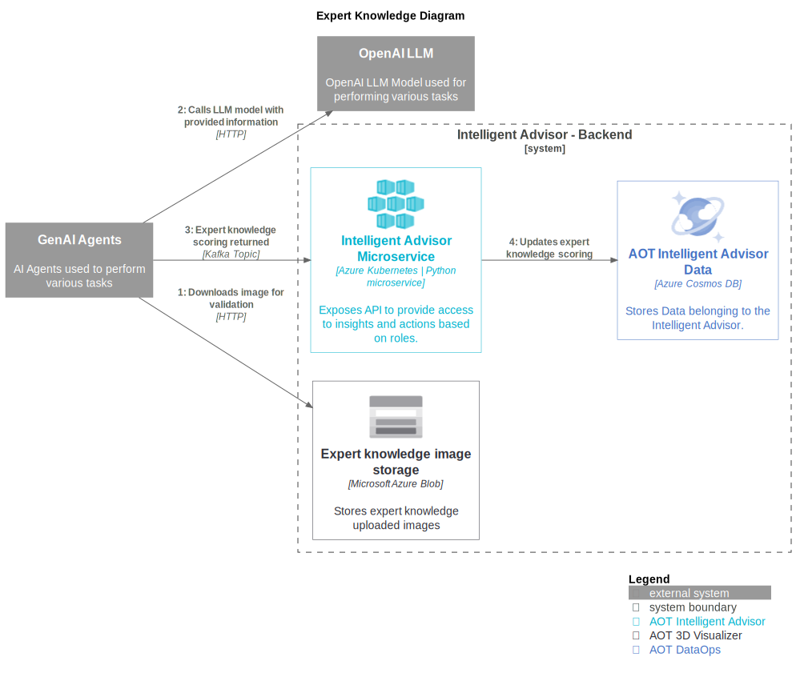

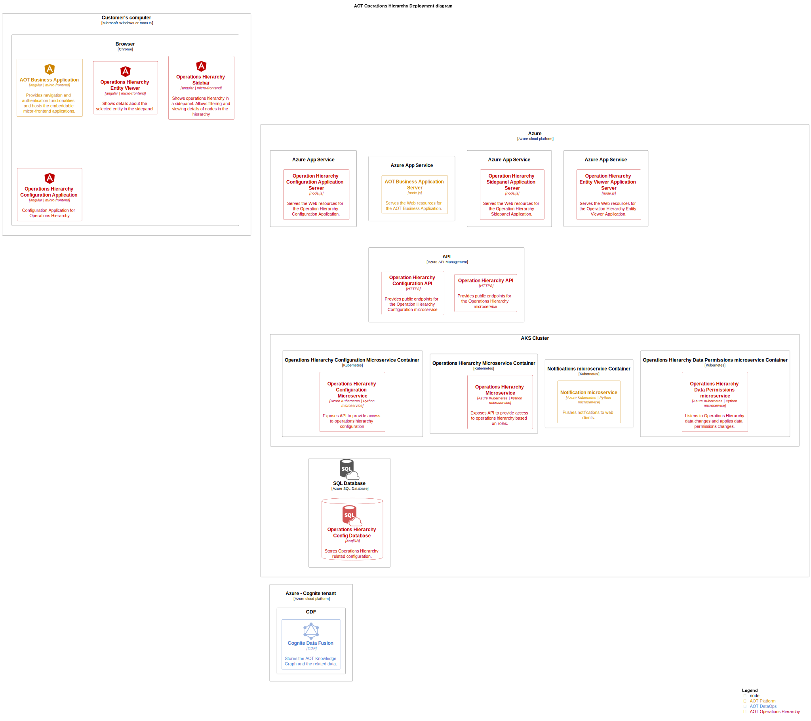

The Recommendation flow follows these steps:

-   A button is available on the Insight details page or in Digital Twin Assistant (when information about insights is requested)

-   User clicks it and the expert knowledge information is gathered (together with images if any) and a recommendation is generated from it

-   Recommendation is displayed on the UI

The flow is depicted in the following diagram:

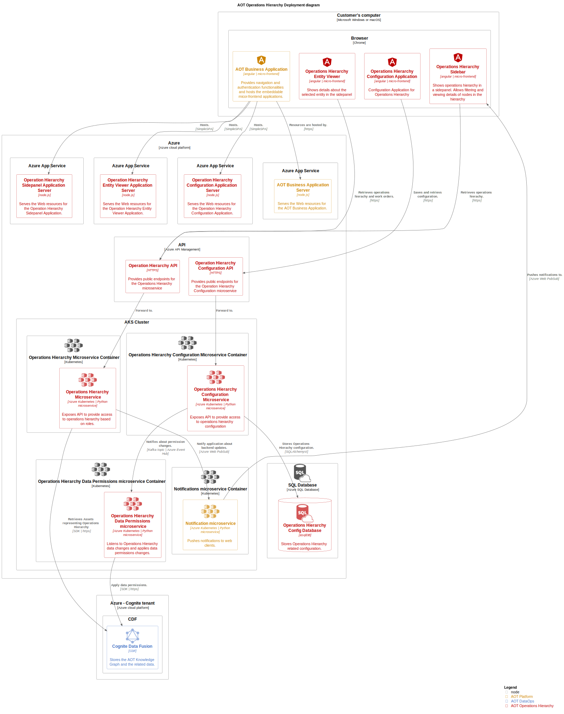

## Domain model

The domain model is composed of an entity named ExpertKnowledge that contains all the information related to Expert Knowledge. It is linked to Insight category through these four keys: type, theme, subtype, plant.

Expert knowledge and recommendations are the same for all Insights from the same category.

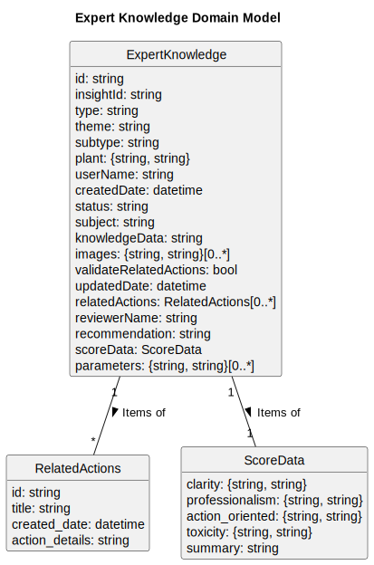

# Smart KPIs

The Smart KPIs system allows the configuration of KPIs that are built on top of each other. The KPIs are calculated based on the configured formula and contributors. These being either parameters received from sensors, other calculated KPIs, or any other values provided by the AOT Knowledge Graph. The calculated KPIs are stored in the AOT Knowledge Graph and exposed through APIs to the Smart KPI Dashboard application, other AOT applications, and third-party custom applications.

The following diagram shows the context of the Smart KPIs system within the AOT landscape.

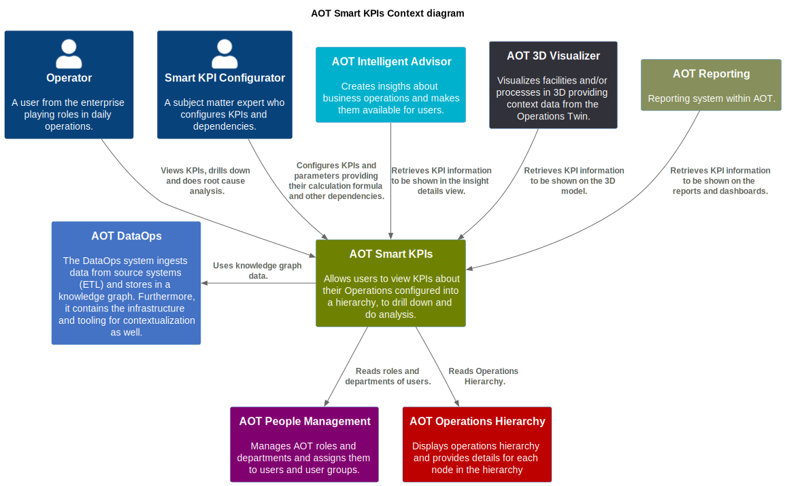

####  Dependencies

The following systems are the dependencies:

-   DataOps provides the Knowledge Graph data for the KPI calculation

-   Operations Hierarchy provides the primary means for contextualizing KPI Instances (providing the scope of the KPI Instances)

-   People Management provides the user roles and departments for implementing the proper data permissions of the system

#### Consumers

-   Operators and Smart KPI Configurators are the usual users of the Smart KPIs system.

-   The Intelligent Advisor, 3D Visualization, and reporting systems are consumers of Smart KPIs.

## Domain Model

The Smart KPIs domain model consists of two parts: configuration and operation. The link between the two is realized by the relationship between the KPI Definition and the KPI Instances.

The configuration domain model (shown right) has just one entity, the KPI Definition. This entity defines the following topics for KPI configuration:

-   Definition of KPI

-   Role and department

-   Formulas for calculations

-   Application Context (list of assets for which the KPI is calculated)

-   Calculation frequency

-   Unit of Measure

-   Red Amber Green (RAG) Configuration

-   Status and version

-   Additional custom attribute

-   Contributor and influencer KPI Definitions, which are relationships towards other KPI Definitions

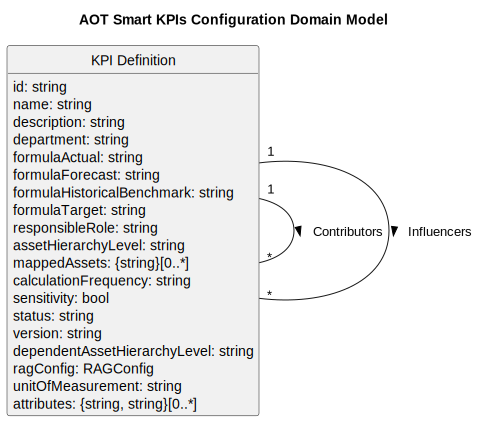

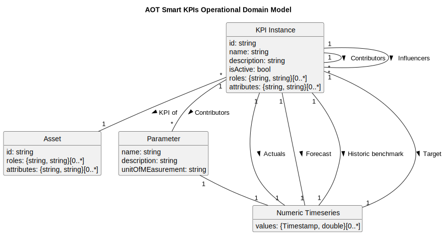

The **operational** model (shown left) consists of two main entities (KPI Instance and Parameter), one auxiliary entity (Numeric Timeseries) and one entity from the Operations Hierarchy system (Asset)

The KPI instance is created based on a KPI Definition. Besides the generic information, it includes four timeseries (Actual, Historic benchmark, Target, Forecast) stored as Numeric Timeseries, the Contributor and Influencer relationships towards other KPI Instances, and references to Assets for defining the context of the KPI Instance.

Parameters are information provided by external systems used in the calculation formulas of KPIs.

## Full Domain Model

The full domain model is a combination of the configuration and operational domain models. The link between the two is realized by the relationship between the KPI Definition and the KPI Instances.

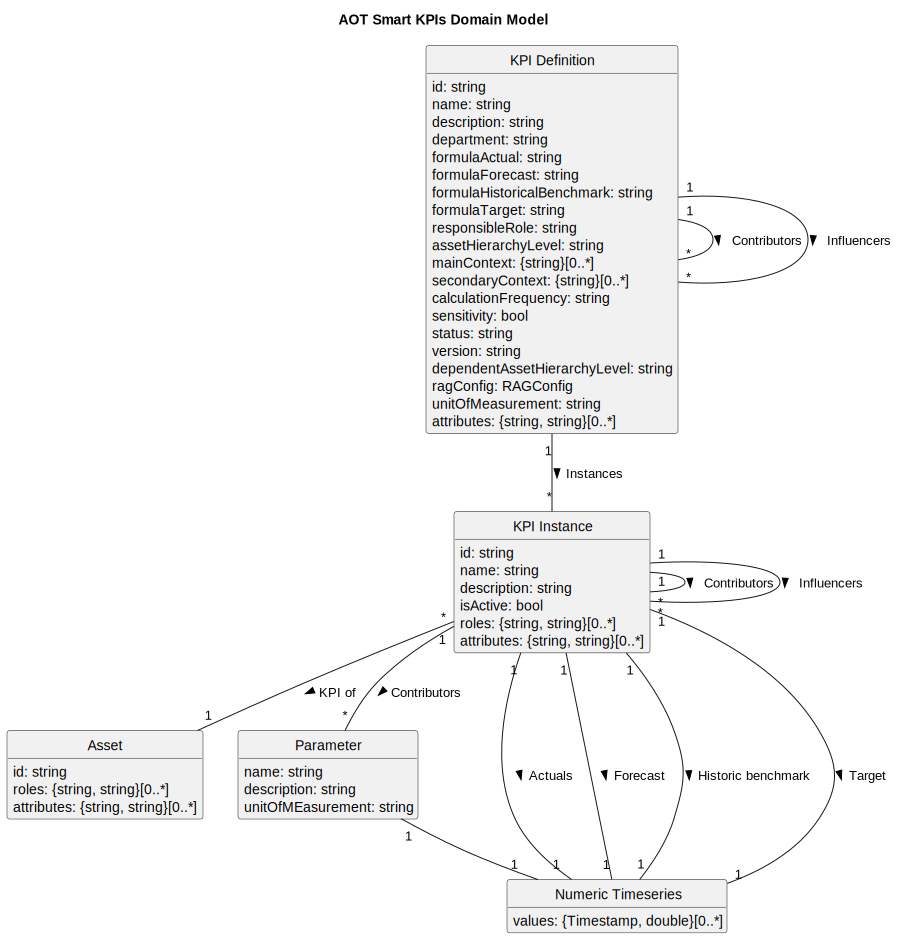

## Containers

This architecture explains how AOT is built and run entirely within Azure, leveraging Azure services for DataOps, platform services, and web applications. The following diagrams show the detailed architecture consisting of:

-   containers specific to Smart KPIs,

-   common and shared containers that are provided by the Platform Tools

-   the knowledge graph container provided by the DataOps system

Check the legend of the diagrams to learn the color coding. Click the image to enlarge it.

> 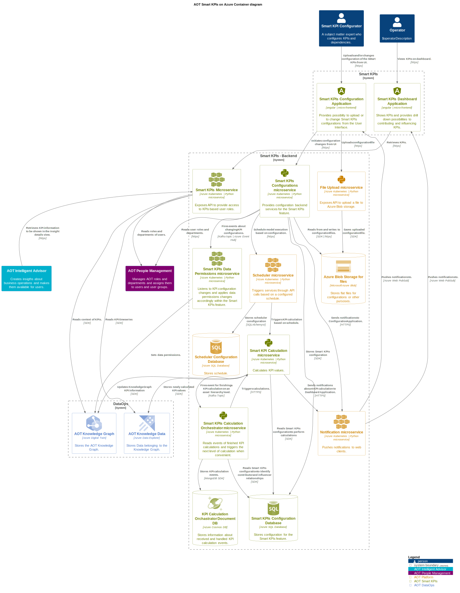

The following tables describe the role and functionality of the different components of the SmartKPIs module:

### Applications

| Name | Responsibility |
|------|----------------|
| SmartKPIs Configuration Application | The SmartKPIs Configuration Application is a standalone web application that can be accessed by SmartKPIs admin users to configure the SmartKPIs calculation engine. It interacts with the Configuration API and microservice to read and write configuration data to the system. |
| SmartKPIs Dashboard Application | The SmartKPIs Dashboard application is a micro‑frontend embedded into the AOT business application. It provides a visualization layer for SmartKPIs on a dashboard and interacts with the SmartKPIs API and microservice to retrieve KPI data. |

### Microservices

| Name | Responsibility |
|------|----------------|
| SmartKPIs Microservice | A data‑access microservice that enables KPI data querying for authenticated users based on their role assignments. It is used by the SmartKPIs Dashboard application and by other AOT modules (for example, Intelligent Advisor and 3D Viewer) as well as third‑party consumers. |
| SmartKPIs Configuration | Enables admin users to read the current configuration of the SmartKPIs engine and to create, update, or archive configurations using Excel‑based templates uploaded to the system. These templates are processed by the configuration microservice and stored in AOT configuration storage. |
| Smart KPIs Orchestrator | An event‑based microservice that operates according to the KPI configuration provided by admin users. It processes calculation events and, based on configured formulas and interdependencies between KPIs, determines when all requirements for a KPI calculation are met and triggers that calculation. |
| Smart KPIs Calculation Microservice | Responsible for calculating KPI values based on the KPI configuration. It evaluates calculation formulas, reads contributing values, performs the calculation, and saves the results to AOT DataOps storage. It supports actual, forecast, historical benchmark, and planned KPI values. |
| Smart KPIs Data Permissions | Triggered by the Orchestrator or Scheduler microservice. It manages the different KPI calculation results for a KPI instance, including actual, forecast, historical benchmark, and planned values. |
| Scheduler | Updates role permissions for impacted KPI instances whenever a KPI configuration or KPI instance change occurs. For example, when the owner role of a KPI configuration changes, all KPI instances derived from that configuration are updated accordingly. |
| Notification | A common Platform Tools microservice in AOT that allows modules to register schedulers with custom properties. Based on the scheduler configuration, the service triggers scheduled jobs. For SmartKPIs, it is used to schedule calculations for lowest‑level KPIs that depend only on parameters. |

### Data storage

| Name | Responsibility |
|------|----------------|
| Knowledge Graph | Defines entities in AOT—assets, KPIs, insights, and actions—and their relationships. Each Smart KPI is represented as a distinct entity linked to its asset and to related KPIs that influence or are influenced by it. |
| Knowledge Data | Stores time‑series KPI values, including actual, forecast, historical benchmark, and planned values, as well as parameter time‑series data. |
| Configuration Database | Stores the current configuration of the SmartKPIs engine. |
| Orchestration Database | Stores intermediate data and the status of KPI calculations. It is maintained by the Orchestration service and can also be used as a log of past calculations. |
| Template Storage Blob | Blob storage used to store Excel (XLS) configuration templates uploaded by users. |
| Scheduler Configuration Database | Stores all schedule configurations related to SmartKPIs, including frequency‑based schedules for KPIs that depend only on parameters. |

## Calculation Integrations

### Flow

1.  The Scheduler Microservice triggers the calculation functions for KPIs that have only parameter contributors.

2.  The calculation function reads the input values of contributor KPIs and Parameters

3.  The calculation function calculates the new KPI value

4.  The calculation function saves back the calculated KPI value to the Knowledge Graph

5.  The calculation function raises an event notifying subscribers about the newly calculated KPI.

6.  The KPI Calculation Orchestrator, which is subscribed to this event, receives it and updates the orchestration information (dependency list of other KPIs to the newly calculated KPI) in the Database

7.  The KPI Calculation Orchestrator reads the list of KPI calculations that can now be executed based on the previously calculated KPI values

8.  KPI Calculation Orchestrator triggers KPI calculation functions for the KPIs that have all dependencies already calculated

The diagram below shows the interaction between the system components when performing KPI calculations.

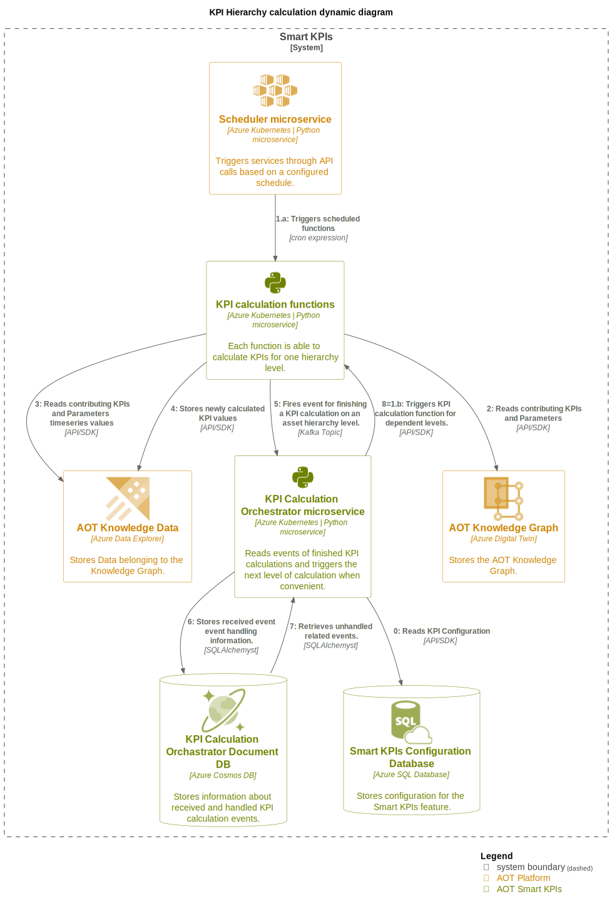

## Deployment 

The diagram below shows where each of the Smart KPIs system components are hosted, along with communication connections. Click the image to enlarge it.

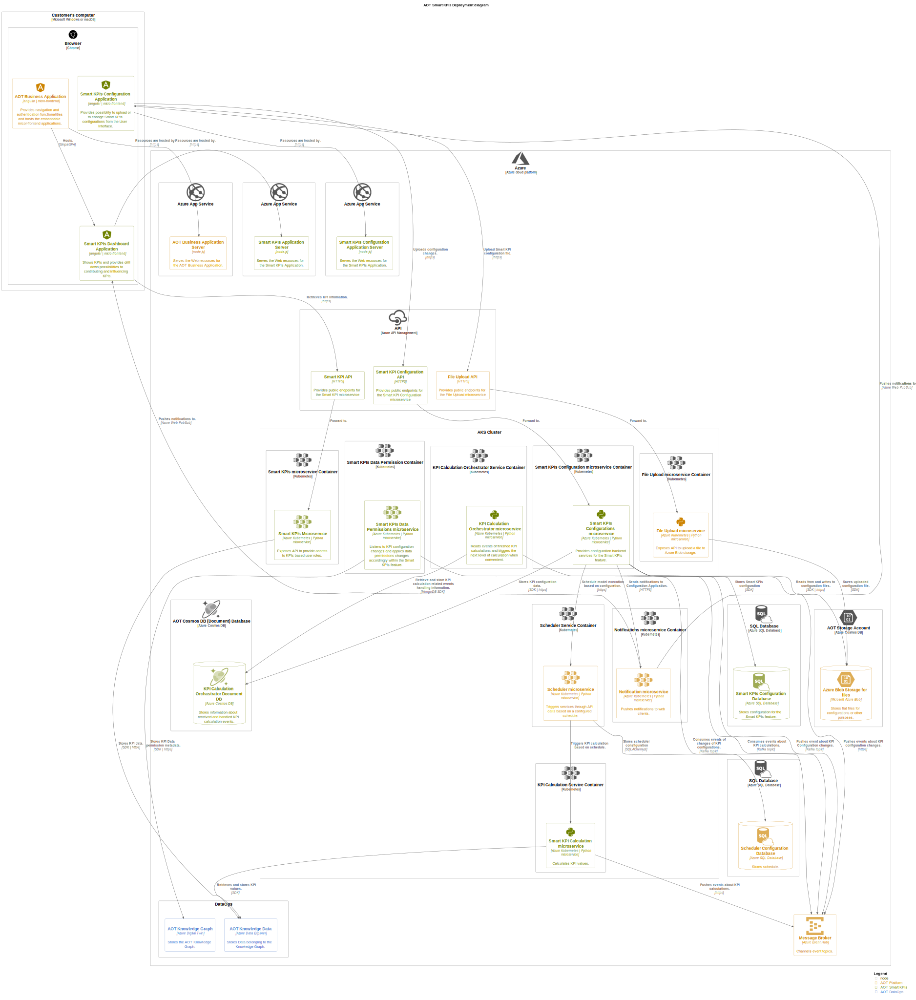

# Operation Hierarchy

The Operations Hierarchy (OH) sub-system provides the means to store logical and physical operational units in the AOT Knowledge Graph, manipulate them, and visualize it. The OH is populated primarily from source systems (other systems from the client ecosystem, responsible for defining daily operations). However, adjustments are also possible from within the AOT applications themselves. The OH is usually the backbone of the Knowledge Graph in a production environment, therefore, all the other business applications depend on it within AOT.

**Domain Model**

The OH domain model only consists of the Asset object.

## Containers

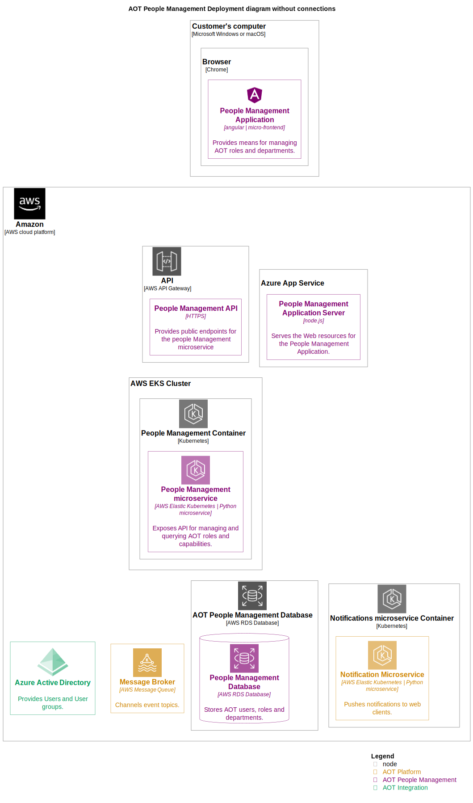

The diagram on the left may be enlarged by clicking it. The following tables list and describe the role and functionality of the containers making up the OH system:

### Applications

| Name | Responsibility |
|------|----------------|
| Operations Hierarchy Configuration Application | Provides the ability to configure the Operations Hierarchy (OH) and the roles assigned to its nodes. |
| Operations Hierarchy Side‑panel Application | Visualizes the Operations Hierarchy as an advanced tree view. It is a micro‑frontend application that is embedded into a host application. |
| Entity Viewer Application | Displays detailed information about a selected node from the Operations Hierarchy, combining data from the OH and other parts of the Knowledge Graph. It is a micro‑frontend application that is embedded into a host application. |

### Microservices

| Name | Responsibility |
|------|----------------|
| Operations Hierarchy Microservice | A data‑access microservice that enables Operations Hierarchy data querying for authenticated users based on their role assignments. |
| Operations Hierarchy Configuration Microservice | Enables configuration of the Operations Hierarchy and the roles assigned to its nodes. |
| Operations Hierarchy Data Permissions Microservice | Raises and consumes events when Operations Hierarchy role assignments or structure changes occur, allowing the Permission Manager to apply correct permissions to the affected OH nodes. It also reacts to DataOps platform events to ensure permissions remain consistent. |

### Data storage

| Name | Responsibility |
|------|----------------|
| Knowledge Graph | Stores the Operations Hierarchy as the structural backbone of the Knowledge Graph. |
| Configuration Database | Stores configuration data for the Operations Hierarchy. |

## Deployment

Click the image to enlarge it.

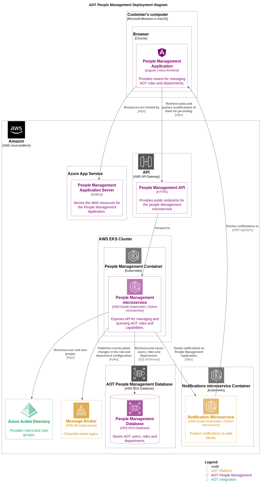

# Production Manager

Production Manager is the sub-system that is responsible for Managing Production Processes and Data. Its primary scope should be the Production Domain from the ISA-95 standard.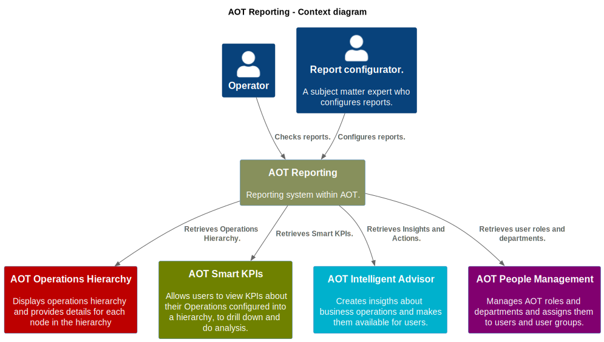

**Domain Model**

The Production Manager domain model consists of the following models:

-   Production Order

-   Batch

-   Recipe

-   BOM (Bill of Material)

-   Recipe

-   Material

-   Process Definition

-   OH Asset

-   OH Asset Definition

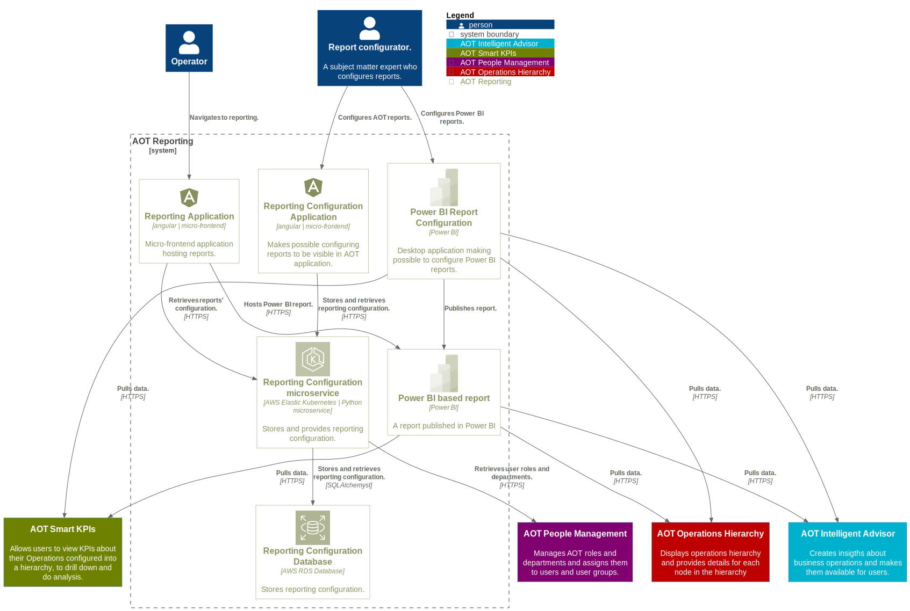

**Containers**

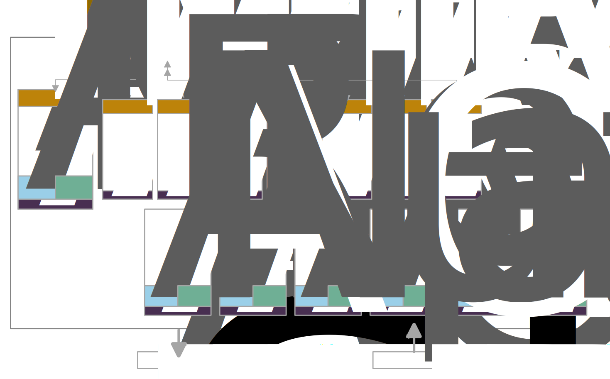

The diagram on the left may be enlarged by clicking it. The following tables list and describe the role and functionality of the containers making up the Production Manager system:

### Applications

| Name | Responsibility |
|------|----------------|
| Production Manager Configuration Application | Provides the ability to configure the Production Manager and the roles assigned to its nodes. |
| Production Manager – Product and Batch Traceability Application | Displays detailed information about selected production orders and batches from production systems, enabling batch analysis. It is a micro‑frontend application that is embedded into a host application. |

### Microservices

| Name | Responsibility |
|------|----------------|
| Production Manager Microservice | A data‑access microservice that enables Production Manager data querying for authenticated users based on their role assignments. |
| Production Manager Configuration Microservice | Enables configuration of the Production Manager and the roles assigned to its nodes. |

### Data storage

| Name | Responsibility |
|------|----------------|
| Knowledge Graph | Stores production data—such as production orders, batches, recipes, and bills of materials (BOM)—within the knowledge graph. |
| Configuration Database | Stores configuration data for the Production Manager. |

**Deployment**

Click the image to enlarge it.

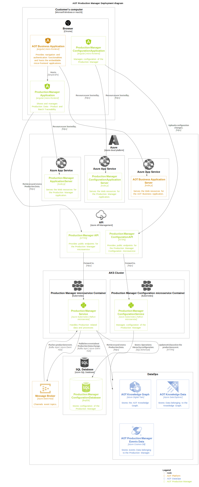

# 3D Visualization

The 3D system of AOT provides 3D visualization of the Plant(s) with contextualized data (KPIs and Insights) displayed on the 3D model with the possibility to drill down inside the visualization. The 3D module has two main components:

-   A 3D Visualizer Micro-Frontend integrated into the AOT business app.

-   A 3D Builder application where the 3D model can be configured and the data from the Knowledge Graph contextualized to it.

The following diagram shows the context of the 3D system within the AOT landscape.

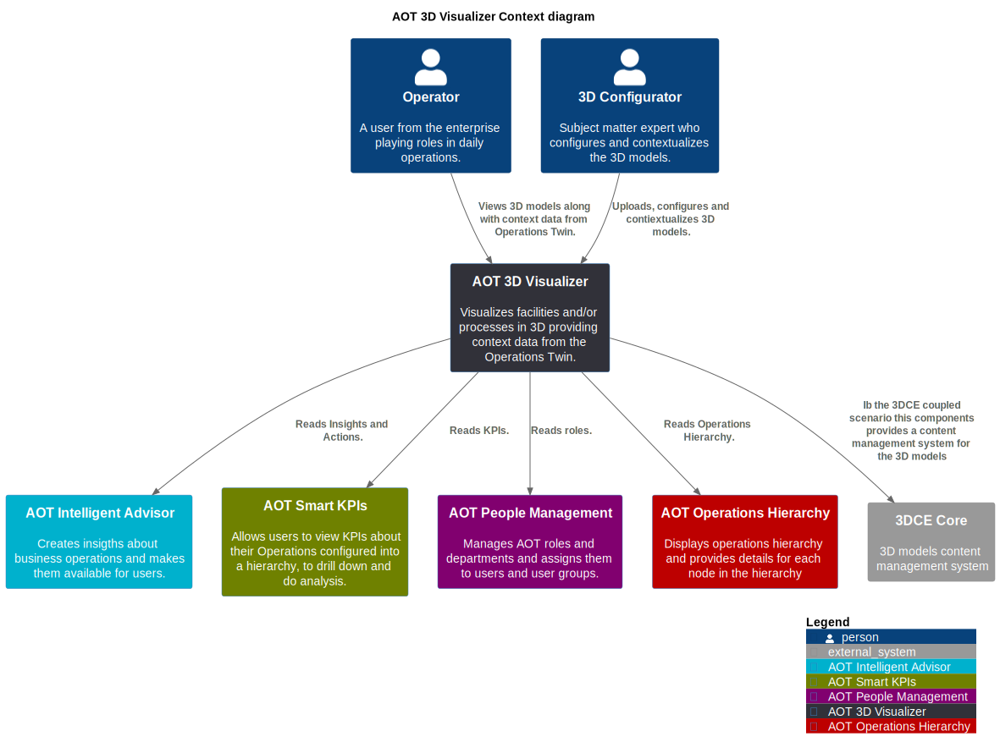

####  Consumers

Operators and 3D Configurators are the usual users of the 3D system. They can explore the 3D models with contextualized data or configure the visualization itself by setting the layout of plants, connections between the different models, and the data context links to build up the visualization.

#### Dependencies

-   Operations Hierarchy provides the primary means for contextualizing the 3D model components to assets in the Operations Hierarchy.

-   People Management provides the user roles and departments for implementing the proper data permissions of the system.

-   Smart KPI provides all the KPI information for the context of the 3D visualization.

-   Intelligent Advisor provides the Insights/Actions information for the context of the 3D visualization.

-   The 3D component of AOT can be delivered with a more advanced 3D models Content Management System. In this case, the 3DCE Core component is also a system dependency.

The following tables list and describe the role and functionality of the containers making up the 3D visualization system:

### Applications

| Name | Responsibility |
|------|----------------|
| 3D Visualizer Application | A micro‑frontend application integrated into the AOT Business Application. It displays 3D models of plants or other assets from the hierarchy and provides contextualized asset data. The application supports drill‑down functionality, allowing users to navigate deeper into the 3D model to view subcomponents and their associated data. |
| 3D Builder / Configuration Application | A standalone micro‑frontend application that combines the tools required to upload, manage, enhance, and contextualize 3D models, as well as to create layouts from those models. It includes Unity3D‑ and/or React‑based components for model management, point‑of‑interest editing and mapping, model mapping, and digital twin creation. |

### Microservices

| Name | Responsibility |
|------|----------------|
| 3D Configuration Microservice | Provides access to persisted 3D visualization data, including 3D models and mappings, and enables modification of that data. |

### Data storage

| Name | Responsibility |
|------|----------------|
| 3D Models and Mappings Storage | Stores 3D visualization–related data such as 3D models, mapping files, and points of interest. |

## Containers

The following diagram shows the detailed architecture consisting of:

-   containers specific to the 3D module

-   common containers provided by the Platform Tools

-   various modules of AOT (Smart KPIs, Intelligent Advisor, Operations Hierarchy, etc.) providing the data to be displayed on the 3D View

The following container diagram describes the individual components of the system, with the most relevant connections highlighted.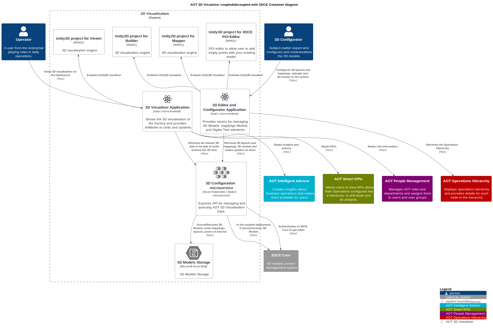

## Deployment diagrams

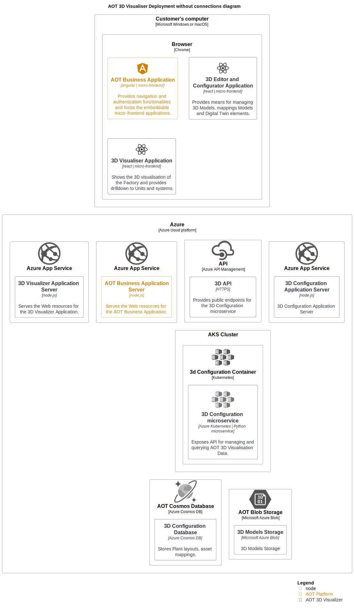

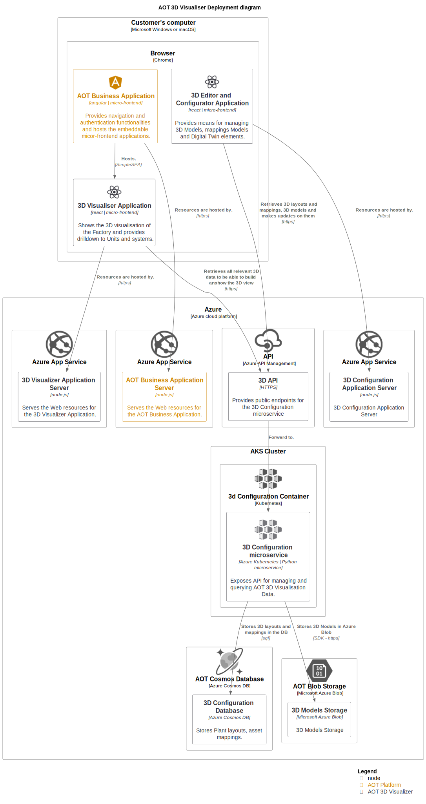

# Reporting

AOT reporting system allows creating reports in third-party tools taking data from AOT but also provides framework to embed these reports into the AOT Business Application in cases needed.

## System context

The reporting modules will read data from the AOT Knowledge Graph through the AOT APIs, primarily from Operations Hierarchy, Smart KPIs, and Intelligent Advisors. It will also use the People Management module for restricting permissions to content.

## Containers

As shown in the container diagram, the following components make up the system.

In this case, the report configurator will create the report in Power BI, integrate data from AOT backend into it, and publish it to make it available online. Next step is to configure the AOT reporting application to know about this online report.

After the configuration is done, generic users having the necessary permissions can visualize in the AOT Business Application the reports.

### Applications

| Name | Responsibility |
|------|----------------|
| Reporting Application | Enables embedding reports provided by external platforms into the AOT Business Application and supports navigation between those reports. |
| Reporting Configuration Application | Enables configuration of reports provided by external platforms for display in the Reporting Application. |

### Microservices

| Name | Responsibility |
|------|----------------|
| Reporting Configuration Microservice | Stores and manages reporting configuration information. |

### Data storage

| Name | Responsibility |
|------|----------------|
| Reporting Configuration Database | Stores reporting configuration information. |

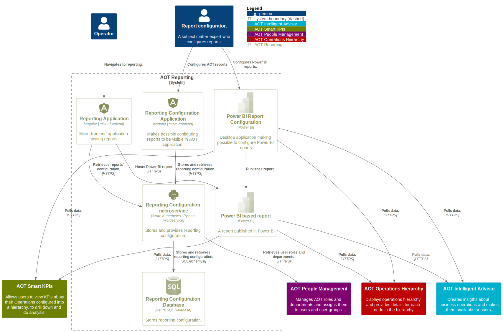

## Deployment diagrams

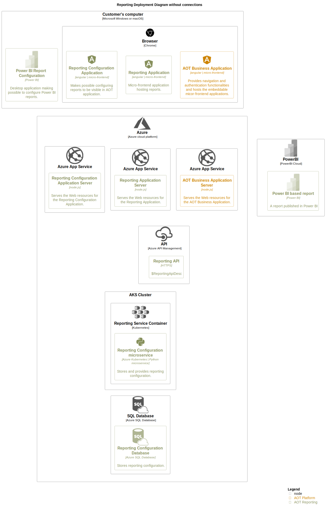

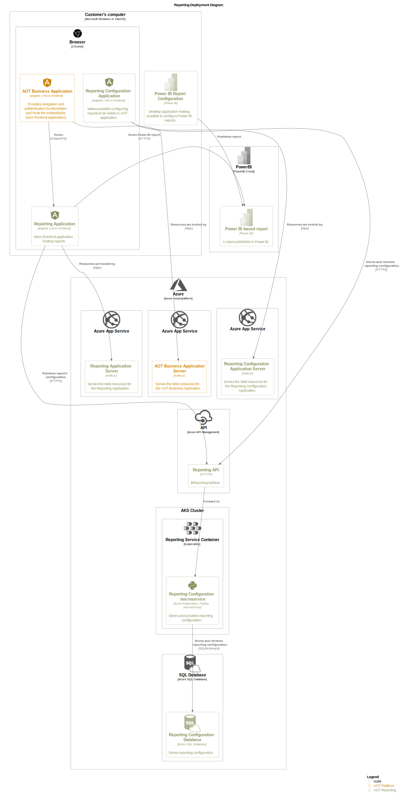

# Applications 

The AOT application pages can be divided into two categories: Business and Configuration.

The diagram below shows the AOT Application landscape. Click the image to enlarge it.

## Host App

The AOT Host App is built from embedded micro-frontend (MFE) applications. Each MFE has a well-defined purpose and is viable on its own. The AOT Host App is responsible for hosting the embedded MFEs, ensuring authentication, and channeling information between components. It is also responsible for facilitating navigation logic, resolving dependencies, and maintaining the URL.

### Embedded MFEs

| Name | Description |
|------|-------------|
| Operation Hierarchy | A side panel with a tree view that displays the asset hierarchy. |
| Smart KPI | Displays calculated actual, forecast, and historical KPI values for the selected asset, including descriptions, calculation formulas, and trendline charts. Users can drill down into a selected KPI to view details of influencing and contributing KPIs. |
| Intelligent Advisor Side Panel | Displays the list of active insights in a side panel. |
| Insight Details | Displays detailed information for a selected insight, including descriptions, actions, contributors, and KPI details when the insight is KPI‑based. |
| 3D Visualizer | Displays a 3D model of a plant or area configured in the 3D editor, with insights, actions, and alerts overlaid on the model. |
| Entity Viewer | Displays a detailed dashboard for a selected asset. |
| Reporting | Visualizes reports defined in the system. |

## Configuration Apps

The AOT Configuration applications are a set of stand-alone MFE applications that allow the configuration of specific modules.

### Stand-alone MFEs

| Name | Description |
|------|-------------|
| Smart KPI Config App | Allows configuration of Smart KPIs either by uploading an Excel file or by configuring KPIs manually. Users can download the Excel template for base KPI configurations as well as export the current configuration to Excel. KPI configurations support multiple statuses and, once published, become available in AOT for use. |
| 3D Editor App | Defines plant or area layouts as 3D models that can be viewed and analyzed in the 3D Visualizer. |
| Intelligent Advisor Config App | Enables users to maintain insight categories and template configurations used by Intelligent Advisor. |
| People Management Config App | Enables admin users to manage user access to data and functionality within the platform. Admin users can create and manage AOT roles, link Active Directory groups to roles, and modify user permissions. The People Management module supports functional permissions for access to configuration pages and data permissions scoped to knowledge‑graph entities such as assets, KPIs, and insights. |
| Reporting Configuration Application | Configures reports to be presented in AOT. Reports are preconfigured in their native environment (currently Power BI), while visibility and access control are managed by AOT. |

# Appendix

## Guiding Principles

| Principle | Meaning |
|----------|---------|
| Keep it short and simple | Minimize the number of capabilities needed to fulfill the requirements and select a component landscape that is easy to develop, lightweight at runtime, and cost‑effective to operate. |
| Don't repeat yourself | Reuse components and consolidate component selection based on reusability across the component landscape. |
| Fit for purpose | The solution should do exactly what it needs to do—no more and no less. |
| Don't reinvent the wheel | Evaluate existing technology options for each required capability and prefer packaged or open‑source solutions before building custom ones. |
| Prepare for failure | Assume that components, processes, or people may become unavailable and design the system to handle failures gracefully. Evaluate failure modes and balance the cost of prevention against the cost of failure. |
| Divide and conquer | Define clear interfaces between applications to improve maintainability. Separate functions into distinct components and implement them independently. |
| Black box | Do not expose implementation details of one component to another. Define clear interfaces and hide internal complexity behind them. |

## Patterns

| Pattern | Description |
|--------|-------------|
| Micro‑frontends | Architectural approach where individual features are implemented as independent micro‑frontend applications. Configuration applications are fully standalone, while business‑application components are embeddable micro‑frontends loaded into the main web application. Micro‑frontends can be developed independently by different teams and synchronize through standardized event‑based publish‑subscribe mechanisms. |
| Stateless middleware | Each request or execution is handled independently, without relying on stored context from previous executions. |
| Lazy loading / initialization | Objects and components are initialized only when first used, instead of during an upfront, time‑ and resource‑intensive initialization phase. |
